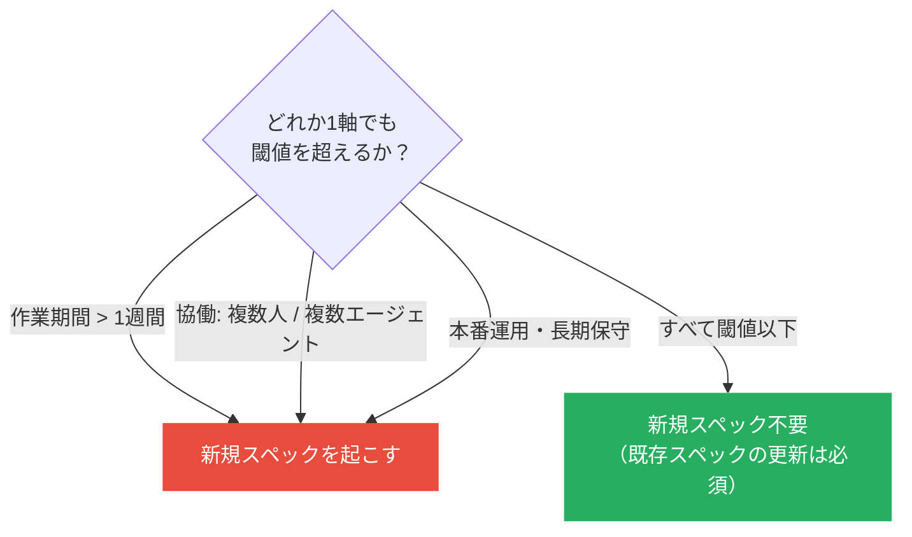
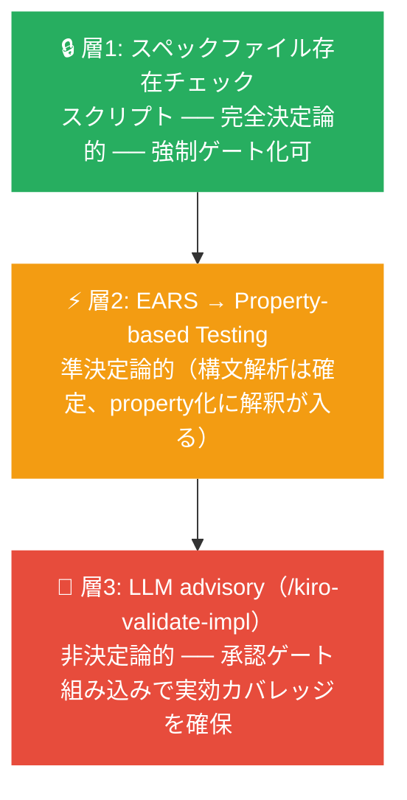
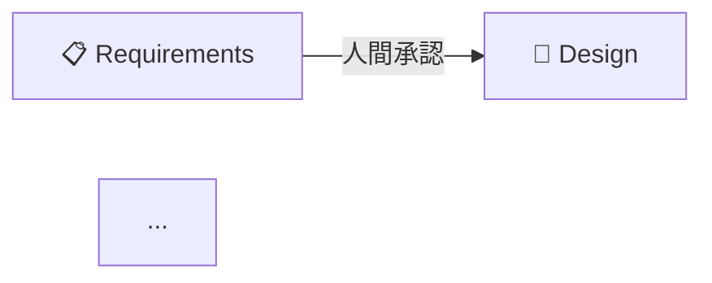

# ドラフトのスライド化（draft-to-slides）

`atelier/drafts/{topic}.md` を **Slidev** 形式の Markdown プレゼンテーションに変換する。
「1スライド = 1主張」を原則とし、視覚的な素材は Mermaid 図に変換する。

> **ツール選択の理由**: Marp は Mermaid を標準でレンダリングしないため、
> Mermaid をネイティブサポートする Slidev を使用する。

## 1. 入力の特定

ユーザーがトピックを明示した場合はそれを使う。明示されない場合:

```bash
ls atelier/drafts/
```

利用可能なドラフトを提示してトピックを選択させる。

## 2. 出力先の確認

```bash
mkdir -p atelier/slides && ls atelier/slides/
```

`atelier/slides/{topic}.md` に出力する。既存ファイルがある場合はユーザーに確認する。

## 3. ドラフトの読み込みと構造把握

`atelier/drafts/{topic}.md` を読み込み、以下のセクションを確認する:

- **セクション0**: 定義（仕様とは / SDD とは）
- **Why SDD セクション**: 導入理由（箇条書き）
- **セクション1**: 誤解パターン（表）
- **セクション2**: 理解の転換点
- **セクション3**: 比喩・アナロジー
- **セクション4**: 向いている/向いていない場面
- **セクション5**: 演習シナリオ候補
- **セクション6**: スライド素材候補（ここに「このスライドを作れ」という指示が含まれることが多い）

## 4. スライド構成の決定

以下の標準構成を基本とし、ドラフトの内容と「セクション6: スライド素材候補」に合わせて調整する。
セクション6に明示された素材は必ずスライド化すること。

| # | タイトル候補 | ソース |
|---|------------|--------|
| 1 | タイトルスライド | トピック名 |
| 2 | このモジュールで学ぶこと | 転換点リスト（概要3〜5点） |
| 3 | 定義: 仕様（Spec）とは | セクション0 |
| 4 | 定義: SDD とは | セクション0 + 承認ゲートフロー図 |
| 5〜 | Why このトピックか（理由ごとに1枚） | Why セクション |
| — | よくある誤解 | セクション1 |
| — | いつ使うか（判断軸） | セクション4 + 判断フロー図 |
| — | セクション6の素材（1素材1〜2枚） | セクション6 |
| 最後から2枚目 | まとめ（一文） | Why セクションの「一文まとめ」 |
| 最後 | 演習 | セクション5から1〜2シナリオ |

## 5. Mermaid 図の生成ガイド

ドラフトに「図」「フロー」「マトリクス」「象限」「ロードマップ」などが含まれる場合、
対応する Mermaid 図を生成する。よく使う図のテンプレートを以下に示す。

### SDD 承認ゲートフロー


### 3軸判断フレームワーク（SDD をいつ使うか）



### 品質担保の4象限

`quadrantChart` は Slidev 0.49 の Mermaid バージョンで非対応のため、テーブルで代替する:

```markdown
| | **決定論的** | **非決定論的** |
|---|---|---|
| **義務化** | ① 存在確認（スクリプト強制）<br/>④ 動作確認（テスト強制） | ③ 整合性<br/>（/kiro-validate-impl 義務的 advisory） |
| **ad-hoc** | — | ② 仕様の正しさ<br/>（人間レビュー + LLM advisory） |
```

### CI 自動化の3層モデル



### レガシー導入ロードマップ


## 6. スライドの書き方原則

- **1スライド = 1主張**: 詳細は削ぎ落とし、核心フレーズを大きく見せる
- **箇条書きは3点まで**: それ以上なら複数スライドに分割する
- **転換点の引用フレーズはそのまま使う**: `> 「引用フレーズ」` の blockquote 形式で
- **Mermaid 図のキャプションを付ける**: 図の下に1行の説明を入れる
- **演習スライドは「問い」を1文で**: 参加者が自分で判断できる問いにする
- **まとめスライドはドラフトの「一文まとめ」を使う**: 新たに作らない

## 7. Slidev フロントマター（ファイル冒頭に付ける）

```yaml
---
theme: default
highlighter: shiki
lineNumbers: false
drawings:
  persist: false
fonts:
  sans: Noto Sans JP
---
```

## 8. スライドテンプレート（最初の3枚）

Slidev では最初の `---` ブロックがグローバル設定、以降の `---` がスライド区切りになる。

```markdown
---
theme: default
highlighter: shiki
lineNumbers: false
fonts:
  sans: Noto Sans JP
---

# {トピック名（日本語）}

**Spec-Driven Development ワークショップ**

---

## このモジュールで学ぶこと

- {転換点1の概要（1行）}
- {転換点2の概要（1行）}
- {転換点3の概要（1行）}

---

## 仕様（Spec）とは

| ファイル | 問い | 役割 |
|---------|------|------|
| `requirements.md` | **WHAT** | ユーザーストーリーと受け入れ基準（EARS形式） |
| `design.md` | **HOW** | 技術アーキテクチャとトレードオフの記録 |
| `tasks.md` | **ORDER** | 実行可能なタスクの詳細計画 |

---

## SDD とは


```

## 9. 完了後の報告

生成完了後、以下を伝える:

- ファイルパス: `atelier/slides/{topic}.md`
- スライド枚数と構成概要（タイトル一覧）
- 起動・出力方法:
  - 開発サーバー: `echo "y" | npx @slidev/cli@0.49 atelier/slides/{topic}.md`
  - PDF出力: `echo "y" | npx @slidev/cli@0.49 export atelier/slides/{topic}.md --format pdf --output atelier/slides/{topic}.pdf`
  - PNG出力: `echo "y" | npx @slidev/cli@0.49 export atelier/slides/{topic}.md --format png`

## 10. 環境メモ（Node.js バージョン制約）

- **Slidev v0.50+ は Node.js v22 以上が必要**。Node v21 以下の環境では `@slidev/cli@0.49` を使う
- PDF エクスポートには `playwright-chromium` が必要。未インストールの場合は先に実行:
  ```bash
  npm i -D playwright-chromium
  ```
- `echo "y"` のパイプは Slidev がテーマインストールを対話的に確認するため必要
