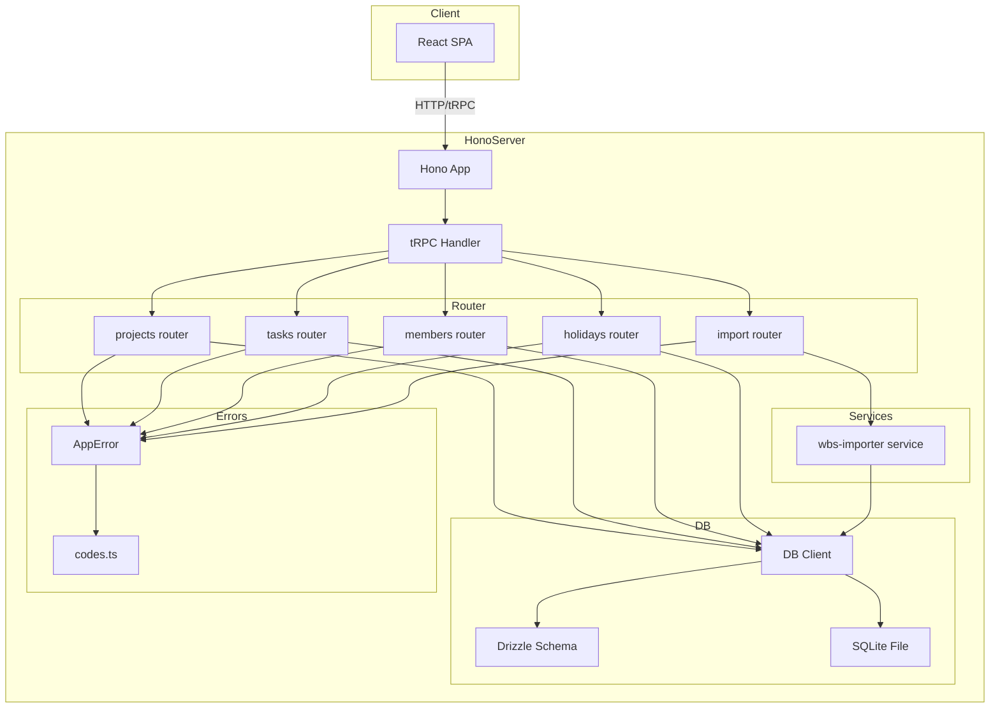
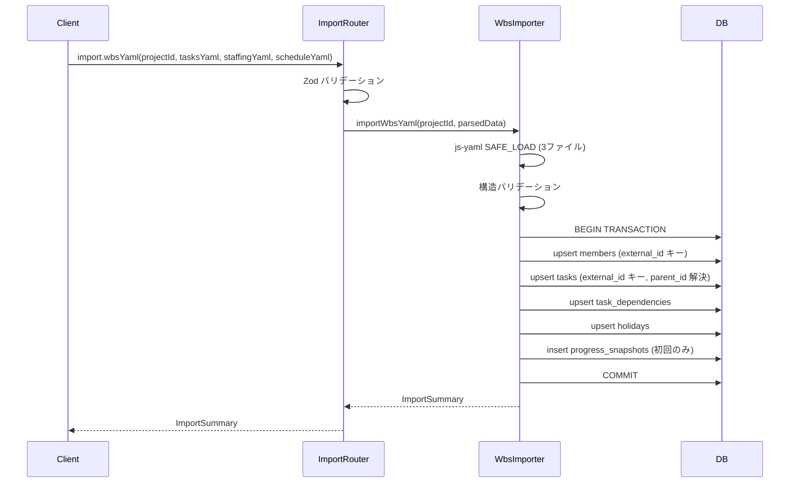
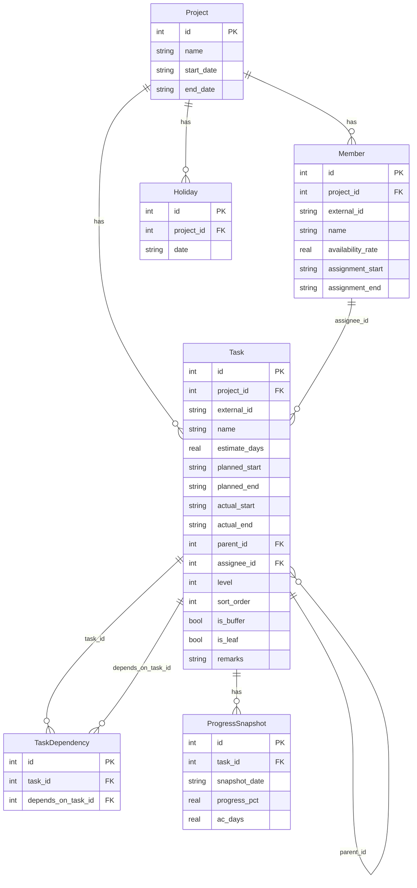

# 設計書: core-data-model

## 概要

本スペックは EVM Studio の基盤データレイヤーを確立する。Drizzle ORM による SQLite スキーマ定義・マイグレーション、tRPC ルーターを通じた Project / Task / Member / Holiday の CRUD エンドポイント、wbs-YAML（tasks.yaml / staffing.yaml / schedule.yaml）の一括インポート機能を提供する。

**目的**: 下流スペック（evm-engine / progress-tracking / dashboard / reporting）すべてが依存する共通エンティティ型と永続化基盤を確定する。

**ユーザー**: プロジェクト管理者が tRPC 経由でプロジェクトデータを作成・管理し、WBS YAML をインポートしてデータを初期化する。

**影響**: 現在は空のスキャフォールドのみ存在する `evm-studio/server/src/` に DB 層・サービス層・API 層を新規追加する。型定義は下流スペックが参照するため、変更時は全スペックへの影響を確認する。

### 目標

- Project / Task / Member / Holiday / TaskDependency / ProgressSnapshot の SQLite スキーマを Drizzle ORM で定義する
- tRPC 経由の CRUD エンドポイントを各エンティティに提供する
- wbs-YAML 3 ファイルのアトミックなインポートを単一エンドポイントで提供する
- Drizzle 推論型を外部エクスポートし、downstream スペックが安全に参照できるようにする

### 非目標

- EVM メトリクス計算（PV/EV/SPI/CPI/EAC）は evm-engine スペックが担う
- 進捗スナップショットの日次更新は progress-tracking スペックが担う
- 画面コンポーネント・チャートは dashboard / reporting スペックが担う
- xlsm インポートは将来対応

---

## 境界コミットメント

### このスペックが所有するもの

- `server/src/db/schema.ts` — Drizzle スキーマ（6 テーブル全定義）とエンティティ型エクスポート
- `server/src/db/index.ts` — DB 接続・マイグレーション実行・`db` インスタンスのエクスポート
- `server/src/db/migrations/` — Drizzle Kit 生成マイグレーションファイル
- `server/src/services/wbs-importer.ts` — YAML → DB 変換ロジック（アトミックトランザクション）
- `server/src/api/projects.ts` — projects tRPC ルーター
- `server/src/api/tasks.ts` — tasks tRPC ルーター
- `server/src/api/members.ts` — members tRPC ルーター
- `server/src/api/holidays.ts` — holidays tRPC ルーター
- `server/src/api/import.ts` — import tRPC ルーター
- `server/src/errors/codes.ts` — 全 ErrorCode 定数（`PROJ_*`, `TASK_*`, `MEMBER_*`, `IMPORT_*`）
- `server/src/errors/AppError.ts` — AppError クラス定義
- `server/src/router.ts` — tRPC appRouter 統合（本スペックの全ルーターをマウント）
- `server/src/index.ts` — Hono サーバーのエントリーポイント（tRPC ハンドラーのマウント）

### 境界外（所有しない）

- EVM 計算ロジック（evm-engine が担う）
- ProgressSnapshot の日次 CRUD（progress-tracking が担う。本スペックではインポート時の初回作成のみ担当）
- フロントエンドコンポーネント・フック（dashboard / reporting が担う）
- 認証・認可（スコープ外）

### 許可された依存関係

- `drizzle-orm` / `better-sqlite3` — DB 層
- `@trpc/server` — tRPC ルーター
- `zod` — 入力バリデーション
- `js-yaml` — YAML パース（SAFE_LOAD のみ）
- `pino` — 構造化ログ（ビジネスロジック層）
- Node.js 組み込みモジュール（`path`, `fs`）

### 再検証トリガー

以下の変更が発生した場合、downstream スペック（evm-engine / progress-tracking / dashboard / reporting）は統合確認を実施すること:

- `Task` エンティティのカラム追加・型変更・削除
- `TaskDependency` テーブルの構造変更
- `ProgressSnapshot` テーブルのカラム変更
- エクスポートされる TypeScript 型定義の変更
- tRPC プロシージャ名の変更または入出力スキーマの変更

---

## アーキテクチャ

### アーキテクチャパターンとバウンダリマップ



依存関係の方向: `errors/codes.ts` → `errors/AppError.ts` → `db/schema.ts` → `db/index.ts` → `services/` → `api/` → `router.ts` → `index.ts`

各レイヤーは左方向にのみ import する。API 層は DB 層・サービス層に依存するが、逆方向の依存は禁止。

### テクノロジースタック

| レイヤー | 選択 / バージョン | 役割 |
|---------|-----------------|------|
| Backend | Hono 4.12 + Node.js 22 | HTTP サーバー・CORS・ロギングミドルウェア |
| API | tRPC 11 | 型安全 CRUD エンドポイント・入力バリデーション |
| ORM | Drizzle ORM 0.45 | スキーマ定義・型推論・マイグレーション |
| DB | better-sqlite3 12 | SQLite ドライバー（同期 API） |
| バリデーション | Zod 4 | tRPC 入力スキーマ定義 |
| YAML パース | js-yaml 4 | WBS YAML の SAFE_LOAD |
| ロギング | pino 10 | サービス層の構造化ログ |

---

## ファイル構成計画

### ディレクトリ構造

```
evm-studio/
├── server/
│   └── src/
│       ├── index.ts                    # Hono エントリーポイント（tRPC マウント）
│       ├── router.ts                   # appRouter（全ルーターをマウント）
│       ├── errors/
│       │   ├── codes.ts                # ErrorCode 定数（唯一の定義場所）
│       │   └── AppError.ts             # AppError クラス
│       ├── db/
│       │   ├── schema.ts               # Drizzle スキーマ（全テーブル・型エクスポート）
│       │   ├── index.ts                # DB 接続・マイグレーション実行・db エクスポート
│       │   └── migrations/             # drizzle-kit 生成ファイル（変更禁止）
│       ├── services/
│       │   └── wbs-importer.ts         # YAML → DB 変換（アトミックトランザクション）
│       ├── api/
│       │   ├── projects.ts             # projects tRPC ルーター
│       │   ├── tasks.ts                # tasks tRPC ルーター
│       │   ├── members.ts              # members tRPC ルーター
│       │   ├── holidays.ts             # holidays tRPC ルーター
│       │   └── import.ts               # import tRPC ルーター
│       └── drizzle.config.ts           # drizzle-kit 設定
├── client/
│   └── src/                            # 本スペックでは変更なし
└── e2e/
    └── import.spec.ts                  # WBS インポート E2E テスト（本スペックで追加）
```

### 変更ファイル

- `evm-studio/server/src/index.ts` — 新規作成（Hono + tRPC 統合エントリーポイント）
- `evm-studio/server/src/router.ts` — 新規作成（appRouter 定義）

---

## システムフロー

### WBS YAML インポートフロー



---

## 要件トレーサビリティ

| 要件 | 概要 | コンポーネント | インターフェース | フロー |
|------|------|---------------|----------------|--------|
| 1.1–1.8 | SQLite スキーマ定義 | DrizzleSchema, DBClient | schema.ts エクスポート型 | — |
| 2.1–2.7 | Project CRUD | ProjectsRouter | projects tRPC | — |
| 3.1–3.9 | Task CRUD | TasksRouter | tasks tRPC | — |
| 4.1–4.6 | Member CRUD | MembersRouter | members tRPC | — |
| 5.1–5.4 | Holiday CRUD | HolidaysRouter | holidays tRPC | — |
| 6.1–6.10 | WBS YAML インポート | ImportRouter, WbsImporter | import tRPC | インポートフロー |
| 7.1–7.5 | エラーハンドリング・型安全 | AppError, ErrorCodes, 全ルーター | AppError, ErrorCode | — |

---

## コンポーネントとインターフェース

### コンポーネントサマリー

| コンポーネント | レイヤー | 目的 | 要件カバレッジ | 主要依存 |
|--------------|---------|------|--------------|---------|
| DrizzleSchema | DB | 全テーブル定義・型エクスポート | 1.1–1.8 | drizzle-orm, better-sqlite3 |
| DBClient | DB | DB 接続・マイグレーション | 1.7, 1.8 | DrizzleSchema, better-sqlite3 |
| ProjectsRouter | API | Project CRUD tRPC | 2.1–2.7 | DBClient, AppError |
| TasksRouter | API | Task CRUD tRPC | 3.1–3.9 | DBClient, AppError |
| MembersRouter | API | Member CRUD tRPC | 4.1–4.6 | DBClient, AppError |
| HolidaysRouter | API | Holiday CRUD tRPC | 5.1–5.4 | DBClient, AppError |
| ImportRouter | API | WBS YAML インポート tRPC | 6.1–6.10 | WbsImporter, AppError |
| WbsImporter | Service | YAML → DB 変換（アトミック） | 6.1–6.10 | DBClient, js-yaml |
| AppError | Error | ドメイン例外 | 7.1–7.2 | ErrorCodes |
| ErrorCodes | Error | 全エラーコード定数 | 7.1 | — |

---

### DB レイヤー

#### DrizzleSchema

| フィールド | 詳細 |
|-----------|------|
| Intent | 全エンティティの Drizzle スキーマ定義と TypeScript 型のエクスポート |
| Requirements | 1.1, 1.2, 1.3, 1.4, 1.5, 1.6, 7.3, 7.4 |

**責任と制約**

- 6 テーブル（projects / tasks / members / holidays / task_dependencies / progress_snapshots）の Drizzle スキーマ定義
- Drizzle 推論型（`Project`, `Task`, `Member`, `Holiday`, `TaskDependency`, `ProgressSnapshot`, `NewProject`, `NewTask` 等）をエクスポート
- DB カラム名は snake_case、TypeScript プロパティ名は camelCase にマッピング
- `is_buffer` / `is_leaf` は SQLite INTEGER として保存（0/1）

**依存関係**

- External: `drizzle-orm/sqlite-core` — スキーマ DSL (P0)

**コントラクト**: Service [x]

##### サービスインターフェース（スキーマ型エクスポート）

```typescript
// server/src/db/schema.ts

// --- projects ---
export const projects = sqliteTable('projects', {
  id:        integer('id').primaryKey({ autoIncrement: true }),
  name:      text('name').notNull(),
  startDate: text('start_date').notNull(),
  endDate:   text('end_date').notNull(),
  createdAt: integer('created_at', { mode: 'timestamp' }).$defaultFn(() => new Date()),
  updatedAt: integer('updated_at', { mode: 'timestamp' }).$defaultFn(() => new Date()),
})
export type Project    = typeof projects.$inferSelect
export type NewProject = typeof projects.$inferInsert

// --- tasks ---
export const tasks = sqliteTable('tasks', {
  id:          integer('id').primaryKey({ autoIncrement: true }),
  projectId:   integer('project_id').notNull().references(() => projects.id, { onDelete: 'cascade' }),
  externalId:  text('external_id'),                // wbs-YAML の "T001" 形式
  name:        text('name').notNull(),
  estimateDays:real('estimate_days').notNull().default(0),
  plannedStart:text('planned_start'),
  plannedEnd:  text('planned_end'),
  actualStart: text('actual_start'),
  actualEnd:   text('actual_end'),
  parentId:    integer('parent_id').references((): AnySQLiteColumn => tasks.id),
  assigneeId:  integer('assignee_id').references(() => members.id, { onDelete: 'set null' }),
  level:       integer('level').notNull().default(1),
  sortOrder:   integer('sort_order').notNull().default(0),
  isBuffer:    integer('is_buffer', { mode: 'boolean' }).notNull().default(false),
  isLeaf:      integer('is_leaf',   { mode: 'boolean' }).notNull().default(true),
  remarks:     text('remarks'),
  createdAt:   integer('created_at', { mode: 'timestamp' }).$defaultFn(() => new Date()),
  updatedAt:   integer('updated_at', { mode: 'timestamp' }).$defaultFn(() => new Date()),
})
export type Task    = typeof tasks.$inferSelect
export type NewTask = typeof tasks.$inferInsert

// --- members ---
export const members = sqliteTable('members', {
  id:               integer('id').primaryKey({ autoIncrement: true }),
  projectId:        integer('project_id').notNull().references(() => projects.id, { onDelete: 'cascade' }),
  externalId:       text('external_id'),
  name:             text('name').notNull(),
  availabilityRate: real('availability_rate').notNull().default(1.0),
  assignmentStart:  text('assignment_start'),
  assignmentEnd:    text('assignment_end'),
  createdAt:        integer('created_at', { mode: 'timestamp' }).$defaultFn(() => new Date()),
  updatedAt:        integer('updated_at', { mode: 'timestamp' }).$defaultFn(() => new Date()),
})
export type Member    = typeof members.$inferSelect
export type NewMember = typeof members.$inferInsert

// --- holidays ---
export const holidays = sqliteTable('holidays', {
  id:        integer('id').primaryKey({ autoIncrement: true }),
  projectId: integer('project_id').notNull().references(() => projects.id, { onDelete: 'cascade' }),
  date:      text('date').notNull(),
})
export type Holiday    = typeof holidays.$inferSelect
export type NewHoliday = typeof holidays.$inferInsert

// --- task_dependencies ---
export const taskDependencies = sqliteTable('task_dependencies', {
  id:              integer('id').primaryKey({ autoIncrement: true }),
  taskId:          integer('task_id').notNull().references(() => tasks.id, { onDelete: 'cascade' }),
  dependsOnTaskId: integer('depends_on_task_id').notNull().references(() => tasks.id, { onDelete: 'cascade' }),
})
export type TaskDependency    = typeof taskDependencies.$inferSelect
export type NewTaskDependency = typeof taskDependencies.$inferInsert

// --- progress_snapshots ---
export const progressSnapshots = sqliteTable('progress_snapshots', {
  id:           integer('id').primaryKey({ autoIncrement: true }),
  taskId:       integer('task_id').notNull().references(() => tasks.id, { onDelete: 'cascade' }),
  snapshotDate: text('snapshot_date').notNull(),
  progressPct:  real('progress_pct').notNull().default(0),
  pvDays:       real('pv_days').notNull().default(0),   // リスケ保全用: 記録時点の PV を保存
  evDays:       real('ev_days').notNull().default(0),   // 再見積保全用: 記録時点の EV を保存
  acDays:       real('ac_days').notNull().default(0),
  createdAt:    integer('created_at', { mode: 'timestamp' }).$defaultFn(() => new Date()),
}, (progressSnapshots) => ({
  taskDateUniq: uniqueIndex('idx_progress_snapshots_task_date').on(progressSnapshots.taskId, progressSnapshots.snapshotDate),
}))
export type ProgressSnapshot    = typeof progressSnapshots.$inferSelect
export type NewProgressSnapshot = typeof progressSnapshots.$inferInsert
```

**実装ノート**

- `tasks.parentId` の自己参照は `() => tasks.id` の遅延評価で対応
- `PRAGMA foreign_keys = ON` は `db/index.ts` の DB 初期化時に実行する（要件 1.8）
- Drizzle Kit で `drizzle-kit generate` を実行してマイグレーションファイルを生成する

---

#### DBClient

| フィールド | 詳細 |
|-----------|------|
| Intent | better-sqlite3 接続の初期化、マイグレーション実行、db インスタンスのシングルトン提供 |
| Requirements | 1.7, 1.8 |

**責任と制約**

- アプリ起動時に `migrate(db, { migrationsFolder })` を実行して最新スキーマを適用（要件 1.7）
- `PRAGMA foreign_keys = ON` を接続後即時実行（要件 1.8）
- `db` インスタンスをモジュールレベルのシングルトンとしてエクスポート

**コントラクト**: Service [x]

##### サービスインターフェース

```typescript
// server/src/db/index.ts
import Database from 'better-sqlite3'
import { drizzle } from 'drizzle-orm/better-sqlite3'
import { migrate } from 'drizzle-orm/better-sqlite3/migrator'
import * as schema from './schema'

const DB_PATH = process.env.DB_PATH ?? './evm-studio.db'
const sqlite = new Database(DB_PATH)
sqlite.pragma('foreign_keys = ON')
export const db = drizzle(sqlite, { schema })

export function runMigrations(): void {
  migrate(db, { migrationsFolder: './src/db/migrations' })
}
```

---

### エラーレイヤー

#### ErrorCodes

| フィールド | 詳細 |
|-----------|------|
| Intent | 全ドメインエラーコードの唯一の定義場所 |
| Requirements | 7.1 |

**コントラクト**: Service [x]

##### サービスインターフェース

```typescript
// server/src/errors/codes.ts
export const ErrorCode = {
  // Project
  PROJ_NOT_FOUND:          'PROJ_NOT_FOUND',
  // Task
  TASK_NOT_FOUND:          'TASK_NOT_FOUND',
  // Member
  MEMBER_NOT_FOUND:        'MEMBER_NOT_FOUND',
  MEMBER_INVALID_RATE:     'MEMBER_INVALID_RATE',
  // Import
  IMPORT_INVALID_YAML:     'IMPORT_INVALID_YAML',
  IMPORT_PARSE_ERROR:      'IMPORT_PARSE_ERROR',
  IMPORT_MISSING_FIELD:    'IMPORT_MISSING_FIELD',
} as const
export type ErrorCode = typeof ErrorCode[keyof typeof ErrorCode]
```

#### AppError

| フィールド | 詳細 |
|-----------|------|
| Intent | ドメイン例外クラス（コードとメッセージを持つ） |
| Requirements | 7.1, 7.2 |

**コントラクト**: Service [x]

##### サービスインターフェース

```typescript
// server/src/errors/AppError.ts
import { type ErrorCode } from './codes'

export class AppError extends Error {
  constructor(
    public readonly code: ErrorCode,
    message: string,
  ) {
    super(message)
    this.name = 'AppError'
  }
}
```

tRPC ルーターでの変換パターン:

```typescript
import { TRPCError } from '@trpc/server'
import { AppError } from '../errors/AppError'

function toTRPCError(e: AppError): TRPCError {
  const codeMap: Record<string, TRPCError['code']> = {
    PROJ_NOT_FOUND:   'NOT_FOUND',
    TASK_NOT_FOUND:   'NOT_FOUND',
    MEMBER_NOT_FOUND: 'NOT_FOUND',
    IMPORT_INVALID_YAML: 'BAD_REQUEST',
    IMPORT_PARSE_ERROR:  'BAD_REQUEST',
    IMPORT_MISSING_FIELD:'BAD_REQUEST',
    MEMBER_INVALID_RATE: 'BAD_REQUEST',
  }
  return new TRPCError({
    code: codeMap[e.code] ?? 'INTERNAL_SERVER_ERROR',
    message: e.message,
    cause: e,
  })
}
```

---

### API レイヤー

#### ProjectsRouter

| フィールド | 詳細 |
|-----------|------|
| Intent | Project の CRUD tRPC プロシージャを提供する |
| Requirements | 2.1, 2.2, 2.3, 2.4, 2.5, 2.6, 2.7 |

**コントラクト**: API [x]

##### API コントラクト

| プロシージャ | 入力スキーマ（Zod） | 戻り値 | エラー |
|------------|-------------------|--------|--------|
| `projects.list` | なし | `Project[]` | — |
| `projects.getById` | `{ id: z.number().int().positive() }` | `Project` | PROJ_NOT_FOUND |
| `projects.create` | `createProjectSchema` | `Project` | BAD_REQUEST |
| `projects.update` | `updateProjectSchema` | `Project` | PROJ_NOT_FOUND, BAD_REQUEST |
| `projects.delete` | `{ id: z.number().int().positive() }` | `{ success: true }` | PROJ_NOT_FOUND |

```typescript
// Zod スキーマ（概略）
const createProjectSchema = z.object({
  name:      z.string().min(1).max(200),
  startDate: z.string().regex(/^\d{4}-\d{2}-\d{2}$/),
  endDate:   z.string().regex(/^\d{4}-\d{2}-\d{2}$/),
})
const updateProjectSchema = z.object({
  id:        z.number().int().positive(),
  name:      z.string().min(1).max(200).optional(),
  startDate: z.string().regex(/^\d{4}-\d{2}-\d{2}$/).optional(),
  endDate:   z.string().regex(/^\d{4}-\d{2}-\d{2}$/).optional(),
})
```

#### TasksRouter

| フィールド | 詳細 |
|-----------|------|
| Intent | Task の CRUD tRPC プロシージャを提供する |
| Requirements | 3.1, 3.2, 3.3, 3.4, 3.5, 3.6, 3.7, 3.8, 3.9 |

**コントラクト**: API [x]

##### API コントラクト

| プロシージャ | 入力スキーマ | 戻り値 | エラー |
|------------|------------|--------|--------|
| `tasks.listByProject` | `{ projectId: z.number() }` | `Task[]` (sort_order 昇順) | — |
| `tasks.getById` | `{ id: z.number() }` | `Task` | TASK_NOT_FOUND |
| `tasks.create` | `createTaskSchema` | `Task` | BAD_REQUEST |
| `tasks.update` | `updateTaskSchema` | `Task` | TASK_NOT_FOUND, BAD_REQUEST |
| `tasks.delete` | `{ id: z.number() }` | `{ success: true }` | TASK_NOT_FOUND |

```typescript
const createTaskSchema = z.object({
  projectId:    z.number().int().positive(),
  name:         z.string().min(1).max(500),
  estimateDays: z.number().nonnegative(),
  plannedStart: z.string().regex(/^\d{4}-\d{2}-\d{2}$/).optional(),
  plannedEnd:   z.string().regex(/^\d{4}-\d{2}-\d{2}$/).optional(),
  parentId:     z.number().int().positive().optional(),
  assigneeId:   z.number().int().positive().optional(),
  level:        z.number().int().nonnegative().default(1),
  sortOrder:    z.number().int().nonnegative().default(0),
  isBuffer:     z.boolean().default(false),
  isLeaf:       z.boolean().default(true),
  remarks:      z.string().optional(),
})
```

#### MembersRouter

| フィールド | 詳細 |
|-----------|------|
| Intent | Member の CRUD tRPC プロシージャを提供する |
| Requirements | 4.1, 4.2, 4.3, 4.4, 4.5, 4.6 |

**コントラクト**: API [x]

##### API コントラクト

| プロシージャ | 入力スキーマ | 戻り値 | エラー |
|------------|------------|--------|--------|
| `members.listByProject` | `{ projectId: z.number() }` | `Member[]` | — |
| `members.create` | `createMemberSchema` | `Member` | BAD_REQUEST |
| `members.update` | `updateMemberSchema` | `Member` | MEMBER_NOT_FOUND, BAD_REQUEST |
| `members.delete` | `{ id: z.number() }` | `{ success: true }` | MEMBER_NOT_FOUND |

```typescript
const createMemberSchema = z.object({
  projectId:        z.number().int().positive(),
  name:             z.string().min(1).max(200),
  availabilityRate: z.number().min(0).max(1),
  assignmentStart:  z.string().regex(/^\d{4}-\d{2}-\d{2}$/).optional(),
  assignmentEnd:    z.string().regex(/^\d{4}-\d{2}-\d{2}$/).optional(),
  externalId:       z.string().optional(),
})
```

#### HolidaysRouter

| フィールド | 詳細 |
|-----------|------|
| Intent | Holiday の CRUD tRPC プロシージャを提供する |
| Requirements | 5.1, 5.2, 5.3, 5.4 |

**コントラクト**: API [x]

##### API コントラクト

| プロシージャ | 入力スキーマ | 戻り値 | エラー |
|------------|------------|--------|--------|
| `holidays.listByProject` | `{ projectId: z.number() }` | `Holiday[]` (date 昇順) | — |
| `holidays.create` | `{ projectId: z.number(), date: z.string().regex(/^\d{4}-\d{2}-\d{2}$/) }` | `Holiday` | BAD_REQUEST |
| `holidays.delete` | `{ id: z.number() }` | `{ success: true }` | — |

#### ImportRouter

| フィールド | 詳細 |
|-----------|------|
| Intent | WBS YAML 3 ファイルの一括インポートエンドポイントを提供する |
| Requirements | 6.1, 6.2, 6.3, 6.4, 6.5, 6.6, 6.7, 6.8, 6.9, 6.10 |

**コントラクト**: API [x]

##### API コントラクト

| プロシージャ | 入力スキーマ | 戻り値 | エラー |
|------------|------------|--------|--------|
| `import.wbsYaml` | `importWbsYamlSchema` | `ImportSummary` | IMPORT_PARSE_ERROR, IMPORT_INVALID_YAML |

```typescript
const importWbsYamlSchema = z.object({
  projectId:    z.number().int().positive(),
  tasksYaml:    z.string().min(1),
  staffingYaml: z.string().min(1),
  scheduleYaml: z.string().min(1),
})

interface ImportSummary {
  projects:     number
  tasks:        number
  members:      number
  holidays:     number
  dependencies: number
  snapshots:    number
}
```

---

### サービスレイヤー

#### WbsImporter

| フィールド | 詳細 |
|-----------|------|
| Intent | WBS YAML を解析し DB にアトミックにインポートするビジネスロジック |
| Requirements | 6.1, 6.2, 6.3, 6.4, 6.5, 6.6, 6.7, 6.8, 6.9, 6.10 |

**責任と制約**

- `js-yaml.load()` の SAFE_LOAD オプションで 3 ファイルをパース（要件 6.10）
- 必須フィールドの構造バリデーション（不足時は `IMPORT_MISSING_FIELD` で throw）
- SQLite トランザクション内で全 upsert を実行（アトミック性、要件 6.7）
- `external_id` をキーとして upsert（再インポート対応、要件 6.8）
- parent_id・assignee_id の external_id → DB id 解決（要件 6.2, 6.4）
- 初回 ProgressSnapshot の insert（要件 6.5）
- pino でインポートログを出力（task_id のみ、個人名はログに含めない）

**コントラクト**: Service [x]

##### サービスインターフェース

```typescript
// server/src/services/wbs-importer.ts
interface WbsImportInput {
  projectId:    number
  tasksYaml:    string
  staffingYaml: string
  scheduleYaml: string
}

interface ImportSummary {
  projects:     number
  tasks:        number
  members:      number
  holidays:     number
  dependencies: number
  snapshots:    number
}

export function importWbsYaml(input: WbsImportInput): ImportSummary
```

- 事前条件: `projectId` が DB に存在すること（存在しない場合は `PROJ_NOT_FOUND` で throw）
- 事後条件: 全エンティティが DB に upsert され、ImportSummary が返る
- 不変条件: トランザクション内で実行されるため、部分的な書き込みは発生しない

**実装ノート**

- `tasks.yaml` の YAML 構造: `tasks: [{ id, title, estimate_days, planned_start, planned_end, parent_id?, depends_on[]?, assignee?, actual_start?, actual_end?, progress_pct?, is_buffer? }]`
- `staffing.yaml` の YAML 構造: `members: [{ id, name, availability_rate, assignment_start?, assignment_end? }]`, `meta.public_holidays: [string]`
- `schedule.yaml` の YAML 構造: `meta.schedule_start`, `meta.schedule_end`（Project のstart_date / end_date に対応）
- better-sqlite3 の同期 API を使用してトランザクションを管理する: `db.transaction(() => { ... })()`
- 初回 ProgressSnapshot 作成時の `pv_days` / `ev_days` 計算:
  - `ev_days = estimate_days × (progress_pct / 100)`（tasks.yaml の progress_pct を使用）
  - `pv_days`: インポート日が `planned_start` 以前なら 0、`planned_end` 以降なら `estimate_days`、期間内なら `min(稼働日数 × availability_rate, estimate_days)` で計算（assignee 未指定時は availability_rate = 1.0）

---

## データモデル

### ドメインモデル



### 物理データモデル

テーブル設計上の重要な決定点:

- **日付型**: SQLite には DATE 型がないため TEXT（`YYYY-MM-DD` 形式）で保存する。比較演算が文字列辞書順で正しく動作する。
- **タイムスタンプ**: INTEGER（Unix エポック秒）で保存し、Drizzle の `{ mode: 'timestamp' }` で Date 型に自動変換する。
- **boolean**: SQLite には BOOLEAN 型がないため INTEGER（0/1）で保存。Drizzle の `{ mode: 'boolean' }` で自動変換。
- **外部キー**: `PRAGMA foreign_keys = ON` を接続時に設定し参照整合性を保証。

---

## エラーハンドリング

### エラー戦略

| エラー種別 | 発生箇所 | 対応 |
|-----------|---------|------|
| 入力バリデーション失敗 | tRPC ルーター（Zod） | TRPCError BAD_REQUEST として返す |
| エンティティ未発見 | API ルーター | AppError(PROJ_NOT_FOUND 等) → TRPCError NOT_FOUND |
| YAML パースエラー | WbsImporter | AppError(IMPORT_PARSE_ERROR) → TRPCError BAD_REQUEST |
| YAML 構造不正 | WbsImporter | AppError(IMPORT_INVALID_YAML) → TRPCError BAD_REQUEST |
| DB エラー | DB レイヤー | 上位に再 throw（tRPC が INTERNAL_SERVER_ERROR に変換） |

### モニタリング

- HTTP リクエストログ: `hono/logger` ミドルウェア（エントリーポイントに設定）
- ビジネスロジックログ: `pino` を使用（WbsImporter）
- ログには個人名を含めない（task_id / project_id のみ）

---

## テスト戦略

### サーバー単体テスト（Vitest）

| テスト対象 | テスト内容 | 要件 |
|-----------|----------|------|
| `wbs-importer.ts` | 正常インポート（3 YAML → DB） | 6.1–6.9 |
| `wbs-importer.ts` | parent_id の external_id 解決 | 6.2 |
| `wbs-importer.ts` | depends_on の task_dependencies 挿入 | 6.3 |
| `wbs-importer.ts` | 不正 YAML でのアトミックロールバック | 6.7 |
| `wbs-importer.ts` | 再インポート（upsert）での重複なし | 6.8 |
| `projects.ts` (router) | NOT_FOUND エラーの正確な AppError コード | 2.4 |
| `members.ts` (router) | availability_rate 範囲外バリデーション | 4.5 |

### E2E テスト（Playwright）

| テストフロー | 内容 | 要件 |
|------------|------|------|
| WBS インポート → プロジェクト確認 | 3 YAML ファイルをインポートしてタスク一覧が返ること | 6.1, 6.9 |

---

## セキュリティ考慮事項

- **YAML インジェクション**: `js-yaml` の `SAFE_LOAD`（デフォルト）を使用し、JavaScript オブジェクト生成を禁止する（要件 6.10）
- **SQL インジェクション**: Drizzle ORM のパラメータ化クエリで自動対応
- **入力バリデーション**: 全 tRPC プロシージャで Zod スキーマによる厳格なバリデーション（要件 7.5）
- **CORS**: Hono の CORS を `localhost` のみに制限（エントリーポイントに設定）
- **個人情報**: ログに担当者名を含めない（task_id のみ参照）
