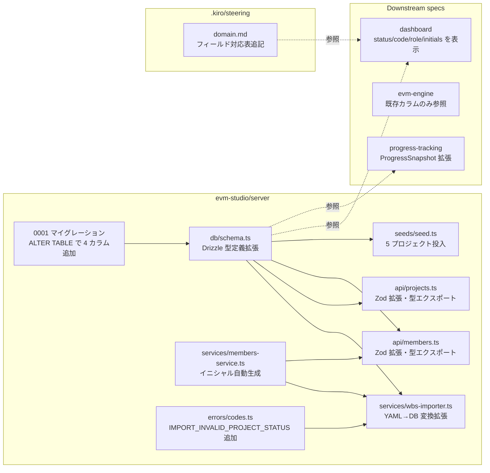
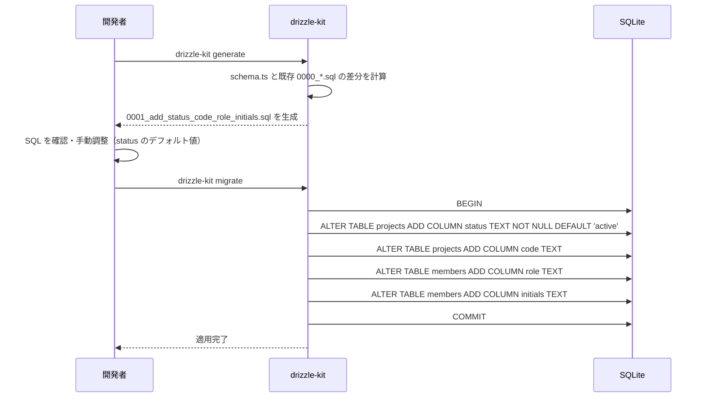
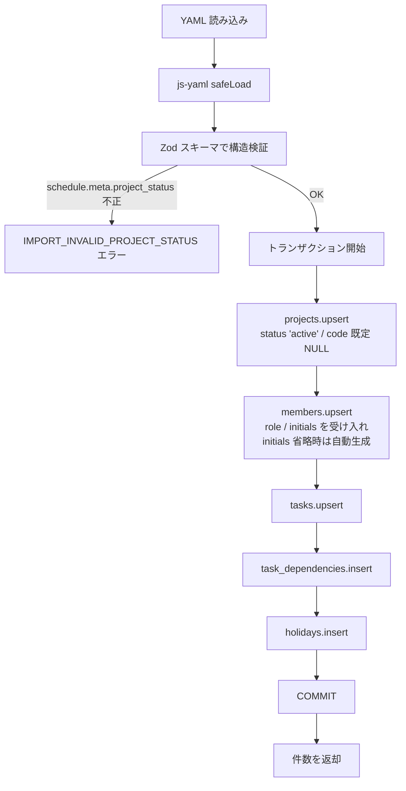
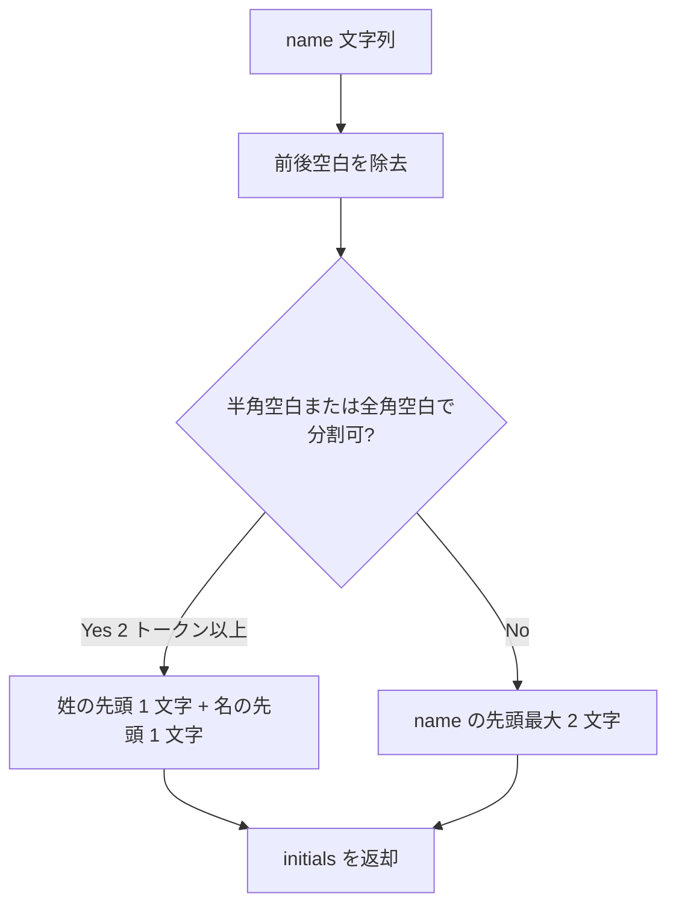
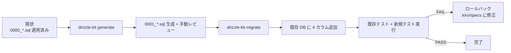

# 設計書: core-data-model

## Overview

**Purpose**: モックアップ `mockup/variation-a.jsx` のワークベンチ UI（左レール・TopBar・Inspector）を支えるために、SQLite スキーマに 4 カラム（`projects.status` / `projects.code` / `members.role` / `members.initials`）を追加し、WBS YAML インポーター・tRPC レスポンス型・シードデータを整合的に拡張する。

**Users**: ダッシュボード／EVM エンジン／進捗トラッキング各スペックの実装者・WBS 作成者・EVM Studio 利用者が、本データモデルを上流とした実装を行う。

**Impact**: 既存スキーマ（`projects` / `members`）に対し非破壊的に `ALTER TABLE ADD COLUMN` 形式でカラムを追加する。既存レコードは保持され、`Project.status` のみ `'active'` で埋められる。WBS YAML フィールドは後方互換で追加される。

### Goals

- `projects.status` / `projects.code` / `members.role` / `members.initials` の 4 カラムを追加し、tRPC を経由してクライアントから型安全に参照できるようにする。
- WBS YAML インポーターを後方互換に保ちながら新フィールドに対応させる。
- モックアップと同等の 5 プロジェクト分のシードデータを `npm run seed` で投入できるようにする。
- 既存の SQLite データベースを破壊せずにマイグレーションが完了する。

### Non-Goals

- `progress_snapshots.note` カラム追加（→ `progress-tracking` spec の責務）。
- EVM 計算ロジック・PV/EV/AC 算出（→ `evm-engine` spec の責務）。
- ダッシュボード UI 表示・Inspector / Avatar / Dot コンポーネントの実装（→ `dashboard` spec の責務）。
- 認証・認可・マルチユーザー対応（プロダクト方針によりローカル限定のため対象外）。
- `Project.code` の重複検証・unique 制約（運用判断によりスキーマ制約は付けない）。

## Boundary Commitments

### This Spec Owns

- `projects` テーブルの `status` / `code` カラム（スキーマ定義・既定値・型・許容値）。
- `members` テーブルの `role` / `initials` カラム（スキーマ定義・既定値・型・自動生成ロジック）。
- 新カラム追加のマイグレーション SQL（`0001_*.sql`）。
- `wbs-importer.ts` の YAML パース・Zod スキーマ・DB 書き込みロジックの新フィールド対応。
- `projects.ts` / `members.ts` tRPC ルーターの入力 Zod スキーマと出力型。
- `members-service.ts`（新規追加）の `initials` 自動生成純粋関数。
- `evm-studio/server/seeds/` 配下のシードスクリプトとシードデータ。
- `.kiro/steering/domain.md` のフィールド対応表追記。

### Out of Boundary

- `tasks` / `progress_snapshots` / `task_dependencies` / `holidays` テーブルへのカラム追加（本スペックでは行わない。`progress-tracking` 等の下流が必要に応じて追加する）。
- `Project.status` を Dot 色分けに変換するロジック・UI 表現（→ `dashboard` spec）。
- `Member.role` をプリセット選択 UI に変換する処理（→ `dashboard` spec）。
- WBS YAML の生成（→ `wbs-*` スキル）。
- マイグレーション自動適用のオーケストレーション変更（既存 `drizzle-kit migrate` の仕組みを使う）。

### Allowed Dependencies

- Drizzle ORM 0.45（スキーマ定義・型推論）。
- better-sqlite3 12（DB ドライバ）。
- drizzle-kit（マイグレーション生成・適用）。
- Zod 4（tRPC 入力バリデーション）。
- js-yaml 4（WBS YAML パース）。
- 既存の `errors/codes.ts`（`ErrorCode` 定数の追加先）。
- 既存の `db/schema.ts`（カラム追加先）。
- 既存の `services/wbs-importer.ts`（拡張先）。
- 既存の `api/projects.ts` / `api/members.ts`（tRPC ルーター拡張先）。

### Revalidation Triggers

- `Project.status` の有効値リストが変わった場合 → `dashboard` の Dot 色分けと Zod enum を更新する必要あり。
- `Member.role` の参考プリセットが変わった場合 → `dashboard` の Members リスト UI を再確認。
- `projects.code` に unique 制約を後付けする判断が出た場合 → 既存シードデータ・WBS YAML の重複チェックを再検証する必要あり。
- WBS YAML のフィールド名（`project_status` / `project_code` / `role` / `initials`）を変更した場合 → `wbs-*` スキル側のテンプレート更新と既存サンプル YAML 修正が必要。
- `Member.initials` 自動生成アルゴリズムを変更した場合 → 既存テストおよび `dashboard` の Avatar 表示期待値の再検証が必要。

## Architecture

### Existing Architecture Analysis

EVM Studio は次の構造を持つ既存実装が稼働している。

- `evm-studio/server/src/db/schema.ts` に Drizzle スキーマが定義され、`projects` / `members` / `tasks` / `holidays` / `task_dependencies` / `progress_snapshots` の 6 テーブルが存在する。
- `evm-studio/server/src/db/migrations/0000_real_gorilla_man.sql` が初期マイグレーションとして適用済み。
- `evm-studio/server/src/services/wbs-importer.ts` が YAML を Zod でバリデートし、`projects.upsert` / `members.upsert` / `tasks.upsert` / `holidays.insert` の順で DB に書き込む。トランザクションで囲まれている。
- `evm-studio/server/src/api/projects.ts` / `members.ts` が tRPC ルーターとして CRUD を提供している。出力は Drizzle 推論型をそのまま流す。
- `evm-studio/server/src/errors/codes.ts` に `ErrorCode` 定数が集約されている。
- `evm-studio/server/seeds/` ディレクトリは未作成。

本スペックは既存のレイヤー責務（`api/` がルーティング、`services/` がビジネスロジック、`db/` がスキーマ）を保持し、各層に対して新カラムと新ロジックを追加する。

### Architecture Pattern & Boundary Map



**Architecture Integration**:
- **Selected pattern**: 既存の 3 層構造（`api/` ルーティング → `services/` ビジネスロジック → `db/` スキーマ）を維持し、純粋関数 `members-service.ts` を新設して `initials` 自動生成ロジックを単独テスト可能にする。
- **Domain/feature boundaries**: スキーマ層・サービス層・API 層・シードスクリプトを明確に分離。マイグレーション SQL は手書き（drizzle-kit `generate` で生成後に確認・調整）。
- **Existing patterns preserved**: Drizzle 推論型 → tRPC 出力型の流し方、`ErrorCode` 定数経由のエラーコード管理、`services/` 純粋関数原則。
- **New components rationale**: `members-service.ts` を新設するのは、`initials` 自動生成を WBS Importer と `members.create` の両方から再利用するため。シード用スクリプトは `seeds/seed.ts` として独立配置。
- **Steering compliance**: TypeScript strict・`any` 禁止・Drizzle 推論型優先・Zod による入力バリデーションを徹底。

### Technology Stack

| Layer | Choice / Version | Role in Feature | Notes |
|-------|------------------|-----------------|-------|
| Frontend / CLI | — | 本スペックでは UI 変更なし | クライアント型推論のみ提供 |
| Backend / Services | Hono 4.12 + tRPC 11 + Zod 4 | スキーマバリデーションと CRUD 配線 | 既存ルーターを拡張 |
| Data / Storage | SQLite (better-sqlite3 12) + Drizzle ORM 0.45 | 4 カラム追加と既存データ保持 | `ALTER TABLE ADD COLUMN` で非破壊適用 |
| Messaging / Events | — | 不使用 | — |
| Infrastructure / Runtime | Node.js 22 LTS + drizzle-kit | マイグレーション生成・適用 | `drizzle-kit migrate` で `0001_*.sql` を適用 |

## File Structure Plan

### Directory Structure

```
evm-studio/
├── server/
│   ├── src/
│   │   ├── db/
│   │   │   ├── schema.ts                          # 修正: projects/members に 4 カラム追加
│   │   │   └── migrations/
│   │   │       └── 0001_add_status_code_role_initials.sql  # 新規: ALTER TABLE
│   │   ├── services/
│   │   │   ├── members-service.ts                 # 新規: initials 自動生成純粋関数
│   │   │   ├── members-service.test.ts            # 新規: 自動生成ロジックの単体テスト
│   │   │   └── wbs-importer.ts                    # 修正: 新 YAML フィールド対応
│   │   ├── api/
│   │   │   ├── projects.ts                        # 修正: Zod スキーマ拡張・出力型拡張
│   │   │   └── members.ts                         # 修正: Zod スキーマ拡張・出力型拡張
│   │   └── errors/
│   │       └── codes.ts                           # 修正: IMPORT_INVALID_PROJECT_STATUS 追加
│   └── seeds/
│       ├── seed.ts                                # 新規: 5 プロジェクト投入スクリプト
│       └── mockup-projects.ts                     # 新規: モックアップ準拠の定数データ
├── package.json                                   # 修正: npm run seed スクリプト追加
└── ...

.kiro/steering/
└── domain.md                                      # 修正: フィールド対応表追記
```

### Modified Files

- `evm-studio/server/src/db/schema.ts` — `projects` に `status` / `code`、`members` に `role` / `initials` を追加。
- `evm-studio/server/src/services/wbs-importer.ts` — YAML パース時に新フィールドを Zod で受け入れ、DB 書き込み時に反映。
- `evm-studio/server/src/api/projects.ts` — `createProjectSchema` / `updateProjectSchema` に `status` / `code` を追加。
- `evm-studio/server/src/api/members.ts` — `createMemberSchema` / `updateMemberSchema` に `role` / `initials` を追加し、`initials` 省略時は `members-service.ts` の自動生成を呼び出す。
- `evm-studio/server/src/errors/codes.ts` — `IMPORT_INVALID_PROJECT_STATUS` を追加。
- `evm-studio/package.json` — `scripts` に `"seed": "tsx server/seeds/seed.ts"` を追加。
- `.kiro/steering/domain.md` — フィールド対応表と「データモデル概要」セクションを更新。

## System Flows

### マイグレーション適用フロー



### WBS YAML インポートフロー（拡張部分のみ）



### イニシャル自動生成ロジック



## Requirements Traceability

| Requirement | Summary | Components | Interfaces | Flows |
|-------------|---------|------------|------------|-------|
| 1.1, 1.2, 1.6 | projects に status / code を追加 | `db/schema.ts`, マイグレーション 0001 | Drizzle 型 `Project` | マイグレーション適用フロー |
| 1.3, 1.4, 1.5 | status / code の Zod 検証と tRPC 出力 | `api/projects.ts` | tRPC `projects.*` | — |
| 2.1, 2.2, 2.3, 2.8 | members に role / initials を追加 | `db/schema.ts`, マイグレーション 0001 | Drizzle 型 `Member` | マイグレーション適用フロー |
| 2.4, 2.5 | role / initials の Zod 検証 | `api/members.ts` | tRPC `members.*` | — |
| 2.6, 2.7 | initials 自動生成 | `services/members-service.ts` | `generateInitials(name): string` | イニシャル自動生成ロジック |
| 3.1, 3.2, 3.3, 3.4 | マイグレーションの後方互換 | マイグレーション 0001, drizzle-kit | — | マイグレーション適用フロー |
| 4.1-4.7 | WBS Importer 拡張 | `services/wbs-importer.ts`, `errors/codes.ts` | Zod スキーマ拡張 | WBS YAML インポートフロー |
| 5.1-5.6 | シードスクリプト | `seeds/seed.ts`, `seeds/mockup-projects.ts` | CLI `npm run seed` | — |
| 6.1, 6.2, 6.3, 6.4, 6.5 | tRPC 入出力型の更新 | `api/projects.ts`, `api/members.ts` | tRPC `projects.*` / `members.*` | — |
| 7.1, 7.2 | ステアリング更新 | `.kiro/steering/domain.md` | — | — |
| 8.1-8.5 | テストカバレッジ | `db/schema.test.ts`, `services/members-service.test.ts`, `services/wbs-importer.test.ts`, `api/projects.test.ts`, `api/members.test.ts` | Vitest 4 | — |

## Components and Interfaces

| Component | Domain/Layer | Intent | Req Coverage | Key Dependencies (P0/P1) | Contracts |
|-----------|--------------|--------|--------------|--------------------------|-----------|
| `db/schema.ts` | Data | `projects` / `members` に 4 カラムを定義 | 1.1, 1.2, 2.1, 2.2 | Drizzle ORM (P0) | State |
| Migration 0001 | Data | 既存 DB に非破壊で 4 カラムを追加 | 1.6, 2.8, 3.1, 3.2, 3.3, 3.4 | drizzle-kit (P0), better-sqlite3 (P0) | Batch |
| `services/members-service.ts` | Services | `initials` 自動生成純粋関数 | 2.6, 2.7 | — | Service |
| `services/wbs-importer.ts` | Services | YAML から DB へ新フィールドを反映 | 4.1, 4.2, 4.3, 4.4, 4.5, 4.6, 4.7 | js-yaml (P0), Zod (P0), `members-service.ts` (P1), `errors/codes.ts` (P0) | Service, Batch |
| `api/projects.ts` | API | `status` / `code` を入出力で扱う tRPC ルーター | 1.3, 1.4, 1.5, 6.1, 6.3, 6.5 | Zod (P0), Drizzle (P0) | API |
| `api/members.ts` | API | `role` / `initials` を入出力で扱う tRPC ルーター | 2.3, 2.4, 2.5, 6.2, 6.4, 6.5 | Zod (P0), Drizzle (P0), `members-service.ts` (P1) | API |
| `errors/codes.ts` | Errors | `IMPORT_INVALID_PROJECT_STATUS` を追加 | 4.6 | — | State |
| `seeds/seed.ts` | Tooling | 5 プロジェクト分のシード投入 | 5.1, 5.2, 5.3, 5.4, 5.5, 5.6 | better-sqlite3 (P0), Drizzle (P0), `seeds/mockup-projects.ts` (P0) | Batch |
| `.kiro/steering/domain.md` | Steering | フィールド対応表追記 | 7.1, 7.2 | — | — |

### Data Layer

#### `db/schema.ts`

| Field | Detail |
|-------|--------|
| Intent | Drizzle スキーマに `status` / `code` / `role` / `initials` を型定義する |
| Requirements | 1.1, 1.2, 2.1, 2.2 |
| Owner / Reviewers | core-data-model |

**Responsibilities & Constraints**
- `projects` に `status: text('status').notNull().default('active')` と `code: text('code')` を追加する。
- `members` に `role: text('role')` と `initials: text('initials')` を追加する。
- Drizzle 推論型 `Project` / `Member` を再エクスポートし、tRPC / シードから参照可能にする。
- 既存カラムの定義・順序を変更しない（マイグレーション差分を最小化するため）。

**Dependencies**
- Outbound: Drizzle ORM `sqlite-core` — テーブル定義 DSL (P0)
- Outbound: 既存 `tasks` / `progress_snapshots` 等の参照 — Foreign Key 整合性 (P0)

**Contracts**: State

##### State Management
- State model: テーブル列定義（DB スキーマ）
- Persistence & consistency: `ALTER TABLE` で追加されたカラムは Drizzle スキーマと一致すること
- Concurrency strategy: 単一プロセスで起動するため不要

#### Migration 0001 (`db/migrations/0001_add_status_code_role_initials.sql`)

| Field | Detail |
|-------|--------|
| Intent | 既存 DB に非破壊で 4 カラムを追加 |
| Requirements | 1.6, 2.8, 3.1, 3.2, 3.3, 3.4 |

**Responsibilities & Constraints**
- 順序: `ALTER TABLE projects ADD COLUMN status TEXT NOT NULL DEFAULT 'active'` → `ALTER TABLE projects ADD COLUMN code TEXT` → `ALTER TABLE members ADD COLUMN role TEXT` → `ALTER TABLE members ADD COLUMN initials TEXT`。
- drizzle-kit は SQLite で `NOT NULL DEFAULT` を扱える（`generate` 出力を確認）。万一 drizzle-kit がテーブル再作成方式を選択した場合は手動で `ALTER TABLE ADD COLUMN` 形式に書き換える。
- マイグレーション SQL は 1 トランザクションで実行され、途中でエラーが発生した場合はロールバックする（better-sqlite3 + drizzle のデフォルト挙動）。

**Dependencies**
- Outbound: drizzle-kit — マイグレーション生成 (P0)
- Outbound: better-sqlite3 — トランザクション実行 (P0)

**Contracts**: Batch

##### Batch / Job Contract
- Trigger: 開発者が `drizzle-kit migrate` を実行
- Input / validation: 既存 `0000_*.sql` 適用済みの DB
- Output / destination: `projects` / `members` テーブルに 4 カラムが追加された状態
- Idempotency & recovery: drizzle-kit のマイグレーション履歴テーブル (`__drizzle_migrations`) で適用済み判定。エラー時はトランザクションロールバックで変更前を維持

### Services Layer

#### `services/members-service.ts`

| Field | Detail |
|-------|--------|
| Intent | `initials` 自動生成（純粋関数） |
| Requirements | 2.6, 2.7 |

**Responsibilities & Constraints**
- 副作用を持たない純粋関数として実装。
- 入力: `name: string`。出力: 1〜2 文字の `initials: string`。
- 半角空白 / 全角空白で分割し、2 トークン以上なら最初の 2 トークン先頭から 1 文字ずつ抽出。
- 1 トークンしかない場合は先頭最大 2 文字を返す（サロゲートペアを考慮し `Array.from(str)` でコード単位ではなく文字単位で扱う）。

**Dependencies**
- Inbound: `services/wbs-importer.ts` — YAML インポート時にイニシャル生成 (P1)
- Inbound: `api/members.ts` — `members.create` / `members.update` 時のフォールバック (P1)

**Contracts**: Service

##### Service Interface
```typescript
export function generateInitials(name: string): string
```
- Preconditions: `name` は非空文字列
- Postconditions: 返値は `name` 由来の 1〜2 文字
- Invariants: 同一入力に対し常に同一出力（純粋性）

**Implementation Notes**
- Integration: WBS Importer の `members` ループと `members.create` で再利用
- Validation: 空文字列入力時は呼び出し側でエラー化（このサービス自体は防御的に空文字 `''` を返さない）
- Risks: サロゲートペア（絵文字等）の取り扱いを誤ると 1 文字が分割される → `Array.from` で対応

#### `services/wbs-importer.ts`（修正）

| Field | Detail |
|-------|--------|
| Intent | YAML に追加されたオプショナルフィールドを DB に反映 |
| Requirements | 4.1, 4.2, 4.3, 4.4, 4.5, 4.6, 4.7 |

**Responsibilities & Constraints**
- `schedule.meta` の Zod スキーマに `project_status?: 'active' \| 'paused' \| 'draft' \| 'archived'` と `project_code?: string` を追加。
- `staffing.members[]` の Zod スキーマに `role?: string \| null` と `initials?: string \| null` を追加。
- `schedule.meta.project_status` が enum 外の値なら `AppError` を `ErrorCode.IMPORT_INVALID_PROJECT_STATUS` でスローする。
- `initials` が省略され、`name` から生成可能な場合は `generateInitials(name)` で補完する。明示的に `null` を渡された場合は `null` のまま保存。
- 後方互換: 既存 YAML（新フィールドなし）はそのまま動作する。`project_status` が省略された場合は DB のデフォルト値 `'active'` を採用する。

**Dependencies**
- Inbound: tRPC `import.fromYaml` ルート (P0)
- Outbound: `db/schema.ts`（テーブル定義参照）(P0)
- Outbound: `services/members-service.ts`（`generateInitials`）(P1)
- Outbound: `errors/codes.ts`（`IMPORT_INVALID_PROJECT_STATUS`）(P0)
- External: js-yaml — YAML パース (P0)

**Contracts**: Service, Batch

##### Service Interface
```typescript
export async function importFromYaml(
  projectId: number,
  yamlText: string,
): Promise<{ projects: number; members: number; tasks: number; dependencies: number; holidays: number }>
```
- Preconditions: `projectId` は事前に作成されている / `yamlText` は schedule・staffing・tasks の 3 セクションを含む
- Postconditions: DB の `projects` / `members` / `tasks` / `task_dependencies` / `holidays` が YAML に従って upsert されている
- Invariants: トランザクション内で全テーブルを更新。途中失敗時はロールバック

##### Batch / Job Contract
- Trigger: tRPC `import.fromYaml` 呼び出し
- Input / validation: YAML テキスト（Zod で構造検証）
- Output / destination: DB 各テーブル + 件数オブジェクト
- Idempotency & recovery: `external_id` ベースの upsert により冪等。トランザクションロールバックで変更前を維持

**Implementation Notes**
- Integration: tRPC ルーターから呼び出され、UI に件数を返す
- Validation: 既存 Zod スキーマに 4 フィールドを追加するだけで他フィールドの検証は変えない
- Risks: drizzle-kit が SQLite の `ALTER TABLE` を生成する際、テーブル再作成方式を選ぶ可能性がある → 生成 SQL を必ず手動レビューする

### API Layer

#### `api/projects.ts`（修正）

| Field | Detail |
|-------|--------|
| Intent | `status` / `code` を入出力で扱う tRPC ルーター |
| Requirements | 1.3, 1.4, 1.5, 6.1, 6.3, 6.5 |

**Responsibilities & Constraints**
- `createProjectSchema` に `status: z.enum(['active','paused','draft','archived']).default('active')` と `code: z.string().nullable().optional()` を追加する。
- `updateProjectSchema` でも同様にオプショナルで受け入れる。
- `projects.list` / `projects.getById` のレスポンスは Drizzle 推論型 `Project` をそのまま使い、`status` / `code` を含めて返す。
- 既存の Zod 型を変更したフィールド（`name` / `startDate` / `endDate`）には触れない。

**Dependencies**
- Inbound: クライアント `useProjects` / `useProjectById` フック (P0)
- Outbound: `db/schema.ts`（`projects` テーブル）(P0)
- Outbound: Zod 4 — バリデーション (P0)

**Contracts**: API

##### API Contract
| Method | Endpoint | Request | Response | Errors |
|--------|----------|---------|----------|--------|
| Query | `projects.list` | なし | `Project[]` (status/code 含む) | 500 |
| Query | `projects.getById` | `{ id: number }` | `Project` | 404, 500 |
| Mutation | `projects.create` | `CreateProjectInput` (status/code 含む) | `Project` | 400, 500 |
| Mutation | `projects.update` | `UpdateProjectInput` (status/code 含む) | `Project` | 400, 404, 500 |

#### `api/members.ts`（修正）

| Field | Detail |
|-------|--------|
| Intent | `role` / `initials` を入出力で扱う tRPC ルーター |
| Requirements | 2.3, 2.4, 2.5, 6.2, 6.4, 6.5 |

**Responsibilities & Constraints**
- `createMemberSchema` に `role: z.string().nullable().optional()` と `initials: z.string().min(1).max(4).nullable().optional()` を追加。
- `members.create` 内部で `initials` が省略され `name` から自動生成可能な場合は `generateInitials(name)` で補完する。明示的に `null` を渡された場合は `null` を保存（自動生成しない）。
- `members.listByProject` / `members.getById` のレスポンスは Drizzle 推論型 `Member` をそのまま使い、`role` / `initials` を含めて返す。

**Dependencies**
- Inbound: クライアント `useMembers` / `useMemberById` フック (P0)
- Outbound: `db/schema.ts`（`members` テーブル）(P0)
- Outbound: `services/members-service.ts`（`generateInitials`）(P1)

**Contracts**: API

##### API Contract
| Method | Endpoint | Request | Response | Errors |
|--------|----------|---------|----------|--------|
| Query | `members.listByProject` | `{ projectId: number }` | `Member[]` (role/initials 含む) | 500 |
| Query | `members.getById` | `{ id: number }` | `Member` | 404, 500 |
| Mutation | `members.create` | `CreateMemberInput` (role/initials 含む) | `Member` | 400, 500 |
| Mutation | `members.update` | `UpdateMemberInput` (role/initials 含む) | `Member` | 400, 404, 500 |

### Errors Layer

#### `errors/codes.ts`（修正）

| Field | Detail |
|-------|--------|
| Intent | 新エラーコード `IMPORT_INVALID_PROJECT_STATUS` を追加 |
| Requirements | 4.6 |

**Responsibilities & Constraints**
- `ErrorCode` オブジェクトに `IMPORT_INVALID_PROJECT_STATUS: 'IMPORT_INVALID_PROJECT_STATUS'` を追加。
- 既存のドメインプレフィックス規約（`IMPORT_*`）に従う。
- 文字列リテラルの直書きを禁ずる規約に従い、`wbs-importer.ts` から定数経由で参照する。

### Tooling Layer

#### `seeds/seed.ts` + `seeds/mockup-projects.ts`

| Field | Detail |
|-------|--------|
| Intent | モックアップ準拠の 5 プロジェクトをシードデータとして投入 |
| Requirements | 5.1, 5.2, 5.3, 5.4, 5.5, 5.6 |

**Responsibilities & Constraints**
- `seeds/mockup-projects.ts` に `mockup/projects-data.jsx` から抽出した定数（プロジェクト 5 件、各プロジェクトのメンバー・タスク・依存関係・休日）を TypeScript として配置する。`assignee` は名前から `external_id` に解決する事前変換も含めて定義する。
- `seeds/seed.ts` は `better-sqlite3` で DB を開き、Drizzle 経由で `projects` / `members` / `tasks` / `task_dependencies` / `holidays` を順番に投入する。
- 既存 `evm.db` が存在する場合は事前削除（または `TRUNCATE` / `DELETE FROM`）するオプションを `--reset` フラグで提供。デフォルトは初期化挙動（テーブルを空にしてから挿入）。
- 投入はトランザクション内で実行。Foreign Key 違反等が発生したらロールバックし、`process.exit(1)` で終了する。
- 完了時に投入件数を `console.log` で表示。
- `package.json` の `scripts` に `"seed": "tsx server/seeds/seed.ts"` を追加。

**Dependencies**
- Outbound: better-sqlite3 — トランザクション (P0)
- Outbound: Drizzle ORM — insert API (P0)
- Outbound: `db/schema.ts` (P0)

**Contracts**: Batch

##### Batch / Job Contract
- Trigger: 開発者が `npm run seed` を実行
- Input / validation: `seeds/mockup-projects.ts` の定数データ（コード内検証）
- Output / destination: SQLite DB の 5 テーブルに対してデータ投入
- Idempotency & recovery: `--reset` で常に初期化してから投入することで冪等性確保。エラー時はロールバック + 非ゼロ終了

## Data Models

### Logical Data Model

#### projects テーブル（拡張後）

| カラム | 型 | NULL | デフォルト | 用途 |
|---|---|---|---|---|
| id | INTEGER PK AUTOINCREMENT | NO | — | 主キー |
| name | TEXT | NO | — | プロジェクト名 |
| start_date | TEXT | NO | — | 開始日 (YYYY-MM-DD) |
| end_date | TEXT | NO | — | 終了日 (YYYY-MM-DD) |
| **status** | TEXT | NO | `'active'` | プロジェクト状態 (`active` / `paused` / `draft` / `archived`) |
| **code** | TEXT | YES | NULL | 表示用短縮コード (例: `NXP-002`) |
| created_at | INTEGER | NO | now() | 作成時刻 |
| updated_at | INTEGER | NO | now() | 更新時刻 |

#### members テーブル（拡張後）

| カラム | 型 | NULL | デフォルト | 用途 |
|---|---|---|---|---|
| id | INTEGER PK AUTOINCREMENT | NO | — | 主キー |
| project_id | INTEGER FK | NO | — | プロジェクト ID |
| external_id | TEXT | YES | NULL | WBS YAML 由来 ID |
| name | TEXT | NO | — | 氏名 |
| availability_rate | REAL | NO | 1.0 | 稼働率 |
| assignment_start | TEXT | YES | NULL | 参画開始日 |
| assignment_end | TEXT | YES | NULL | 参画終了日 |
| **role** | TEXT | YES | NULL | 役割（例: PM, Lead Eng, Engineer, Designer, QA, BA, Security, Analyst） |
| **initials** | TEXT | YES | NULL | 表示用 1〜4 文字のイニシャル |
| created_at | INTEGER | NO | now() | 作成時刻 |
| updated_at | INTEGER | NO | now() | 更新時刻 |

**Consistency & Integrity**:
- `Project.status` は CHECK 制約ではなく、Zod / TypeScript 型でアプリ側で担保する（SQLite の柔軟性を活用し、後の値追加を容易にするため）。
- `Project.code` は unique 制約なし。重複時の警告は dashboard 側でも特に行わない（運用判断）。
- `Member.role` は自由文字列。プリセットは UI 側の入力補完で扱う（→ `dashboard`）。
- `Member.initials` は 1〜4 文字（Zod で制約）。`null` の場合は Avatar 側で `name` から都度生成する判断を `dashboard` 側に委ねる選択肢もあるが、本スペックでは保存時に補完する方針を採る。

### Physical Data Model

#### マイグレーション 0001 (期待 SQL)

```sql
-- 0001_add_status_code_role_initials.sql
ALTER TABLE projects ADD COLUMN status TEXT NOT NULL DEFAULT 'active';
ALTER TABLE projects ADD COLUMN code TEXT;
ALTER TABLE members ADD COLUMN role TEXT;
ALTER TABLE members ADD COLUMN initials TEXT;
```

> drizzle-kit が SQLite で `ALTER TABLE ADD COLUMN` を直接生成しない場合（テーブル再作成方式を選んだ場合）、生成 SQL を手動で上記の 4 行に置き換えること。既存データ保持のために必須。

### Data Contracts & Integration

#### tRPC Project 入力スキーマ（拡張部分）

```typescript
export const createProjectSchema = z.object({
  name:      z.string().min(1),
  startDate: z.string().regex(/^\d{4}-\d{2}-\d{2}$/),
  endDate:   z.string().regex(/^\d{4}-\d{2}-\d{2}$/),
  status:    z.enum(['active', 'paused', 'draft', 'archived']).default('active'),
  code:      z.string().nullable().optional(),
})
export type CreateProjectInput = z.infer<typeof createProjectSchema>
```

#### tRPC Member 入力スキーマ（拡張部分）

```typescript
export const createMemberSchema = z.object({
  projectId:        z.number().int().positive(),
  externalId:       z.string().nullable().optional(),
  name:             z.string().min(1),
  availabilityRate: z.number().min(0).max(1).default(1),
  assignmentStart:  z.string().regex(/^\d{4}-\d{2}-\d{2}$/).nullable().optional(),
  assignmentEnd:    z.string().regex(/^\d{4}-\d{2}-\d{2}$/).nullable().optional(),
  role:             z.string().nullable().optional(),
  initials:         z.string().min(1).max(4).nullable().optional(),
})
export type CreateMemberInput = z.infer<typeof createMemberSchema>
```

#### WBS YAML 構造（拡張部分のみ）

```yaml
# schedule.yaml
schedule:
  meta:
    schedule_start: '2026-04-01'
    schedule_end:   '2026-09-30'
    project_status: 'active'      # NEW: optional
    project_code:   'NXP-002'     # NEW: optional

# staffing.yaml
staffing:
  members:
    - id: M001
      name: '田中 美咲'
      availability_rate: 0.8
      role: 'PM'                  # NEW: optional
      initials: '田美'            # NEW: optional
```

## Error Handling

### Error Strategy

- スキーマ層: SQLite の型制約 + Zod の型制約で書き込み前に弾く。
- サービス層 (`wbs-importer.ts`): 入力 YAML のバリデーション失敗時に `AppError` を `ErrorCode.IMPORT_INVALID_PROJECT_STATUS` 等でスロー。
- API 層 (`projects.ts` / `members.ts`): Zod バリデーションエラーは tRPC が自動的に `BAD_REQUEST` に変換。`AppError` は既存パターンに従い `TRPCError` に再ラップ。
- シードスクリプト: トランザクション内で `try / catch`。失敗時は `console.error` + `process.exit(1)`。

### Error Categories and Responses

**User Errors (400)**:
- `status` enum 外 → `ZodError` → tRPC が `BAD_REQUEST` で返却 → クライアントはトーストで表示。
- `initials` 文字数 (5 文字以上) → 同上。

**System Errors (500)**:
- マイグレーション失敗 → drizzle-kit が SQL エラーをスロー → 起動時に exit。
- シード Foreign Key 違反 → トランザクションロールバック → `process.exit(1)`。

**Business Logic Errors (422 相当)**:
- WBS YAML の `project_status` が不正値 → `IMPORT_INVALID_PROJECT_STATUS` で `AppError` スロー → tRPC `UNPROCESSABLE_CONTENT` に変換。

### Monitoring

- pino 経由でビジネスロジック層のエラーをログ出力（既存パターン踏襲）。
- マイグレーション・シードは標準出力に進捗・件数を表示。

## Testing Strategy

### Unit Tests

1. **Schema 単体テスト** (`db/schema.test.ts`): `projects` に `status='active'` / `code='NXP-002'` を insert → select で読み出し、両カラムが取得できることを確認 (要件 1.1, 1.2, 1.5, 8.2)。
2. **Member スキーマ単体テスト** (`db/schema.test.ts`): `members` に `role='PM'` / `initials='田美'` を insert → select で確認 (要件 2.1, 2.2, 2.3, 8.1)。
3. **Initials 自動生成テスト** (`services/members-service.test.ts`): `'田中 美咲'` (半角空白) → `'田美'`、 `'田中　美咲'` (全角空白) → `'田美'`、 `'伊藤健太'` (空白なし) → `'伊藤'` の 3 ケース (要件 2.6, 2.7, 8.4)。
4. **Project 入力 Zod テスト** (`api/projects.test.ts`): `status='invalid'` で `safeParse` が失敗、`status='paused'` で成功することを確認 (要件 1.3, 1.4, 6.3)。
5. **Member 入力 Zod テスト** (`api/members.test.ts`): `initials='12345'` (5 文字) で失敗、`initials='田美'` で成功 (要件 2.5, 6.4)。

### Integration Tests

1. **WBS Importer 新フィールド対応** (`services/wbs-importer.test.ts`): 新フィールドを含む YAML を読み込み、DB に `status` / `code` / `role` / `initials` が保存されることを確認 (要件 4.1, 4.2, 4.3, 4.4, 8.3)。
2. **WBS Importer 後方互換** (`services/wbs-importer.test.ts`): 新フィールドを欠いた YAML を読み込み、`status='active'` / `code/role/initials=null` でインポート完了することを確認 (要件 4.5, 4.7, 8.3)。
3. **WBS Importer 無効 status** (`services/wbs-importer.test.ts`): `project_status='unknown'` を含む YAML が `IMPORT_INVALID_PROJECT_STATUS` でスローすることを確認 (要件 4.6)。
4. **Members tRPC 自動生成統合** (`api/members.test.ts`): `members.create` で `initials` を省略すると `generateInitials(name)` の結果が保存されることを確認 (要件 2.6, 2.7)。
5. **マイグレーション後方互換** (`db/db.test.ts`): 既存 `0000_*.sql` 適用済み DB に `0001_*.sql` を適用 → 既存タスク・進捗・依存関係が全件読み込めることを確認 (要件 3.1, 3.2, 3.3, 3.4)。

### E2E Tests

本スペックでは UI 変更がないため E2E テストは追加しない（`dashboard` spec で WBS インポート → 表示の通しシナリオを担う）。

### Performance / Load

不要（数件〜数十件のレコードを扱うローカルアプリのため）。

## Security Considerations

- 個人情報（担当者氏名・イニシャル）はログ出力対象外。pino ロガー設定で氏名フィールドをマスクすることは別 spec の対象とし、本スペックではログ箇所に氏名を追加しないことのみ徹底する。
- YAML パースは引き続き `js-yaml` の SAFE_LOAD オプションを使用する。
- Zod による入力バリデーションを徹底し、enum / 文字数制約で異常値を弾く。

## Migration Strategy



**Phase breakdown**:
1. スキーマ定義更新 (`schema.ts`) → 2. マイグレーション生成・手動調整 → 3. ユニットテスト追加 → 4. WBS Importer / tRPC / シード更新 → 5. ステアリング更新 → 6. 全テスト実行。

**Rollback triggers**:
- マイグレーション SQL がテーブル再作成方式で既存データ消失を引き起こす場合 → SQL を手動で `ALTER TABLE ADD COLUMN` 形式に書き換える。
- 既存テストが新スキーマで失敗する場合 → スキーマ定義またはマイグレーション SQL を見直す。

**Validation checkpoints**:
- マイグレーション適用後、`SELECT COUNT(*)` で既存レコード数が変わっていないこと。
- 新カラムが期待値で埋まっていること (`status='active'`、その他 NULL)。
- WBS Importer の後方互換テストが全件パスしていること。
