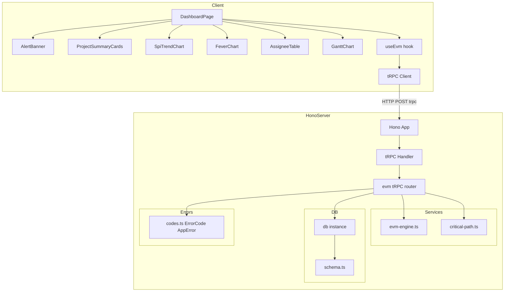
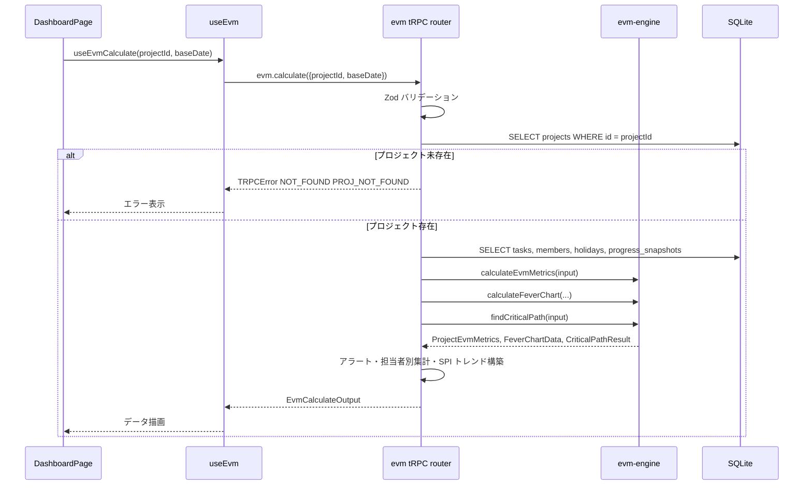

# 設計書: dashboard

## 概要

本スペックは EVM Studio のメイン可視化レイヤーを確立する。`evm.calculate` tRPC エンドポイントを介して evm-engine の計算結果を集約し、SPI/CPI トレンドチャート・CCPM フィーバーチャート・担当者別テーブル・アラートバナー・プロジェクトサマリーをワンページで提供する。

**目的**: プロジェクト管理者が任意の基準日のメトリクスをリアルタイムに近い形で視覚確認し、遅延タスクを見落とさないようにする。

**ユーザー**: プロジェクト管理者および担当者がブラウザからダッシュボードを参照する。

**影響**: `server/src/api/evm.ts`（新規）に tRPC ルーターを追加し、`client/src/` 以下に DashboardPage・各チャートコンポーネント・useEvm フックを追加する。既存ファイルでは `server/src/router.ts` と `client/src/App.tsx` にマウント・ルート追加を行う。

### Goals

- `evm.calculate` エンドポイントを 1 回呼ぶだけで全 EVM データを取得できる
- SPI/CPI トレンド・フィーバーチャート・担当者テーブル・アラートをワンページで表示する
- TanStack Query で 5 分間キャッシュし、不要な再計算を防ぐ
- アラート閾値（SPI < 0.8 = critical、0.8 ≤ SPI < 0.9 = warning）を視覚的に一目で識別できる

### Non-Goals

- EVM メトリクスの計算ロジック（evm-engine スペックが担う）
- 進捗データの永続化・入力 UI（progress-tracking スペックが担う）
- 朝報レポート生成（reporting スペックが担う）
- 認証・認可

---

## Boundary Commitments

### This Spec Owns

- `server/src/api/evm.ts` — `evm.calculate` tRPC ルーター（DB クエリ + evm-engine 呼び出しの集約）
- `server/src/router.ts` への evm ルーターのマウント（追加）
- `client/src/pages/DashboardPage.tsx` — メインダッシュボードページ
- `client/src/components/SpiTrendChart.tsx` — SPI/CPI 折れ線チャート
- `client/src/components/FeverChart.tsx` — CCPM フィーバーチャート
- `client/src/components/AssigneeTable.tsx` — 担当者別 EVM テーブル
- `client/src/components/AlertBanner.tsx` — アラートバナー
- `client/src/components/ProjectSummaryCards.tsx` — プロジェクトサマリーカード群
- `client/src/components/GanttChart.tsx` — WBS ガントチャート（読み取り専用・将来書き込み拡張対応）
- `client/src/hooks/useEvm.ts` — `evm.calculate` TanStack Query フック
- `client/src/App.tsx` への `/dashboard` ルート追加（変更）

### Out of Boundary

- EVM 計算純粋関数（evm-engine が所有: `services/evm-engine.ts`, `services/critical-path.ts`）
- `progress_snapshots` の CRUD（progress-tracking が所有）
- DB スキーマ定義（core-data-model が所有）
- `AppError` / `ErrorCode` クラス定義（core-data-model が所有）
- ProgressInputPage（progress-tracking が所有）

### Allowed Dependencies

- `server/src/services/evm-engine.ts` — `calculateEvmMetrics`, `calculateFeverChart`, `evaluateAlertLevel`（evm-engine 提供）
- `server/src/services/critical-path.ts` — `findCriticalPath`（evm-engine 提供）
- `server/src/db/schema.ts` — `tasks`, `members`, `progressSnapshots`, `holidays` 型（core-data-model 提供）
- `server/src/db/index.ts` — `db` インスタンス（core-data-model 提供）
- `server/src/errors/codes.ts` — `ErrorCode`, `AppError`（core-data-model 提供）
- `server/src/router.ts` — `appRouter` への evm ルーターのマウント（progress-tracking が作成）
- `client/src/lib/trpc.ts` — tRPC クライアント（progress-tracking が作成）
- `recharts` — 折れ線チャート・散布図描画
- `@trpc/react-query` + `@tanstack/react-query` 5 — データフェッチ・キャッシュ
- `zod` 4 — tRPC 入力バリデーション
- TailwindCSS 4 — スタイリング

### Revalidation Triggers

以下の変更が発生した場合、本スペックは統合確認を実施すること:

- `ProjectEvmMetrics`, `TaskEvmMetrics`, `FeverChartData`, `AlertLevel` 型のシグネチャ変更（evm-engine が所有）
- `calculateEvmMetrics`, `calculateFeverChart`, `findCriticalPath` の引数・戻り値変更
- `progress.getLatest` / `projects.list` / `tasks.listByProject` の戻り型変更
- `progressSnapshots`, `tasks`, `members`, `holidays` テーブルのカラム変更

---

## Architecture

### Architecture Pattern & Boundary Map



依存方向: `errors/codes.ts` → `db/schema.ts` → `db/index.ts` + `services/evm-engine.ts` → `api/evm.ts` → `router.ts`

クライアント: `lib/trpc.ts` → `hooks/useEvm.ts` → `pages/DashboardPage.tsx` → UI コンポーネント群

### Technology Stack

| レイヤー | 選択 / バージョン | 役割 |
|---------|-----------------|------|
| Frontend | React 19 + Vite 8 + TailwindCSS 4 | ダッシュボード UI・レスポンシブレイアウト |
| Charts | recharts | SPI/CPI 折れ線チャート・フィーバーチャート散布図 |
| Data Fetching | @trpc/react-query + @tanstack/react-query 5 | `evm.calculate` クエリ・5 分キャッシュ |
| Backend | Hono 4 + tRPC 11 | `evm.calculate` tRPC エンドポイント |
| ORM | Drizzle ORM 0.45 | tasks・members・progress_snapshots・holidays クエリ |
| Validation | Zod 4 | tRPC 入力スキーマ |

---

## File Structure Plan

### Directory Structure

```
evm-studio/
├── server/
│   └── src/
│       ├── api/
│       │   └── evm.ts                   # 新規: evm.calculate tRPC ルーター
│       └── router.ts                    # 変更: evm ルーターをマウント
└── client/
    └── src/
        ├── pages/
        │   └── DashboardPage.tsx        # 新規: メインダッシュボードページ
        ├── components/
        │   ├── AlertBanner.tsx          # 新規: アラートバナー
        │   ├── ProjectSummaryCards.tsx  # 新規: サマリーカード群
        │   ├── SpiTrendChart.tsx        # 新規: SPI/CPI 折れ線チャート
        │   ├── FeverChart.tsx           # 新規: CCPM フィーバーチャート
        │   ├── AssigneeTable.tsx        # 新規: 担当者別 EVM テーブル
        │   └── GanttChart.tsx           # 新規: WBS ガントチャート
        ├── hooks/
        │   └── useEvm.ts               # 新規: evm.calculate TanStack Query フック
        └── App.tsx                      # 変更: /dashboard ルート追加
```

### Modified Files

- `evm-studio/server/src/router.ts` — `evmRouter` を `appRouter` にマウント（`evm: evmRouter` を追加）
- `evm-studio/client/src/App.tsx` — `/dashboard` ルートと `DashboardPage` コンポーネントを追加

---

## System Flows

### evm.calculate リクエストフロー



---

## Requirements Traceability

| 要件 | 概要 | コンポーネント | インターフェース |
|------|------|--------------|----------------|
| 1.1–1.6 | プロジェクト・基準日選択 | DashboardPage | useEvm, projects.list |
| 2.1–2.5 | アラートバナー | AlertBanner | evm.calculate alerts[] |
| 3.1–3.5 | プロジェクトサマリー | ProjectSummaryCards | evm.calculate summary |
| 4.1–4.5 | SPI/CPI トレンドチャート | SpiTrendChart | evm.calculate spiTrend[] |
| 5.1–5.5 | CCPM フィーバーチャート | FeverChart | evm.calculate feverChart |
| 6.1–6.5 | 担当者別 EVM テーブル | AssigneeTable | evm.calculate assignees[] |
| 7.1–7.3 | キャッシュ・パフォーマンス | useEvm | TanStack Query staleTime |
| 8.1–8.5 | tRPC evm.calculate エンドポイント | EvmRouter | evm.calculate tRPC |
| 9.1–9.3 | レスポンシブレイアウト | DashboardPage | TailwindCSS grid |
| 10.1–10.8 | ガントチャートビュー | GanttChart | evm.calculate gantt[] |

---

## Components and Interfaces

### コンポーネントサマリー

| コンポーネント | レイヤー | Intent | 要件カバレッジ | 主要依存 | コントラクト |
|--------------|---------|--------|--------------|---------|------------|
| EvmRouter | API | evm.calculate tRPC エンドポイント | 8.1–8.5 | evm-engine, DrizzleClient | API |
| useEvm | Hook | TanStack Query フック | 7.1–7.3 | trpc client | Service |
| DashboardPage | UI | プロジェクト・基準日選択・全コンポーネント統合 | 1.1–1.6, 9.1–9.3 | useEvm, 各コンポーネント | State |
| AlertBanner | UI | アラートバナー表示 | 2.1–2.5 | DashboardPage props | — |
| ProjectSummaryCards | UI | サマリー数値カード群 | 3.1–3.5 | DashboardPage props | — |
| SpiTrendChart | UI | SPI/CPI 折れ線チャート | 4.1–4.5 | recharts, DashboardPage props | — |
| FeverChart | UI | CCPM フィーバーチャート | 5.1–5.5 | recharts, DashboardPage props | — |
| AssigneeTable | UI | 担当者別 EVM テーブル | 6.1–6.5 | DashboardPage props | — |
| GanttChart | UI | WBS ガントチャート（タスクバー・進捗・稲妻線・SPI 色分け） | 10.1–10.8 | DashboardPage props | — |

---

### API レイヤー

#### EvmRouter

| フィールド | 詳細 |
|-----------|------|
| Intent | DB からデータを集約し evm-engine を呼び出して全 EVM 計算結果を返す tRPC クエリプロシージャ |
| Requirements | 8.1, 8.2, 8.3, 8.4, 8.5 |

**責任と制約**

- Zod スキーマによる入力バリデーション（projectId: 正整数、baseDate: YYYY-MM-DD 形式）
- `AppError` → `TRPCError` 変換
- `PROJ_NOT_FOUND` エラーコードの参照
- DB から tasks・members・holidays・progress_snapshots を取得して evm-engine に渡す
- evm-engine の純粋関数を呼び出すのみで、ビジネスロジックを持たない
- ログに個人名を含めず `project_id`・`base_date` のみ記録

**依存関係**

- Inbound: useEvm フック — evm.calculate 呼び出し (P0)
- Outbound: `services/evm-engine.ts` — `calculateEvmMetrics`, `evaluateAlertLevel`, `calculateFeverChart` (P0)
- Outbound: `services/critical-path.ts` — `findCriticalPath` (P0)
- Outbound: `db/schema.ts` / `db/index.ts` — テーブルクエリ (P0)
- Outbound: `errors/codes.ts` — `ErrorCode.PROJ_NOT_FOUND` (P0)

**コントラクト**: API [x]

##### API コントラクト

```typescript
// server/src/api/evm.ts

import { z } from 'zod'

const calculateInputSchema = z.object({
  projectId: z.number().int().positive(),
  baseDate:  z.string().regex(/^\d{4}-\d{2}-\d{2}$/),
})

// --- 出力型 ---

export interface EvmSummaryOutput {
  bac:  number
  pv:   number
  ev:   number
  ac:   number
  spi:  number | null
  cpi:  number | null
  eac:  number | null
  vac:  number | null
  etc:  number | null
  tcpi: number | null
}

export interface AssigneeEvmOutput {
  assigneeId:   number
  assigneeName: string
  bac:          number
  ev:           number
  pv:           number
  ac:           number
  spi:          number | null
  cpi:          number | null
  status:       'critical' | 'warning' | 'normal' | 'na'
}

export interface AlertOutput {
  taskId:       number
  taskName:     string
  assigneeName: string
  spi:          number | null
  level:        'critical' | 'warning'
}

export interface SpiTrendPoint {
  snapshotDate: string
  spi:          number | null
  cpi:          number | null
}

export interface FeverChartOutput {
  bufferConsumption:       number
  criticalChainCompletion: number
  zone:                    'GREEN' | 'YELLOW' | 'RED'
}

export interface GanttTaskOutput {
  id:          number
  name:        string
  assigneeName: string | null
  plannedStart: string            // ISO date
  plannedEnd:   string            // ISO date
  progressPct:  number            // 0–100
  spi:          number | null
  level:        number            // 階層深度（1=ルート）
  sortOrder:    number
  isBuffer:     boolean
  isLeaf:       boolean
}

export interface EvmCalculateOutput {
  summary:    EvmSummaryOutput
  tasks:      TaskEvmMetrics[]        // evm-engine の TaskEvmMetrics
  assignees:  AssigneeEvmOutput[]
  alerts:     AlertOutput[]
  feverChart: FeverChartOutput | null  // バッファタスクなし = null
  spiTrend:   SpiTrendPoint[]
  gantt:      GanttTaskOutput[]       // ガントチャート表示用タスク一覧（sort_order 昇順）
}

// プロシージャ定義（概念）:
// evm.calculate: query, input: calculateInputSchema, output: EvmCalculateOutput
```

**実装ノート**

- `progress.getLatest({ projectId })` の相当クエリをルーター内で直接実行（tRPC の cross-router 呼び出しを避け、DB クエリを直接発行する）
- SPI トレンドデータ: `progress_snapshots` から各 `snapshot_date` ごとに `calculateEvmMetrics` を呼び出して時系列を構築する
- 担当者別集計: `tasks` の `assignee_id` でグループ化し、各担当者タスクのみで `calculateEvmMetrics` を実行する
- アラート生成: `taskMetrics` の各タスクに対して `evaluateAlertLevel` を呼び出し、`CRITICAL_DELAY` / `WARNING_DELAY` のものを抽出する
- フィーバーチャート: `findCriticalPath` で critical path を特定し、バッファタスクを特定して `calculateFeverChart` を呼び出す。バッファタスクが存在しない場合は `null` を返す

---

### フック レイヤー

#### useEvm

| フィールド | 詳細 |
|-----------|------|
| Intent | `evm.calculate` への TanStack Query フックを提供し 5 分間キャッシュする |
| Requirements | 7.1, 7.2, 7.3 |

**コントラクト**: Service [x]

```typescript
// client/src/hooks/useEvm.ts

/**
 * evm.calculate クエリフック
 * projectId または baseDate が null のときは無効化（enabled: false）
 */
export function useEvmCalculate(
  projectId: number | null,
  baseDate: string | null,
): UseQueryResult<EvmCalculateOutput>
// options: { staleTime: 5 * 60 * 1000, enabled: !!projectId && !!baseDate }
```

---

### フロントエンドレイヤー

#### DashboardPage

| フィールド | 詳細 |
|-----------|------|
| Intent | プロジェクト・基準日選択と全可視化コンポーネントの統合ページ |
| Requirements | 1.1, 1.2, 1.3, 1.4, 1.5, 1.6, 9.1, 9.2, 9.3 |

**コントラクト**: State [x]

**ステート管理**

- `selectedProjectId: number | null` — プロジェクトドロップダウン選択値
- `baseDate: string` — 基準日（ISO 形式、初期値: today）

**UI 構造**

1. ヘッダー行: プロジェクトセレクト + 基準日ピッカー + ローディングスピナー
2. アラートバナー（alerts.length > 0 のとき）
3. プロジェクトサマリーカード群（summary）
4. グリッド: SPI/CPI トレンドチャート + フィーバーチャート（lg: 2 カラム）
5. 担当者別 EVM テーブル
6. ガントチャート（gantt）

**実装ノート**

- `projects.list` tRPC クエリでプロジェクト一覧を取得する
- `useEvmCalculate(selectedProjectId, baseDate)` で EVM データを取得する
- エラー時はページ内にエラーメッセージを表示する（トーストは使用しない）

---

#### AlertBanner

| フィールド | 詳細 |
|-----------|------|
| Intent | critical/warning アラートをページ上部にバナーとして表示する |
| Requirements | 2.1, 2.2, 2.3, 2.4, 2.5 |

```typescript
interface AlertBannerProps {
  alerts: AlertOutput[]
}
```

**実装ノート**

- `alerts` が空配列の場合はレンダリングしない（要件 2.4）
- critical と warning を区別して赤・黄の背景色を使い分ける
- 各アラートにタスク名・担当者名・SPI 値を表示する（要件 2.3）

---

#### ProjectSummaryCards

| フィールド | 詳細 |
|-----------|------|
| Intent | BAC/EAC/VAC/ETC/TCPI/SPI/CPI を数値カードで表示する |
| Requirements | 3.1, 3.2, 3.3, 3.4, 3.5 |

```typescript
interface ProjectSummaryCardsProps {
  summary: EvmSummaryOutput
}
```

**実装ノート**

- SPI/CPI カードに閾値に応じた色付け（< 0.8: 赤、0.8–0.9: 黄、≥ 0.9: 緑）を適用する
- `null` 値は "N/A" と表示する（要件 3.5）

---

#### SpiTrendChart

| フィールド | 詳細 |
|-----------|------|
| Intent | SPI と CPI の時系列折れ線チャートを recharts で描画する |
| Requirements | 4.1, 4.2, 4.3, 4.4, 4.5 |

```typescript
interface SpiTrendChartProps {
  data: SpiTrendPoint[]
}
```

**実装ノート**

- recharts の `LineChart` + `Line` コンポーネントを使用する
- SPI=1.0 の基準線を `ReferenceLine` で描画する（要件 4.3）
- `spi = null` または `cpi = null` のデータポイントは recharts の `connectNulls={false}` 設定で線を途切れさせる（要件 4.4）
- `Tooltip` カスタマイザーでスナップショット日・SPI・CPI を表示する（要件 4.5）

---

#### FeverChart

| フィールド | 詳細 |
|-----------|------|
| Intent | CCPM フィーバーチャートを recharts の ScatterChart で描画する |
| Requirements | 5.1, 5.2, 5.3, 5.4, 5.5 |

```typescript
interface FeverChartProps {
  data: FeverChartOutput | null
}
```

**実装ノート**

- recharts の `ScatterChart` + `Scatter` を使用する
- Green/Yellow/Red ゾーンは `ReferenceArea` を重ねて背景色として描画する
- `data = null`（バッファなし）の場合は "バッファデータなし" の代替 UI を表示する（要件 5.5）
- プロットの色はゾーンに対応した色（GREEN: green-600、YELLOW: yellow-500、RED: red-600）にする（要件 5.4）

---

#### AssigneeTable

| フィールド | 詳細 |
|-----------|------|
| Intent | 担当者別 BAC/EV/PV/SPI/AC/CPI/ステータスをテーブル表示する |
| Requirements | 6.1, 6.2, 6.3, 6.4, 6.5 |

```typescript
interface AssigneeTableProps {
  assignees: AssigneeEvmOutput[]
}
```

**実装ノート**

- `status` に応じた行の背景色（critical: 赤、warning: 黄、normal: 緑）を TailwindCSS で適用する
- `spi = null` / `cpi = null` は "N/A" と表示する（要件 6.5）

---

#### GanttChart

| フィールド | 詳細 |
|-----------|------|
| Intent | WBS タスクの計画期間・進捗・SPI 健全性をガントチャートで表示する（読み取り専用、将来書き込み拡張対応） |
| Requirements | 10.1, 10.2, 10.3, 10.4, 10.5, 10.6, 10.7, 10.8 |

```typescript
// client/src/components/GanttChart.tsx

interface GanttChartProps {
  tasks:    GanttTaskOutput[]
  baseDate: string                  // ISO date — 稲妻線の位置

  // 将来の書き込み拡張用（未定義 = 読み取り専用モード）
  onProgressUpdate?: (taskId: number, progressPct: number) => void
  onTaskReschedule?: (taskId: number, start: string, end: string) => void
}
```

**実装ノート**

- 横軸タイムラインはプロジェクト内の最小 `plannedStart` ～最大 `plannedEnd` の範囲を自動計算する
- タスクバーの塗りつぶし幅: `barWidth * (progressPct / 100)`（要件 10.2）
- 稲妻線（thunder line）: `baseDate` がタイムライン範囲内の場合のみ表示する（要件 10.3）
- SPI 色分け: `spi < 0.8` → `bg-red-500`、`0.8 ≤ spi < 0.9` → `bg-yellow-400`、それ以外 → `bg-blue-500`（要件 10.4）
- バッファタスク（`isBuffer = true`）: `bg-gray-300 bg-stripes` またはハッチングパターンで描画し、通常タスクと視覚的に区別する（要件 10.7）
- 階層インデント: `level * 12px` を左パディングとして適用する（要件 10.5）
- `onProgressUpdate` / `onTaskReschedule` が `undefined` の場合、ドラッグ・クリック等の編集インタラクションを無効化する（要件 10.8）
- recharts は使用しない（DOM + TailwindCSS で独自実装、または react-gantt 系ライブラリを検討）

---

## データモデル

本スペックは新規データモデルを定義しない。core-data-model が定義する以下のテーブルを読み取り専用で使用する。

### 入力（core-data-model からインポート）

| テーブル | 参照カラム | 用途 |
|---------|-----------|------|
| `projects` | `id`, `name`, `startDate`, `endDate` | プロジェクト一覧取得・バリデーション |
| `tasks` | `id`, `name`, `estimateDays`, `plannedStart`, `plannedEnd`, `assigneeId`, `isBuffer`, `isLeaf`, `level`, `sortOrder` | EVM 計算入力・ガントチャート表示 |
| `members` | `id`, `name`, `availabilityRate` | PV 計算・担当者名解決 |
| `holidays` | `date` | 稼働日数計算 |
| `progressSnapshots` | `taskId`, `snapshotDate`, `progressPct`, `acDays` | EV/AC 計算・SPI トレンド |
| `taskDependencies` | `taskId`, `dependsOnTaskId` | クリティカルパス計算 |

### 出力型（本スペックが定義）

`EvmSummaryOutput`, `AssigneeEvmOutput`, `AlertOutput`, `SpiTrendPoint`, `FeverChartOutput`, `GanttTaskOutput`, `EvmCalculateOutput` を `server/src/api/evm.ts` でエクスポートし、クライアントは tRPC の型推論で参照する。

---

## Error Handling

### Error Strategy

| エラー種別 | 発生箇所 | 対応 |
|-----------|---------|------|
| 入力バリデーション失敗（Zod） | evm.calculate | TRPCError BAD_REQUEST として返す |
| プロジェクト未存在 | evm.calculate | AppError(PROJ_NOT_FOUND) → TRPCError NOT_FOUND |
| DB エラー | Drizzle クエリ | 上位に再 throw（tRPC が INTERNAL_SERVER_ERROR に変換） |
| クライアントエラー表示 | DashboardPage | TanStack Query の `error` state を受け取りページ内にエラー表示 |

### エラーコード

`evm.calculate` でプロジェクト未存在時は、core-data-model の `server/src/errors/codes.ts` が定義する既存の `PROJ_NOT_FOUND` を使用する。新規エラーコードの追加は不要。

---

## Testing Strategy

### サーバー単体テスト（Vitest 4）

| テスト対象 | テスト内容 | 要件 |
|-----------|----------|------|
| `evm.ts` router | evm.calculate: 正常系（全フィールド返却確認） | 8.1, 8.2 |
| `evm.ts` router | evm.calculate: プロジェクト未存在 → PROJ_NOT_FOUND | 8.3 |
| `evm.ts` router | evm.calculate: baseDate フォーマット不正 → BAD_REQUEST | 8.4 |
| `evm.ts` router | evm.calculate: バッファタスクなし → feverChart = null | 5.5 |
| `evm.ts` router | アラート生成: SPI < 0.8 → critical アラート抽出 | 2.1 |
| `evm.ts` router | アラート生成: 0.8 ≤ SPI < 0.9 → warning アラート抽出 | 2.2 |

### E2E テスト（Playwright）

| テストフロー | 内容 | 要件 |
|------------|------|------|
| ダッシュボード表示 | プロジェクト選択 → 基準日設定 → 全コンポーネント表示確認 | 1.1–1.5 |
| アラートバナー | SPI < 0.8 のデータで critical アラートバナー表示確認 | 2.1, 2.3 |
| フィーバーチャート | バッファタスクなしプロジェクトで "バッファデータなし" 表示確認 | 5.5 |
