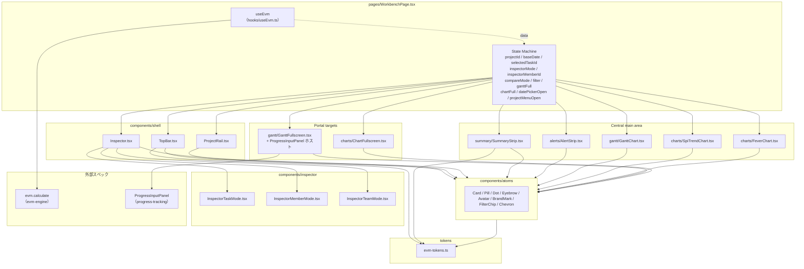
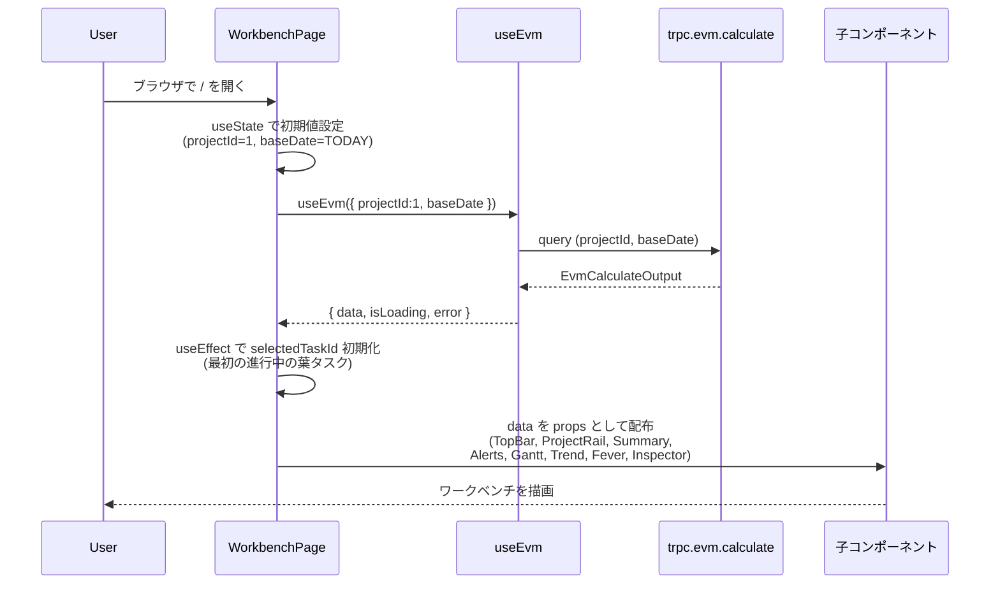
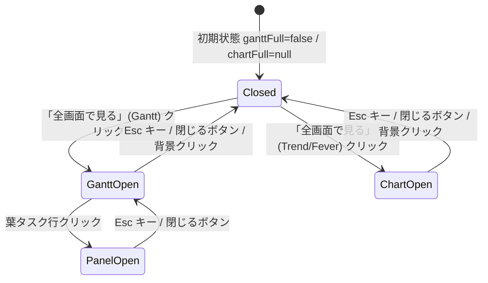
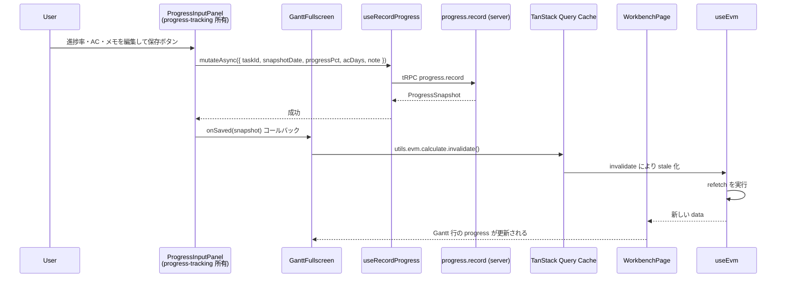
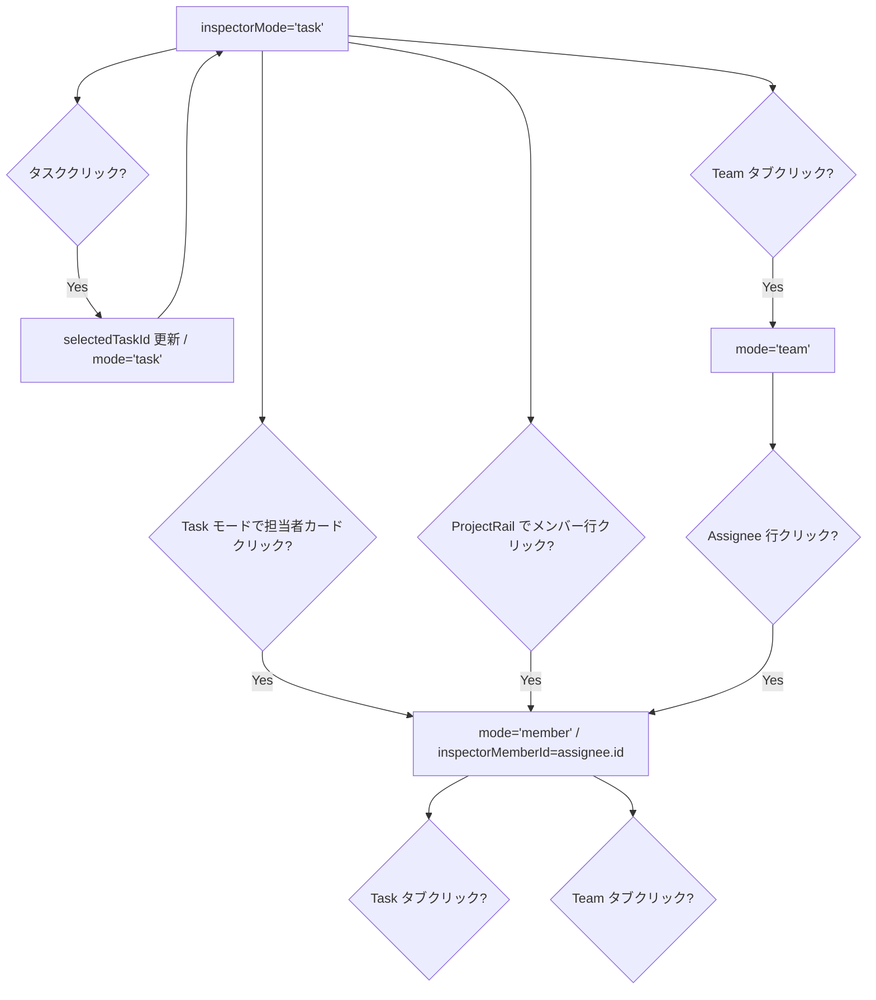
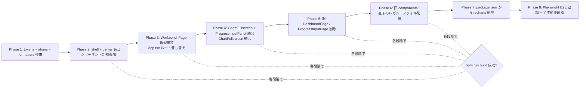

# 設計書: dashboard

## Overview

**Purpose**: EVM Studio のフロントエンドを、モックアップ `mockup/variation-a.jsx` を正典とする「単一ワークベンチ画面」として確立する。`WorkbenchPage` 1 ページが TopBar / ProjectRail / SummaryStrip / AlertStrip / GanttChart / SpiTrendChart / FeverChart / Inspector を常時保持し、`GanttFullscreen`（ProgressInputPanel をホスト）と `ChartFullscreen` の 2 モーダルで詳細操作を完結させる。

**Users**: プロジェクトマネージャー（PM）が毎営業日の状況確認・進捗反映を 1 画面で完結させる主たる利用者。実装者・将来の reporting スペックが `useEvm` フックと WorkbenchPage の状態機械を再利用する。

**Impact**: 既存の 3 画面 SPA 構成（`/` `DashboardPage` / `/progress` `ProgressInputPage`）と既存コンポーネント（`AlertBanner` / `AssigneeTable` / `FeverChart` / `GanttChart` / `ProjectSummaryCards` / `SpiTrendChart`）を全削除し、`client/src/pages/WorkbenchPage.tsx` + `client/src/components/{shell,summary,alerts,gantt,charts,inspector,atoms}/**.tsx` で再構築する。Recharts 依存を撤去して SVG 直書きへ移行する。`evm.calculate` の集約レスポンス（`evm-engine` spec）と `ProgressInputPanel`（`progress-tracking` spec）を消費する。

### Goals

- 単一ルート `/` の `WorkbenchPage` がモックアップと視覚的にほぼ一致する状態で動作する
- WorkbenchPage が 11 個の状態スロットを `useState` で集中管理し、子コンポーネントが状態を持たない
- `useEvm({ projectId, baseDate })` フック 1 つで `evm.calculate` を呼び、子コンポーネントへ top-down にデータを流す
- 2 つのモーダル（GanttFullscreen / ChartFullscreen）が `createPortal` + Esc キー + body スクロールロックで動作する
- ProgressInputPanel が `GanttFullscreen` 内にホストされ、保存時に TanStack Query キャッシュを invalidate して親の `useEvm` を再フェッチさせる
- 旧 3 画面構成および既存コンポーネントを段階的に削除し、各段階で `npm run build` が通る

### Non-Goals

- `evm.calculate` レスポンスの計算ロジック（→ `evm-engine` spec の責務）
- `ProgressInputPanel` コンポーネント本体・`progress.record` API（→ `progress-tracking` spec の責務）
- SQLite スキーマ・WBS YAML インポーター・シードデータ（→ `core-data-model` spec の責務）
- 朝報レポート出力・認証認可・xlsm インポート・モバイル対応（将来対応）
- 横幅 1280px 未満のレスポンシブレイアウト（モックアップは 1280px 以上前提）
- フォーカストラップ・キーボードナビゲーション網羅（ネイティブブラウザ挙動で十分とする）

## Boundary Commitments

### This Spec Owns

- `client/src/pages/WorkbenchPage.tsx` — 単一ページ・11 個の状態スロット・`useEvm` 呼び出し・全子コンポーネントへの prop drilling
- `client/src/components/shell/{TopBar,ProjectRail,Inspector}.tsx`
- `client/src/components/summary/{SummaryStrip,SummaryStat}.tsx`
- `client/src/components/alerts/AlertStrip.tsx`
- `client/src/components/gantt/{GanttChart,GanttFullscreen}.tsx`
- `client/src/components/charts/{SpiTrendChart,FeverChart,Sparkline,ChartFullscreen}.tsx`
- `client/src/components/inspector/{InspectorTaskMode,InspectorMemberMode,InspectorTeamMode}.tsx`
- `client/src/components/atoms/{Card,Pill,Dot,Eyebrow,Avatar,BrandMark,FilterChip,Chevron}.tsx`
- `client/src/tokens/evm-tokens.ts` — モックアップ `EVM` オブジェクトの完全移植
- `client/src/hooks/useEvm.ts` — `trpc.evm.calculate.useQuery` ラッパー
- `client/src/lib/formatters.ts` — `fmtMD` / `fmtPct` / `fmtSignedMD` / `fmtDeltaIdx` / `fmtDeltaMD` / `fmtDeltaPct` / `spiTone` / `statusColor` / `statusJp` / `initialsOf` / `deltaTone`
- `client/src/lib/formatters.test.ts` — `formatters.ts` 純関数群の Vitest 単体テスト（人日 (Man-Day) 単位の不変則・delta 表示・null/0 区別・SPI tone 境界）
- `client/src/App.tsx` のルーティング再定義（`/` → `WorkbenchPage` のみ）
- `client/index.html` の Google Fonts CDN リンク追加
- `client/src/styles/workbench.css`（モックアップ `<style>` ブロック移植：hover 等）
- 旧 `pages/DashboardPage.tsx` / `pages/ProgressInputPage.tsx` および旧 `components/{AlertBanner,AssigneeTable,FeverChart,GanttChart,ProjectSummaryCards,SpiTrendChart}.tsx` の削除
- `package.json` から Recharts 依存削除
- `e2e/` 配下の Playwright テスト追加（プロジェクト切替・基準日変更・compareMode・モーダル開閉フロー）

### Out of Boundary

- tRPC `evm.calculate` ルーター本体・純粋関数群（→ `evm-engine` spec）
- `client/src/components/gantt/ProgressInputPanel.tsx` 本体・`hooks/useProgress.ts`・`services/planned-comparison.ts` / `ac-unit.ts`（→ `progress-tracking` spec）
- `client/src/lib/trpc.ts` の tRPC クライアントセットアップ（既存・`core-data-model` 所有）
- DB スキーマ・マイグレーション・シードデータ（→ `core-data-model` spec）
- 認証・認可（プロダクト方針によりローカル限定のため対象外）

### Allowed Dependencies

- React 19.2 / React DOM 19.2 — UI ライブラリ
- `@trpc/react-query` 11 / `@tanstack/react-query` 5 — データフェッチ（既存 `client/src/lib/trpc.ts` 経由）
- `react-router-dom` 6（既存）— `/` 1 ルートのみ登録
- TypeScript 5 strict — 型システム
- Vite 8 — ビルドツール
- `progress-tracking` が提供する `ProgressInputPanel` コンポーネントと `useProgressLatest` / `useRecordProgress` フック
- `evm-engine` が提供する `EvmCalculateOutput` 型と `trpc.evm.calculate` プロシージャ
- `core-data-model` が提供する `Project` / `Member` / `Task` Drizzle 推論型（tRPC 経由で参照のみ）
- Google Fonts CDN（Cinzel / Source Serif 4 / JetBrains Mono / Inter）

### Revalidation Triggers

- `evm.calculate` の出力型 `EvmCalculateOutput` のフィールド追加・削除・改名（→ WorkbenchPage と全子コンポーネントの prop 型が再ビルド対象）
- `ProgressInputPanelProps` の契約変更（→ `GanttFullscreen` のマウント箇所を更新）
- `Project.status` enum 値の追加（→ `Dot` 色分け・`statusJp` の更新）
- モックアップ `mockup/variation-a.jsx` の意匠変更（モックアップ正典原則のため、本スペックを再生成する必要あり）
- TanStack Query / tRPC バージョンアップによる API 破壊的変更
- Vite / React のメジャーバージョンアップ（特に React 20 の `use` API 等が `useEvm` の実装方針を変える場合）
- `evm.calculate` レスポンスの数値単位契約変更（既定: BAC / PV / EV / AC / VAC / EAC / ETC は Man-Day = 人日）。単位定義が変わる場合は `formatters.ts` の表示前提と `formatters.test.ts` の期待値、および E2E 数値整合シナリオを連動で再評価する

## Architecture

### Existing Architecture Analysis

現在の `evm-studio/client/src/` は以下の構成で稼働している。

- `pages/DashboardPage.tsx` — `/` ルート。プロジェクト選択 → 基準日入力 → 計算実行 → 縦並びカード表示
- `pages/ProgressInputPage.tsx` — `/progress` ルート。タスク一覧で進捗を編集する独立ページ
- `components/{AlertBanner,AssigneeTable,FeverChart,GanttChart,ProjectSummaryCards,SpiTrendChart}.tsx` — DashboardPage が利用する個別カードコンポーネント。Recharts ベースで実装されている
- `lib/trpc.ts` — `@trpc/react-query` セットアップ（`core-data-model` 所有・流用）
- ルーティング: `client/src/App.tsx` で `react-router-dom` の `/` と `/progress` を登録

本スペックは pages 階層を 1 ページに縮約し、components 階層をモックアップのセクション境界に沿って 7 サブディレクトリ（shell / summary / alerts / gantt / charts / inspector / atoms）に再構成する。チャートは Recharts を撤去し SVG 直書きへ移行する。

### Architecture Pattern & Boundary Map



**Architecture Integration**:

- **Selected pattern**: 「State Lifting + Prop Drilling」。WorkbenchPage が全状態を保持し、子コンポーネントは presentational（純粋表示）として実装する。グローバル状態管理ライブラリは導入しない（要件 12.5）
- **Domain/feature boundaries**: モックアップ `mockup/variation-a.jsx` のセクション境界 = ファイル境界。1 ファイル 1 責務でレビュー可能なサイズ（200〜400 行/ファイル）を保つ
- **Existing patterns preserved**: `client/src/lib/trpc.ts`（`core-data-model` 提供）、Vite パスエイリアス `@/`、TanStack Query キャッシュ管理、TypeScript strict
- **New components rationale**: モックアップの 1525 行のモノリスを 25 個の TSX ファイルへ分割。WorkbenchPage（コンテナ）/ shell（永続表示の枠）/ center（中央セクション）/ modals（ポータル）/ atoms（再利用ユニット）の 5 階層に責務を分ける
- **Steering compliance**: TypeScript strict、`any` 禁止、PascalCase コンポーネント名、kebab-case ディレクトリ、Vite alias 経由のインポート

### Technology Stack

| Layer | Choice / Version | Role in Feature | Notes |
|-------|------------------|-----------------|-------|
| Frontend / UI | React 19.2 + TypeScript 5 strict + Vite 8 + TailwindCSS 4 | 単一ワークベンチ画面の全コンポーネント | Tailwind は使わず `style={{}}` 直書きを基本とする（モックアップ準拠） |
| Frontend / State | React `useState` のみ | WorkbenchPage が 11 個の状態スロットを集中管理 | グローバル状態ライブラリは導入しない |
| Frontend / Data Fetch | `@trpc/react-query` 11 + `@tanstack/react-query` 5 | `useEvm` フックで `evm.calculate` を呼び出し | 既存 `lib/trpc.ts` を流用 |
| Frontend / Charts | SVG 直書き | SpiTrendChart / FeverChart / Sparkline / Gantt | Recharts 依存を撤去 |
| Frontend / Routing | `react-router-dom` 6（既存） | `/` 1 ルートのみ | `/progress` ルート削除 |
| Frontend / Modals | `react-dom` の `createPortal` | GanttFullscreen / ChartFullscreen | body 直下にポータル、Esc キー / body スクロールロック |
| Frontend / Fonts | Google Fonts CDN | Cinzel / Source Serif 4 / JetBrains Mono / Inter | `client/index.html` の `<link>` で読み込み |
| Test | Playwright（既存） | E2E 8 シナリオ | コンポーネント単体テストは ROI が低いため不採用 |

## File Structure Plan

### Directory Structure

```
evm-studio/client/
├── index.html                              # 修正: Google Fonts CDN <link> を追加
├── package.json                            # 修正: recharts 依存削除
└── src/
    ├── App.tsx                             # 修正: ルートを `/` → WorkbenchPage のみに
    ├── main.tsx                            # 変更なし
    ├── lib/
    │   ├── trpc.ts                         # 既存（core-data-model 所有）変更なし
    │   ├── formatters.ts                   # 新規: fmtMD / spiTone / statusJp 等（人日単位前提・スケール変換禁止）
    │   ├── formatters.test.ts              # 新規: 上記純関数の Vitest 単体テスト（単位不変則 + 境界）
    │   └── task-tree.ts                    # 新規: deriveAncestors（task.code 階層から祖先を導出）
    ├── tokens/
    │   └── evm-tokens.ts                   # 新規: EVM 色・フォント定数
    ├── styles/
    │   └── workbench.css                   # 新規: hover / animation CSS
    ├── hooks/
    │   ├── useEvm.ts                       # 新規: trpc.evm.calculate ラッパー
    │   ├── useProgress.ts                  # progress-tracking 所有
    │   └── ...                             # その他既存フック
    ├── pages/
    │   └── WorkbenchPage.tsx               # 新規: 唯一のページ
    │   # 削除: DashboardPage.tsx / ProgressInputPage.tsx
    └── components/
        ├── shell/
        │   ├── TopBar.tsx                  # 新規
        │   ├── ProjectRail.tsx             # 新規
        │   └── Inspector.tsx               # 新規（タブ切替コーディネータ）
        ├── summary/
        │   ├── SummaryStrip.tsx            # 新規
        │   └── SummaryStat.tsx             # 新規
        ├── alerts/
        │   └── AlertStrip.tsx              # 新規
        ├── gantt/
        │   ├── GanttChart.tsx              # 新規（中央埋め込み版）
        │   ├── GanttFullscreen.tsx         # 新規（モーダル + ProgressInputPanel ホスト）
        │   └── ProgressInputPanel.tsx      # progress-tracking 所有（ここに配置）
        ├── charts/
        │   ├── SpiTrendChart.tsx           # 新規（SVG）
        │   ├── FeverChart.tsx              # 新規（SVG）
        │   ├── Sparkline.tsx               # 新規（SVG）
        │   └── ChartFullscreen.tsx         # 新規（モーダル）
        ├── inspector/
        │   ├── InspectorTaskMode.tsx       # 新規
        │   ├── InspectorMemberMode.tsx     # 新規
        │   └── InspectorTeamMode.tsx       # 新規
        └── atoms/
            ├── Card.tsx                    # 新規
            ├── Pill.tsx                    # 新規
            ├── Dot.tsx                     # 新規
            ├── Eyebrow.tsx                 # 新規
            ├── Avatar.tsx                  # 新規
            ├── BrandMark.tsx               # 新規
            ├── FilterChip.tsx              # 新規
            └── Chevron.tsx                 # 新規

evm-studio/e2e/
└── workbench.spec.ts                       # 新規: Playwright 9 シナリオ（うち 1 つが API ↔ UI 数値整合）
```

### Modified Files

- `client/index.html` — `<head>` に Google Fonts CDN `<link rel="preconnect">` と `<link rel="stylesheet">` を追加（Cinzel / Source Serif 4 / JetBrains Mono / Inter）
- `client/package.json` — `dependencies` から `recharts` を削除
- `client/src/App.tsx` — `react-router-dom` の `Routes` を `<Route path="/" element={<WorkbenchPage />} />` のみに削減、`/progress` 削除
- `client/src/lib/formatters.ts` — モックアップから `fmtMD` / `fmtPct` / `fmtSignedMD` / `fmtDeltaIdx` / `fmtDeltaMD` / `fmtDeltaPct` / `spiTone` / `statusColor` / `statusJp` / `initialsOf` / `deltaTone` を移植

### Deleted Files (sequential migration order)

1. `client/src/pages/DashboardPage.tsx` — `WorkbenchPage` が `/` で稼働確認できた直後に削除
2. `client/src/pages/ProgressInputPage.tsx` — `GanttFullscreen` から `ProgressInputPanel` がマウントできることを確認後に削除
3. `client/src/components/AlertBanner.tsx`, `AssigneeTable.tsx`, `FeverChart.tsx`, `GanttChart.tsx`, `ProjectSummaryCards.tsx`, `SpiTrendChart.tsx` — 新ディレクトリ配下に同名（または再設計）コンポーネントが配置・利用されたあとに削除

各削除はビルドが通る状態を維持する単一コミットで行う（要件 16.6）。

## System Flows

### WorkbenchPage 初期マウントとデータフロー



### プロジェクト切替フロー

```mermaid
flowchart TD
  Click[ユーザーが ProjectRail で別プロジェクトをクリック] --> CB[onProjectChange(newId) を呼ぶ]
  CB --> SetId[WorkbenchPage が setProjectId(newId)]
  SetId --> Effect[useEffect が projectId 変化を検知]
  Effect --> Reset[selectedTaskId=null, inspectorMode='task', inspectorMemberId=null にリセット]
  SetId --> Refetch[useEvm の queryKey が変わり TanStack Query が refetch]
  Refetch --> NewData[新しい EvmCalculateOutput を取得]
  NewData --> InitTask[useEffect で selectedTaskId を新プロジェクトの<br/>最初の進行中タスク (0<progress<100) に設定]
  InitTask --> Render[全子コンポーネントが再描画]
```

### モーダル開閉と Esc キー処理



### ProgressInputPanel 保存 → メトリクス更新フロー



### Inspector モード遷移



## Requirements Traceability

| Requirement | Summary | Components | Interfaces | Flows |
|-------------|---------|------------|------------|-------|
| 1.1-1.6 | WorkbenchPage 単一ページ構成 | `pages/WorkbenchPage.tsx`, `App.tsx` | React Router | 初期マウント |
| 2.1-2.8 | TopBar とピッカー | `components/shell/TopBar.tsx`, `atoms/{BrandMark,Dot,Chevron,Avatar}.tsx` | Props: `project`, `projects`, `baseDate`, `onProjectChange`, `onBaseDateChange` | プロジェクト切替 |
| 3.1-3.7 | ProjectRail | `components/shell/ProjectRail.tsx`, `atoms/{Dot,Avatar,Eyebrow}.tsx` | Props: `projects`, `activeProjectId`, `members`, `assignees`, `inspectorMode`, `inspectorMemberId`, `onProjectChange`, `onMemberSelect` | プロジェクト切替, Inspector 遷移 |
| 4.1-4.7 | SummaryStrip + 前日比トグル（4.7 は API 値を人日単位そのまま表示する不変則） | `components/summary/{SummaryStrip,SummaryStat}.tsx`, `lib/formatters.ts` | Props: `project`, `summary`, `prevDay`, `compareMode`, `onCompareModeChange` | — |
| 5.1-5.5 | AlertStrip | `components/alerts/AlertStrip.tsx`, `atoms/Pill.tsx` | Props: `alerts`, `onJump` | Inspector 遷移 |
| 6.1-6.8 | GanttChart（埋め込み版） | `components/gantt/GanttChart.tsx`, `lib/formatters.ts` | Props: `tasks`, `gantt`, `selectedTaskId`, `onTaskClick`, `onFullscreen` | Inspector 遷移 |
| 7.1-7.11, 8.1-8.7 | GanttFullscreen + ProgressInputPanel ホスト | `components/gantt/GanttFullscreen.tsx`, ProgressInputPanel | Props: `project`, `tasks`, `assignees`, `selectedTaskId`, `filter`, `onSelectTask`, `onFilterChange`, `onClose`, `baseDate` | モーダル開閉, 保存→更新 |
| 9.1-9.7 | チャート（SpiTrend / Fever）+ Sparkline | `components/charts/{SpiTrendChart,FeverChart,Sparkline}.tsx` | Props: `data`, `w`, `h` | — |
| 10.1-10.5 | ChartFullscreen | `components/charts/ChartFullscreen.tsx` | Props: `type`, `project`, `onClose` | モーダル開閉 |
| 11.1-11.9 | Inspector 3 モード（11.9 は BAC/EV/PV/AC を `tasks[]` 由来の値で描画し定数文字列を禁止） | `components/shell/Inspector.tsx`, `inspector/{InspectorTaskMode,InspectorMemberMode,InspectorTeamMode}.tsx` | Props: `mode`, `task`, `taskMetrics`, `project`, `memberId`, `compareMode`, `onSwitchTask`, `onSwitchMember`, `onSwitchTeam` | Inspector 遷移 |
| 12.1-12.5 | WorkbenchPage 状態管理 | `pages/WorkbenchPage.tsx` | `useState` × 11 | — |
| 13.1-13.7 | useEvm フック | `hooks/useEvm.ts` | `useEvm({ projectId, baseDate })` | 初期マウント, プロジェクト切替, 保存→更新 |
| 14.1-14.5 | デザイントークン + SVG チャート | `tokens/evm-tokens.ts`, `client/index.html`, `client/package.json`, `styles/workbench.css` | `EVM` 定数 | — |
| 15.1-15.9 | コンポーネント配置 | 全 `components/**` ディレクトリ | — | — |
| 16.1-16.6 | 旧画面・旧コンポーネント削除 | `pages/DashboardPage.tsx`, `pages/ProgressInputPage.tsx`, 旧 `components/**.tsx` | — | — |
| 17.1-17.5 | Esc キー + body スクロールロック | `gantt/GanttFullscreen.tsx`, `charts/ChartFullscreen.tsx`, `shell/TopBar.tsx` | `document.addEventListener('keydown')` | モーダル開閉 |
| 18.1-18.5 | ロード/エラー/空データ | `pages/WorkbenchPage.tsx`, `gantt/GanttChart.tsx`, `inspector/InspectorTeamMode.tsx` | `isLoading` / `error` / `data` ガード | — |
| 19.1-19.4 | パフォーマンス | `pages/WorkbenchPage.tsx`, `charts/*` | `React.memo`, queryKey 設計 | — |
| 20.1-20.5 | テスト方針（20.3 E2E 9 シナリオ・20.4 formatter ピュア関数 Vitest・20.5 視覚一致） | `e2e/workbench.spec.ts`, `lib/formatters.test.ts` | Playwright + Vitest | — |
| 21.1-21.5 | API レスポンス値と UI 表示値の整合（人日単位そのまま・null/0 区別・delta 符号整合） | `lib/formatters.ts`, `components/summary/SummaryStrip.tsx`, `components/inspector/InspectorTaskMode.tsx`, `lib/formatters.test.ts`, `e2e/workbench.spec.ts`（シナリオ i） | Pure function contracts + E2E assertions | — |

## Components and Interfaces

### サマリー

| Component | Domain/Layer | Intent | Req Coverage | Key Dependencies (P0/P1) | Contracts |
|-----------|--------------|--------|--------------|--------------------------|-----------|
| `pages/WorkbenchPage.tsx` | Page | 唯一のページ。11 状態スロット + useEvm + 全子へ prop drilling | 1.1-1.6, 12.1-12.5, 13.3, 18.1-18.5, 19.1-19.2 | `useEvm` (P0), 全 components (P0), `react-router-dom` (P1) | State |
| `hooks/useEvm.ts` | Data Hook | tRPC `evm.calculate` を TanStack Query でラップ | 13.1-13.7 | `@trpc/react-query` (P0), `@tanstack/react-query` (P0) | Service |
| `components/shell/TopBar.tsx` | UI / Shell | ブランド + プロジェクトピッカー + 基準日ピッカー + 通知 + アバター | 2.1-2.8, 17.3 | atoms (P0), `lib/formatters.ts` (P1) | State |
| `components/shell/ProjectRail.tsx` | UI / Shell | 左レール（Projects / Members 切替） | 3.1-3.7 | atoms (P0), `lib/formatters.ts` (P1) | State |
| `components/shell/Inspector.tsx` | UI / Shell | Task / Member / Team タブ切替シェル | 11.1, 11.4, 11.8 | inspector/* (P0), atoms (P0) | State |
| `components/inspector/InspectorTaskMode.tsx` | UI | Task モード本体 | 11.2-11.3 | `Sparkline` (P0), atoms (P0), `lib/formatters.ts` (P1) | State |
| `components/inspector/InspectorMemberMode.tsx` | UI | Member モード本体 | 11.5-11.6 | `Sparkline` (P0), atoms (P0) | State |
| `components/inspector/InspectorTeamMode.tsx` | UI | Team モード本体 | 11.7-11.8 | atoms (P0), `lib/formatters.ts` (P1) | State |
| `components/summary/SummaryStrip.tsx` | UI / Center | 中央上部のメトリクス帯 + 前日比トグル | 4.1-4.7 | `SummaryStat` (P0), `lib/formatters.ts` (P0) | State |
| `components/summary/SummaryStat.tsx` | UI / Atom | 個別メトリクス表示 | 4.2-4.4 | tokens (P1) | State |
| `components/alerts/AlertStrip.tsx` | UI / Center | アラート帯 or HEALTHY バナー | 5.1-5.5 | atoms (P0) | State |
| `components/gantt/GanttChart.tsx` | UI / Center | 中央埋め込みガント | 6.1-6.8, 18.3 | `lib/formatters.ts` (P0), tokens (P0) | State |
| `components/gantt/GanttFullscreen.tsx` | UI / Modal | ガント全画面 + ProgressInputPanel ホスト | 7.1-7.11, 8.1-8.7, 17.1, 17.4 | `ProgressInputPanel` (P0), `GanttChart` 共通描画 (P0), `createPortal` (P0) | State |
| `components/charts/SpiTrendChart.tsx` | UI / Center | SPI/CPI SVG 折れ線 | 9.1-9.3, 19.4 | tokens (P0) | State |
| `components/charts/FeverChart.tsx` | UI / Center | CCPM フィーバー SVG | 9.4-9.6, 19.4 | tokens (P0) | State |
| `components/charts/Sparkline.tsx` | UI / Atom | Inspector 用ミニ折れ線 | 9.1, 11.2, 11.5, 19.4 | tokens (P0) | State |
| `components/charts/ChartFullscreen.tsx` | UI / Modal | トレンド / フィーバー全画面 | 10.1-10.5, 17.2, 17.4 | `SpiTrendChart` / `FeverChart` (P0), `createPortal` (P0) | State |
| `components/atoms/{Card,Pill,Dot,Eyebrow,Avatar,BrandMark,FilterChip,Chevron}.tsx` | UI / Atom | 共通プリミティブ | 14.1-14.5, 15.8 | tokens (P0) | State |
| `tokens/evm-tokens.ts` | Config | `EVM` 色・フォント定数 | 14.1, 15.* | — | State |
| `lib/formatters.ts` | Utility | 数値・日付・SPI tone ユーティリティ純関数（API 値を人日単位そのまま表示、スケール変換禁止） | 4.7, 6.4, 11.2-11.3, 11.9, 21.1-21.5 | — | Service |
| `lib/formatters.test.ts` | Test | `formatters.ts` の Vitest 単体テスト（単位不変則・delta 符号・null/0 区別） | 20.4, 21.1-21.5 | Vitest (P0) | Service |
| `lib/task-tree.ts` | Utility | `TaskEvm.code` から祖先タスク `{id,name}` 配列を導出する純関数 `deriveAncestors` | 8.2 | — | Service |
| `e2e/workbench.spec.ts` | Test | Playwright 9 シナリオ（うち 1 つが API ↔ UI 数値整合） | 20.3, 21.1-21.2 | Playwright (P0) | Service |

### Data Hook Layer

#### `hooks/useEvm.ts`

| Field | Detail |
|-------|--------|
| Intent | `trpc.evm.calculate.useQuery` を TanStack Query でラップし、`{ data, isLoading, error, refetch }` を返却 |
| Requirements | 13.1-13.7 |

**Responsibilities & Constraints**

- 入力 `{ projectId: number \| null, baseDate: string }`
- `projectId === null` または `baseDate` が `YYYY-MM-DD` 形式でない場合 `enabled: false` でクエリをスキップ
- queryKey は tRPC が自動的に `[['evm','calculate'], { projectId, baseDate }]` を生成
- 戻り値は tRPC が推論する `EvmCalculateOutput` 型を保持
- TanStack Query のデフォルト挙動: `staleTime: 0`、`refetchOnWindowFocus: false`（ローカルアプリのため）

**Dependencies**

- Inbound: `pages/WorkbenchPage.tsx` (P0) のみ
- Outbound: `lib/trpc.ts`（`core-data-model` 提供）(P0), `@tanstack/react-query` (P0)

**Contracts**: Service

##### Service Interface

```typescript
export interface UseEvmInput {
  projectId: number | null;
  baseDate: string; // 'YYYY-MM-DD'
}
export function useEvm(input: UseEvmInput): {
  data: EvmCalculateOutput | undefined;
  isLoading: boolean;
  error: TRPCClientError | null;
  refetch: () => Promise<unknown>;
};
```

- Preconditions: `projectId` は `core-data-model` 既知の ID、`baseDate` は ISO-8601
- Postconditions: TanStack Query のキャッシュキー `['evm','calculate',{projectId,baseDate}]` に結果を保持
- Invariants: 子コンポーネントは本フックを直接呼ばない（WorkbenchPage が唯一の呼び出し元）

### Page Layer

#### `pages/WorkbenchPage.tsx`

| Field | Detail |
|-------|--------|
| Intent | 唯一のページ。11 状態スロットを集中管理し、`useEvm` で取得したデータを全子コンポーネントへ prop drilling |
| Requirements | 1.1-1.6, 12.1-12.5, 13.3, 18.1-18.5, 19.1-19.2 |

**Responsibilities & Constraints**

- 状態スロット 11 個を `useState` で保持（要件 12.1）。各状態の責務:
  - `projectId: number` — 選択中プロジェクト ID
  - `baseDate: string` — `YYYY-MM-DD` 形式
  - `selectedTaskId: number | null` — Inspector の対象タスク ID
  - `inspectorMode: 'task' | 'member' | 'team'`
  - `inspectorMemberId: number | null` — Inspector Member モードの対象 ID
  - `compareMode: boolean` — 前日比トグル
  - `filter: 'all' | 'delayed' | 'notdone' | 'todo' | 'inprogress' | 'done'` — GanttFullscreen のフィルタ
  - `ganttFull: boolean` — GanttFullscreen 開閉
  - `chartFull: null | 'trend' | 'fever'` — ChartFullscreen 開閉
  - `datePickerOpen: boolean` — TopBar 基準日ピッカー開閉
  - `projectMenuOpen: boolean` — TopBar プロジェクトピッカー開閉
- `useEvm({ projectId, baseDate })` を呼び出し、戻り値の `data` を子コンポーネントへ配布
- `useEffect([projectId, data])` で、`data.tasks` から `selectedTaskId` を初期化（`0 < progress < 100` の葉タスク優先）。プロジェクト切替時もリセット
- 子コンポーネントへ渡すコールバックは `useCallback` でメモ化し、不要な再レンダーを抑制
- 状態スロットの一部のみが変化する場合（例: `compareMode` のトグル）、`useEvm` の refetch は発火しない（要件 19.2）
- ロード/エラー時はレイアウト殻を維持しつつ中央領域にプレースホルダ / エラーカードを表示（要件 18.1, 18.2）

**Dependencies**

- Inbound: `App.tsx` の Routes 経由でマウント (P0)
- Outbound: `useEvm` (P0), 全 components (P0)

**Contracts**: State

##### State Management

- State model: 11 個の `useState` フック
- Persistence & consistency: TanStack Query キャッシュが `evm.calculate` データを保持。UI 状態は揮発（ページリロードで初期化）
- Concurrency strategy: 単一ユーザー前提。`useEvm` の同時呼び出しは TanStack Query がデデュープ

**Implementation Notes**

- Integration: `App.tsx` が `<Route path="/" element={<WorkbenchPage />} />` でマウント
- Validation: `baseDate` の正規化（`YYYY-MM-DD`）は TopBar / 基準日ピッカー側で行い、本ページでは検証しない
- Risks: 11 個の状態のうち UI 開閉系（`datePickerOpen`, `projectMenuOpen`, `ganttFull`, `chartFull`）は条件分岐が増えるため、子コンポーネントへの prop drilling が深くなる。`Inspector` 内のモード切替コールバックは `useCallback` で必ずメモ化する

### Shell Layer

#### `components/shell/TopBar.tsx`

| Field | Detail |
|-------|--------|
| Intent | ブランド + プロジェクトピッカー + 基準日ピッカー + 通知ベル + ユーザーアバター |
| Requirements | 2.1-2.8, 17.3 |

**Responsibilities & Constraints**

- 横並びのヘッダーを 1 行で構成（高さ ≈ 56px）
- プロジェクトピッカー / 基準日ピッカーのポップオーバーは `Overlay` で背景クリック検出
- ESC キーで開いているポップオーバーを閉じる（要件 17.3）
- ポップオーバー内のリスト・プリセットチップはモックアップに準拠

**Dependencies**

- Inbound: `WorkbenchPage` (P0)
- Outbound: `atoms/BrandMark` (P0), `atoms/Dot` (P0), `atoms/Chevron` (P0), `atoms/Avatar` (P0), `atoms/Pill` (P0), `atoms/Eyebrow` (P0), `lib/formatters.ts` (`statusJp` 等) (P1), `tokens/evm-tokens.ts` (P0)

**Contracts**: State

##### State Management

- State model: 開閉状態は親 (`WorkbenchPage`) が `datePickerOpen` / `projectMenuOpen` で保持。本コンポーネントは props として受領
- Persistence & consistency: ローカル状態なし
- Concurrency strategy: なし

**Implementation Notes**

- Integration: 親から `projects`, `activeProjectId`, `baseDate`, `datePickerOpen`, `projectMenuOpen`, 各種 `on*` コールバックを受領
- Validation: `baseDate` の `<input type="date">` バインドはコンポーネント内で行うが、内部 state は持たない
- Risks: native `<input type="date">` の i18n 表示はブラウザ依存。プレースホルダのみ ISO 形式で固定

#### `components/shell/ProjectRail.tsx`

| Field | Detail |
|-------|--------|
| Intent | 左レール 232px 固定。Projects / Members の 2 セクション |
| Requirements | 3.1-3.7 |

**Responsibilities & Constraints**

- 上半分 = Projects（全プロジェクト一覧）、下半分 = Members（現プロジェクトのメンバー）
- アクティブ行は brand wash 背景 + 3px brand-deep 左ボーダー
- メンバー行クリックで `onMemberSelect(assigneeId)` を発火（`assignees` 内に同名がある場合のみ）

**Dependencies**

- Inbound: `WorkbenchPage` (P0)
- Outbound: `atoms/{Dot,Avatar,Eyebrow}` (P0), `lib/formatters.ts`（`spiTone`）(P1), tokens (P0)

#### `components/shell/Inspector.tsx`

| Field | Detail |
|-------|--------|
| Intent | 右パネル 380px 固定。Task / Member / Team タブ切替シェル |
| Requirements | 11.1, 11.4, 11.8 |

**Responsibilities & Constraints**

- 上部 `TabBar` をレンダリングし、選択されたモードに応じて `InspectorTaskMode` / `InspectorMemberMode` / `InspectorTeamMode` のいずれかをレンダリング
- モード遷移は親が保持。本コンポーネントはコーディネータ
- `task` / `taskMetrics` / `taskTone` などの派生値は親 (`WorkbenchPage`) で算出し props として受領

**Dependencies**

- Inbound: `WorkbenchPage` (P0)
- Outbound: `inspector/{InspectorTaskMode,InspectorMemberMode,InspectorTeamMode}` (P0)

### Inspector Mode Layer

3 ファイル（`InspectorTaskMode.tsx` / `InspectorMemberMode.tsx` / `InspectorTeamMode.tsx`）はモックアップ `mockup/variation-a.jsx` 行 626–897 の 3 ブロックを 1:1 で TSX 化。それぞれ独立してレンダリングされ、共通の `Inspector.tsx` シェルがモードに応じて切り替える。

**共通制約**:

- props で全データを受領（自前のデータフェッチなし）
- `compareMode === true` のとき各メトリクスは `prevDay` 比較に切り替わる
- 担当者カードクリックで `onSwitchMember(assignee)` を呼ぶ

### Center Layer

#### `components/summary/SummaryStrip.tsx`

| Field | Detail |
|-------|--------|
| Intent | プロジェクト名 + 残日数 + 進捗 + SPI/CPI/BAC/EV/AC/VAC + 前日比トグル |
| Requirements | 4.1-4.7 |

**Responsibilities & Constraints**

- `compareMode === false` で current 値、`compareMode === true` で前日比差分を表示
- `compareMode` 切替トグル（モックアップ準拠の 36×20px スイッチ）を右端に配置
- 数値フォーマットは `lib/formatters.ts` の `fmtMD` / `fmtSignedMD` / `fmtDeltaIdx` / `fmtDeltaMD` / `deltaTone` を使用

#### `components/summary/SummaryStat.tsx`

| Field | Detail |
|-------|--------|
| Intent | 個別メトリクスの表示原子（label / value / sub + tone カラー） |
| Requirements | 4.2-4.4 |

**Service Interface**

```typescript
export interface SummaryStatProps {
  label: string;
  value: string;
  sub?: string;
  tone?: 'neutral' | 'brand' | 'normal' | 'warning' | 'critical' | 'na';
  big?: boolean;
}
export function SummaryStat(props: SummaryStatProps): JSX.Element;
```

#### `components/alerts/AlertStrip.tsx`

| Field | Detail |
|-------|--------|
| Intent | warning / critical アラートストリップ |
| Requirements | 5.1-5.5 |

**Responsibilities & Constraints**

- `alerts.length > 0` のときストリップを表示、`length === 0` のとき WorkbenchPage 側で `HEALTHY` バナーを描画
- 最高重大度を判定し、背景色（warningSoft / critSoft）とヘッダーラベル（WARNING / CRITICAL）を変える
- 各アラートチップクリックで `onJump(alert)` を発火

#### `components/gantt/GanttChart.tsx`

| Field | Detail |
|-------|--------|
| Intent | 中央埋め込み版ガント。WBS 階層 + 進捗バー + 基準日線 + 雷線 |
| Requirements | 6.1-6.8, 18.3 |

**Responsibilities & Constraints**

- モックアップ `mockup/shared.jsx` の `Gantt` 関数 (行 487–747) を 1:1 で TSX 化
- 行クリックで `onTaskClick(task)` を発火
- 「全画面で見る」ボタンクリックで `onFullscreen()` を発火 → 親が `ganttFull=true`
- 空タスクの場合「タスクがありません」を表示（要件 18.3）

**Dependencies**

- Inbound: `WorkbenchPage` (P0), `GanttFullscreen` (P0)（共通描画パーツとして再利用される）
- Outbound: tokens (P0), `lib/formatters.ts`（`spiTone`, `statusColor`）(P0)

#### `components/gantt/GanttFullscreen.tsx`

| Field | Detail |
|-------|--------|
| Intent | ガント全画面モーダル + ProgressInputPanel スライドインホスト |
| Requirements | 7.1-7.11, 8.1-8.7, 17.1, 17.4 |

**Responsibilities & Constraints**

- `ReactDOM.createPortal` で `document.body` 直下にマウント
- ヘッダー: ブランド + 基準日 + 担当者フィルター + 検索 + フィルターチップ + 閉じるボタン
- ボディ: 左に拡大ガント、葉タスク選択時に右に 440px の `ProgressInputPanel`
- Esc キーは「Panel が開いていれば Panel を閉じる、それ以外はモーダル自体を閉じる」（要件 7.8, 17.1）
- マウント時 `document.body.style.overflow = 'hidden'`、アンマウント時に復元（要件 7.10, 17.4）
- 内部状態: `progressTask: TaskEvm | null`, `snapshotDate: string`, `searchQuery: string`, `assigneeFilter: string | null`, `ganttW: number`
- 担当者フィルター変更時は `progressTask = null` にリセット（要件 8.5）
- ProgressInputPanel の `onSaved` で `utils.evm.calculate.invalidate()` を呼ぶ（要件 8.4, 13.5）
- 進捗入力サブパネル内の `<input type="date">` には `max={baseDate}` を設定し、未来日付の選択を防ぐ。サーバー側 (`progress-tracking`) でも同様のバリデーションが行われるため、UI ガードはあくまでも一次防御である（要件 8.7）

**Dependencies**

- Inbound: `WorkbenchPage` (P0)
- Outbound: `ProgressInputPanel`（`progress-tracking` 提供）(P0), `GanttChart` のチャート描画パーツ (P0), `atoms/{Card,Pill,Eyebrow,FilterChip,BrandMark}` (P0), `lib/trpc.ts` の `useUtils()` (P0), `lib/task-tree.ts` の `deriveAncestors` (P0), tokens (P0)

**Contracts**: State

##### State Management

- State model: モーダルローカル `useState` ×5（progressTask, snapshotDate, searchQuery, assigneeFilter, ganttW）
- Persistence & consistency: モーダルを閉じると全リセット
- Concurrency strategy: 単一インスタンスのみマウント

**Implementation Notes**

- Integration: 親 `WorkbenchPage` から `project`, `tasks`, `assignees`, `selectedTaskId`, `filter`, `baseDate`, 各種 `on*` コールバックを受領
- Validation: `progressTask` は葉かつ非バッファに限定
- Risks: `ProgressInputPanel` の props 契約が `progress-tracking` 側で変更された場合、本モーダルでマッピングコードを更新する必要あり。`progress-tracking/design.md` の `ProgressInputTask` / `ProgressInputPanelProps` を参照点とする

#### `components/charts/SpiTrendChart.tsx`

| Field | Detail |
|-------|--------|
| Intent | SPI/CPI SVG 折れ線。ホバートゥールチップ + 最新点アノテーション |
| Requirements | 9.1-9.3, 19.4 |

**Responsibilities & Constraints**

- モックアップ `shared.jsx` 行 233–336 を TSX 化
- y 軸 0.7〜1.15、tick = [0.8, 0.9, 1.0, 1.1]、1.0 は破線
- `React.memo` でメモ化し、`data` が referentially stable なら再描画しない

#### `components/charts/FeverChart.tsx`

| Field | Detail |
|-------|--------|
| Intent | CCPM フィーバーチャート SVG。3 ゾーン + trail + 現在点 |
| Requirements | 9.4-9.6, 19.4 |

**Responsibilities & Constraints**

- モックアップ `shared.jsx` 行 339–452 を TSX 化
- `data === null` のときは「バッファタスク未定義」テキストを返す
- `React.memo` でメモ化

#### `components/charts/Sparkline.tsx`

| Field | Detail |
|-------|--------|
| Intent | Inspector 用ミニ折れ線（6 点） |
| Requirements | 9.1, 11.2, 11.5, 19.4 |

#### `components/charts/ChartFullscreen.tsx`

| Field | Detail |
|-------|--------|
| Intent | SpiTrend / FeverChart の全画面モーダル |
| Requirements | 10.1-10.5, 17.2, 17.4 |

**Responsibilities & Constraints**

- `ReactDOM.createPortal` で body 直下にマウント
- `type === 'trend'` で `SpiTrendChart`、`type === 'fever'` で `FeverChart` を可変サイズで描画
- Esc / 閉じるボタン / 背景クリックで `onClose()` を発火
- マウント時 `document.body.style.overflow = 'hidden'`

### Atom Layer

8 ファイル（`Card.tsx` / `Pill.tsx` / `Dot.tsx` / `Eyebrow.tsx` / `Avatar.tsx` / `BrandMark.tsx` / `FilterChip.tsx` / `Chevron.tsx`）はモックアップ `mockup/shared.jsx` 行 157–230 と `variation-a.jsx` 行 1471–1511 から 1:1 で TSX 化。すべて純粋表示コンポーネント。

**共通制約**:

- props はモックアップの定義に従う
- `tokens/evm-tokens.ts` から `EVM` 定数を import
- `React.memo` を付与（プロップが安定なら再描画しない）

### Token Layer

#### `tokens/evm-tokens.ts`

```typescript
export const EVM = {
  ink:       '#1c1a16',
  ink2:      '#4a463d',
  ink3:      '#827d70',
  ink4:      '#b1ab9d',
  rule:      '#e4dfd2',
  ruleSoft:  '#efebde',
  paper:     '#f7f4ec',
  paperWarm: '#fbf9f2',
  card:      '#ffffff',
  brand:     '#9bc132',
  brandDeep: '#7ea61f',
  brandSoft: '#e8f1cd',
  brandWash: 'rgba(155,193,50,0.10)',
  ok:        '#5d8a3a',
  okSoft:    '#dfe9cf',
  warn:      '#c89a2d',
  warnSoft:  '#f3e7c4',
  crit:      '#b8482e',
  critSoft:  '#f1d5c8',
  na:        '#9a958a',
  font:      "'Inter', 'Helvetica Neue', -apple-system, BlinkMacSystemFont, system-ui, sans-serif",
  fontSerif: "'Source Serif 4', 'Source Serif Pro', 'Hiragino Mincho ProN', serif",
  fontBrand: "'Cinzel', 'Trajan Pro', 'Source Serif 4', serif",
  fontMono:  "'JetBrains Mono', ui-monospace, monospace",
} as const;
export type EvmToken = keyof typeof EVM;
```

### Utility Layer

#### `lib/formatters.ts`

| Function | Signature | Source |
|----------|-----------|--------|
| `fmtMD(n)` | `(n: number) => string` | モックアップ `shared.jsx` 148 |
| `fmtPct(n)` | `(n: number) => string` | shared.jsx 149 |
| `fmtNum(n, d)` | `(n: number \| null, d?: number) => string` | shared.jsx 150 |
| `fmtSignedMD(n)` | `(n: number) => string` | shared.jsx 151 |
| `fmtDeltaIdx(d)` | `(d: number) => string` | variation-a.jsx 26 |
| `fmtDeltaMD(d)` | `(d: number) => string` | variation-a.jsx 27 |
| `fmtDeltaPct(d)` | `(d: number) => string` | variation-a.jsx 28 |
| `deltaTone(d, posGood?)` | `(d: number, posGood?: boolean) => 'na' \| 'normal' \| 'critical'` | variation-a.jsx 29 |
| `statusColor(s)` | `(s: 'critical' \| 'warning' \| 'normal' \| 'na') => string` | shared.jsx 153 |
| `spiTone(spi)` | `(spi: number \| null) => 'critical' \| 'warning' \| 'normal' \| 'na'` | shared.jsx 154 |
| `statusJp(s)` | `(s: 'active' \| 'paused' \| 'draft' \| 'archived') => string` | variation-a.jsx 22 |
| `initialsOf(name)` | `(name: string) => string` | variation-a.jsx 18 |

**単位契約と不変則** (要件 4.7, 21.1-21.5)

- `evm.calculate` のレスポンス値（`summary.bac/pv/ev/ac/vac/eac/etc`, `tasks[*].bac/pv/ev/ac`, `assignees[*].bac/pv/ev/ac`, `prevDay.*` 同様）は **人日 (Man-Day)** 単位の `number`。`formatters.ts` の `fmt*MD` 系関数は **スケール変換を行わない** — 例えば `fmtMD(70) === '70.0 MD'` であり、定数による除算（`1_000_000` など）や時間（h）への暗黙変換を導入してはならない。
- `fmtMD(n) === n.toFixed(1) + ' MD'`、`fmtSignedMD(n)` は符号文字 `+` / `−` / `±` を前置、`fmtDeltaMD(d)` は delta 0 のとき `±0.0 MD` を返す（API レスポンス値が `0` の現在値表示と区別される）。
- `fmtDeltaIdx(d)` は SPI/CPI 差分を `▲0.02` / `▼0.03` / `±0.00` で表現。`d === 0` と `null` は別表現とし、null は `'N/A'` を返す呼び出し側責務。
- 全関数は純関数。副作用・I/O・乱数・`Date.now()` 依存禁止。同入力で同出力（テストの決定性保証）。

**テスト要件** (要件 20.4, 21.1-21.5)

- `lib/formatters.test.ts` を Vitest で実装し、以下の境界を最低限カバーする:
  - `fmtMD(0)` → `'0.0 MD'`、`fmtMD(70)` → `'70.0 MD'`、`fmtMD(0.05)` → `'0.1 MD'`
  - `fmtSignedMD(+1.5)` → `'+1.5 MD'`、`fmtSignedMD(-0.8)` → `'−0.8 MD'`、`fmtSignedMD(0)` → `'±0.0 MD'`
  - `fmtDeltaIdx(+0.02)` → `'▲0.02'`、`fmtDeltaIdx(-0.03)` → `'▼0.03'`、`fmtDeltaIdx(0)` → `'±0.00'`
  - `spiTone(null)` → `'na'`、`spiTone(0.79)` → `'critical'`、`spiTone(0.85)` → `'warning'`、`spiTone(0.95)` → `'normal'`
  - `deltaTone(d, posGood?)` の `posGood = false` 時に符号反転していること
- 「自明な変換のみ」という理由でユニットテストを省略してはならない（過去にこの判断で `fmtMD` の `1_000_000` 割算が混入し未検出となった経緯がある — 詳細は `research.md`）。

#### `lib/task-tree.ts`

| Field | Detail |
|-------|--------|
| Intent | `TaskEvm.code` の階層構造（例: `'1.2.3'`）から祖先タスクの `{ id, name }` 配列を導出する純関数ユーティリティ |
| Requirements | 8.2（`ProgressInputTask.ancestors` の生成元） |

**Signature**

```typescript
export function deriveAncestors(
  task: TaskEvm,
  allTasks: ReadonlyArray<TaskEvm>
): Array<{ id: number; name: string }>;
```

**Algorithm**

1. `task.code` を `'.'` で分割し、プレフィックスを段階的に組み立てる（例: `'1.2.3'` → `['1', '1.2']`、自身の `code` は除外）
2. 各プレフィックスについて `allTasks` を線形探索し、`code` が完全一致するタスクを見つける
3. 一致したタスクの `{ id, name }` をルート → 直近の親の順で配列に積む
4. 一致が無いプレフィックスはスキップ（祖先欠落データに対しても安全に動作させる）
5. 自身（`task.code` と一致するエントリ）は結果に含めない

**Dependencies**

- Inbound: `components/gantt/GanttFullscreen.tsx` (P0)（`ProgressInputPanel` への props マッピング時に使用）
- Outbound: 型として `TaskEvm`（`evm-engine` spec 提供）のみを参照

**Implementation Notes**

- 純関数。副作用なし。Vitest で単体テスト対象とする（最低 3 ケース: ルートタスク=空配列 / 中間タスク=1 件 / 葉タスク=複数件）
- GanttFullscreen 側では `useMemo` でメモ化し、`progressTask` と `project.tasks` の参照が変わったときのみ再計算する

## Data Models

### Logical Data Model

本スペックはデータベース・テーブルを所有しない。`evm-engine` spec が定義する `EvmCalculateOutput` 型を読み取り専用で消費する。

```typescript
type EvmCalculateOutput = {
  summary: EvmSummary & { spiDelta: number; cpiDelta: number };
  prevDay: {
    summary: EvmSummary;
    assignees: ReadonlyArray<AssigneePrevDay>;
    tasks: ReadonlyArray<TaskPrevDiff>;
  } | null;
  assignees: ReadonlyArray<AssigneeEvm>;
  alerts: ReadonlyArray<Alert>;
  spiTrend: ReadonlyArray<TrendPoint>;
  fever: FeverData;        // null 許容
  tasks: ReadonlyArray<TaskEvm>;
  gantt: GanttMeta;
};
```

各サブ型の正式定義は `.kiro/specs/evm-engine/design.md`「tRPC 出力型」セクションを参照する。

### Data Contracts & Integration

#### tRPC 呼び出し

```typescript
// hooks/useEvm.ts 抜粋
import { trpc } from '@/lib/trpc';

export function useEvm({ projectId, baseDate }: UseEvmInput) {
  return trpc.evm.calculate.useQuery(
    { projectId: projectId!, baseDate },
    {
      enabled: projectId !== null && /^\d{4}-\d{2}-\d{2}$/.test(baseDate),
      staleTime: 0,
      refetchOnWindowFocus: false,
    }
  );
}
```

#### キャッシュ無効化

```typescript
// GanttFullscreen 内
const utils = trpc.useUtils();
const handleSaved = useCallback(() => {
  void utils.evm.calculate.invalidate();
}, [utils]);
```

#### ProgressInputPanel への props マッピング

```typescript
// GanttFullscreen 内（progressTask: TaskEvm が選択された後）
import { deriveAncestors } from '@/lib/task-tree';

const ancestors = useMemo(
  () => deriveAncestors(progressTask, evm.tasks),
  [progressTask, evm.tasks],
);
const panelTask: ProgressInputTask = {
  id: progressTask.id,
  code: progressTask.code,
  name: progressTask.name,
  assigneeName: progressTask.assignee,
  plannedStart: dateOffsetToISO(project.gantt.startISO, progressTask.start),
  plannedEnd:   dateOffsetToISO(project.gantt.startISO, progressTask.end),
  bac: progressTask.bac,
  spi: progressTask.spi,
  ancestors,
};
```

`deriveAncestors` の正式定義は本ファイル「Utility Layer / `lib/task-tree.ts`」を参照。

`dateOffsetToISO` は `lib/formatters.ts` に追加するヘルパー関数（`startISO` からのオフセット日数を ISO 文字列に戻す）。

## Error Handling

### Error Strategy

- **データフェッチ層**: TanStack Query の `error` を `useEvm` がそのまま透過。WorkbenchPage が `error` プロパティを表示
- **モーダル層**: `ProgressInputPanel` 内のエラーは `progress-tracking` spec が責務を負う。本スペックでは `onSaved` 失敗時の処理は呼ばれない（成功時のみ呼ばれる契約）
- **状態整合**: `selectedTaskId` が新プロジェクトに存在しない場合、`useEffect` で先頭タスクに自動リセット（要件 12.3）

### Error Categories and Responses

**User Errors (400)**:
- 該当なし（本スペックはユーザー入力をほぼ持たない。`baseDate` の `<input type="date">` はブラウザ側でフォーマットを担保）

**System Errors (500)**:
- `evm.calculate` のサーバーエラー → TanStack Query の `error` 経由で WorkbenchPage がエラーカードを表示（要件 18.2）

**Business Logic Errors (422)**:
- `EVM_INVALID_BASE_DATE`（基準日不正）→ tRPC が BAD_REQUEST に変換 → WorkbenchPage がエラーメッセージを表示。基準日ピッカーで再入力可能

### Monitoring

- クライアント側ログは `console.error` のみ（`.kiro/steering/tech.md` 既定）
- TanStack Query のクエリエラーは React DevTools / TanStack Query Devtools で観測可能

## Testing Strategy

### Unit Tests

- **`lib/formatters.test.ts`（必須・要件 20.4, 21.1-21.5）**: `formatters.ts` の純関数群を Vitest でテスト。境界例 (zero / positive / negative / 小数) と単位不変則 (`fmtMD(70) === '70.0 MD'`) を網羅し、過去の `1_000_000` 割算ミス相当の単位スケール混入が起きていないことを保証する。
- サーバーサイドのユニットテストは追加しない（計算ロジックは `evm-engine` spec が担当・要件 20.1）。
- React コンポーネントテストは `.kiro/steering/tech.md` の方針により採用しない（要件 20.2）。ピュア関数の単体テスト (`formatters.test.ts`) はコンポーネントテストではないため、20.2 と矛盾しない。
- `useEvm` フックは TanStack Query / tRPC のラッパーで、両者は十分にテストされているため省略。

### Integration Tests

本スペックでは新規統合テストを追加しない。サーバー側統合テストは `evm-engine` spec が担当する。

### E2E Tests

`e2e/workbench.spec.ts`（Playwright 4 既存環境）に以下 9 シナリオを追加（要件 20.3, 21.1-21.2）:

1. **プロジェクト切替**: TopBar のプロジェクトピッカーで別プロジェクトを選ぶ → SummaryStrip のプロジェクト名が変わる
2. **基準日変更**: TopBar の基準日ピッカーで前日を選ぶ → SummaryStrip の SPI/CPI が変わる
3. **前日比トグル**: SummaryStrip 右端のトグルをクリック → SummaryStat 値が delta 表示になる
4. **GanttChart 行クリック**: 中央 Gantt の行クリック → 行がハイライト + Inspector が Task モードで更新
5. **GanttFullscreen 開閉**: 「全画面で見る」クリック → GanttFullscreen が開く、Esc で閉じる
6. **ProgressInputPanel 開閉**: GanttFullscreen 内で葉タスククリック → 右に ProgressInputPanel が開く、Esc でパネルのみ閉じる
7. **進捗保存 → 更新**: ProgressInputPanel で進捗率変更 → 保存 → モーダル背景の Gantt 行の進捗バーが更新される
8. **ChartFullscreen 開閉**: SPI トレンドの「全画面で見る」クリック → ChartFullscreen 開く、背景クリックで閉じる
9. **API ↔ UI 数値整合（要件 21.1-21.2）**: 固定 seed プロジェクト (`projectId=1`, `baseDate='2026-05-13'`) で `trpc.evm.calculate` を直接叩いてレスポンスを取得 → 同じパラメータで描画された WorkbenchPage の SummaryStrip と Inspector Task モードの BAC / EV / PV / AC 表示文字列が、レスポンス値の `toFixed(1) + ' MD'` と一致することをアサート（非ゼロ値が `'0.0 MD'` と表示される単位スケール混入を検出するリグレッションテスト）

### Performance / Load

- E2E テスト中に Performance API で WorkbenchPage の初期描画時間を計測（参考値）
- 100 タスク・60 日スナップショットのモックプロジェクトで p95 ≤ 500ms（要件 19.1）

## Security Considerations

- 本スペックの責務はフロントエンドのみ。サーバー入力検証は `evm-engine` / `progress-tracking` / `core-data-model` が担当
- 担当者名はサーバーから返却された値をそのまま表示。React のデフォルトエスケープで XSS を防止（`dangerouslySetInnerHTML` 禁止）
- 個人情報（担当者氏名）は `console.log` に出力しない（クライアント側ログ規約）

## Performance & Scalability

- 目標: 100 タスク・60 日スナップショット・6 メンバーのプロジェクトで初期描画 ≤ 500ms（要件 19.1）
- 戦略:
  - `useEvm` は `projectId` / `baseDate` のみを queryKey に含め、UI 状態変更で refetch しない（要件 19.2）
  - SVG チャートは `React.memo` でメモ化（要件 19.4）
  - GanttChart / GanttFullscreen は仮想化なし（200 タスクまでは仮想化なしで耐える想定）
- スケーリング: ローカルファースト前提のため水平スケーリングなし。タスク数 500 を超えるプロジェクトはアプリケーションの設計対象外

## Migration Strategy



**Phase breakdown**:

1. **Phase 1**（基盤）: `tokens/evm-tokens.ts`, `lib/formatters.ts`, `styles/workbench.css`, `components/atoms/**.tsx` を追加。これらは旧コードと共存可能で、ビルドへの影響なし
2. **Phase 2**（部品）: `shell/` `summary/` `alerts/` `gantt/GanttChart.tsx` `charts/{SpiTrendChart,FeverChart,Sparkline}.tsx` `inspector/**.tsx` を追加。旧コードはまだ稼働中
3. **Phase 3**（ページ統合）: `hooks/useEvm.ts` + `pages/WorkbenchPage.tsx` を追加し、`App.tsx` のルート `/` を `WorkbenchPage` に差し替える。旧 `DashboardPage` は不参照になる
4. **Phase 4**（モーダル統合）: `gantt/GanttFullscreen.tsx`（`ProgressInputPanel` を progress-tracking spec から import）、`charts/ChartFullscreen.tsx` を追加。`/progress` ルートを `App.tsx` から削除
5. **Phase 5**（旧ページ削除）: `pages/DashboardPage.tsx` / `pages/ProgressInputPage.tsx` を削除
6. **Phase 6**（旧コンポーネント削除）: `components/` 直下のレガシー 6 ファイルを削除
7. **Phase 7**（依存削除）: `package.json` から `recharts` を削除、`npm install` で `package-lock.json` を更新
8. **Phase 8**（E2E）: `e2e/workbench.spec.ts` を追加し、`npm run test:e2e` でグリーン確認

**Rollback triggers**:

- Phase 3 で WorkbenchPage 初期描画が崩れる → 旧 `DashboardPage` ルートを残したまま並行ビルドし、原因を特定
- Phase 4 で ProgressInputPanel の props マッピングが壊れる → `progress-tracking/design.md` の `ProgressInputPanelProps` を確認、必要なら progress-tracking spec の再生成を要求
- Phase 7 で recharts 撤去後に旧依存箇所が残っていることが発覚 → 該当ファイルを Phase 6 へ戻し追加削除

**Validation checkpoints**:

- 各 Phase の終わりで `npm run build` が成功すること
- Phase 3 完了時点で `npm start` し、WorkbenchPage が `/` で表示されること
- Phase 4 完了時点で GanttFullscreen → ProgressInputPanel 保存 → ガント更新の通しが動くこと
- Phase 8 完了時点で Playwright 8 シナリオがグリーンになること

## Supporting References

- モックアップ正典: `mockup/variation-a.jsx`（1525 行・全 UI 構造の出典）
- 共通プリミティブ: `mockup/shared.jsx`（820 行・atoms とチャート SVG 実装）
- データ形状: `mockup/projects-data.jsx`（5 プロジェクト分の `EvmCalculateOutput` 相当データ）
- 隣接スペック:
  - `.kiro/specs/evm-engine/design.md` — `EvmCalculateOutput` 型と各サブ型の正式定義
  - `.kiro/specs/progress-tracking/design.md` — `ProgressInputPanel` の props 契約 (`ProgressInputTask`, `ProgressInputPanelProps`)
  - `.kiro/specs/core-data-model/design.md` — `Project.status` / `Member.role` 等のソースオブトゥルース
- ステアリング:
  - `.kiro/steering/structure.md` — コンポーネント配置規約
  - `.kiro/steering/tech.md` — TypeScript strict / SVG 直書き / Tailwind 使用方針
  - `.kiro/steering/product.md` — ワークベンチ UI 仕様の正典宣言
