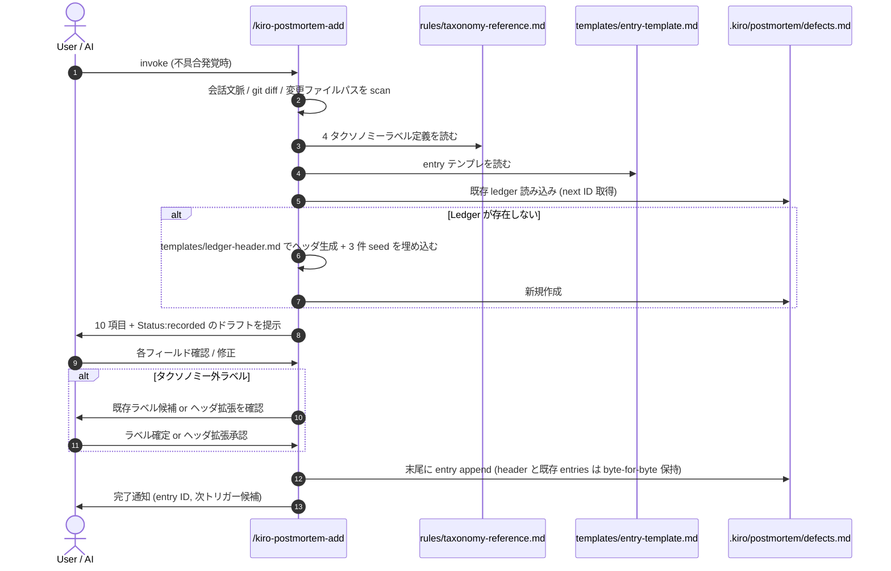
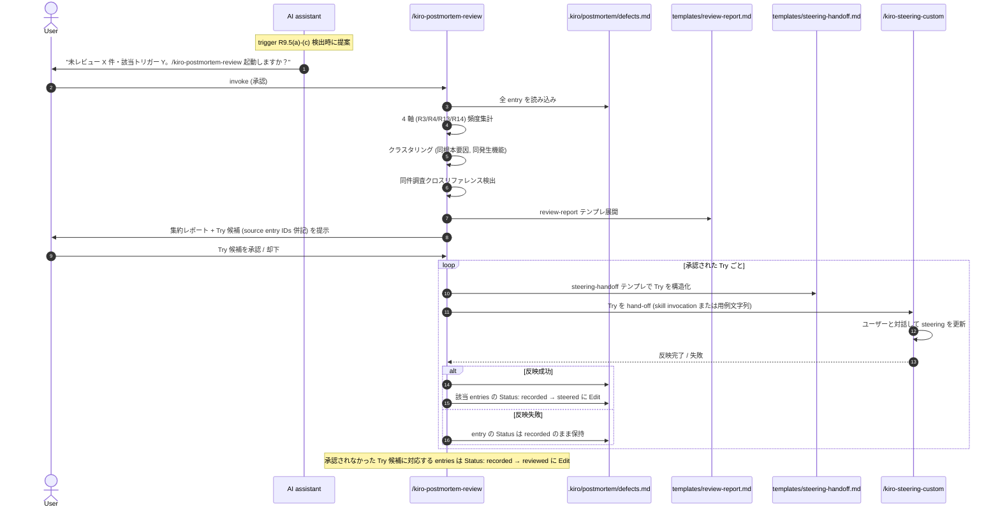
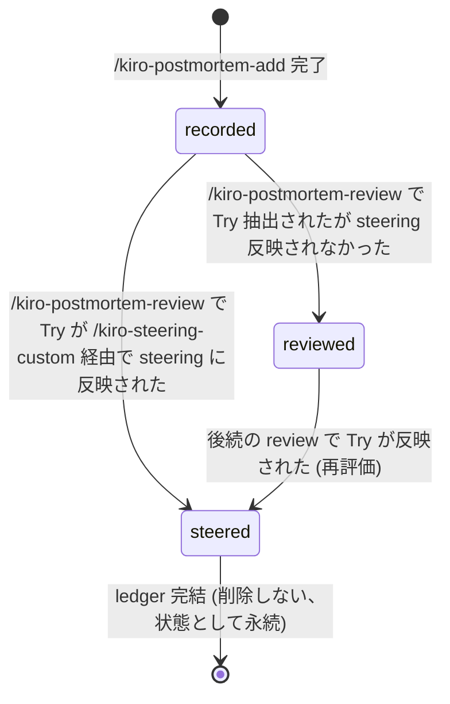
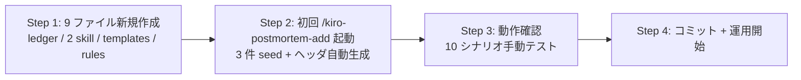

# 設計書: defect-pdca

## Overview

**Purpose**: AI 駆動の開発作業で発生する不具合をプロジェクトの学習資産として体系化する PDCA 基盤を、追記型 Markdown ledger (`.kiro/postmortem/defects.md`) と 2 つの skill (`/kiro-postmortem-add`, `/kiro-postmortem-review`) として実装する。抽出された Try は既存 `/kiro-steering-custom` を経由して `.kiro/steering/*.md` に反映され、次セッション以降の AI 振る舞いを恒常的に改善する。

**Users**: 本リポジトリで AI と協働する個人開発者 / プロジェクトオーナー。AI アシスタント自身も `/kiro-postmortem-add` の起動提案者および `/kiro-postmortem-review` のトリガー検知者として参加する。

**Impact**: 既存 4 機能 spec (`core-data-model` / `evm-engine` / `progress-tracking` / `dashboard`) と既存 skill (`kiro-*`) には一切手を入れず、新規ディレクトリ `.kiro/postmortem/` と `.claude/skills/kiro-postmortem-{add,review}/` を追加するだけで完結する。`/kiro-steering-custom` skill は外部 I/F として呼び出されるが修正対象外。

> **記述スタイル**: 本設計は `.kiro/steering/requirements-style.md` に従い、EARS 形式の契約・不変則・interface 制約は英文 + 和訳併記で記述する。Overview / Components の説明・図・運用記述は日本語のみ。

### Goals

- `.kiro/postmortem/defects.md` を単一の追記型 ledger として確立し、Plan→Do→Check→Act の各フェーズが対応する操作に明確にマップされた状態を作る
- `/kiro-postmortem-add` で 10 項目 (発生機能・発生不具合・検知工程ペア・要因分類・根本要因分類・根本要因詳細・同件調査・次回対応策) をすべて確実に記録できる
- `/kiro-postmortem-review` で 4 軸 (R3 What × R4 検証層 × R13 発生機能 × R14 Why) の頻度集計とクラスタリングが実行され、Try 候補が `/kiro-steering-custom` に確実にハンドオフされる
- 初期 seed 3 件 (今セッションで明らかになった `fmtMD` / seed DB / Playwright 脆弱性) が ledger に登録され、運用初日から `/kiro-postmortem-review` が意味のある集計を出せる
- 既存 spec / skill / settings.json を一切変更しない

### Non-Goals

- `/kiro-steering-custom` の機能拡張 (現状の signature をそのまま使う)
- 既存 4 機能 spec の修正
- `.claude/settings.json` への hook 追加による完全自動化 (将来検討)
- 外部 issue tracker (GitHub Issues / Backlog / Linear) との同期
- ML / LLM ベースの自動分類推論
- 可視化ツール (チャート・ダッシュボード)
- 過去不具合の遡及登録 (3 件の初期 seed のみ例外)

## Boundary Commitments

### This Spec Owns

- `.kiro/postmortem/defects.md` — ledger 本体 (ヘッダ + 初期 seed 3 件 + 追記される全 entry + `## Steering 反映ログ` セクション)
- `.claude/skills/kiro-postmortem-add/SKILL.md` — Plan-Do フェーズの skill 定義
- `.claude/skills/kiro-postmortem-add/templates/ledger-header.md` — 初回 ledger 作成時のヘッダテンプレ (PDCA ガイド + スキーマ説明 + 4 タクソノミー定義表)
- `.claude/skills/kiro-postmortem-add/templates/entry-template.md` — 1 entry 分の Markdown テンプレ (10 項目 + Status 行)
- `.claude/skills/kiro-postmortem-add/rules/taxonomy-reference.md` — 4 タクソノミー (R3/R4/R13/R14) の定義表 (共有 source of truth)
- `.claude/skills/kiro-postmortem-add/rules/trigger-detection.md` — `/kiro-postmortem-review` の起動トリガー判定ルール (R9.5)
- `.claude/skills/kiro-postmortem-review/SKILL.md` — Check-Act フェーズの skill 定義
- `.claude/skills/kiro-postmortem-review/templates/review-report.md` — 集約レポート出力テンプレ
- `.claude/skills/kiro-postmortem-review/templates/steering-handoff.md` — Try を `/kiro-steering-custom` に渡す際のフォーマットテンプレ

### Out of Boundary

- `.claude/skills/kiro-steering-custom/**` — 既存 skill、修正対象外。本 spec からは呼び出しのみ
- `.kiro/specs/{core-data-model,evm-engine,progress-tracking,dashboard}/**` — 既存 4 機能 spec の修正禁止 (R11.1)
- `.claude/skills/kiro-*/**` (新 2 skill 以外) — 既存 skill の signature・振る舞い変更禁止 (R11.2)
- `.claude/settings.json` — hook 追加禁止 (R11.3)
- 外部 issue tracker 連携 — Out of scope (R11.4)
- `.kiro/steering/*.md` — `/kiro-postmortem-review` から直接書き込み禁止 (R6.6 / R7.1)。書き込みは必ず `/kiro-steering-custom` 経由

### Allowed Dependencies

- `/kiro-steering-custom` skill (既存) — Try ハンドオフの唯一の経路
- `.kiro/steering/` ディレクトリ (read-only 参照のみ) — タクソノミー拡張時の整合確認用
- Git — ledger ファイルのバージョン管理
- Markdown / UTF-8 — ledger フォーマット
- 標準 Claude skill 機構 (frontmatter + `Read` / `Write` / `Edit` / `Glob` / `Grep` / `Bash`) — skill 実装基盤

### Revalidation Triggers

The following changes require revalidation of this spec.
- 和訳: 以下の変更が発生した場合、本スペックの再検証が必要となる。

1. `/kiro-steering-custom` skill の signature または振る舞いに破壊的変更が入った場合 → `templates/steering-handoff.md` と `/kiro-postmortem-review` の hand-off ロジック再検証
   - 和訳: `/kiro-steering-custom` skill の signature または振る舞いに破壊的変更が入った場合、`templates/steering-handoff.md` と `/kiro-postmortem-review` のハンドオフロジックを再検証する。
2. `.kiro/steering/requirements-style.md` の改訂で EARS 英文 + 和訳併記ルールが変更された場合 → ledger ヘッダの定義表表記の再検討
   - 和訳: `.kiro/steering/requirements-style.md` の改訂で EARS 英文 + 和訳併記ルールが変更された場合、ledger ヘッダの定義表表記を再検討する。
3. 新規機能 spec が `.kiro/specs/` 配下に追加された場合 → R13.5 に従い、発生機能タクソノミーへの新ラベル追加を次回 `/kiro-postmortem-add` 起動時に観察
   - 和訳: 新規機能 spec が `.kiro/specs/` 配下に追加された場合、R13.5 に従い、発生機能タクソノミーへの新ラベル追加を次回 `/kiro-postmortem-add` 起動時に観察する。
4. 4 タクソノミー (R3/R4/R13/R14) のラベル定義変更 → `rules/taxonomy-reference.md` と `requirements.md` の同時更新
   - 和訳: 4 タクソノミー (R3/R4/R13/R14) のラベル定義変更が発生した場合、`rules/taxonomy-reference.md` と `requirements.md` を同時に更新する。

## Architecture

### Existing Architecture Analysis

本リポジトリの既存 skill 群 (`.claude/skills/kiro-*/`) は以下の構造で稼働している:

- 各 skill は `SKILL.md` 1 ファイルで定義され、frontmatter (`name` / `description` / `allowed-tools` / 任意で `argument-hint` `disable-model-invocation`) + 本文 (`## Role` / `## Core Mission` / `## Execution Steps` / `## Critical Constraints` / `## Output Description` / `## Safety & Fallback`) を持つ
- `templates/` 配下に prompt テンプレを置く pattern (`kiro-impl` の implementer/reviewer/debugger-prompt.md) と、`rules/` 配下に方針文書を置く pattern (`kiro-steering-custom` の steering-principles.md, `kiro-spec-*` の各種ガイド) が確立されている
- skill は対話的に動作し、必要に応じて Agent ツールで subagent を dispatch する (`kiro-impl` autonomous mode)
- 既存 spec の文書は `.kiro/specs/{feature}/` に `spec.json`, `brief.md` (任意), `requirements.md`, `design.md`, `research.md` (任意), `tasks.md` を持つ

本スペックは上記パターンを新規 skill 2 つに踏襲し、新しい運用領域として `.kiro/postmortem/` ディレクトリを追加する。

### Architecture Pattern & Boundary Map

```mermaid
flowchart TB
  subgraph Trigger [Trigger Sources]
    Defect[不具合発覚]
    SpecDone[/kiro-impl 完了]
    NewSpec[/kiro-spec-init 直前]
    UserReq[ユーザー明示要求]
  end

  subgraph Plan_Do [Plan-Do]
    AddSkill[/kiro-postmortem-add SKILL]
    Templates1[templates/<br/>ledger-header.md<br/>entry-template.md]
    Rules1[rules/<br/>taxonomy-reference.md<br/>trigger-detection.md]
    AddSkill --> Templates1
    AddSkill --> Rules1
  end

  Ledger[.kiro/postmortem/defects.md<br/>追記型 Markdown ledger]

  subgraph Check_Act [Check-Act]
    ReviewSkill[/kiro-postmortem-review SKILL]
    Templates2[templates/<br/>review-report.md<br/>steering-handoff.md]
    ReviewSkill --> Templates2
    ReviewSkill -. references .-> Rules1
  end

  SteeringCustom[/kiro-steering-custom SKILL<br/>既存・修正対象外]
  SteeringFiles[.kiro/steering/*.md<br/>project memory]

  Defect --> AddSkill
  AddSkill -->|append entry| Ledger
  SpecDone -.->|AI proposes| ReviewSkill
  NewSpec -.->|AI proposes| ReviewSkill
  UserReq -.->|user invokes| ReviewSkill
  ReviewSkill -->|read all entries| Ledger
  ReviewSkill -->|Try hand-off| SteeringCustom
  SteeringCustom --> SteeringFiles
  ReviewSkill -->|append back-reference| Ledger
```

### Dependency Direction

依存方向は厳密に下流向き:

1. **Skill 層** (`/kiro-postmortem-add`, `/kiro-postmortem-review`) → Ledger (`.kiro/postmortem/defects.md`)
2. **`/kiro-postmortem-review`** → `/kiro-steering-custom` (既存) → `.kiro/steering/*.md`
3. **`/kiro-postmortem-add`** ⇄ **`/kiro-postmortem-review`** (互いに `rules/taxonomy-reference.md` を共有参照する弱い水平依存。書き換えは `/kiro-postmortem-add` のみが行う)

逆向き依存は禁止: ledger は skill を呼び出さない (受動データ)、steering は本 spec に依存しない (steering は project-wide memory)。

### Technology Stack

| Layer | Tool / Convention | Version | Role |
|---|---|---|---|
| Skill 定義 | Claude skill frontmatter | (Claude Code 標準) | `name` / `description` / `allowed-tools` 等のメタデータ |
| Ledger フォーマット | Markdown (UTF-8) | CommonMark + GFM tables | entry の構造化記録 |
| ID 形式 | Zero-padded 4-digit integer (`0001`, `0002`, ...) | — | エントリの相互参照と grep 可読性 |
| Timestamp | ISO 8601 (`YYYY-MM-DDTHH:MM:SSZ`) | — | `created_at` / Steering 反映ログのタイムスタンプ |
| Skill ツール | `Read` / `Write` / `Edit` / `Glob` / `Grep` / `Bash` | (Claude Code 標準) | ledger 操作と分析 |
| 外部依存 | (なし) | — | 完全にローカルファイル完結 (R10.3) |

## File Structure Plan

### Directory Structure

```
.kiro/
├── postmortem/                                    # 新規ディレクトリ
│   └── defects.md                                 # 新規: ledger 本体
└── steering/
    └── requirements-style.md                      # 既存 (本設計で参照)

.claude/skills/
├── kiro-postmortem-add/                           # 新規ディレクトリ
│   ├── SKILL.md                                   # 新規: skill 定義
│   ├── templates/
│   │   ├── ledger-header.md                       # 新規: 初回作成ヘッダテンプレ
│   │   └── entry-template.md                      # 新規: 1 entry テンプレ
│   └── rules/
│       ├── taxonomy-reference.md                  # 新規: 4 タクソノミー定義表
│       └── trigger-detection.md                   # 新規: review トリガー判定ルール
├── kiro-postmortem-review/                        # 新規ディレクトリ
│   ├── SKILL.md                                   # 新規: skill 定義
│   └── templates/
│       ├── review-report.md                       # 新規: 集約レポート出力テンプレ
│       └── steering-handoff.md                    # 新規: Try ハンドオフフォーマット
└── kiro-steering-custom/                          # 既存・修正対象外
    └── ...
```

### Created Files

新規作成ファイル (10 件):

- `.kiro/postmortem/defects.md`
- `.claude/skills/kiro-postmortem-add/SKILL.md`
- `.claude/skills/kiro-postmortem-add/templates/ledger-header.md`
- `.claude/skills/kiro-postmortem-add/templates/entry-template.md`
- `.claude/skills/kiro-postmortem-add/rules/taxonomy-reference.md`
- `.claude/skills/kiro-postmortem-add/rules/trigger-detection.md`
- `.claude/skills/kiro-postmortem-review/SKILL.md`
- `.claude/skills/kiro-postmortem-review/templates/review-report.md`
- `.claude/skills/kiro-postmortem-review/templates/steering-handoff.md`

### Modified Files

(本スペックでは既存ファイルを一切変更しない)

### Deleted Files

(本スペックでは既存ファイルを一切削除しない)

## System Flows

### Plan-Do フロー (`/kiro-postmortem-add`)



### Check-Act フロー (`/kiro-postmortem-review`)



### State Transition (entry 状態遷移)



`recorded` → `reviewed` への遷移は、Try 候補に挙がったが steering 化が不要 / 却下されたケースを表す (例: 1 回限りのレアケース、または既知の制約として残す判断)。

## Requirements Traceability

| Requirement | Summary | Components | Interfaces / Contracts | Flows |
|---|---|---|---|---|
| 1.1-1.4 | Ledger ファイル配置と初期化 | `.kiro/postmortem/defects.md`, `templates/ledger-header.md` | append-only, UTF-8, Git-trackable | Plan-Do (初回作成分岐) |
| 2.1-2.6 | Entry スキーマ 10 項目 + ID + timestamp + title | `templates/entry-template.md`, `/kiro-postmortem-add` | 必須 10 fields, entry ID = zero-padded int, ISO-8601 timestamp | Plan-Do |
| 3.1-3.4 | 要因分類タクソノミー (R3) | `rules/taxonomy-reference.md` (§要因分類), ledger ヘッダ | 8 ラベル固定 + 拡張フロー | Plan-Do (タクソノミー検証) |
| 4.1-4.5 | 検知工程タクソノミー (R4, 検証層) | `rules/taxonomy-reference.md` (§検知工程), ledger ヘッダ | 7 ラベル固定 + ギャップ解釈ルール | Plan-Do, Check-Act (頻度集計) |
| 5.1-5.6 | `/kiro-postmortem-add` の振る舞い | `kiro-postmortem-add/SKILL.md` | 10 項目ドラフト提案 + 確認 + append, partial write 禁止, 中断ドラフト復帰 | Plan-Do フロー全体 |
| 6.1-6.6 | `/kiro-postmortem-review` の振る舞い | `kiro-postmortem-review/SKILL.md`, `templates/review-report.md` | 全 entry 読み込み + 4 軸頻度集計 + クラスタリング + Try 抽出 + steering-handoff | Check-Act フロー |
| 7.1-7.4 | Try → steering 反映と back-reference | `templates/steering-handoff.md`, ledger `## Steering 反映ログ` セクション | `/kiro-steering-custom` 経由のみ書き込み, append-only back-ref | Check-Act (Try 反映分岐) |
| 8.1-8.4 | 初期 seed entry 3 件 | `templates/ledger-header.md` (初回作成時に同時挿入), 3 件の seed body | `source: retrospective-seed` メタフラグ, 5 軸マッピング既定 | Plan-Do (初回分岐) |
| 9.1-9.7 | PDCA 運用ガイド + 起動トリガー | `templates/ledger-header.md`, `rules/trigger-detection.md` | 4 トリガー条件列挙, AI 提案動作, ユーザー任意起動の保証 | Check-Act (trigger 検出 → 提案) |
| 10.1-10.5 | データ整合性とエラー処理 | `kiro-postmortem-add/SKILL.md`, `kiro-postmortem-review/SKILL.md` | malformed entry skip, concurrent write 検知, UTF-8 保持, FS エラー時の write 中止 | Plan-Do, Check-Act 共通 |
| 11.1-11.5 | 既存資産との独立性 | (制約事項のみ、出力ファイルなし) | 既存 spec / skill / settings.json / 外部 tracker 不変 | (boundary 制約として全フローに適用) |
| 12.1-12.4 | PDCA 経過の可視性 | ledger 内 `Status:` 行, `## Steering 反映ログ` セクション | 3 状態遷移 (`recorded` / `reviewed` / `steered`), 時系列 back-ref | State Transition |
| 13.1-13.5 | 発生機能タクソノミー | `rules/taxonomy-reference.md` (§発生機能), ledger ヘッダ | 10 ラベル固定 + 拡張フロー + 新 spec 追加時の拡張ポリシー | Plan-Do, Check-Act (頻度集計) |
| 14.1-14.6 | 根本要因分類タクソノミー (Why 軸) | `rules/taxonomy-reference.md` (§根本要因分類), ledger ヘッダ | 11 ラベル固定 + R3 との直交性 + (What × Why) マッピング例 | Plan-Do, Check-Act (頻度集計) |

## Components and Interfaces

### サマリー

| Component | Domain/Layer | Intent | Req Coverage | Key Dependencies (P0/P1) | Contracts |
|---|---|---|---|---|---|
| `.kiro/postmortem/defects.md` | Data | 全 entry を保持する追記型 Markdown ledger | 1.1-1.4, 2.1-2.6, 12.1-12.4 | (none, 永続データ) | State |
| `kiro-postmortem-add/SKILL.md` | Skill | Plan-Do: 不具合発生時の 10 項目記録 | 1.2, 1.3, 5.1-5.6, 10.2, 10.4, 10.5 | `templates/entry-template.md` (P0), `rules/taxonomy-reference.md` (P0), `templates/ledger-header.md` (P0) | Service |
| `kiro-postmortem-add/templates/ledger-header.md` | Template | 初回 ledger 作成時のヘッダ (PDCA ガイド + スキーマ + 4 タクソノミー定義 + 例エントリ + 3 件 seed) | 1.2, 8.1-8.4, 9.1-9.7 | `rules/taxonomy-reference.md` (P1) | State |
| `kiro-postmortem-add/templates/entry-template.md` | Template | 1 entry 分の Markdown テンプレ | 2.1, 2.5, 2.6 | — | State |
| `kiro-postmortem-add/rules/taxonomy-reference.md` | Reference | 4 タクソノミー (R3/R4/R13/R14) の共有定義表 | 3.1-3.4, 4.1-4.5, 13.1-13.5, 14.1-14.6 | — | State |
| `kiro-postmortem-add/rules/trigger-detection.md` | Reference | R9.5 起動トリガー判定ルール | 9.5, 9.6 | — | State |
| `kiro-postmortem-review/SKILL.md` | Skill | Check-Act: 集約分析と Try 抽出と steering 化 | 6.1-6.6, 7.1-7.4, 10.1, 10.3, 10.5, 12.1-12.4 | `templates/review-report.md` (P0), `templates/steering-handoff.md` (P0), `kiro-postmortem-add/rules/taxonomy-reference.md` (P1), `/kiro-steering-custom` (P0, external) | Service |
| `kiro-postmortem-review/templates/review-report.md` | Template | 集約レポート出力フォーマット | 6.1, 6.2, 6.3 | — | State |
| `kiro-postmortem-review/templates/steering-handoff.md` | Template | Try を `/kiro-steering-custom` に渡す構造化フォーマット | 6.4, 7.1, 7.2 | — | State |

### Data Layer

#### `.kiro/postmortem/defects.md`

| Field | Detail |
|-------|--------|
| Intent | 全 defect entry と Steering 反映ログを永続化する単一の追記型 Markdown ledger |
| Requirements | 1.1-1.4, 2.1-2.6, 8.1-8.4, 12.1-12.4 |

**Responsibilities & Constraints**

- 単一ファイルで完結 (R1.1)
- UTF-8、Git-trackable、`.gitignore` で除外しない (R1.4, R10.4)
- 追記型: 既存 entry の編集 / 削除を skill から行わない (R1.3, R5.4, R6.5)
- 構造: `## Header` (PDCA ガイド + スキーマ + タクソノミー定義 + 例エントリ) → `## Entries` (`### 0001: title` 形式で各 entry) → `## Steering 反映ログ` (Try 反映の back-reference 時系列)
- 各 entry の冒頭に `Status: recorded | reviewed | steered` 行を 1 行で配置 (R12.1, R12.2)
- 初回作成時は `kiro-postmortem-add` が `templates/ledger-header.md` を展開し、3 件の seed entry も同時に挿入 (R8.3)

**Markdown 構造例**

```markdown
# 不具合要因分析 Ledger

(PDCA 運用ガイド・スキーマ説明・4 タクソノミー定義表・例エントリ — templates/ledger-header.md から展開)

## Entries

### 0001: fmtMD が常に 0.0 MD を返す単位スケール混入

Status: steered
Entry ID: 0001
Created: 2026-05-18T16:00:00Z
Source: retrospective-seed

#### 1. 発生機能
`dashboard / formatters`

#### 2. 発生した不具合
SummaryStrip / Inspector の BAC/EV/PV/AC が ... (要約と詳細)

#### 3. 検知した工程
`user-report`

#### 4. 検知すべき工程
`unit-test`

#### 5. 検知すべき工程で検知できなかった理由
formatters.ts のピュア関数ユニットテストが存在せず、設計書 Testing Strategy が「自明な変換だから省略」と明記していたため、検知層自体が整備されていなかった。

#### 6. 要因分類
`impl-error`

#### 7. 根本要因分類
`assumption-error`

#### 8. 根本要因詳細
「MD = Man-Day なら 1_000_000 で割らないはず」という当然のセマンティクスを「自明な変換」と判断し、テストでアサートしなかった。バイト→MB のような別ドメインのスケール変換と無意識に混同した可能性。

#### 9. 同件調査
過去 entry 内で同じ `assumption-error` ラベルなし (本件が初出 seed)

#### 10. 次回からの対応策 (Try)
ピュア関数の単位契約 (人日 / 時間 / 比率) はテストで明示する。設計書で「自明だから省略」と書かれている箇所を見つけたら自動的に疑う。

### 0002: ...

(同形式で続く)

## Steering 反映ログ

### 2026-05-19T13:00:00Z

- Source entries: #0001
- Target steering: `.kiro/steering/defect-patterns-assumption-error.md`
- Try summary: ピュア関数の単位契約はテストで明示せよ
```

**Dependencies**

- Inbound: `/kiro-postmortem-add` (write append), `/kiro-postmortem-review` (read all + Edit Status + append `## Steering 反映ログ`)
- Outbound: (なし、データファイル)

**Contracts**: State

### Skill Layer

#### `/kiro-postmortem-add` SKILL.md

| Field | Detail |
|-------|--------|
| Intent | Plan-Do フェーズ: 不具合発生時に 10 項目 + メタを ledger に追記する |
| Requirements | 1.2, 1.3, 5.1-5.6, 10.2, 10.4, 10.5 |

**Frontmatter**

```yaml
---
name: kiro-postmortem-add
description: Append a defect entry to .kiro/postmortem/defects.md with 10 mandatory fields. Use when a defect is identified and its root cause is clarified, either proactively by the AI or on user demand.
allowed-tools: Read, Write, Edit, Glob, Grep, Bash
argument-hint: <one-line defect summary, optional>
---
```

**Responsibilities & Constraints**

- 起動時に会話文脈・最近の `git diff`・変更ファイルパス・関連 spec/steering 抜粋から 10 項目のドラフトを提案する (R5.1)
- `発生機能` の提案値は変更ファイルパスを `rules/taxonomy-reference.md` の発生機能タクソノミーと照合して導出 (R5.1, R13.1)
- 各フィールドをユーザーに提示し、確認 / 修正を受け取る (R5.2)
- 10 項目すべてが埋まった時点でのみ ledger に append (R2.5, R5.5)
- append-only セマンティクス: 既存 ledger 内容を byte-for-byte 保持 (R1.3, R5.4)
- ledger が存在しない場合、`templates/ledger-header.md` を展開 + 3 件 seed を埋め込んで新規作成 (R1.2, R8.3)
- タクソノミー外ラベル入力時、既存タクソノミー候補を提示 + ヘッダ拡張オプションを提示 (R3.4, R13.4, R14.5)
- 中断された前回ドラフトが残っている場合、新規開始前に破棄 / 確定を確認 (R5.6)
- 同時起動時の競合検知: ledger ファイルの mtime を比較して矛盾があればユーザーに解決を求める (R10.2)
- ファイルシステムエラーで ledger が読めない場合、書き込みを行わずエラー表面化 (R10.5)
- 完了後、R9.5 のトリガー条件 ((a) spec 完了 / (b) 同根本要因 2 件以上蓄積 / (c) 新 spec 開始直前) を `rules/trigger-detection.md` のロジックで判定し、該当時は 1 行で `/kiro-postmortem-review` 起動を提案 (R9.6)

**Dependencies**

- Inbound: ユーザー / AI からの skill invocation
- Outbound: `templates/entry-template.md` (P0), `templates/ledger-header.md` (P0, 初回作成時のみ), `rules/taxonomy-reference.md` (P0), `rules/trigger-detection.md` (P0), `.kiro/postmortem/defects.md` (P0, write target), Git (P1, optional context for diff)

**Contracts**: Service

##### Service Interface

```typescript
// 概念上の I/F (skill 起動時の argument-hint と output)
interface KiroPostmortemAddInput {
  defectSummary?: string;  // optional: argument-hint で受け取る 1 行要約
}

interface KiroPostmortemAddOutput {
  status: 'appended' | 'cancelled' | 'error';
  entryId?: string;          // e.g., "0004"
  ledgerPath: string;        // ".kiro/postmortem/defects.md"
  reviewTriggerProposed?: {  // R9.6 提案出力
    triggers: Array<'spec-completion' | 'cluster-threshold' | 'new-spec-init'>;
    unreviewedCount: number;
  };
  error?: string;            // status === 'error' のとき
}
```

- 和訳: skill 起動時に optional な不具合要約文字列を受け取り、終了時に append 結果・entry ID・ledger パス・(該当時) review トリガー提案 / エラー詳細を返す概念 I/F。

- **Preconditions**: `.kiro/postmortem/` ディレクトリの書き込み権限があること
- **Postconditions**: ledger 末尾に 1 entry が追記されている (append) または ledger は変更されていない (cancelled / error)
- **Invariants**: ledger の既存内容は byte-for-byte 保持される (R5.4)

**Implementation Notes**

- 初回作成時: `templates/ledger-header.md` をテンプレ展開 → 3 件 seed body を `templates/entry-template.md` に流し込み → `.kiro/postmortem/defects.md` に Write
- 通常追記時: 既存 ledger を Read → next entry ID 算出 (既存 ID の最大値 + 1) → entry body を Write append (`Edit` で末尾位置を特定 or `Bash` で >> リダイレクト)
- タクソノミー拡張時: ヘッダ内のタクソノミー定義表 (Markdown table) を Edit で行追加 → 同じ操作の中で entry を append

#### `/kiro-postmortem-review` SKILL.md

| Field | Detail |
|-------|--------|
| Intent | Check-Act フェーズ: ledger を集約分析し、Try を抽出して `/kiro-steering-custom` 経由で steering に反映 |
| Requirements | 6.1-6.6, 7.1-7.4, 10.1, 10.3, 10.5, 12.1-12.4 |

**Frontmatter**

```yaml
---
name: kiro-postmortem-review
description: Aggregate all entries in .kiro/postmortem/defects.md, produce a 4-axis frequency report and clusters, extract Try candidates, and hand them off to /kiro-steering-custom for steering reflection. Invoke at /kiro-impl completion, new spec init, when same root-cause label crosses 2 unreviewed entries, or on user demand.
allowed-tools: Read, Edit, Glob, Grep, Bash
argument-hint: <scope filter, optional. e.g., "since:2026-05-01" or "feature:dashboard">
---
```

**Responsibilities & Constraints**

- ledger 全 entry を Read (R6.1)
- 4 軸 (R3 要因分類 × R4 検知工程 (検知した工程 / 検知すべき工程両方) × R13 発生機能 × R14 根本要因分類) の頻度表を構築 (R6.1)
- クラスタリング: 同 `根本要因分類` を共有する entries / 同 `発生機能` を共有する entries / `同件調査` で相互参照される entries をグループ化 (R6.1)
- Try 候補抽出: 最頻 + 最近の `根本要因分類` クラスタの `次回からの対応策` を集約 (R6.2)
- 各 Try 候補にソース entry IDs を併記 (R6.3)
- malformed entry は entry ID を報告してスキップ、他は処理継続 (R10.1)
- 副作用として ledger entry を削除 / 修正しない (R6.5, ただし Status 行と `## Steering 反映ログ` 末尾は明示的更新対象)
- `.kiro/steering/` への直接書き込み禁止 (R6.6, R7.1)
- Try が承認された場合、`templates/steering-handoff.md` で構造化し `/kiro-steering-custom` に渡す (R6.4, R7.1)
- ハンドオフ成功時: `## Steering 反映ログ` に back-reference を append + 該当 entries の `Status:` を `recorded` → `steered` に Edit (R7.2, R12.2)
- ハンドオフ失敗 / 却下時: ledger entries を `Status: recorded` のまま保持、Try は次回 review で再提示可能 (R7.3)
- Try 抽出されたが reflection 不要と判定された entries は `Status: recorded` → `reviewed` に Edit (R12.1)
- `## Steering 反映ログ` セクションは append-only、本 skill による既存ログの編集禁止 (R7.4)
- FS エラーで ledger 読めない場合、書き込みなしでエラー表面化 (R10.5)

**Dependencies**

- Inbound: ユーザー (主体起動), AI (提案後にユーザー承認で起動)
- Outbound: `.kiro/postmortem/defects.md` (P0, read + Status Edit + append `## Steering 反映ログ`), `templates/review-report.md` (P0), `templates/steering-handoff.md` (P0), `kiro-postmortem-add/rules/taxonomy-reference.md` (P1, 弱い水平依存), `/kiro-steering-custom` (P0, external skill invocation)

**Contracts**: Service

##### Service Interface

```typescript
interface KiroPostmortemReviewInput {
  scopeFilter?: string;  // optional: "since:YYYY-MM-DD" or "feature:<label>" 形式
}

interface KiroPostmortemReviewOutput {
  status: 'completed' | 'cancelled' | 'error';
  ledgerSnapshot: {
    totalEntries: number;
    validEntries: number;
    malformedEntries: string[];  // skipped entry IDs
  };
  report: {
    frequencyByCauseCategory: Record<string, number>;   // 要因分類ラベル → count
    frequencyByRootCause: Record<string, number>;       // 根本要因分類ラベル → count
    frequencyByFeature: Record<string, number>;         // 発生機能ラベル → count
    detectionGapMatrix: Array<{shouldBe: string; was: string; count: number}>;
    clustersByRootCause: Array<{label: string; entryIds: string[]}>;
    clustersByFeature: Array<{label: string; entryIds: string[]}>;
  };
  tryCandidates: Array<{
    summary: string;
    sourceEntryIds: string[];
    proposedSteeringTarget: string;  // e.g., ".kiro/steering/defect-patterns-assumption-error.md"
    userVerdict: 'approved' | 'rejected' | 'pending';
  }>;
  steeringReflections: Array<{
    sourceEntryIds: string[];
    targetSteeringPath: string;
    summary: string;
    timestamp: string;  // ISO 8601
    handoffResult: 'success' | 'failed';
  }>;
  error?: string;
}
```

- 和訳: review skill の出力。ledger snapshot、4 軸頻度レポート、クラスタリング結果、Try 候補とユーザー判定、steering 反映ログを含む。

- **Preconditions**: `.kiro/postmortem/defects.md` が存在し読み込み可能であること
- **Postconditions**:
  - report が生成され (`status: 'completed'` 時)
  - 承認された Try に対応する entry の Status が `steered` に更新されている
  - 却下された Try に対応する entry の Status が `reviewed` に更新されている
  - `## Steering 反映ログ` に成功した hand-off の back-reference が追加されている
- **Invariants**: ledger 内の entry 本体 (10 項目) は本 skill によって変更されない (R6.5)

**Implementation Notes**

- ledger パース: Markdown を正規表現で section ごとに分割。各 entry は `### \d{4}:` で始まる H3 を境界として識別。`Status:` 行は H3 直下の決まった位置から grep
- 集約分析: Python 風の擬似コードで言えば `Counter(entries[*].根本要因分類)` のようなシンプルな頻度計算 + 同ラベル entries の grouping
- Try 抽出: 同 `根本要因分類` を持つ entries が 2 件以上ある場合、その `次回からの対応策` をマージして 1 つの Try にまとめる。複数 Try が同 steering ファイルを target にする場合、まとめてバッチハンドオフを試みる
- `/kiro-steering-custom` ハンドオフ: Skill ツールで invoke するか、`templates/steering-handoff.md` をユーザーに提示してユーザーが手動で `/kiro-steering-custom` を起動する形 (前者は disable-model-invocation 未設定なら可、後者は確実)
- Status Edit: `## Entries` セクション内で対象 entry の Status 行のみを `Edit` で書き換え (entry 本体は触らない)
- back-reference append: `## Steering 反映ログ` セクション末尾に新しい `### {timestamp}` ブロックを append

### Reference Layer

#### `rules/taxonomy-reference.md`

| Field | Detail |
|-------|--------|
| Intent | 4 タクソノミー (R3/R4/R13/R14) の共有定義 source of truth |
| Requirements | 3.1-3.4, 4.1-4.5, 13.1-13.5, 14.1-14.6 |

**構造**

```markdown
# Taxonomy Reference

> Source of truth for 4 axes. `kiro-postmortem-add` reads this for label suggestion;
> `kiro-postmortem-review` reads this for valid-label validation.
> When labels are extended, this file AND `.kiro/postmortem/defects.md` ヘッダ
> AND `.kiro/specs/defect-pdca/requirements.md` を同時に更新する。

## R3: 要因分類タクソノミー (成果物軸 / What)
(8 ラベル + 定義 + 該当例の表)

## R4: 検知工程タクソノミー (検証層 / Where)
(7 ラベル + 定義 + V モデル対応 + 該当例の表)

## R13: 発生機能タクソノミー (Spec 軸)
(10 ラベル + 定義 + 該当例の表)

## R14: 根本要因分類タクソノミー (Why 軸)
(11 ラベル + 定義 + 該当例の表)

## (What × Why) Quick Reference Map
| 要因分類 | よく合わさる 根本要因分類 | 検知すべき検証層 |
|---|---|---|
| impl-error | assumption-error / pattern-misapplication | unit-test |
| design-error | knowledge-gap / context-loss | integration-test |
| env-config | context-loss | integration-test |
| tooling-fragility | tooling-trap | e2e |
| ... | ... | ... |
```

**Dependencies**

- Inbound: `/kiro-postmortem-add` (P0), `/kiro-postmortem-review` (P1, 弱い水平依存), `.kiro/postmortem/defects.md` ヘッダ (P1, 同期対象)
- Outbound: (なし)

**Contracts**: State

#### `rules/trigger-detection.md`

| Field | Detail |
|-------|--------|
| Intent | `/kiro-postmortem-review` の起動トリガー (R9.5) を機械的に判定するロジックを文書化 |
| Requirements | 9.5, 9.6 |

**判定ロジック (擬似コード)**

```
function detectReviewTriggers(ledger, sessionContext):
    triggers = []

    // (a) /kiro-impl 完了直後
    if sessionContext.justCompleted == "/kiro-impl":
        triggers.append("spec-completion")

    // (b) 同根本要因 / 同要因分類が未レビューで 2 件以上
    unreviewedEntries = ledger.entries.filter(e => e.status == "recorded")
    rootCauseCounts = Counter(e.rootCauseCategory for e in unreviewedEntries)
    causeCounts = Counter(e.causeCategory for e in unreviewedEntries)
    if any(c >= 2 for c in rootCauseCounts.values()) or
       any(c >= 2 for c in causeCounts.values()):
        triggers.append("cluster-threshold")

    // (c) /kiro-spec-init 直前
    if sessionContext.aboutToInvoke == "/kiro-spec-init":
        triggers.append("new-spec-init")

    return triggers
```

- 和訳: `/kiro-impl` 完了直後 (a) / 未レビュー同根本要因 2 件以上 (b) / 新 spec init 直前 (c) のいずれかが満たされた場合、AI は `/kiro-postmortem-review` 起動提案を 1 行で表示する。

### Template Layer

#### `templates/ledger-header.md` (kiro-postmortem-add 配下)

初回 ledger 作成時のヘッダテンプレ。以下の節を含む:

1. PDCA 運用ガイド (R9.1-R9.7: Plan/Do/Check/Act の役割 + 4 トリガー条件 + AI 提案動作)
2. Entry スキーマ説明 (R2: 10 項目順序 + 必須フィールド + ID / timestamp / title 形式)
3. Status 状態遷移 (R12: `recorded` / `reviewed` / `steered`)
4. 4 タクソノミー定義表 (R3/R4/R13/R14、`rules/taxonomy-reference.md` のコピー)
5. (What × Why) Quick Reference Map (R14.6)
6. 例エントリ 1 件 (R9.4、3 件 seed のうち #0001 を例示として再掲)

#### `templates/entry-template.md` (kiro-postmortem-add 配下)

1 entry 分のテンプレ。プレースホルダは `{{ }}` 形式:

```markdown
### {{ENTRY_ID}}: {{TITLE}}

Status: recorded
Entry ID: {{ENTRY_ID}}
Created: {{ISO_TIMESTAMP}}
Source: {{SOURCE_FLAG}}

#### 1. 発生機能
{{FEATURE_LABEL}}

#### 2. 発生した不具合
{{DEFECT_DESCRIPTION}}

#### 3. 検知した工程
{{DETECTED_AT_LABEL}}

#### 4. 検知すべき工程
{{SHOULD_DETECT_AT_LABEL}}

#### 5. 検知すべき工程で検知できなかった理由
{{GAP_REASON}}

#### 6. 要因分類
{{CAUSE_CATEGORY_LABEL}}

#### 7. 根本要因分類
{{ROOT_CAUSE_CATEGORY_LABEL}}

#### 8. 根本要因詳細
{{ROOT_CAUSE_DETAIL}}

#### 9. 同件調査
{{RELATED_ENTRIES}}

#### 10. 次回からの対応策
{{TRY_PROPOSAL}}
```

#### `templates/review-report.md` (kiro-postmortem-review 配下)

集約レポート出力テンプレ:

```markdown
# Postmortem Review Report ({{TIMESTAMP}})

## Summary
- Total entries: {{TOTAL_COUNT}}
- Valid entries: {{VALID_COUNT}}
- Malformed (skipped): {{MALFORMED_LIST}}
- Status breakdown: recorded={{R_COUNT}}, reviewed={{V_COUNT}}, steered={{S_COUNT}}

## Frequency (4 axes)
### 要因分類 (R3 / What)
{{R3_TABLE}}

### 検知工程ギャップ (R4 / Where)
{{R4_GAP_MATRIX}}

### 発生機能 (R13 / Spec)
{{R13_TABLE}}

### 根本要因分類 (R14 / Why)
{{R14_TABLE}}

## Clusters
### By 根本要因分類
{{R14_CLUSTERS}}

### By 発生機能
{{R13_CLUSTERS}}

### Cross-referenced (via 同件調査)
{{CROSS_REF_GRAPH}}

## Try Candidates
{{TRY_LIST}}
(各 Try は: summary + source entry IDs + proposed steering target)
```

#### `templates/steering-handoff.md` (kiro-postmortem-review 配下)

`/kiro-steering-custom` への Try ハンドオフフォーマット:

```markdown
# Steering Handoff: {{TRY_SUMMARY}}

## Source
- Entries: {{SOURCE_ENTRY_IDS}}
- Root cause cluster: {{ROOT_CAUSE_LABEL}}
- Frequency: {{N}} occurrences

## Proposed Steering Target
- File: {{TARGET_STEERING_PATH}}
- Section: {{TARGET_SECTION_OR_NEW}}

## Try Content (to be added to steering)
{{TRY_BODY}}

## Rationale (motivating evidence)
{{RATIONALE_FROM_ENTRIES}}
```

## Data Models

### Entry スキーマ (10 必須項目 + メタ)

| Field | Type | Required | Constraint |
|---|---|---|---|
| Entry ID | string | ✓ | Zero-padded 4-digit int (`0001`, `0002`, ...). Monotonically increasing within ledger |
| Title | string (1 line) | ✓ | 発生した不具合の 1 行要約。H3 見出しに表示 |
| Status | enum | ✓ | `recorded` / `reviewed` / `steered` のいずれか |
| Created | ISO 8601 timestamp | ✓ | UTC 推奨。`/kiro-postmortem-add` の finalization 時刻 |
| Source | string | ✓ | `organic` (通常追記) or `retrospective-seed` (初期 seed) |
| (1) 発生機能 | string (taxonomy + optional sub-scope) | ✓ | R13 taxonomy ラベル + `/` 区切り任意サブスコープ |
| (2) 発生した不具合 | string (free text) | ✓ | 1-3 段落の具体的記述 |
| (3) 検知した工程 | enum | ✓ | R4 taxonomy ラベル 1 つ |
| (4) 検知すべき工程 | enum | ✓ | R4 taxonomy ラベル 1 つ |
| (5) 検知すべき工程で検知できなかった理由 | string (free text) | ✓ | (3)≠(4) なら非空必須 (R4.3); (3)=(4) なら "該当なし" 可 (R4.4) |
| (6) 要因分類 | enum | ✓ | R3 taxonomy ラベル 1 つ |
| (7) 根本要因分類 | enum | ✓ | R14 taxonomy ラベル 1 つ |
| (8) 根本要因詳細 | string (free text) | ✓ | 「なぜそのメカニズムが発動したか」の具体的記述 |
| (9) 同件調査 | string (entry ID list or "該当なし") | ✓ | 過去 ledger 内の関連 entry ID を `#0003, #0007` 形式で列挙、または "該当なし" |
| (10) 次回からの対応策 | string (free text) | ✓ | Try 候補となる対策案 |

### Steering 反映ログエントリ

```typescript
interface SteeringReflectionLog {
  timestamp: string;            // ISO 8601
  sourceEntryIds: string[];     // ["0001", "0002"]
  targetSteeringPath: string;   // ".kiro/steering/defect-patterns-assumption-error.md"
  trySummary: string;           // 1-2 行
  handoffResult: 'success';     // 失敗時は本ログに記録しない (R7.3)
}
```

- 和訳: Steering 反映ログ 1 件のスキーマ。タイムスタンプ・ソース entry IDs・反映先 steering ファイルパス・Try 要約・成功フラグを保持する。

### Taxonomy (4 軸)

詳細は `requirements.md` R3 / R4 / R13 / R14 を参照 (重複記述を避ける)。本設計では各軸が 8 / 7 / 10 / 11 = 計 36 ラベルの固定タクソノミーであることのみを再確認し、ラベル定義は `rules/taxonomy-reference.md` を唯一の skill 用 source of truth とする。

## Error Handling

### Error Strategy

ローカルファイル完結のため、エラーは主にファイルシステム関連と Markdown フォーマット関連:

| Error Category | Detection | Response |
|---|---|---|
| ledger ファイルが読めない (`ENOENT` / permission) | `Read` ツール失敗 | エラー表面化、書き込み中止 (R10.5) |
| ledger ファイルが malformed (必須 10 項目欠落) | パース時の正規表現マッチ失敗 | 該当 entry ID を report に記載、頻度集計からスキップ、他 entry の処理は継続 (R10.1) |
| 同時起動による競合書き込み | `Write` 前に再度 mtime 確認、不一致を検知 | ユーザーに通知、resolve 待ち (R10.2) |
| ユーザーが mid-flow で却下 | 対話セッションのキャンセル | partial write を行わない (R5.5) |
| `/kiro-steering-custom` のハンドオフ失敗 | skill invocation の結果 / ユーザー却下 | ledger entries の Status を `recorded` のまま保持、Try は次回 review で再提示可能 (R7.3) |
| タクソノミー外ラベル入力 | `rules/taxonomy-reference.md` との照合失敗 | 既存ラベル候補提示 + ヘッダ拡張オプション提示 (R3.4, R13.4, R14.5) |

### Error Categories and Responses

外部サービス依存ゼロのため、ネットワーク / 認証 / API クォータ系のエラーは対象外。Markdown パースエラーは「skipした事実」を report で開示するので、ユーザーが手動修復してから再 review すれば回復する。

### Monitoring

- 本スペックの責務は AI 駆動開発の learning ledger であり、本番運用される webapp ではない
- ledger ファイル自体が PDCA 経過の証跡 (audit log)。Git history で時系列追跡可能
- 失敗した hand-off は ledger に記録されない (R7.3) ため、Try が再現するように `recorded` ステータスを保持することで「失敗した Try は次回再評価される」が暗黙のリトライ機構として機能

## Testing Strategy

本スペックは webapp ではなく文書 + skill 定義の集合体のため、自動テスト戦略は最小限。

### Unit Tests

- 不採用: 各 skill は対話的に動作し、コードベースに永続的な実行ロジックを持たないため、unit test 対象が存在しない
- 代替: `templates/*.md` のテンプレが正しく展開されるか、`rules/taxonomy-reference.md` と `requirements.md` のラベル定義が一致するかは **手動レビュー** で確認する

### Integration Tests

- 不採用: 同上、コードベースを持たない
- 代替: 各 skill の最初の動作確認 (実稼働テスト) で End-to-End 動作を検証する

### Manual Scenario Tests (主要検証手段)

実装完了時に以下のシナリオを手動で実行し、要件に対する検証を行う:

| Scenario | 検証内容 | 要件 |
|---|---|---|
| 1. 初回 `/kiro-postmortem-add` 起動 | ledger 不在の状態で起動し、ヘッダ + 3 件 seed が含まれる ledger が生成され、新 entry #0004 が append される | R1.2, R5.1-5.3, R8.1-8.4 |
| 2. 2 回目以降の `/kiro-postmortem-add` 起動 | 既存 ledger の byte-for-byte 保持 + 新 entry が末尾に append される | R5.4 |
| 3. タクソノミー外ラベル入力 | 既存タクソノミー候補が提示され、ユーザーが既存選択 / ヘッダ拡張のいずれかを選べる | R3.4, R13.4, R14.5 |
| 4. 必須 10 項目のいずれかが空 | append が refuse され、欠落フィールドが報告される | R2.5 |
| 5. `/kiro-postmortem-review` 集約 | ledger 全 entry が読まれ、4 軸頻度表 + クラスタリング + Try 候補が出力される | R6.1-6.3 |
| 6. Try 承認 → `/kiro-steering-custom` ハンドオフ | Try が `/kiro-steering-custom` に渡され、ユーザー対話で steering 更新、ledger の `## Steering 反映ログ` に back-ref 追加、該当 entry の Status が `steered` に更新 | R6.4, R7.1-7.2, R12.2 |
| 7. Try 却下 | ledger 該当 entry の Status が `reviewed` に更新、`## Steering 反映ログ` は変更されない | R7.3, R12.1 |
| 8. malformed entry が混在した ledger で review | malformed entry ID が report に記載され、他 entry の処理は継続 | R10.1 |
| 9. R9.5(b) cluster-threshold 自動検知 | 同根本要因が 2 件以上 `recorded` の状態で AI が 1 行で review 起動を提案 | R9.5(b), R9.6 |
| 10. ユーザー明示要求での任意起動 | 他トリガー条件なしでも `/kiro-postmortem-review` がユーザー起動で動く | R9.7 |

### Performance / Load

- 想定エントリ数: 100 件規模まで余裕。1 ファイル ~5,000 行 (1 entry ≈ 50 行) で Markdown viewer / Git diff のレンダリングに支障なし
- 100 件超は ledger 分割 (例: `defects-2026.md` / `defects-2027.md`) を別 spec で検討
- skill 起動レイテンシは Read / Edit のみで sub-second。集約分析も全 entry を 1 回読むだけで線形時間

## Security Considerations

- ローカル AI 駆動開発の learning ledger であり、認証 / 認可は対象外
- `.kiro/steering/` の steering-principles.md 規約に従い、ledger に **secrets / API keys / 個人情報 を記録しない**。Entry 本文に `password=` / `api_key=` 等のリテラルが含まれていれば `/kiro-postmortem-add` が警告するロジックを SKILL.md に明記
- ledger は Git 管理対象なので、リポジトリを公開する場合は記録内容のレビューが必要 (本スペックはローカル個人開発前提)

## Performance & Scalability

- N=100 entry 規模までの線形操作で完結 (本スペックの想定スケール)
- N>100 で集約レポートが冗長化する場合、`/kiro-postmortem-review` の `scopeFilter` 引数 (`since:YYYY-MM-DD` / `feature:<label>`) で部分集約に切り替え可能 (Service Interface 設計済み)
- Markdown パースは正規表現ベース。N=10,000 でも sub-second 程度 (実測しない、現時点では YAGNI)

## Migration Strategy

新規導入のため migration なし。導入手順は以下の単一フェーズ:



- Step 1 と Step 2 を 1 PR でまとめて入れる。Step 3 のシナリオ 1-4 はその PR 内で実施、シナリオ 5-10 は 2 件目以降の entry 蓄積後に実施 (`/kiro-postmortem-review` は 2+ 件たまってから意味を持つため)

## Supporting References

- `requirements.md` R1-R14 — 本設計の要件源泉
- `.kiro/steering/requirements-style.md` — EARS 英文 + 和訳併記ルール
- `.claude/skills/kiro-impl/SKILL.md` — skill frontmatter / templates 配置の参考
- `.claude/skills/kiro-steering-custom/SKILL.md` — Try ハンドオフ先 skill の signature
- `.kiro/specs/defect-pdca/research.md` — 設計判断の根拠と Architecture Pattern Evaluation
