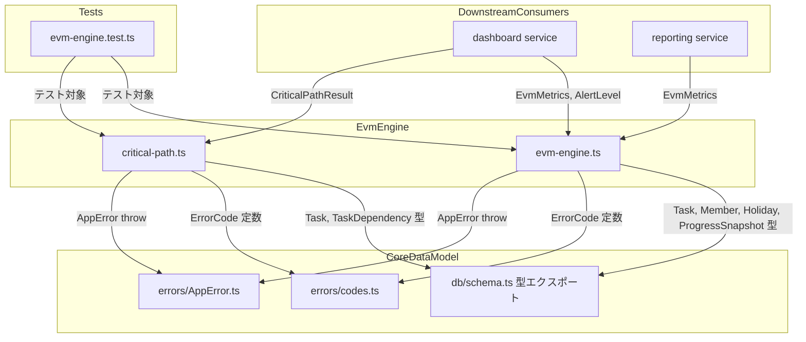
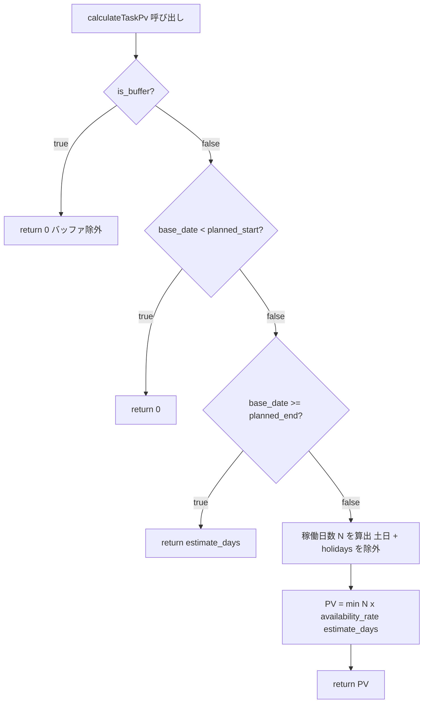
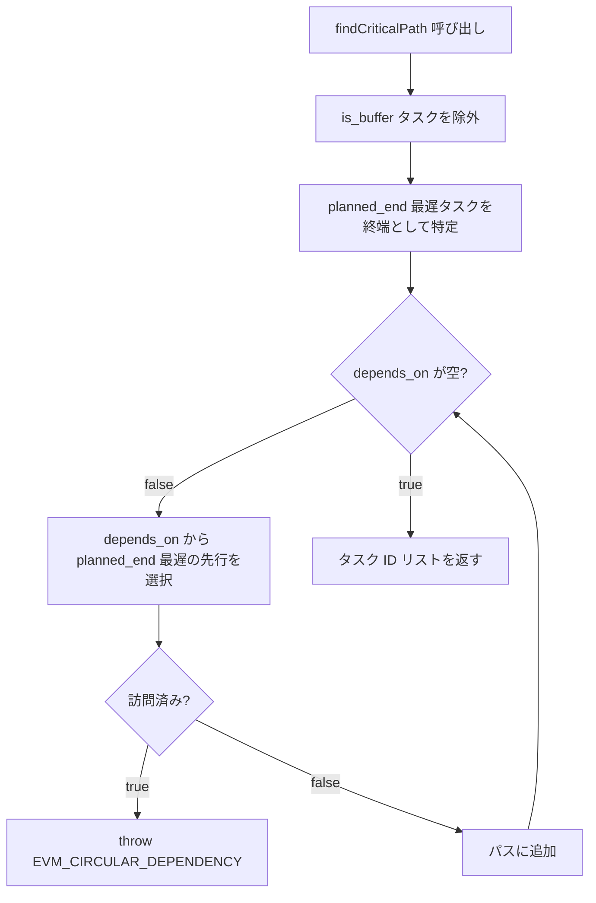

# 設計書: evm-engine

## 概要

本スペックは EVM Studio の計算コアとなる純粋関数ライブラリを確立する。PV/EV/AC/SPI/CPI/EAC/VAC/ETC/TCPI の全 EVM メトリクス計算、WBS-CMN-013 の fill-to-capacity PV モデル（稼働率×休日除外）、クリティカルパス算出（タスク依存グラフ逆追跡）、CCPM フィーバーチャートのバッファ消費率計算を提供する。

**目的**: downstream スペック（dashboard・reporting）が DB アクセスなしで EVM 計算を呼び出せる、副作用ゼロの純粋関数群を提供する。

**ユーザー**: dashboard スペックが SPI トレンドとアラート表示に使用し、reporting スペックが朝報データ生成に使用する。直接の人間ユーザーは存在せず、コンシューマーはサーバーサービス層のコードである。

**影響**: `evm-studio/server/src/services/` に `evm-engine.ts` と `critical-path.ts` を新規追加する。既存ファイルへの変更は `errors/codes.ts` への EVM エラーコード追加のみ。

### 目標

- WBS-CMN-013 準拠の fill-to-capacity PV モデルを正確に実装する
- 全 EVM 派生メトリクス（SPI/CPI/EAC/VAC/ETC/TCPI）をゼロ除算安全に実装する
- クリティカルパスをタスク依存グラフの逆追跡アルゴリズムで算出する
- CCPM フィーバーチャート用座標（バッファ消費率・チェーン完了率・ゾーン判定）を算出する
- 全関数を Vitest 4 の単体テストで境界値・エラーケース込みで検証する

### 非目標

- DB アクセス・tRPC ルーター（dashboard/reporting が担う）
- グラフ描画・UI コンポーネント（dashboard が担う）
- 進捗データの永続化（progress-tracking が担う）
- プロジェクト・タスクの CRUD（core-data-model が担う）
- xlsm インポート（将来対応）

---

## 境界コミットメント

### このスペックが所有するもの

- `server/src/services/evm-engine.ts` — 全 EVM 計算純粋関数（PV/EV/AC/SPI/CPI/EAC/VAC/ETC/TCPI・アラート評価）
- `server/src/services/critical-path.ts` — クリティカルパス算出純粋関数
- `server/src/services/evm-engine.test.ts` — 境界値・エラーケースの単体テスト（Vitest 4）
- `server/src/errors/codes.ts` への追加（`EVM_*` エラーコードの定義）— 既存ファイルへの追記

### 境界外（所有しない）

- DB アクセス・ORM クエリ（DrizzleSchema / DBClient は core-data-model が所有）
- tRPC プロシージャ定義（dashboard・reporting が所有）
- フロントエンドコンポーネント・グラフ描画
- `ProgressSnapshot` の日次 CRUD（progress-tracking が所有）

### 許可された依存関係

- `server/src/db/schema.ts` からの型インポート（`Task`, `Member`, `Holiday`, `ProgressSnapshot`）— 読み取り専用
- `server/src/errors/codes.ts` からの `ErrorCode` 定数インポート（`AppError` throw に使用）
- `server/src/errors/AppError.ts` からの `AppError` クラスインポート
- Node.js 組み込みモジュール（`Date` 等）— 日付計算に使用
- 外部ライブラリへの依存なし（pure TypeScript のみ）

### 再検証トリガー

以下の変更が発生した場合、本スペックは統合確認を実施すること:

- `Task` エンティティのカラム追加・型変更（`estimate_days`, `planned_start`, `planned_end`, `is_buffer`, `is_leaf` 等）
- `TaskDependency` テーブルの構造変更
- `ProgressSnapshot` テーブルのカラム変更（`progress_pct`, `pv_days`, `ev_days`, `ac_days`）
- `Member.availability_rate` の型・意味変更
- `Holiday.date` のフォーマット変更

downstream スペック（dashboard・reporting）は本スペックの以下が変更された場合に再確認が必要:

- `EvmMetrics`, `CriticalPathResult`, `FeverChartData` 型の変更
- エクスポート関数のシグネチャ変更

---

## アーキテクチャ

### アーキテクチャパターンとバウンダリマップ



依存方向: `errors/codes.ts` → `errors/AppError.ts` → `db/schema.ts` → `services/evm-engine.ts` / `services/critical-path.ts` → downstream consumers

### テクノロジースタック

| レイヤー | 選択/バージョン | 本フィーチャーでの役割 | 備考 |
|---------|--------------|---------------------|------|
| Backend | TypeScript 5 + Node.js 22 | 純粋関数の実装言語 | strict モード必須 |
| テスト | Vitest 4 | 境界値・エラーケースの単体テスト | `npm test` で実行 |
| 型参照 | core-data-model 型エクスポート | 入力データ型の定義 | 新規依存なし |

外部ライブラリへの依存は追加しない。日付計算は `Date` オブジェクトと手動ロジックのみで実装する。

---

## ファイル構成計画

### ディレクトリ構造

```
evm-studio/
└── server/
    └── src/
        ├── services/
        │   ├── evm-engine.ts          # 新規作成: PV/EV/AC/SPI等の全EVM計算純粋関数
        │   ├── critical-path.ts       # 新規作成: クリティカルパス算出純粋関数
        │   └── evm-engine.test.ts     # 新規作成: evm-engine + critical-path の単体テスト
        └── errors/
            └── codes.ts               # 変更: EVM_* エラーコードを追加
```

### 変更ファイル

- `evm-studio/server/src/errors/codes.ts` — `EVM_*` エラーコード（`EVM_INVALID_BASE_DATE`, `EVM_INVALID_AVAILABILITY_RATE`, `EVM_CIRCULAR_DEPENDENCY`）を既存の `ErrorCode` オブジェクトに追加

---

## システムフロー

### PV 計算フロー（fill-to-capacity モデル）



### クリティカルパス逆追跡フロー



---

## 要件トレーサビリティ

| 要件 | 概要 | コンポーネント | インターフェース |
|------|------|--------------|----------------|
| 1.1–1.6 | PV 計算（fill-to-capacity） | EvmEngine | `calculateTaskPv`, `calculateProjectPv` |
| 2.1–2.4 | EV・AC 計算 | EvmEngine | `calculateTaskEv`, `calculateProjectEv`, `calculateProjectAc` |
| 3.1–3.9 | 派生メトリクス（SPI/CPI/EAC等） | EvmEngine | `calculateEvmMetrics` |
| 4.1–4.5 | アラート評価 | EvmEngine | `evaluateAlertLevel` |
| 5.1–5.5 | クリティカルパス算出 | CriticalPath | `findCriticalPath` |
| 6.1–6.6 | CCPM バッファ・フィーバーチャート | EvmEngine | `calculateFeverChart` |
| 7.1–7.5 | 純粋関数設計・型安全性 | EvmEngine, CriticalPath | 全関数シグネチャ |
| 8.1–8.6 | 単体テスト | TestSuite | `evm-engine.test.ts` |

---

## コンポーネントとインターフェース

### コンポーネントサマリー

| コンポーネント | レイヤー | 目的 | 要件カバレッジ | 主要依存 | コントラクト |
|--------------|---------|------|--------------|---------|------------|
| EvmEngine | Service | 全 EVM 計算純粋関数群 | 1–4, 6, 7 | SchemaTypes, ErrorCodes, AppError | Service |
| CriticalPath | Service | クリティカルパス算出純粋関数 | 5, 7 | SchemaTypes, ErrorCodes, AppError | Service |
| TestSuite | Test | 境界値・エラーケース単体テスト | 8 | EvmEngine, CriticalPath | — |

---

### サービスレイヤー

#### EvmEngine

| フィールド | 詳細 |
|-----------|------|
| Intent | PV/EV/AC/SPI/CPI/EAC/VAC/ETC/TCPI・アラート・CCPM フィーバーチャートを計算する純粋関数群 |
| Requirements | 1.1–1.6, 2.1–2.4, 3.1–3.9, 4.1–4.5, 6.1–6.6, 7.1–7.5 |

**責任と制約**

- DB アクセス・I/O を一切行わない。引数のスナップショットデータのみを使用する
- `is_buffer = true` のタスクを PV・EV 累積から除外する
- 祝日（`Holiday[]`）を稼働日数算出から除外する
- ゼロ除算（PV=0, AC=0, BAC-AC=0）を `null` 返却で安全に処理する
- TypeScript strict モード準拠、`any` 型禁止

**依存関係**

- Inbound: dashboard service — EvmMetrics 取得 (P0)
- Inbound: reporting service — 朝報用 EvmMetrics 取得 (P1)
- Outbound: `db/schema.ts` — `Task`, `Member`, `Holiday`, `ProgressSnapshot` 型参照 (P0)
- Outbound: `errors/codes.ts` — `ErrorCode` 定数参照 (P0)
- Outbound: `errors/AppError.ts` — `AppError` throw (P0)

**コントラクト**: Service [x]

##### サービスインターフェース

```typescript
// server/src/services/evm-engine.ts

import type { Task, Member, Holiday, ProgressSnapshot } from '../db/schema'
import { AppError } from '../errors/AppError'
import { ErrorCode } from '../errors/codes'

// --- 入力型 ---

/** EVM 計算に必要なスナップショット入力 */
export interface EvmInput {
  tasks: Task[]
  members: Member[]                   // availability_rate 参照用
  holidays: Holiday[]                 // 稼働日計算の除外リスト
  snapshots: ProgressSnapshot[]       // progress_pct / ac_days を含む。pv_days・ev_days はリスケ保全済みの記録値（ダッシュボードの時系列 S カーブはこれを直接参照する）
  baseDate: string                    // 'YYYY-MM-DD' 形式
}

// --- 出力型 ---

export type AlertLevel = 'CRITICAL_DELAY' | 'WARNING_DELAY' | 'NORMAL' | 'OVERDUE' | 'NA'

/** タスク単位の EVM メトリクス */
export interface TaskEvmMetrics {
  taskId: number
  pv: number
  ev: number
  ac: number
  spi: number | null
  cpi: number | null
  alertLevel: AlertLevel
}

/** プロジェクト単位の EVM サマリー */
export interface ProjectEvmMetrics {
  bac: number
  pv: number
  ev: number
  ac: number
  spi: number | null
  cpi: number | null
  eac: number | null
  vac: number | null
  etc: number | null
  tcpi: number | null
  taskMetrics: TaskEvmMetrics[]
}

export type FeverChartZone = 'GREEN' | 'YELLOW' | 'RED'

/** CCPM フィーバーチャートデータ */
export interface FeverChartData {
  bufferConsumption: number        // バッファ消費率 (0.0–1.0+)
  criticalChainCompletion: number  // クリティカルチェーン完了率 (0.0–1.0)
  zone: FeverChartZone
}

// --- 公開関数 ---

/**
 * タスク単体の PV を算出する（fill-to-capacity モデル WBS-CMN-013）
 *
 * @param task - 対象タスク
 * @param baseDate - 基準日（'YYYY-MM-DD'）
 * @param availabilityRate - 担当者稼働率（0.0–1.0）
 * @param holidays - 除外する祝日リスト
 * @returns タスク PV（日数）
 * @throws AppError(EVM_INVALID_BASE_DATE) when baseDate is invalid format
 */
export function calculateTaskPv(
  task: Task,
  baseDate: string,
  availabilityRate: number,
  holidays: Holiday[],
): number

/**
 * プロジェクト全体の累積 PV を算出する（is_buffer タスク除外）
 */
export function calculateProjectPv(input: EvmInput): number

/**
 * タスク単体の EV を算出する
 * EV = estimate_days × (progress_pct / 100)
 */
export function calculateTaskEv(task: Task, progressPct: number): number

/**
 * プロジェクト全体の累積 EV を算出する（is_buffer タスク除外）
 */
export function calculateProjectEv(
  tasks: Task[],
  snapshots: ProgressSnapshot[],
): number

/**
 * プロジェクト全体の AC を算出する
 * AC = ProgressSnapshot.ac_days の合計
 */
export function calculateProjectAc(snapshots: ProgressSnapshot[]): number

/**
 * EVM 全メトリクスを一括算出する
 */
export function calculateEvmMetrics(input: EvmInput): ProjectEvmMetrics

/**
 * アラートレベルを評価する
 *
 * @param spi - SPI（null の場合は PV=0）
 * @param delayDays - 遅延日数
 * @param isOverdue - planned_end 超過かつ未完了
 */
export function evaluateAlertLevel(
  spi: number | null,
  delayDays: number,
  isOverdue: boolean,
): AlertLevel

/**
 * CCPM フィーバーチャートデータを算出する
 *
 * @param cumulativeDelayDays - クリティカルチェーンの累積遅延日数
 * @param bufferTotalDays - バッファ総日数
 * @param completedEvOnChain - チェーン上の完了 EV
 * @param bacOfChain - チェーンの BAC
 */
export function calculateFeverChart(
  cumulativeDelayDays: number,
  bufferTotalDays: number,
  completedEvOnChain: number,
  bacOfChain: number,
): FeverChartData

/**
 * planned_start から baseDate までの稼働日数を算出する
 * 土日・holidays を除外する
 * 内部ユーティリティ（テスト可能性のためエクスポート）
 */
export function countWorkingDays(
  plannedStart: string,
  baseDate: string,
  holidays: Holiday[],
): number
```

**実装ノート**

- `calculateTaskPv`: `baseDate < planned_start` → 0、`baseDate >= planned_end` → `estimate_days`、それ以外 → `min(N × availability_rate, estimate_days)`
- 稼働日数計算: 日付を `Date` オブジェクトに変換し、1日ずつインクリメントして土日・holidays を除外してカウント
- `availability_rate` は `Member` から参照するが、タスクに `assignee_id` がない場合は `1.0` をデフォルト値とする
- `is_buffer = true` のタスクはすべての累積計算（PV・EV）から除外する。ただし `calculateFeverChart` の入力は呼び出し側が適切に集計して渡す
- 日付フォーマット: 全日付は `'YYYY-MM-DD'` テキスト形式で受け取り、`Date` オブジェクト変換時は UTC ベースで処理する（ローカルタイムゾーンのズレを防ぐ）

---

#### CriticalPath

| フィールド | 詳細 |
|-----------|------|
| Intent | タスク依存グラフの逆追跡によりクリティカルパスを算出する純粋関数 |
| Requirements | 5.1–5.5, 7.1–7.5 |

**責任と制約**

- DB アクセス・I/O を行わない
- `is_buffer = true` のタスクをパス探索から除外する
- 循環依存を検出して `AppError(EVM_CIRCULAR_DEPENDENCY)` を throw する
- タスク ID の配列（起点→終端の順）としてクリティカルパスを返す

**依存関係**

- Inbound: dashboard service — CriticalPathResult 取得 (P1)
- Outbound: `db/schema.ts` — `Task`, `TaskDependency` 型参照 (P0)
- Outbound: `errors/codes.ts` — `ErrorCode` 定数参照 (P0)
- Outbound: `errors/AppError.ts` — `AppError` throw (P0)

**コントラクト**: Service [x]

##### サービスインターフェース

```typescript
// server/src/services/critical-path.ts

import type { Task, TaskDependency } from '../db/schema'
import { AppError } from '../errors/AppError'
import { ErrorCode } from '../errors/codes'

export interface CriticalPathInput {
  tasks: Task[]
  dependencies: TaskDependency[]
}

export interface CriticalPathResult {
  criticalPath: number[]     // タスク ID の配列（起点から終端の順）
  terminalTaskId: number     // 終端タスクの ID（planned_end 最遅）
}

/**
 * クリティカルパスを算出する（WBS-SCHEDULE-010）
 *
 * アルゴリズム:
 * 1. is_buffer=true タスクを除外
 * 2. planned_end 最遅のタスクを終端として特定
 * 3. depends_on を逆方向にたどり、各ステップで planned_end 最遅の先行を選択
 * 4. depends_on が空になるまで繰り返し、タスク ID 配列を返す
 *
 * @throws AppError(EVM_CIRCULAR_DEPENDENCY) when circular dependency detected
 */
export function findCriticalPath(input: CriticalPathInput): CriticalPathResult
```

**実装ノート**

- 終端タスク特定: `tasks.filter(t => !t.isBuffer).reduce(...)` で `plannedEnd` 最遅を取得
- 先行タスク選択: `dependencies.filter(d => d.taskId === currentId)` で現タスクの依存元を取得し、`plannedEnd` 最遅を選択
- 循環検出: 訪問済みタスク ID を `Set<number>` で追跡し、再訪問時に throw
- 結果は終端から起点方向に収集したのち `reverse()` して起点→終端の順にする

---

#### TestSuite（evm-engine.test.ts）

| フィールド | 詳細 |
|-----------|------|
| Intent | EvmEngine・CriticalPath の境界値・エラーケースを Vitest 4 で検証する |
| Requirements | 8.1–8.6 |

**テスト項目**

| グループ | テストケース | 要件 |
|---------|------------|------|
| PV 計算 | 基準日 < 開始日 → 0 | 1.1 |
| PV 計算 | 基準日 = 開始日 → 0 or 1日分 | 1.3 |
| PV 計算 | 基準日 >= 終了日 → estimate_days | 1.2 |
| PV 計算 | 祝日ありvs祝日なし → 差異確認 | 1.4 |
| PV 計算 | is_buffer=true タスク除外 | 1.5 |
| PV 計算 | availability_rate=0.6 でのキャップ動作 | 1.3 |
| EV 計算 | progress_pct=0 → 0 | 2.1 |
| EV 計算 | progress_pct=100 → estimate_days | 2.1 |
| EV 計算 | is_buffer=true タスク除外 | 2.3 |
| SPI/CPI | PV=0 → null | 3.2 |
| SPI/CPI | AC=0 → null | 3.4 |
| SPI/CPI | 正常値計算の精度 | 3.1, 3.3 |
| EAC/VAC/ETC/TCPI | 通常値計算 | 3.5–3.9 |
| TCPI | BAC-AC=0 → null | 3.9 |
| アラート | SPI<0.8 → CRITICAL_DELAY | 4.1 |
| アラート | delayDays>5 → CRITICAL_DELAY | 4.1 |
| アラート | 0.8≤SPI<0.9 → WARNING_DELAY | 4.2 |
| アラート | SPI≥0.9 → NORMAL | 4.3 |
| アラート | planned_end 超過・未完了 → OVERDUE | 4.4 |
| アラート | SPI=null → NA | 4.5 |
| クリティカルパス | 正常系（3タスク直列）| 5.1–5.3 |
| クリティカルパス | is_buffer タスク除外 | 5.4 |
| クリティカルパス | 循環依存 → EVM_CIRCULAR_DEPENDENCY | 5.5 |
| フィーバーチャート | GREEN ゾーン判定 | 6.3 |
| フィーバーチャート | YELLOW ゾーン判定 | 6.4 |
| フィーバーチャート | RED ゾーン判定 | 6.5 |

---

## データモデル

本スペックは新規データモデルを定義しない。core-data-model が定義する以下の型を読み取り専用で使用する。

### 入力型（core-data-model からインポート）

| 型 | 参照フィールド | 用途 |
|---|-------------|------|
| `Task` | `id`, `estimateDays`, `plannedStart`, `plannedEnd`, `assigneeId`, `isBuffer`, `isLeaf` | PV/EV 計算・クリティカルパス |
| `Member` | `id`, `availabilityRate` | PV 計算の稼働率参照 |
| `Holiday` | `date` | 稼働日数計算からの除外 |
| `ProgressSnapshot` | `taskId`, `progressPct`, `pvDays`, `evDays`, `acDays` | EV・AC 計算、S カーブ時系列参照 |
| `TaskDependency` | `taskId`, `dependsOnTaskId` | クリティカルパス依存グラフ構築 |

### 出力型（本スペックが定義）

`ProjectEvmMetrics`, `TaskEvmMetrics`, `FeverChartData`, `CriticalPathResult` は `evm-engine.ts` / `critical-path.ts` でエクスポートし、downstream スペックが参照する。

---

## エラーハンドリング

### エラー戦略

本スペックの関数は副作用なしのため、外部 I/O エラーは発生しない。発生しうるエラーは入力データの検証失敗のみ。

### エラーカテゴリとレスポンス

| エラーコード | 条件 | 対応 |
|------------|------|------|
| `EVM_INVALID_BASE_DATE` | 日付フォーマット不正 | `AppError` throw |
| `EVM_INVALID_AVAILABILITY_RATE` | `availability_rate` が 0–1 の範囲外 | `AppError` throw |
| `EVM_CIRCULAR_DEPENDENCY` | タスク依存グラフに循環が検出された | `AppError` throw |

`AppError` は `server/src/errors/AppError.ts` で定義済みのクラスを使用する。エラーコードは `server/src/errors/codes.ts` に追加する。

```typescript
// server/src/errors/codes.ts への追加
export const ErrorCode = {
  // ... 既存コード ...
  // EVM
  EVM_INVALID_BASE_DATE:          'EVM_INVALID_BASE_DATE',
  EVM_INVALID_AVAILABILITY_RATE:  'EVM_INVALID_AVAILABILITY_RATE',
  EVM_CIRCULAR_DEPENDENCY:        'EVM_CIRCULAR_DEPENDENCY',
} as const
```

ゼロ除算（SPI の PV=0、CPI の AC=0、TCPI の BAC-AC=0）はエラーではなく `null` 返却で表現する（要件 3.2, 3.4, 3.9）。

---

## テスト戦略

### 単体テスト（Vitest 4）— 必須

`server/src/services/evm-engine.test.ts` に以下をカバーする:

- **PV 境界値テスト**: 基準日の 3 ケース（before/during/after planned period）+ 稼働率キャップ + 祝日除外 + is_buffer 除外
- **EV/AC テスト**: progress_pct 0/50/100、is_buffer 除外、ac_days 合計
- **派生メトリクステスト**: SPI/CPI の null ケース、EAC/VAC/ETC/TCPI の通常値と境界値
- **アラートテスト**: 5 レベル全分岐（CRITICAL_DELAY/WARNING_DELAY/NORMAL/OVERDUE/NA）
- **クリティカルパステスト**: 正常系（複数経路から最長選択）+ is_buffer 除外 + 循環依存エラー
- **フィーバーチャートテスト**: GREEN/YELLOW/RED ゾーン境界値

テスト実行コマンド: `npm test`（`evm-studio/` 配下から）

### E2E テスト

本スペックは純粋関数のみのため E2E テスト対象外とする。E2E は dashboard/reporting スペックが担う。
