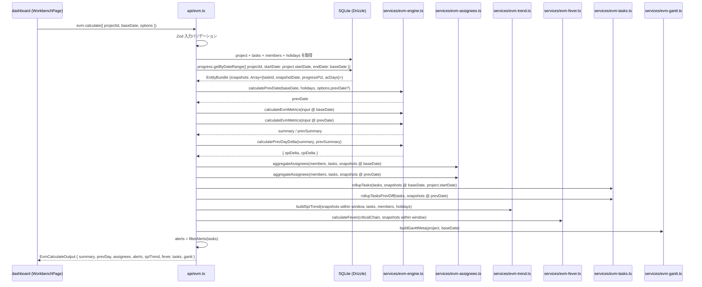
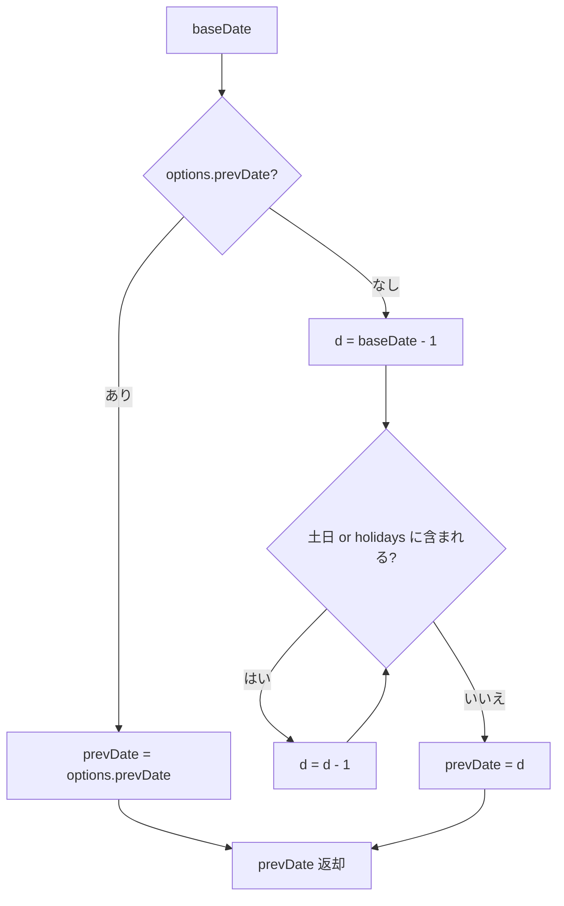
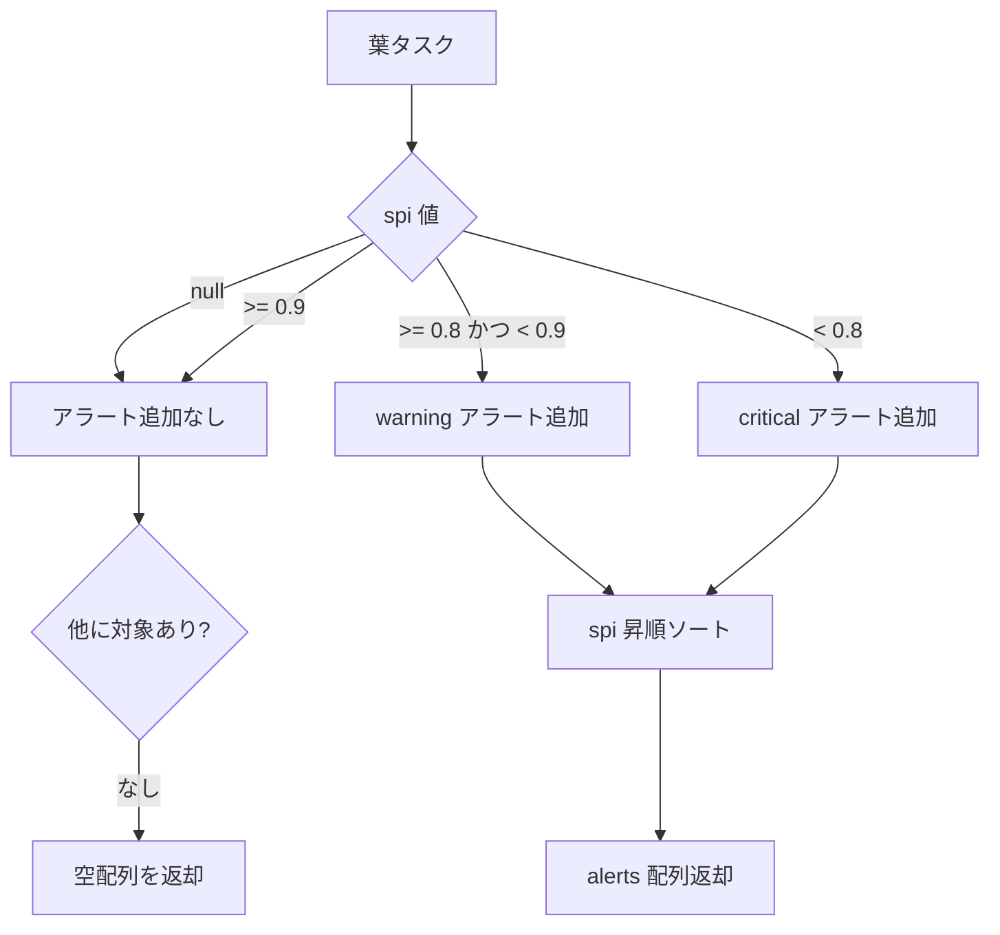
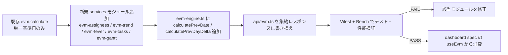

# 設計書

## Overview

**Purpose**: dashboard の `WorkbenchPage` がモックアップ `mockup/variation-a.jsx` の全領域（SummaryStrip 前日比トグル / AlertStrip / GanttChart / SpiTrendChart / FeverChart / Inspector の 3 モード）を 1 リクエストで描画できるようにするため、`evm.calculate(projectId, baseDate, options?)` を「`summary` / `prevDay` / `assignees` / `alerts` / `spiTrend` / `fever` / `tasks` / `gantt` を一括で返す集約 API」として再定義する。計算ロジックは `server/src/services/evm-engine.ts` および新規 `evm-assignees.ts` / `evm-trend.ts` 等の純粋関数モジュールに集約し、I/O は tRPC ルーターのみが担う。

**Users**: dashboard 実装者・将来の reporting 実装者が直接の利用者である。エンドユーザー（プロジェクトマネージャー）は dashboard 経由で間接利用する。

**Impact**: 既存の `evm.calculate` を拡張し、レスポンス型を `EvmCalculateOutput` として定義し直す。`services/evm-engine.ts` の関数群は基本シグネチャを保ちつつ、prevDay・assignees・trend・fever.trail・gantt メタデータの生成関数を追加する。クライアント側 `dashboard` は本レスポンスを丸ごと消費する前提で実装される。

### Goals

- `evm.calculate` を単一基準日と前日（任意 `prevDate`）の EVM データを一括返却する集約 API として確立する。
- 計算ロジックを純粋関数のみで構成し、DB I/O は tRPC ルーター層に隔離する（決定論性とテスト容易性の確保）。
- 前日比（`spiDelta` / `cpiDelta`）と前日比較データ（`prevDay.summary` / `prevDay.assignees` / `prevDay.tasks`）を `baseDate - 任意日数` で算出可能にする。
- 担当者別 EVM・アラート・SPI トレンド・CCPM フィーバーチャート・ガントメタデータをモックアップ `mockup/projects-data.jsx` の `PROJECT_DATA` と同等の形状で提供する。
- 100 タスク規模で 200ms 以内のレスポンスを担保する（DB I/O 1 度 + 純粋関数 N 回）。

### Non-Goals

- SQLite スキーマ・Drizzle テーブル定義の変更（→ `core-data-model`）。
- `ProgressSnapshot` の書き込み・進捗入力 UI（→ `progress-tracking`）。
- ダッシュボード UI コンポーネント・SVG 描画・Inspector 実装（→ `dashboard`）。
- WBS YAML インポートロジック・xlsm インポート（→ `core-data-model` / 将来対応）。
- マルチプロジェクト横断集計・組織レベル KPI（本リリース対象外）。

## Boundary Commitments

### This Spec Owns

- `server/src/services/evm-engine.ts` — PV/EV/AC/SPI/CPI/EAC/VAC/ETC/TCPI 計算純粋関数、`calculateTaskPv` / `calculateProjectPv` / `calculateEvmMetrics` / `countWorkingDays` / `calculatePrevDate` / `calculatePrevDayDelta` 等。
- `server/src/services/evm-assignees.ts`（新規） — 担当者別 EVM 集計と status 判定の純粋関数。
- `server/src/services/evm-trend.ts`（新規） — `spiTrend` 配列生成の純粋関数。
- `server/src/services/evm-fever.ts`（新規。既存 `calculateFeverChart` を分離） — フィーバーチャート計算と `trail` 生成。
- `server/src/services/evm-tasks.ts`（新規） — タスク別 EVM データの集計・親子ロールアップ・WBS ソート。
- `server/src/services/evm-gantt.ts`（新規） — ガントメタデータ（`startISO` / `endISO` / `totalDays` / `baseDay` / `months`）の生成。
- `server/src/services/critical-path.ts` — クリティカルパス算出純粋関数（既存）。
- `server/src/api/evm.ts` — tRPC `evm.calculate` ルーター。Zod 入力スキーマと `EvmCalculateOutput` 出力型のエクスポート。
- `server/src/services/__tests__/evm-engine.test.ts` ほか各純粋関数のテスト。
- `server/src/errors/codes.ts` への `EVM_*` エラーコード追加。

### Out of Boundary

- `db/schema.ts` の変更（テーブル定義は `core-data-model` が所有）。
- `ProgressSnapshot` の書き込み API・スナップショット日付の解決ロジック（`progress-tracking` が所有）。
- フロントエンドの SVG コンポーネント・チャート描画（`dashboard` が所有）。
- WBS Importer の YAML パース（`core-data-model` が所有）。

### Allowed Dependencies

- Drizzle ORM 0.45 の推論型 `Project` / `Task` / `Member` / `Holiday` / `ProgressSnapshot` / `TaskDependency`（読み取り専用インポート）。
- `server/src/db/index.ts` の DB クライアント（tRPC ルーター層のみで使用、`services/` 配下では使用禁止）。
- `server/src/errors/codes.ts` の `ErrorCode` 定数と `server/src/errors/AppError.ts` の `AppError` クラス。
- `server/src/lib/working-days.ts`（既存。なければ `evm-engine.ts` 内に `countWorkingDays` を保持）。
- tRPC 11・Zod 4・TypeScript 5 strict モード。
- Node.js 22 LTS の組み込み `Date`（タイムゾーン回避のため UTC ベースで扱う）。

### Revalidation Triggers

- `Task` / `Member` / `ProgressSnapshot` / `Holiday` / `TaskDependency` のフィールド追加・型変更（特に `estimateDays` / `availabilityRate` / `progressPct` / `acDays`）。
- 前日比の定義変更（営業日繰り上がりルール、`prevDate` の意味）。
- `evm.calculate` の入力 Zod スキーマ・出力型シグネチャ変更（dashboard 側の TypeScript コードが再ビルド対象）。
- SPI/CPI 閾値（critical / warning）の変更（domain.md 更新要）。
- フィーバーチャートゾーン判定式の変更（domain.md 更新要）。
- `progress-tracking` が提供する範囲スナップショット取得 API `progress.getByDateRange({ projectId, startDate, endDate })` のシグネチャ変更。

## Architecture

### Existing Architecture Analysis

EVM Studio は次の構造を持つ既存実装が稼働している。

- `evm-studio/server/src/services/evm-engine.ts` に `calculateTaskPv` / `calculateProjectPv` / `calculateEvmMetrics` / `calculateFeverChart` / `countWorkingDays` が存在。`Member.availabilityRate` と `Holiday[]` を引数として受け取り、副作用なく動作する純粋関数として実装済み。
- `evm-studio/server/src/services/critical-path.ts` がトポロジカルソートによるクリティカルチェーン特定を提供。
- `evm-studio/server/src/api/evm.ts` の `evm.calculate` は単一基準日の集計を返すが、`prevDay` / `assignees.status` / `spiTrend` / `fever.trail` / `tasks` の WBS ロールアップ / `gantt` メタデータが未統合。
- `core-data-model` により `projects.status` / `code` / `members.role` / `initials` が追加され、`progress-tracking` で `ProgressSnapshot` の範囲取得 API が整備される予定。
- `errors/codes.ts` に既存の `ErrorCode` 定数とドメインプレフィックス規約（`EVM_*` / `PROJ_*` / `TASK_*`）が存在。

本スペックでは既存の純粋関数を再利用しつつ、集約モジュール（`evm-assignees.ts` / `evm-trend.ts` / `evm-fever.ts` / `evm-tasks.ts` / `evm-gantt.ts`）を新設し、tRPC ルーター層で 1 回の DB I/O + 純粋関数群の呼び出しに集約する。

### Architecture Pattern & Boundary Map

```mermaid
flowchart LR
  subgraph Client [client (dashboard)]
    Workbench[WorkbenchPage / useEvm]
  end

  subgraph API [server/src/api]
    EvmRouter[evm.ts<br/>evm.calculate ルーター]
  end

  subgraph Services [server/src/services 純粋関数]
    Engine[evm-engine.ts<br/>core メトリクス計算]
    Assignees[evm-assignees.ts<br/>担当者別集計]
    Trend[evm-trend.ts<br/>spiTrend 配列生成]
    Fever[evm-fever.ts<br/>fever + trail]
    Tasks[evm-tasks.ts<br/>WBS ロールアップ]
    Gantt[evm-gantt.ts<br/>gantt メタデータ]
    CriticalPath[critical-path.ts<br/>クリティカルチェーン]
  end

  subgraph Data [server/src/db]
    Schema[schema.ts<br/>Drizzle 型エクスポート]
    DBClient[index.ts<br/>better-sqlite3 + Drizzle]
  end

  subgraph Errors [server/src/errors]
    Codes[codes.ts<br/>ErrorCode 定数]
    AppErrCls[AppError.ts]
  end

  Workbench -->|tRPC| EvmRouter
  EvmRouter -->|1度の I/O| DBClient
  EvmRouter -->|呼び出し| Engine
  EvmRouter -->|呼び出し| Assignees
  EvmRouter -->|呼び出し| Trend
  EvmRouter -->|呼び出し| Fever
  EvmRouter -->|呼び出し| Tasks
  EvmRouter -->|呼び出し| Gantt
  Fever -->|参照| CriticalPath
  Engine -.型参照.-> Schema
  Assignees -.型参照.-> Schema
  Trend -.型参照.-> Schema
  Fever -.型参照.-> Schema
  Tasks -.型参照.-> Schema
  Gantt -.型参照.-> Schema
  Engine -.エラー.-> Codes
  Engine -.エラー.-> AppErrCls
```

**Architecture Integration**:

- **Selected pattern**: 「Thin tRPC Router + Pure Service Functions」。tRPC ルーター層が DB I/O とエラーマッピングを担当し、`services/` 配下は完全に純粋関数として保つ。
- **Domain/feature boundaries**: コア計算（PV/EV/AC/派生指標）・担当者集計・トレンド・フィーバー・タスクロールアップ・ガントメタを別ファイルに分離し、各々を独立してテスト可能にする。
- **Existing patterns preserved**: `services/` 純粋関数原則、`ErrorCode` 定数経由のエラー、Drizzle 推論型 → tRPC 出力型の流し方、Zod 入力バリデーション。
- **New components rationale**: モックアップ `mockup/projects-data.jsx` の `PROJECT_DATA` 構造が大きいため、関心ごとにモジュールを分離（assignees / trend / fever / tasks / gantt）。各モジュールは 200 行未満のテスタブルサイズに収める。
- **Steering compliance**: TypeScript strict・`any` 禁止・純粋関数・エラーコード集中管理・pino 構造化ログ（tRPC 層のみで使用）。

### Technology Stack

| Layer | Choice / Version | Role in Feature | Notes |
|-------|------------------|-----------------|-------|
| Frontend / CLI | — | 直接的な UI 変更なし。出力型 `EvmCalculateOutput` を dashboard が型補完で消費 | `dashboard` spec で実装 |
| Backend / Services | Hono 4.12 + tRPC 11 + Zod 4 | `evm.calculate` ルーター・入力バリデーション・型エクスポート | 既存ルーター拡張 |
| Backend / Pure Logic | TypeScript 5 strict + Node 22 | 純粋関数群（services/evm-*.ts） | 外部ライブラリへの追加依存なし |
| Data / Storage | SQLite (better-sqlite3 12) + Drizzle ORM 0.45 | tRPC ルーターから 1 回の範囲取得 | 純粋関数からは型のみ参照 |
| Test | Vitest 4 | 境界値テスト + 集約 API の統合テスト | `npm test` で実行 |
| Logging | pino 10 | tRPC ルーター層でのみ使用 | 純粋関数からは使用しない |

## File Structure Plan

### Directory Structure

```
evm-studio/server/src/
├── api/
│   └── evm.ts                                 # 修正: evm.calculate を集約レスポンス対応に拡張
├── services/
│   ├── evm-engine.ts                          # 修正: core メトリクス + countWorkingDays + calculatePrevDate + calculatePrevDayDelta
│   ├── evm-engine.test.ts                     # 修正: core メトリクスの境界値テスト
│   ├── evm-assignees.ts                       # 新規: 担当者別 EVM 集計純粋関数
│   ├── evm-assignees.test.ts                  # 新規: assignees 集計のテスト
│   ├── evm-trend.ts                           # 新規: spiTrend 配列生成
│   ├── evm-trend.test.ts                      # 新規: spiTrend のテスト
│   ├── evm-fever.ts                           # 新規: fever + trail 計算（旧 calculateFeverChart の責務を分離）
│   ├── evm-fever.test.ts                      # 新規: fever ゾーン判定のテスト
│   ├── evm-tasks.ts                           # 新規: WBS ツリーロールアップ + タスク別 EVM データ生成
│   ├── evm-tasks.test.ts                      # 新規: タスクロールアップ / WBS ソートのテスト
│   ├── evm-gantt.ts                           # 新規: ガントメタデータ生成
│   ├── evm-gantt.test.ts                      # 新規: gantt months 生成のテスト
│   ├── critical-path.ts                       # 既存: クリティカルチェーン特定（fever から呼び出し）
│   └── critical-path.test.ts                  # 既存
├── api/
│   └── evm.test.ts                            # 新規: evm.calculate の統合テスト（PROJECT_DATA[0] 相当）
├── errors/
│   └── codes.ts                               # 修正: EVM_INVALID_BASE_DATE / EVM_INVALID_AVAILABILITY_RATE / EVM_CIRCULAR_DEPENDENCY を維持
└── db/
    └── schema.ts                              # 参照のみ。変更しない
```

### Modified Files

- `evm-studio/server/src/api/evm.ts` — `evm.calculate` を `EvmCalculateOutput` 型のオブジェクトを返却する集約 API に拡張。入力に `options.prevDate` / `options.trendWindowDays` を追加。
- `evm-studio/server/src/services/evm-engine.ts` — `calculatePrevDate(baseDate, holidays)` と `calculatePrevDayDelta(current, previous)` を追加。既存 `calculateEvmMetrics` を WBS ロールアップ用にリファクタ（タスク別結果も返せるよう拡張）。
- `evm-studio/server/src/errors/codes.ts` — 既存の `EVM_*` 定数を維持（不足があれば追加）。

> 新規モジュールは責務単位で 200 行以下を目安にし、テストファイルを 1:1 で配置する。

## System Flows

### evm.calculate 呼び出しシーケンス



非同期 / リトライは発生しない。すべて同期的に純粋関数を組み合わせて構築する。

### prevDate 決定フロー



> **prevDate のスコープに関する設計上の重要事項**: `prevDate` は `services/evm-engine.ts` の `calculatePrevDate(baseDate, holidays, override?)` によってサーバー内部で決定される **INTERNAL な計算値** である。`api/evm.ts` の `evm.calculate` 入力では `options.prevDate` 経由でクライアントが override を渡すことを許容するが（テスト用途・"任意日比較"用途）、デフォルトの計算ロジックはサーバー側に閉じる。算出された `prevDate` 文字列は `EvmCalculateOutput` のいかなるフィールドにもシリアライズされない（UI には `prevDay.summary` / `prevDay.assignees` / `prevDay.tasks` の値のみを返却し、参照日付そのものは露出しない）。これにより、UI 層が前日決定ロジックを再実装したり、参照日付の文字列に依存したりすることを防ぐ。

### アラート判定フロー（葉タスク単位）



## Requirements Traceability

| Requirement | Summary | Components | Interfaces | Flows |
|-------------|---------|------------|------------|-------|
| 1.1-1.10 | コア EVM メトリクス算出 | `evm-engine.ts` | `calculateEvmMetrics` | evm.calculate シーケンス |
| 2.1-2.8 | prevDay 計算 | `evm-engine.ts`, `api/evm.ts` | `calculatePrevDate`, `calculatePrevDayDelta`, `EvmCalculateInput.options.prevDate` | prevDate 決定フロー |
| 3.1-3.10 | 担当者別 EVM | `evm-assignees.ts` | `aggregateAssignees` | evm.calculate シーケンス |
| 4.1-4.6 | アラート判定 | `api/evm.ts`, `evm-tasks.ts` | `filterAlerts` | アラート判定フロー |
| 5.1-5.6 | SPI/CPI 時系列 | `evm-trend.ts` | `buildSpiTrend` | evm.calculate シーケンス |
| 6.1-6.6 | CCPM フィーバー | `evm-fever.ts`, `critical-path.ts` | `calculateFever` | evm.calculate シーケンス |
| 7.1-7.7 | タスク別 EVM | `evm-tasks.ts` | `rollupTasks`, `rollupTasksPrevDiff` | evm.calculate シーケンス |
| 8.1-8.6 | ガントメタデータ | `evm-gantt.ts` | `buildGanttMeta` | evm.calculate シーケンス |
| 9.1-9.6 | tRPC 入出力契約 | `api/evm.ts` | Zod `evmCalculateSchema`, `EvmCalculateOutput` | evm.calculate シーケンス |
| 10.1-10.5 | 純粋性・決定論性 | `services/evm-*.ts` 全モジュール | — | — |
| 11.1-11.5 | エラー処理 | `errors/codes.ts`, `evm-engine.ts`, `api/evm.ts` | `AppError`, `TRPCError` 変換 | — |
| 12.1-12.3 | パフォーマンス | `api/evm.ts` | 1 度の範囲 I/O | evm.calculate シーケンス |
| 13.1-13.7 | テストカバレッジ | `services/*.test.ts`, `api/evm.test.ts` | Vitest 4 | — |

## Components and Interfaces

### サマリー

| Component | Domain/Layer | Intent | Req Coverage | Key Dependencies (P0/P1) | Contracts |
|-----------|--------------|--------|--------------|--------------------------|-----------|
| `services/evm-engine.ts` | Services | コア EVM メトリクス・PV 計算・prevDate 決定 | 1.1-1.10, 2.1-2.8, 11.1-11.4 | Drizzle 型 (P0), `errors/codes.ts` (P0) | Service |
| `services/evm-assignees.ts` | Services | 担当者別 EVM 集計と status 判定 | 3.1-3.10 | `evm-engine.ts` (P0), Drizzle 型 (P0) | Service |
| `services/evm-trend.ts` | Services | spiTrend 配列生成 | 5.1-5.6 | `evm-engine.ts` (P0), Drizzle 型 (P0) | Service |
| `services/evm-fever.ts` | Services | CCPM フィーバー計算・trail 生成 | 6.1-6.6 | `critical-path.ts` (P0), Drizzle 型 (P0) | Service |
| `services/evm-tasks.ts` | Services | WBS ツリーロールアップとタスク別 EVM | 4.1-4.6, 7.1-7.7 | `evm-engine.ts` (P0), Drizzle 型 (P0) | Service |
| `services/evm-gantt.ts` | Services | ガントメタデータ生成 | 8.1-8.6 | Drizzle 型 (P0) | Service |
| `services/critical-path.ts` | Services | クリティカルチェーン特定 | 6.1-6.6, 11.3 | Drizzle 型 (P0) | Service |
| `api/evm.ts` | API | `evm.calculate` ルーターと型エクスポート | 9.1-9.6, 12.1-12.3 | Zod 4 (P0), Drizzle DB クライアント (P0), 各 services モジュール (P0) | API |
| `errors/codes.ts` | Errors | `EVM_*` エラーコード集中管理 | 11.1-11.5 | — | State |
| `services/*.test.ts`, `api/evm.test.ts` | Tests | 境界値テスト + 統合テスト | 13.1-13.7 | Vitest 4 (P0) | Service |

### Services Layer

#### `services/evm-engine.ts`

| Field | Detail |
|-------|--------|
| Intent | コア EVM メトリクス・PV 計算・前日決定・差分計算の純粋関数 |
| Requirements | 1.1-1.10, 2.1-2.8, 11.1-11.4 |

**Responsibilities & Constraints**

- 純粋関数で実装。DB アクセス禁止・グローバル変数禁止・乱数禁止・現在時刻禁止。
- `Date` の可変メソッドを入力配列要素に対して呼ばず、新しい `Date` インスタンスを生成して扱う。
- `countWorkingDays(start, end, holidays)`、`calculateTaskPv(task, baseDate, availabilityRate, holidays)`、`calculateProjectPv(input)`、`calculateProjectEv(tasks, snapshots)`、`calculateProjectAc(snapshots)`、`calculateEvmMetrics(input)` を提供する。
- 新規: `calculatePrevDate(baseDate, holidays, override?)` で前営業日（または override）を返す。
- 新規: `calculatePrevDayDelta(summary, prevSummary)` で `{ spiDelta, cpiDelta }` を算出（`null` は `0` に置換）。
- 入力検証: `baseDate` 不正 → `AppError(EVM_INVALID_BASE_DATE)`、`availabilityRate` 範囲外 → `AppError(EVM_INVALID_AVAILABILITY_RATE)`。

**Dependencies**

- Inbound: `api/evm.ts`、`evm-assignees.ts`、`evm-trend.ts`、`evm-tasks.ts` (P0)
- Outbound: `db/schema.ts` 型エクスポート (P0)、`errors/codes.ts` (P0)、`errors/AppError.ts` (P0)
- External: なし

**Contracts**: Service

##### Service Interface

```typescript
export type EvmInput = {
  baseDate: string                     // 'YYYY-MM-DD'
  project: Pick<Project, 'startDate' | 'endDate'>
  tasks: ReadonlyArray<Task>
  members: ReadonlyArray<Member>
  holidays: ReadonlyArray<Holiday>
  snapshots: ReadonlyArray<ProgressSnapshot>   // baseDate 以前 (taskId, snapshotDate, progressPct, acDays)
}

export type EvmSummary = {
  bac: number
  pv: number
  ev: number
  ac: number
  spi: number | null
  cpi: number | null
  eac: number | null
  vac: number | null
  etc: number | null
  tcpi: number | null
}

export type EvmSummaryWithDelta = EvmSummary & {
  spiDelta: number
  cpiDelta: number
}

export function calculateEvmMetrics(input: EvmInput): EvmSummary
export function calculatePrevDate(
  baseDate: string,
  holidays: ReadonlyArray<Holiday>,
  override?: string,
): string
export function calculatePrevDayDelta(
  current: EvmSummary,
  previous: EvmSummary | null,
): { spiDelta: number; cpiDelta: number }
```

- Preconditions: `baseDate` は `YYYY-MM-DD`。`members[].availabilityRate` は `[0, 1]`。
- Postconditions: 同一入力で同一出力。`pv = 0` 時 `spi = null`、`ac = 0` 時 `cpi = null`、`bac - ac = 0` 時 `tcpi = null`。
- Invariants: 純粋関数。副作用ゼロ。

#### `services/evm-assignees.ts`（新規）

| Field | Detail |
|-------|--------|
| Intent | 担当者別 EVM 集計と status 判定 |
| Requirements | 3.1-3.10 |

**Responsibilities & Constraints**

- メンバーごとに担当タスクをグループ化し、`bac` / `ev` / `pv` / `ac` を合計。
- `availabilityRate` はメンバーごとに採用。PV 計算は `evm-engine.ts` の `calculateTaskPv` を呼び出す。
- `spi` / `cpi` は分母 `0` の場合 `null`。`status` は SPI 閾値で `'critical'` / `'warning'` / `'normal'` を返す（`null` は `'normal'`）。
- N+1 禁止: 入力 `snapshots` は呼び出し側で `baseDate` 以前に絞り込んだ範囲取得結果を渡す前提とする。

**Dependencies**

- Inbound: `api/evm.ts` (P0)
- Outbound: `evm-engine.ts`（`calculateTaskPv`）(P0)、Drizzle 型 (P0)

**Contracts**: Service

##### Service Interface

```typescript
export type AssigneeEvm = {
  id: number
  name: string
  bac: number
  ev: number
  pv: number
  ac: number
  spi: number | null
  cpi: number | null
  status: 'normal' | 'warning' | 'critical'
}

export type AssigneePrevDay = {
  id: number
  ev: number
  pv: number
  ac: number
  spi: number | null
  cpi: number | null
}

export function aggregateAssignees(args: {
  baseDate: string
  members: ReadonlyArray<Member>
  tasks: ReadonlyArray<Task>
  snapshots: ReadonlyArray<ProgressSnapshot>
  holidays: ReadonlyArray<Holiday>
}): AssigneeEvm[]

export function aggregateAssigneesAt(args: {
  baseDate: string
  members: ReadonlyArray<Member>
  tasks: ReadonlyArray<Task>
  snapshots: ReadonlyArray<ProgressSnapshot>
  holidays: ReadonlyArray<Holiday>
}): AssigneePrevDay[]
```

- Preconditions: `snapshots` は当該 `baseDate` 以前のもののみ。
- Postconditions: メンバー数と同じ長さの配列を返す。`status` は `spi` の評価結果に整合。

#### `services/evm-trend.ts`（新規）

| Field | Detail |
|-------|--------|
| Intent | SPI/CPI 時系列ポイント配列の生成 |
| Requirements | 5.1-5.6 |

**Responsibilities & Constraints**

- スナップショット日付の集合 `D = unique(snapshots.snapshotDate)` を昇順で並べる。
- 各 `d ∈ D` で `calculateEvmMetrics({ baseDate: d, ... })` を実行し、`{ d: 'MM-DD', spi, cpi }` を生成。
- `options.trendWindowDays` で範囲を絞る。指定なしは `Project.startDate ～ baseDate` 全期間。
- 0 件のときは `[]` を返却。

**Dependencies**

- Inbound: `api/evm.ts` (P0)
- Outbound: `evm-engine.ts`（`calculateEvmMetrics`）(P0)、Drizzle 型 (P0)

**Contracts**: Service

##### Service Interface

```typescript
export type TrendPoint = { d: string; spi: number | null; cpi: number | null }

export function buildSpiTrend(args: {
  baseDate: string
  trendWindowDays?: number
  project: Pick<Project, 'startDate'>
  tasks: ReadonlyArray<Task>
  members: ReadonlyArray<Member>
  holidays: ReadonlyArray<Holiday>
  snapshots: ReadonlyArray<ProgressSnapshot>
}): TrendPoint[]
```

#### `services/evm-fever.ts`（新規）

| Field | Detail |
|-------|--------|
| Intent | CCPM フィーバーチャート（消費率 / 完了率 / ゾーン / trail） |
| Requirements | 6.1-6.6 |

**Responsibilities & Constraints**

- `critical-path.ts` でクリティカルチェーン上のタスクとバッファ総日数を特定。
- バッファ非存在時は `null` を返却。
- ゾーン判定式: `consumption < completion * 0.67` → GREEN、 `< completion * 1.0` → YELLOW、それ以上 → RED。
- `bufferTotalDays === 0` または `bacOfChain === 0` のとき消費率・完了率を `0` として扱う（ゼロ除算回避）。
- `trail` は過去スナップショット日付ごとに `(criticalChainCompletion, bufferConsumption)` を時系列順に格納。

**Dependencies**

- Inbound: `api/evm.ts` (P0)
- Outbound: `critical-path.ts` (P0)、`evm-engine.ts` (P0)、Drizzle 型 (P0)

**Contracts**: Service

##### Service Interface

```typescript
export type FeverData = {
  bufferConsumption: number
  criticalChainCompletion: number
  zone: 'GREEN' | 'YELLOW' | 'RED'
  trail: ReadonlyArray<{ x: number; y: number }>
} | null

export function calculateFever(args: {
  baseDate: string
  tasks: ReadonlyArray<Task>
  dependencies: ReadonlyArray<TaskDependency>
  snapshots: ReadonlyArray<ProgressSnapshot>
  holidays: ReadonlyArray<Holiday>
  trendWindowDays?: number
}): FeverData
```

#### `services/evm-tasks.ts`（新規）

| Field | Detail |
|-------|--------|
| Intent | WBS ツリーロールアップ + タスク別 EVM データ生成 + アラートフィルター |
| Requirements | 4.1-4.6, 7.1-7.7 |

**Responsibilities & Constraints**

- 葉タスク（`isLeaf === true`）: 最新スナップショットの `progressPct`、`pv > 0` のとき `spi = ev / pv`、それ以外 `null`。
- 親タスク: 子葉タスクの BAC 加重平均で `progress` を、子葉タスクの `ev` 合計 / `pv` 合計で `spi` を算出。
- **バッファタスク扱い**: `rollupTasks` の出力で `buffer === true` のタスクは EVM 計算（PV/EV/AC/SPI/CPI および親タスクへのロールアップ）の集計対象から除外する。ただし `tasks` 配列には `progress` / `spi` を含めずに保持し、`gantt` 表示で行として描画可能にする。`summary.bac` / `summary.ev` / `assignees[]` / `fever` の計算でも `buffer === true` のタスクは対象外（`fever` のクリティカルチェーン側でのみバッファ総日数として参照）。
- `start` / `end` は `Project.startDate` からの相対日数（整数）。
- `assignee` は `Task.assigneeId` を `Member.name` に解決。`null` 許容。
- WBS ソートは `code` の階層辞書順で安定ソート（`1` → `1.1` → `1.2` → `2`）。
- `filterAlerts(tasks)`: 葉タスクの `spi` が `< 0.8` → critical、`[0.8, 0.9)` → warning。`null` / `>= 0.9` は除外。`spi` 昇順ソート。
- `rollupTasksPrevDiff(tasksCurrent, snapshotsPrev)`: 前日進捗があるタスクのみ `{ id, progress, spi }` を返却。

**Dependencies**

- Inbound: `api/evm.ts` (P0)
- Outbound: `evm-engine.ts` (P0)、Drizzle 型 (P0)

**Contracts**: Service

##### Service Interface

```typescript
export type TaskEvm = {
  id: number
  code: string
  name: string
  level: number
  start: number
  end: number
  progress: number
  spi: number | null
  assignee: string | null
  leaf: boolean
  buffer?: boolean
  bac: number
}

export type TaskPrevDiff = {
  id: number
  progress: number
  spi: number | null
}

export type Alert = {
  taskId: number
  taskName: string
  assigneeName: string | null
  spi: number
  level: 'warning' | 'critical'
}

export function rollupTasks(args: {
  project: Pick<Project, 'startDate'>
  tasks: ReadonlyArray<Task>
  members: ReadonlyArray<Member>
  snapshots: ReadonlyArray<ProgressSnapshot>
  holidays: ReadonlyArray<Holiday>
  baseDate: string
}): TaskEvm[]

export function rollupTasksPrevDiff(args: {
  tasksCurrent: ReadonlyArray<TaskEvm>
  snapshotsPrev: ReadonlyArray<ProgressSnapshot>
  tasks: ReadonlyArray<Task>
  members: ReadonlyArray<Member>
  holidays: ReadonlyArray<Holiday>
  prevDate: string
}): TaskPrevDiff[]

export function filterAlerts(tasks: ReadonlyArray<TaskEvm>): Alert[]
```

#### `services/evm-gantt.ts`（新規）

| Field | Detail |
|-------|--------|
| Intent | ガントの日付軸メタデータ（startISO / endISO / totalDays / baseDay / months） |
| Requirements | 8.1-8.6 |

**Responsibilities & Constraints**

- `totalDays = (endISO - startISO) + 1`（両端を含む暦日数）。
- `baseDay = baseDate - startISO`（整数）。`baseDate < startISO` のとき `0`、`baseDate > endISO` のとき `totalDays - 1`。
- `months`: `startISO ～ endISO` の各月初の相対日数 `d` と日本語ラベル `l`（`'5月'` など）を返す。`startISO` を含む月は先頭に必ず含める。

**Dependencies**

- Inbound: `api/evm.ts` (P0)
- Outbound: Drizzle 型 (P0)

**Contracts**: Service

##### Service Interface

```typescript
export type GanttMeta = {
  startISO: string
  endISO: string
  totalDays: number
  baseDay: number
  months: ReadonlyArray<{ d: number; l: string }>
}

export function buildGanttMeta(args: {
  project: Pick<Project, 'startDate' | 'endDate'>
  baseDate: string
}): GanttMeta
```

### API Layer

#### `api/evm.ts`（修正）

| Field | Detail |
|-------|--------|
| Intent | `evm.calculate` を集約レスポンス対応に拡張、Zod スキーマと出力型を確定 |
| Requirements | 9.1-9.6, 12.1-12.3 |

**Responsibilities & Constraints**

- 入力 Zod スキーマ:
  - `projectId: z.number().int().positive()`
  - `baseDate: z.string().regex(/^\d{4}-\d{2}-\d{2}$/)`
  - `options: z.object({ prevDate: z.string().regex(/^\d{4}-\d{2}-\d{2}$/).optional(), trendWindowDays: z.number().int().positive().max(365).optional() }).optional()`
- DB I/O は 1 度に集約: `project`・`tasks`・`task_dependencies`・`members`・`holidays` を取得し、スナップショットは `progress-tracking` の `progress.getByDateRange({ projectId, startDate: project.startDate, endDate: baseDate }): Array<{taskId, snapshotDate, progressPct, acDays}>` で範囲取得する。
- 純粋関数群（`evm-engine` / `evm-assignees` / `evm-trend` / `evm-fever` / `evm-tasks` / `evm-gantt`）を順次呼び出して `EvmCalculateOutput` を構築。
- `AppError` を `TRPCError` に変換し、`code: appError.code` を `cause` 経由で伝搬。`PROJ_NOT_FOUND` → `NOT_FOUND`、`EVM_INVALID_BASE_DATE` → `BAD_REQUEST`。
- 出力型 `EvmCalculateOutput` を再エクスポートし、クライアント `dashboard` が型補完で利用できるようにする。

**Dependencies**

- Inbound: tRPC AppRouter (P0)
- Outbound: Drizzle DB クライアント (P0)、`services/evm-*.ts` 各モジュール (P0)、`errors/codes.ts` (P0)
- External: tRPC 11 / Zod 4 / pino 10（ロギング）

**Contracts**: API

##### API Contract

| Method | Endpoint | Request | Response | Errors |
|--------|----------|---------|----------|--------|
| Query | `evm.calculate` | `{ projectId, baseDate, options? }` | `EvmCalculateOutput` | `BAD_REQUEST` (`EVM_INVALID_BASE_DATE`)、`NOT_FOUND` (`PROJ_NOT_FOUND`)、`INTERNAL_SERVER_ERROR` (`EVM_INVALID_AVAILABILITY_RATE` / `EVM_CIRCULAR_DEPENDENCY`) |

**Implementation Notes**

- Integration: dashboard の `useEvm(projectId, baseDate, options)` フックから消費。
- Validation: Zod による入力チェック後、純粋関数の事前条件を `AppError` で表現。
- Risks: 範囲スナップショット取得のコストが大きくなる可能性 → タスク数 100・スナップショット件数 300/月 程度の規模で 200ms 目標を Vitest ベンチで検証。

### Errors Layer

#### `errors/codes.ts`（修正）

| Field | Detail |
|-------|--------|
| Intent | `EVM_*` エラーコードの集中管理 |
| Requirements | 11.1-11.5 |

**Responsibilities & Constraints**

- `ErrorCode` オブジェクトに `EVM_INVALID_BASE_DATE` / `EVM_INVALID_AVAILABILITY_RATE` / `EVM_CIRCULAR_DEPENDENCY` を保持。
- 既存ドメインプレフィックス（`EVM_`）に従う。
- 文字列リテラル直書き禁止規約に従い、純粋関数からは `ErrorCode.EVM_*` 定数経由で参照。

## Data Models

### Logical Data Model

本スペックは DB スキーマを変更しない。`core-data-model` の `projects` / `tasks` / `task_dependencies` / `members` / `holidays` / `progress_snapshots` を読み取り専用で参照する。`progress-tracking` が提供する範囲取得 API `progress.getByDateRange({ projectId, startDate, endDate }): Array<{ taskId, snapshotDate, progressPct, acDays }>` を `api/evm.ts` から呼び出す（`startDate` は `Project.startDate`、`endDate` は `baseDate` を渡す）。

### Data Contracts & Integration

#### tRPC 入力スキーマ

```typescript
export const evmCalculateSchema = z.object({
  projectId: z.number().int().positive(),
  baseDate: z.string().regex(/^\d{4}-\d{2}-\d{2}$/),
  options: z.object({
    prevDate: z.string().regex(/^\d{4}-\d{2}-\d{2}$/).optional(),
    trendWindowDays: z.number().int().positive().max(365).optional(),
  }).optional(),
})
export type EvmCalculateInput = z.infer<typeof evmCalculateSchema>
```

#### tRPC 出力型

```typescript
export type EvmCalculateOutput = {
  summary: EvmSummary & {
    spiDelta: number
    cpiDelta: number
  }
  prevDay: {
    summary: EvmSummary
    assignees: ReadonlyArray<AssigneePrevDay>
    tasks: ReadonlyArray<TaskPrevDiff>
  } | null
  assignees: ReadonlyArray<AssigneeEvm>
  alerts: ReadonlyArray<Alert>
  spiTrend: ReadonlyArray<TrendPoint>
  fever: FeverData
  tasks: ReadonlyArray<TaskEvm>
  gantt: GanttMeta
}
```

> 形状はモックアップ `mockup/projects-data.jsx` の `PROJECT_DATA[0]` をリファレンスとし、フィールド名・ネスト構造を一致させる。dashboard 側で形状変換を不要にする。

## Error Handling

### Error Strategy

- **入力検証**: tRPC の Zod が形式エラーを `BAD_REQUEST` に自動変換。
- **ビジネスロジック**: 純粋関数は `AppError(ErrorCode.EVM_*)` をスロー。tRPC ルーター層で `TRPCError` に再ラップ。
- **DB I/O 失敗**: tRPC ルーターで `INTERNAL_SERVER_ERROR` に変換し、`pino.error` で構造化ログを記録。
- **ゼロ除算 / null 伝搬**: 純粋関数は分母 `0` の場合に `null` または `0` を明示的に返却（throw しない）。

### Error Categories and Responses

**User Errors (400)**:
- `baseDate` フォーマット不正 → `EVM_INVALID_BASE_DATE`。
- `projectId` 未存在 → `PROJ_NOT_FOUND`（404）。

**System Errors (500)**:
- `availabilityRate` 範囲外 → `EVM_INVALID_AVAILABILITY_RATE`（データ不整合扱い）。
- クリティカルパス循環依存 → `EVM_CIRCULAR_DEPENDENCY`。
- DB タイムアウト・接続失敗 → 既定の 500。

**Business Logic Errors (422 相当)**:
- 該当なし（本スペックの計算では業務ルール違反を 422 として扱うケースを設けない）。

### Monitoring

- pino（tRPC ルーター層）で `projectId` / `baseDate` / 処理時間を構造化ログに出力。
- 純粋関数からのログ出力は行わない（決定論性確保のため）。

## Testing Strategy

### Unit Tests

1. **`evm-engine.test.ts`**: `calculateTaskPv` の 3 ケース（baseDate < plannedStart / baseDate >= plannedEnd / 中間）、`calculateEvmMetrics` の `pv = 0` / `ac = 0` / `bac - ac = 0` の境界、`calculatePrevDate` の「土日スキップ」「holidays スキップ」「override 採用」、`calculatePrevDayDelta` の「prev が null のとき 0 を返す」を検証。
2. **`evm-assignees.test.ts`**: 「複数タスクを持つメンバー」「タスク未割当メンバー」「`availabilityRate=0.5` のメンバー」「`spi=null` の status 判定」を検証。
3. **`evm-trend.test.ts`**: 「`trendWindowDays` 指定あり / なし」「スナップショット 0 件で `[]` を返す」「`spi = null` の点を含める」を検証。
4. **`evm-fever.test.ts`**: バッファ非存在で `null`、GREEN（`0.6 * 0.5 = 0.30 > 0.10`）・YELLOW（境界）・RED（境界）、`bufferTotalDays = 0` の防御を検証。
5. **`evm-tasks.test.ts`**: 葉タスクの SPI 算出、親タスクのロールアップ（BAC 加重平均）、`filterAlerts` の 6 境界点（`spi = 0.79 / 0.80 / 0.89 / 0.90 / 1.00 / null`）、WBS ソート（`1` → `1.1` → `2`）を検証。
6. **`evm-gantt.test.ts`**: `totalDays` の両端含む計算、`baseDay` のクリップ（`baseDate < startISO`、`baseDate > endISO`）、`months` の月初検出を検証。

### Integration Tests

1. **`api/evm.test.ts` — `evm.calculate` 統合テスト**: モックアップ `mockup/projects-data.jsx` の `PROJECT_DATA[0]`（NXP-002）に近い入力データを用意し、レスポンスに `summary` / `prevDay` / `assignees` / `alerts` / `spiTrend` / `fever` / `tasks` / `gantt` の全キーが含まれること、`summary.spi` などの数値が許容誤差 `± 0.005` 以内でモック期待値と一致することを検証。
2. **`api/evm.test.ts` — `prevDate` バリエーション**: `options.prevDate` 指定あり / なしの 2 ケースで `prevDay.summary` が変化することを検証。
3. **`api/evm.test.ts` — エラー伝搬**: `baseDate = '2026/05/15'`（フォーマット不正）が `BAD_REQUEST` に、`projectId = 999`（未存在）が `NOT_FOUND` になることを検証。
4. **`critical-path.test.ts`**: 既存のクリティカルチェーン特定テストが新スキーマでもパスすることを確認。

### E2E Tests

本スペックは UI 変更を含まないため E2E テストは追加しない。dashboard spec の E2E（Playwright）で `evm.calculate` のレスポンス消費フローを通しシナリオとして検証する。

### Performance / Load

1. **`evm.bench.ts`（Vitest bench）**: 100 タスク / 5 メンバー / 60 日分スナップショットの入力で `evm.calculate` を 50 回実行し、p95 が 200ms 以内であることを確認。
2. **`evm-engine` 関数ベンチ**: `calculateEvmMetrics` 単体が 100 タスクで 20ms 以内であることを確認。

## Security Considerations

- 個人情報（担当者氏名）はログに含めない。pino のログには `projectId` / `baseDate` / 処理時間のみを出力。
- 計算結果はサーバー内で完結し、外部送信なし。
- tRPC の Zod による入力検証で SQL インジェクション・型不一致を遮断（Drizzle のパラメータ化クエリと併用）。

## Performance & Scalability

- 目標: 100 タスク・5 メンバー・60 日分スナップショット規模で p95 ≤ 200ms。
- 戦略: tRPC ルーター層で 1 度の DB 取得 → 純粋関数で全集計。N+1 を回避するため、`progress-tracking` の範囲取得 API を必須要件とする。
- スケーリング: ローカルファースト前提のため水平スケーリングなし。タスク数 500 を超えるプロジェクトはアプリケーションの設計対象外（ドメインの実用上限を 200 タスクと想定）。

## Migration Strategy



**Phase breakdown**:
1. `errors/codes.ts` の `EVM_*` 定数を整備 → 2. `evm-engine.ts` に `calculatePrevDate` / `calculatePrevDayDelta` を追加 → 3. `evm-assignees` / `evm-trend` / `evm-fever` / `evm-tasks` / `evm-gantt` を新規実装 → 4. `api/evm.ts` を集約レスポンス対応に書き換え → 5. Vitest + 統合テスト + ベンチ実行。

**Rollback triggers**:
- 集約レスポンスに切り替えた後 `dashboard` 側の型補完が壊れる → `EvmCalculateOutput` の形状差分を確認し、モックアップ `PROJECT_DATA` と整合させる。
- ベンチで p95 が 200ms を超える → 範囲スナップショット取得の絞り込み / `evm-trend` のキャッシュ化を検討（次回スペックで対応）。

**Validation checkpoints**:
- `npm test` 全件パス。
- `evm.bench.ts` の p95 ≤ 200ms。
- モックアップ `PROJECT_DATA[0]` の数値とテストの期待値が `± 0.005` 以内で一致。
