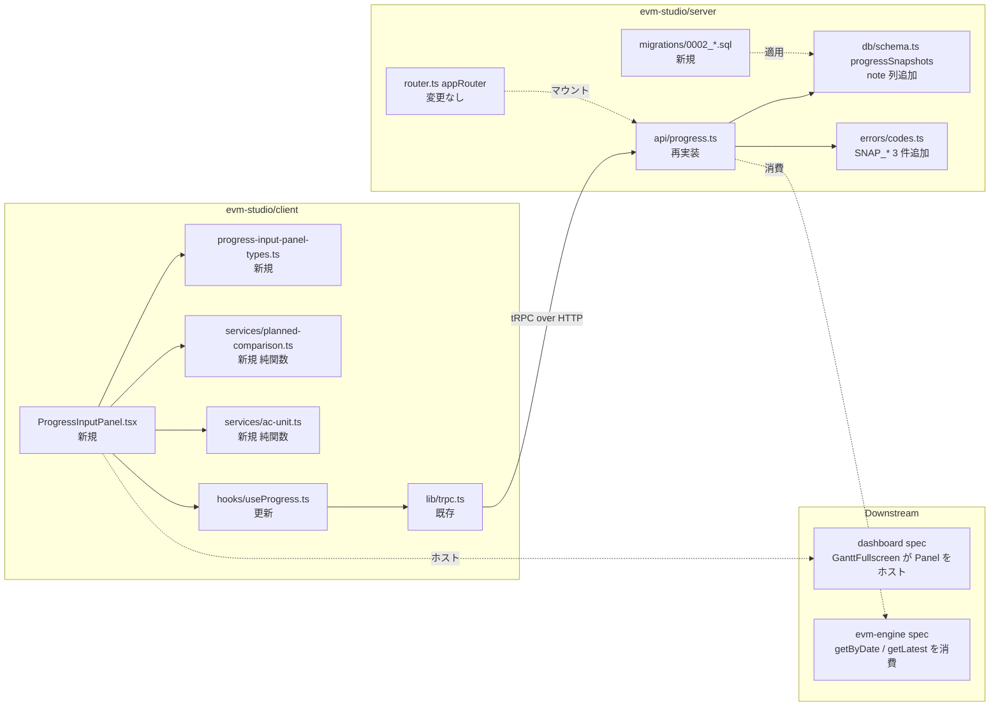
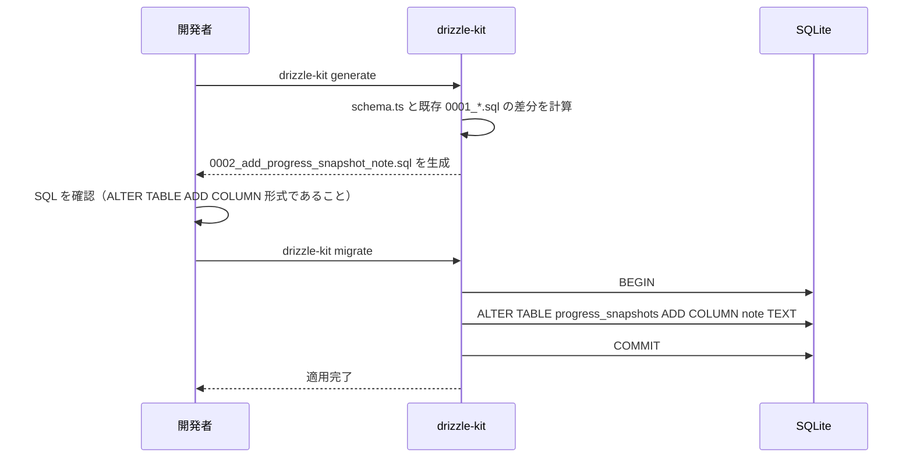
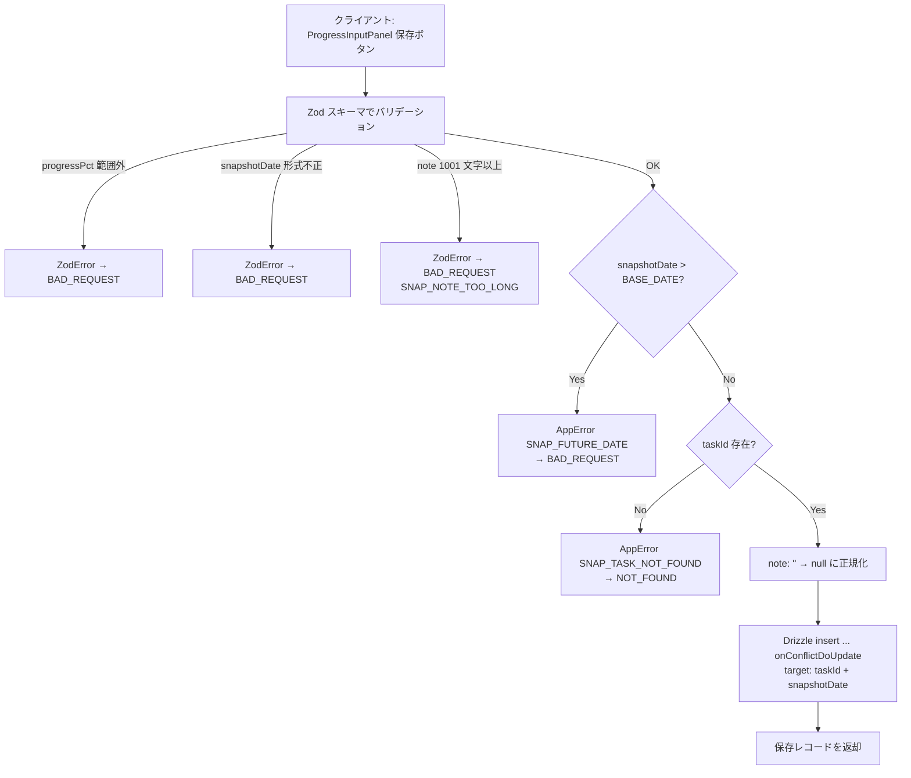
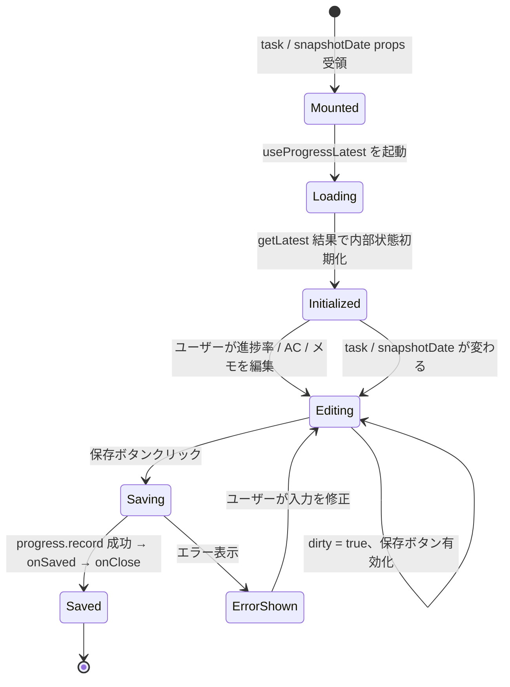
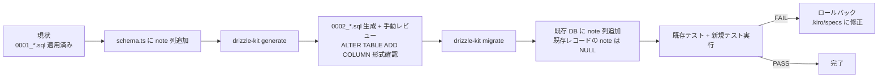

# 設計書: progress-tracking

## Overview

**Purpose**: EVM Studio の進捗記録機能をモックアップ `mockup/variation-a.jsx` の `ProgressInputPanel`（GanttFullscreen 内サブパネル）駆動で再構築する。`progress.record` を冪等な upsert として再設計し、`note` カラムを追加して文脈情報を保持し、計画線比較・MD ↔ h 単位変換ロジックをクライアント側純関数として切り出す。

**Users**: プロジェクト管理者・担当者がブラウザの `ProgressInputPanel` から日次進捗を入力する。`evm-engine` スペックが `progress.getByDate` / `progress.getByDateRange` / `progress.getLatest` を呼び出してメトリクスを計算する。`dashboard` スペックが `ProgressInputPanel` を `GanttFullscreen` 内にホストする。

**Impact**: `progress_snapshots` テーブルに `note` カラム（nullable text）を追加するマイグレーションを実行する。既存の `progress.record` プロシージャを「メモ受け入れ + 未来日付 reject + 単一タスク getLatest」を含む新仕様に置き換える。クライアントは旧 `ProgressInputPage` から `ProgressInputPanel` コンポーネントへ責務を再配置する（旧ページの実体削除は `dashboard` スペックが担う）。

### Goals

- `progress_snapshots.note` カラムを追加し、既存データを破壊しないマイグレーションを提供する
- `progress.record` を `(taskId, snapshotDate)` で upsert 冪等にし、未来日付・メモ長を Zod / ドメインエラーで弾く
- `progress.getLatest(taskId)` で単一タスクの最新スナップショットを返し、`ProgressInputPanel` の「前回累積 AC」初期表示に供給する
- `ProgressInputPanel` を再利用可能な React コンポーネントとして提供し、`dashboard` がそのままホストできる props 契約を定義する
- 計画線比較・単位変換を純関数として切り出し、単体テスト可能にする

### Non-Goals

- `ProgressInputPanel` をマウントする `GanttFullscreen` 自体・モーダルの開閉制御は本スペックに含めない（→ `dashboard` スペック）
- 旧 `ProgressInputPage.tsx` / `/progress` ルートの削除実行は本スペックに含めない（→ `dashboard` スペック）
- EVM メトリクス計算（PV / EV / SPI / CPI / EAC）（→ `evm-engine` スペック）
- 進捗履歴の SVG グラフ・SPI トレンドの描画（→ `dashboard` スペック）
- WBS YAML インポート時の初回スナップショット作成（→ `core-data-model` スペック）
- 進捗の一括 CSV / xlsm インポート（将来対応）

## Boundary Commitments

### This Spec Owns

- `evm-studio/server/src/db/migrations/0002_add_progress_snapshot_note.sql` — `progress_snapshots.note` カラム追加マイグレーション
- `evm-studio/server/src/db/schema.ts` の `progressSnapshots` テーブル定義の `note` 列追加（差分のみ、テーブル所有権は core-data-model に残る）
- `evm-studio/server/src/api/progress.ts` — progress tRPC ルーター全体（`record` / `getLatest` / `getByDate` / `getByDateRange` / `getHistory`）の再設計
- `evm-studio/server/src/errors/codes.ts` への `SNAP_TASK_NOT_FOUND` / `SNAP_FUTURE_DATE` / `SNAP_NOTE_TOO_LONG` 追加
- `evm-studio/client/src/components/gantt/ProgressInputPanel.tsx` — 新規コンポーネント
- `evm-studio/client/src/components/gantt/progress-input-panel-types.ts` — `ProgressInputTask` / `ProgressInputPanelProps` 型定義
- `evm-studio/client/src/services/planned-comparison.ts` — `calculatePlannedPct` 純関数
- `evm-studio/client/src/services/ac-unit.ts` — `mdToHours` / `hoursToMd` 純関数
- `evm-studio/client/src/hooks/useProgress.ts` — `useProgressLatest` / `useProgressByDate` / `useProgressHistory` / `useRecordProgress` フックの追加・更新

### Out of Boundary

- `evm-studio/server/src/db/schema.ts` の `progressSnapshots` テーブル全体の所有権（`note` 列以外）は `core-data-model` スペック
- `evm-studio/server/src/router.ts` の `appRouter` 定義（`core-data-model` 所有）— 本スペックでは `progress` ルーターの再マウントのみ行う
- `evm-studio/server/src/errors/AppError.ts` クラス定義（`core-data-model` 所有）
- `evm-studio/client/src/components/gantt/GanttFullscreen.tsx`（`dashboard` 所有）— `ProgressInputPanel` のホスト先
- 旧 `evm-studio/client/src/pages/ProgressInputPage.tsx` の削除（`dashboard` スペックが旧 SPA レイアウトのリストラクチャ時に削除）
- EVM 計算（→ `evm-engine`）
- ガントチャート・チャート群の描画（→ `dashboard`）

### Allowed Dependencies

- `drizzle-orm` 0.45 / `better-sqlite3` 12 — DB クエリ
- `@trpc/server` 11 — tRPC ルーター定義
- `zod` 4 — 入力バリデーション
- `pino` 10 — サーバーサイドログ
- `@trpc/react-query` 11 / `@tanstack/react-query` 5 — クライアント tRPC フック
- `react` 19 — UI コンポーネント
- `evm-studio/server/src/db/schema.ts` — `progressSnapshots` / `tasks` テーブル型（`core-data-model` 提供）
- `evm-studio/server/src/db/index.ts` — `db` インスタンス（`core-data-model` 提供）
- `evm-studio/server/src/errors/AppError.ts` / `codes.ts` — エラー基盤（`core-data-model` 提供）
- `evm-studio/client/src/lib/trpc.ts` — tRPC クライアント設定（`core-data-model` 提供）
- `evm-studio/client/src/tokens/evm-tokens.ts` — デザイントークン（`dashboard` 提供）
- `evm-studio/client/src/components/atoms/Card.tsx` / `Pill.tsx` / `Eyebrow.tsx` — 原子コンポーネント（`dashboard` 提供）

### Revalidation Triggers

以下の変更が発生した場合、progress-tracking は再確認が必要:

- `progress_snapshots` テーブルの他カラム（`task_id` / `snapshot_date` / `progress_pct` / `ac_days`）の型変更・名称変更（→ `core-data-model`）
- `tasks` テーブルの `project_id` / `planned_start` / `planned_end` カラム変更（→ `core-data-model`）
- `AppError` クラス・`ErrorCode` 型シグネチャの変更（→ `core-data-model`）
- tRPC `appRouter` セットアップ・`/trpc` パスマウントの変更（→ `core-data-model`）
- `dashboard` スペックが `ProgressInputPanel` の props 契約に追加要求を出した場合（例: 保存後にトーストを表示するための callback 拡張）
- `evm-engine` が `progress.getLatest` に `projectId` 形式の一括取得を要求した場合（その時はオーバーロードとして追加）

## Architecture

### Existing Architecture Analysis

EVM Studio は次の構造を持つ既存実装が稼働している。

- `evm-studio/server/src/db/schema.ts` に Drizzle スキーマが定義され、`progressSnapshots` テーブルが存在する（カラム: `id`, `taskId`, `snapshotDate`, `progressPct`, `acDays`, `pvDays`, `evDays`, `createdAt`, `updatedAt`）
- `evm-studio/server/src/api/progress.ts` に既存の `record` / `getByDate` / `getLatest` / `getHistory` プロシージャが実装済み（`note` 受け入れなし、`pvDays` / `evDays` を計算保存する仕様）
- `evm-studio/server/src/db/migrations/0000_real_gorilla_man.sql` / `0001_add_status_code_role_initials.sql` が適用済み
- `evm-studio/client/src/hooks/useProgress.ts` に既存フックが定義済み
- `evm-studio/client/src/pages/ProgressInputPage.tsx` が旧形式の一覧編集 UI を提供（本スペックでは触らず、`dashboard` スペックで削除）
- `evm-studio/client/src/components/gantt/GanttChart.tsx` が `dashboard` スペックで実装済み
- モックアップ `mockup/variation-a.jsx` の `ProgressInputPanel` セクション（行 1148–1357）が UI 仕様の正典

本スペックは既存レイヤー責務（`api/` がルーティング、`services/` がビジネスロジック、`db/` がスキーマ）を保持しつつ、`progress.ts` ルーターを「note 受け入れ」「未来日付 reject」「単一タスク getLatest」の新仕様で再実装する。`pvDays` / `evDays` の計算保存は本スペックの責務から除外し（`evm-engine` に委譲）、`progress_snapshots` への書き込みは `progressPct` / `acDays` / `note` のみとする方針に変更する。

### Architecture Pattern & Boundary Map



**Architecture Integration**:
- **Selected pattern**: 既存の 3 層構造（`api/` → `db/`、クライアント側 `hooks/` → `services/` → `components/`）を維持。`ProgressInputPanel` は presentational + データフックの薄い構成で、計算ロジックは純関数 `services/` に切り出す。
- **Domain/feature boundaries**: API 層が DB 整合性と冪等性を担保、`ProgressInputPanel` が UI 振る舞いを担保、`services/planned-comparison.ts` / `services/ac-unit.ts` が表示ロジックを担保する。
- **Existing patterns preserved**: Drizzle 推論型 → tRPC 出力型のフロー、`ErrorCode` 定数経由のエラーコード管理、`services/` 純関数原則、TanStack Query キャッシュ invalidate パターン。
- **New components rationale**: `ProgressInputPanel` 単体ではテストしづらい計算ロジック（`calculatePlannedPct` / `mdToHours`）を `services/` に切り出すことで、`vitest` で単独検証可能にする。
- **Steering compliance**: TypeScript strict・`any` 禁止・Drizzle 推論型優先・Zod 入力バリデーション・`tokens/evm-tokens.ts` 経由のデザイン定数参照を徹底。

### Technology Stack

| Layer | Choice / Version | Role in Feature | Notes |
|-------|------------------|-----------------|-------|
| Frontend / UI | React 19.2 + TailwindCSS 4 + Vite 8 | `ProgressInputPanel` コンポーネント実装 | モックアップの `style={{}}` 直書きを CSS-in-JS で踏襲、`tokens/evm-tokens.ts` 参照 |
| Frontend / State | TanStack Query 5 + `@trpc/react-query` 11 | データフェッチ・キャッシュ | `useProgress*` フック群 |
| Backend / Services | Hono 4.12 + tRPC 11 + Zod 4 | tRPC ルーターと入力バリデーション | 既存 `progress.ts` を再実装 |
| Data / Storage | SQLite (better-sqlite3 12) + Drizzle ORM 0.45 | `progress_snapshots` の upsert | `ALTER TABLE ADD COLUMN` で `note` 追加 |
| Migration | drizzle-kit | スキーマ差分生成 | 手動で SQL を確認・調整 |
| Logging | pino 10 | サーバーログ | `taskId` / `projectId` のみ記録 |

## File Structure Plan

### Directory Structure

```
evm-studio/
├── server/
│   ├── src/
│   │   ├── db/
│   │   │   ├── schema.ts                              # 修正: progressSnapshots に note 列を追加
│   │   │   └── migrations/
│   │   │       └── 0002_add_progress_snapshot_note.sql  # 新規: ALTER TABLE ADD COLUMN note
│   │   ├── api/
│   │   │   └── progress.ts                            # 再実装: note 対応 + 未来日付 reject + 単一 getLatest + getByDateRange 追加
│   │   └── errors/
│   │       └── codes.ts                               # 修正: SNAP_TASK_NOT_FOUND / SNAP_FUTURE_DATE / SNAP_NOTE_TOO_LONG 追加
│   └── tests/
│       └── api/
│           └── progress.test.ts                       # 修正: 新仕様のテストへ書き換え
└── client/
    └── src/
        ├── components/
        │   └── gantt/
        │       ├── ProgressInputPanel.tsx              # 新規: メインコンポーネント
        │       └── progress-input-panel-types.ts       # 新規: 型定義
        ├── services/
        │   ├── planned-comparison.ts                   # 新規: 純関数
        │   ├── planned-comparison.test.ts              # 新規
        │   ├── ac-unit.ts                              # 新規: 純関数
        │   └── ac-unit.test.ts                         # 新規
        └── hooks/
            └── useProgress.ts                          # 修正: useProgressLatest 追加・useRecordProgress 拡張
```

### Modified Files

- `evm-studio/server/src/db/schema.ts` — `progressSnapshots` Drizzle 定義に `note: text('note')` を追加（既存列は変更しない）
- `evm-studio/server/src/api/progress.ts` — 全プロシージャを新仕様で再実装。既存の `pv_days` / `ev_days` 計算ロジックは削除（責務を `evm-engine` へ移譲）
- `evm-studio/server/src/errors/codes.ts` — `SNAP_TASK_NOT_FOUND` / `SNAP_FUTURE_DATE` / `SNAP_NOTE_TOO_LONG` を追加
- `evm-studio/server/tests/api/progress.test.ts` — 既存テストを新仕様（note・未来日付 reject・単一 taskId getLatest）に書き換え
- `evm-studio/client/src/hooks/useProgress.ts` — `useProgressLatest(taskId)` を追加、`useRecordProgress` の invalidate を `getLatest` も含むよう拡張

### Files Not Touched (delegated to other specs)

- `evm-studio/client/src/pages/ProgressInputPage.tsx` — 削除は `dashboard` スペックの責務
- `evm-studio/client/src/components/gantt/GanttFullscreen.tsx` — `ProgressInputPanel` のマウントは `dashboard` スペックが行う

## System Flows

### マイグレーション適用フロー



### progress.record 呼び出しフロー



### ProgressInputPanel コンポーネントの状態遷移



## Requirements Traceability

| Requirement | Summary | Components | Interfaces | Flows |
|-------------|---------|------------|------------|-------|
| 1.1, 1.2, 1.3 | `progress_snapshots.note` 列追加・マイグレーション | `db/schema.ts`, Migration 0002 | Drizzle 型 `ProgressSnapshot` | マイグレーション適用フロー |
| 1.4 | note 1000 文字超 reject | `api/progress.ts` | Zod スキーマ | progress.record フロー |
| 1.5, 1.6 | note の NULL 正規化（null / 空文字 → NULL） | `api/progress.ts` | サービスロジック | progress.record フロー |
| 2.1 | record の upsert 冪等性 | `api/progress.ts` | tRPC `progress.record` | progress.record フロー |
| 2.2, 2.3, 2.4 | progressPct / acDays / snapshotDate のフォーマット検証 | `api/progress.ts` | Zod スキーマ | progress.record フロー |
| 2.5 | 過去日付の許容 | `api/progress.ts` | tRPC `progress.record` | progress.record フロー |
| 2.6 | 未来日付 reject (SNAP_FUTURE_DATE) | `api/progress.ts`, `errors/codes.ts` | AppError | progress.record フロー |
| 2.7 | note 受け入れ | `api/progress.ts` | Zod スキーマ | progress.record フロー |
| 2.8 | taskId 未存在 reject (SNAP_TASK_NOT_FOUND) | `api/progress.ts`, `errors/codes.ts` | AppError | progress.record フロー |
| 2.9 | 保存レコード返却 | `api/progress.ts` | tRPC 出力型 | progress.record フロー |
| 2.10 | スナップショット蓄積保証 | `api/progress.ts` | DB upsert | progress.record フロー |
| 3.1, 3.2, 3.3, 3.4 | progress.getLatest(taskId) 単一タスク最新 1 件 | `api/progress.ts` | tRPC `progress.getLatest` | — |
| 4.1, 4.2, 4.3, 4.4, 4.5 | progress.getByDate 一括取得 | `api/progress.ts` | tRPC `progress.getByDate` | — |
| 4.5.1, 4.5.2, 4.5.3, 4.5.4, 4.5.5, 4.5.6 | progress.getByDateRange 期間一括取得（evm-engine 消費） | `api/progress.ts` | tRPC `progress.getByDateRange` | — |
| 5.1, 5.2, 5.3 | progress.getHistory 履歴取得 | `api/progress.ts` | tRPC `progress.getHistory` | — |
| 6.1, 6.2 | ProgressInputPanel props 契約 | `progress-input-panel-types.ts`, `ProgressInputPanel.tsx` | TypeScript interface | — |
| 6.3, 6.4 | task / snapshotDate 変更時の再初期化 | `ProgressInputPanel.tsx` | useEffect | ProgressInputPanel 状態遷移 |
| 6.5, 6.6 | スナップショット日付ピッカー + 過去日付警告 | `ProgressInputPanel.tsx` | UI 振る舞い | — |
| 6.7 | 進捗率スライダー + 数値入力連動 | `ProgressInputPanel.tsx` | UI 振る舞い | — |
| 6.8, 6.9 | 進捗バー + 計画線マーカー + 差分色分け | `ProgressInputPanel.tsx`, `services/planned-comparison.ts` | `calculatePlannedPct` | — |
| 6.10, 6.11 | AC 入力 MD/h トグル + 前回累積/本日/合計 | `ProgressInputPanel.tsx`, `services/ac-unit.ts` | `mdToHours` / `hoursToMd` | — |
| 6.12 | メモ入力 1000 文字制限 | `ProgressInputPanel.tsx` | UI 振る舞い | — |
| 6.13 | EV/AC/CPI リアルタイムプレビュー | `ProgressInputPanel.tsx` | 計算ロジック | — |
| 6.14, 6.15, 6.16 | 保存ボタン dirty 制御 + onSaved + エラー表示 | `ProgressInputPanel.tsx`, `useProgress.ts` | `useRecordProgress` | progress.record フロー |
| 6.17 | 祖先パンくず + メタ情報表示 | `ProgressInputPanel.tsx` | UI 構造 | — |
| 7.1, 7.2, 7.3, 7.4 | useProgress 拡張 | `hooks/useProgress.ts` | TanStack Query フック | — |
| 8.1, 8.2, 8.3 | calculatePlannedPct 純関数 | `services/planned-comparison.ts` | 純関数 | — |
| 8.4, 8.5, 8.6 | mdToHours / hoursToMd 純関数 | `services/ac-unit.ts` | 純関数 | — |
| 9.1 | Zod による全プロシージャ入力バリデーション | `api/progress.ts` | Zod | progress.record フロー |
| 9.2, 9.3 | AppError → TRPCError 変換 + ErrorCode 追加 | `api/progress.ts`, `errors/codes.ts` | AppError | progress.record フロー |
| 9.4 | ログに個人名を含めない | `api/progress.ts` | pino logger | — |
| 10.1–10.7 | 単体テスト | `progress.test.ts`, `planned-comparison.test.ts`, `ac-unit.test.ts` | Vitest | — |
| 10.8 | npm test 全パス | (テストランナー) | Vitest | — |

## Components and Interfaces

| Component | Domain/Layer | Intent | Req Coverage | Key Dependencies (P0/P1) | Contracts |
|-----------|--------------|--------|--------------|--------------------------|-----------|
| `db/schema.ts` (差分) | Data | `progressSnapshots` に `note` 列を追加 | 1.1 | Drizzle ORM (P0) | State |
| Migration 0002 | Data | DB に非破壊で `note` 列を追加 | 1.2, 1.3 | drizzle-kit (P0), better-sqlite3 (P0) | Batch |
| `api/progress.ts` | API | progress tRPC ルーター（5 プロシージャ） | 2.*, 3.*, 4.*, 4.5.*, 5.*, 9.1–9.3 | Zod (P0), Drizzle (P0), AppError (P0), pino (P1) | API |
| `errors/codes.ts` (差分) | Errors | `SNAP_*` 3 コード追加 | 9.3 | — | State |
| `ProgressInputPanel.tsx` | UI | スライドイン進捗入力パネル本体 | 6.* | React (P0), TanStack Query (P0), atoms (P1), evm-tokens (P1) | State |
| `progress-input-panel-types.ts` | UI Types | `ProgressInputTask` / `ProgressInputPanelProps` 型定義 | 6.1, 6.2 | TypeScript (P0) | State |
| `services/planned-comparison.ts` | Services | `calculatePlannedPct` 純関数 | 6.8, 8.1, 8.2, 8.3 | — | Service |
| `services/ac-unit.ts` | Services | `mdToHours` / `hoursToMd` 純関数 | 6.10, 8.4, 8.5, 8.6 | — | Service |
| `hooks/useProgress.ts` | Data Hooks | TanStack Query フック群 | 7.* | tRPC (P0), TanStack Query (P0) | Service |

### Data Layer

#### `db/schema.ts`（差分）

| Field | Detail |
|-------|--------|
| Intent | `progress_snapshots` に `note` 列を追加 |
| Requirements | 1.1 |
| Owner / Reviewers | progress-tracking（差分のみ。テーブル全体は core-data-model） |

**Responsibilities & Constraints**
- `progressSnapshots` テーブル定義に `note: text('note')` を追加（NULL 許容、デフォルト値なし）
- 既存列（`id`, `taskId`, `snapshotDate`, `progressPct`, `acDays`, `pvDays`, `evDays`, `createdAt`, `updatedAt`）は変更しない
- Drizzle 推論型 `ProgressSnapshot` に `note: string | null` が含まれることを確認

**Dependencies**
- Outbound: Drizzle ORM `sqlite-core` (P0)

**Contracts**: State

##### State Management
- State model: テーブル列定義
- Persistence & consistency: `ALTER TABLE` で追加されたカラムは Drizzle スキーマと一致すること
- Concurrency strategy: 単一プロセスで起動するため不要

#### Migration 0002 (`db/migrations/0002_add_progress_snapshot_note.sql`)

| Field | Detail |
|-------|--------|
| Intent | DB に非破壊で `note` 列を追加 |
| Requirements | 1.2, 1.3 |

**Responsibilities & Constraints**
- 内容: `ALTER TABLE progress_snapshots ADD COLUMN note TEXT;` の 1 行のみ
- drizzle-kit が `progress_snapshots` テーブル再作成方式を選択した場合、生成 SQL を手動で `ALTER TABLE ADD COLUMN` 形式に書き換える（既存スナップショット保持のため必須）
- マイグレーション SQL は 1 トランザクションで実行され、エラー時はロールバックする

**Dependencies**
- Outbound: drizzle-kit (P0), better-sqlite3 (P0)

**Contracts**: Batch

##### Batch / Job Contract
- Trigger: 開発者が `drizzle-kit migrate` を実行
- Input / validation: `0001_*.sql` 適用済みの DB
- Output / destination: `progress_snapshots` テーブルに `note` カラムが追加された状態
- Idempotency & recovery: drizzle-kit のマイグレーション履歴テーブル (`__drizzle_migrations`) で適用済み判定。エラー時はトランザクションロールバック

### API Layer

#### `api/progress.ts`（再実装）

| Field | Detail |
|-------|--------|
| Intent | progress tRPC ルーター（4 プロシージャ）の新仕様での再実装 |
| Requirements | 2.*, 3.*, 4.*, 5.*, 9.1–9.3 |

**Responsibilities & Constraints**
- 既存実装の `pvDays` / `evDays` 計算ロジックを削除し、`progressSnapshots` への書き込みは `taskId` / `snapshotDate` / `progressPct` / `acDays` / `note` の 5 列のみとする（EVM 計算は `evm-engine` に委譲）
- `progress.record` プロシージャ:
  - 入力 Zod スキーマ `recordProgressSchema`: `taskId: z.number().int().positive()`, `snapshotDate: z.string().regex(/^\d{4}-\d{2}-\d{2}$/)`, `progressPct: z.number().int().min(0).max(100)`, `acDays: z.number().min(0)`, `note: z.string().max(1000).nullable().optional()`
  - サーバー側 `BASE_DATE` 取得: 本スペックでは UI から「現在日扱いの基準日」をプロシージャ入力には含めず、サーバーの `new Date().toISOString().slice(0, 10)`（UTC、YYYY-MM-DD）と比較する。比較は文字列辞書順で可（ISO-8601 同一フォーマット前提）。`snapshotDate > today`（厳密不等号）の場合 `AppError(SNAP_FUTURE_DATE)` をスロー。**不変条件: `snapshotDate ≤ baseDate` でなければならず、`snapshotDate === baseDate` は許容、`snapshotDate > baseDate` は常に reject する（サーバー側 today を baseDate とみなす）**。
  - タスク存在チェック: `db.select().from(tasks).where(eq(tasks.id, input.taskId))` → 未存在で `AppError(SNAP_TASK_NOT_FOUND)`
  - note 正規化: `note === '' || note === undefined ? null : note`
  - Drizzle upsert: `db.insert(progressSnapshots).values({ taskId, snapshotDate, progressPct, acDays, note }).onConflictDoUpdate({ target: [progressSnapshots.taskId, progressSnapshots.snapshotDate], set: { progressPct, acDays, note, updatedAt: new Date() } })`
  - 戻り値: 保存後のレコード（`.returning()` を使用）
- `progress.getLatest` プロシージャ:
  - 入力 Zod スキーマ: `z.object({ taskId: z.number().int().positive() })`
  - クエリ: `db.select().from(progressSnapshots).where(eq(progressSnapshots.taskId, input.taskId)).orderBy(desc(progressSnapshots.snapshotDate)).limit(1)`
  - 戻り値: 0 件なら `null`、1 件なら `ProgressSnapshot`
- `progress.getByDate` プロシージャ:
  - 入力 Zod スキーマ: `z.object({ projectId: z.number().int().positive(), snapshotDate: z.string().regex(/^\d{4}-\d{2}-\d{2}$/) })`
  - クエリ: `db.select({...progressSnapshots fields}).from(progressSnapshots).innerJoin(tasks, eq(progressSnapshots.taskId, tasks.id)).where(and(eq(tasks.projectId, input.projectId), eq(progressSnapshots.snapshotDate, input.snapshotDate))).orderBy(asc(progressSnapshots.taskId))`
- `progress.getByDateRange` プロシージャ:
  - 入力 Zod スキーマ: `z.object({ projectId: z.number().int().positive(), startDate: z.string().regex(/^\d{4}-\d{2}-\d{2}$/), endDate: z.string().regex(/^\d{4}-\d{2}-\d{2}$/) })`
  - クエリ: `db.select({ taskId: progressSnapshots.taskId, snapshotDate: progressSnapshots.snapshotDate, progressPct: progressSnapshots.progressPct, acDays: progressSnapshots.acDays }).from(progressSnapshots).innerJoin(tasks, eq(progressSnapshots.taskId, tasks.id)).where(and(eq(tasks.projectId, input.projectId), gte(progressSnapshots.snapshotDate, input.startDate), lte(progressSnapshots.snapshotDate, input.endDate))).orderBy(asc(progressSnapshots.snapshotDate), asc(progressSnapshots.taskId))`
  - 用途: `evm-engine` の prevDay / spiTrend / fever trail 計算用。ペイロード軽量化のため `note` および内部フィールド（`id`・`createdAt`・`updatedAt`）は返さない
  - `startDate > endDate` の場合は SQLite クエリ自体が空集合を返すため、追加バリデーションは不要（要件 4.5.6）
  - 戻り値: `Array<{ taskId: number, snapshotDate: string, progressPct: number, acDays: number }>`、`snapshotDate` ASC → `taskId` ASC でソート済み
- `progress.getHistory` プロシージャ:
  - 入力 Zod スキーマ: `z.object({ taskId: z.number().int().positive() })`
  - クエリ: `db.select().from(progressSnapshots).where(eq(progressSnapshots.taskId, input.taskId)).orderBy(asc(progressSnapshots.snapshotDate))`
- すべてのプロシージャで `AppError` を `TRPCError` に変換するエラーハンドラを通す（既存パターン踏襲）
- ログ: `taskId` / `projectId` のみを `pino.info` で記録、個人名は記録しない

**Dependencies**
- Inbound: クライアント `useProgress*` フック (P0)
- Outbound: `db/schema.ts` (P0), `db/index.ts` (P0), `errors/AppError.ts` (P0), `errors/codes.ts` (P0)
- External: Zod 4 (P0), Drizzle ORM 0.45 (P0), pino 10 (P1)

**Contracts**: API

##### API Contract
| Method | Endpoint | Request | Response | Errors |
|--------|----------|---------|----------|--------|
| Mutation | `progress.record` | `{ taskId: number, snapshotDate: string, progressPct: number, acDays: number, note?: string \| null }` | `ProgressSnapshot` | 400 (Zod / SNAP_FUTURE_DATE / SNAP_NOTE_TOO_LONG), 404 (SNAP_TASK_NOT_FOUND), 500 |
| Query | `progress.getLatest` | `{ taskId: number }` | `ProgressSnapshot \| null` | 400 (Zod), 500 |
| Query | `progress.getByDate` | `{ projectId: number, snapshotDate: string }` | `ProgressSnapshot[]` | 400 (Zod), 500 |
| Query | `progress.getByDateRange` | `{ projectId: number, startDate: string, endDate: string }` | `Array<{ taskId: number, snapshotDate: string, progressPct: number, acDays: number }>` | 400 (Zod), 500 |
| Query | `progress.getHistory` | `{ taskId: number }` | `ProgressSnapshot[]` | 400 (Zod), 500 |

**Implementation Notes**
- Integration: 既存 `appRouter` に `progress: progressRouter` がマウント済み。本スペックではルーター本体のみ書き換える。
- Validation: Zod の `superRefine` ではなく、未来日付チェックは Zod パース後にプロシージャ実装内で行う（サーバー側 `today` を取得するため Zod ではなく実装層で扱う）。
- Risks: SQLite の `onConflictDoUpdate` は Drizzle 0.45 でサポート済みだが、複合 unique 制約 `(taskId, snapshotDate)` が `0000_*.sql` の段階で定義済みであることを前提とする。未定義の場合は `core-data-model` 側で `UNIQUE(task_id, snapshot_date)` 制約を確認・追加する必要がある。

### Errors Layer

#### `errors/codes.ts`（差分）

| Field | Detail |
|-------|--------|
| Intent | `SNAP_TASK_NOT_FOUND` / `SNAP_FUTURE_DATE` / `SNAP_NOTE_TOO_LONG` を追加 |
| Requirements | 9.3 |

**Responsibilities & Constraints**
- `ErrorCode` オブジェクトに 3 行追加: `SNAP_TASK_NOT_FOUND: 'SNAP_TASK_NOT_FOUND'`, `SNAP_FUTURE_DATE: 'SNAP_FUTURE_DATE'`, `SNAP_NOTE_TOO_LONG: 'SNAP_NOTE_TOO_LONG'`
- ドメインプレフィックス規約（`SNAP_*`）に従う
- 文字列リテラルの直書きは禁止、`api/progress.ts` からは `ErrorCode.SNAP_*` 経由で参照する

### Client UI Layer

#### `client/src/components/gantt/progress-input-panel-types.ts`

| Field | Detail |
|-------|--------|
| Intent | `ProgressInputPanel` の props 型定義と Task 型を切り出す |
| Requirements | 6.1, 6.2 |

**Responsibilities & Constraints**
- `ProgressInputTask` 型: `{ id: number; code: string; name: string; assigneeName: string | null; plannedStart: string; plannedEnd: string; bac: number; spi: number | null; ancestors: Array<{ id: number; name: string }> }`
- `ProgressInputPanelProps` 型: `{ task: ProgressInputTask; projectStartISO: string; baseDate: string; snapshotDate: string; onSnapshotDateChange: (date: string) => void; onClose: () => void; onSaved?: (snapshot: ProgressSnapshot) => void }`
- `ProgressSnapshot` 型は `import type { ProgressSnapshot } from '@/server-types'`（tRPC 経由で推論される型を再エクスポート想定）
- tRPC ルーター `appRouter.progress` の推論結果から `ProgressSnapshot` 型をクライアントが import するには、`client/src/types/progress.ts` で以下のように再エクスポートする:
  ```typescript
  import type { inferRouterOutputs } from '@trpc/server'
  import type { AppRouter } from '@server/trpc-router'
  export type ProgressSnapshot = inferRouterOutputs<AppRouter>['progress']['getLatest']
  ```
  実装タスクは dashboard spec 側の型基盤タスクで実施する（本 spec は再エクスポートを利用するのみ。`client/src/types/progress.ts` の所有権は dashboard spec）
- `ancestors` の導出は GanttFullscreen（dashboard spec の責務）が `client/src/lib/task-tree.ts` の `deriveAncestors(task, allTasks)` で行う。本 spec は `ancestors` を受け取るだけであり、導出ロジック・`task-tree.ts` の所有権は dashboard spec に属する

**Contracts**: State

#### `client/src/components/gantt/ProgressInputPanel.tsx`

| Field | Detail |
|-------|--------|
| Intent | スライドイン進捗入力パネルの実装 |
| Requirements | 6.* |

**Responsibilities & Constraints**
- モックアップ `mockup/variation-a.jsx` 行 1148–1357 の構造を TSX に移植する
- 内部編集ステート（React `useState`）:
  - `progress: number`（初期値 = `latest?.progressPct ?? 0`）
  - `acDaysToday: number`（初期値 = 0、本日追加分のみ。前回累積は `latest?.acDays ?? 0` を表示用に保持）
  - `note: string`（初期値 = `latest?.note ?? ''`）
  - `acUnit: 'MD' | 'h'`（初期値 = `'MD'`）
  - `saveError: string | null`（初期値 = `null`）
- `useEffect`: `task.id` または `snapshotDate` が変更されたとき、`useProgressLatest(task.id)` の戻り値で内部ステートを再初期化
- `useProgressLatest(task.id)` から取得した `latest` を使い、`prevAcDays = latest?.acDays ?? 0`、`prevProgress = latest?.progressPct ?? 0` を派生
- `calculatePlannedPct({ projectStartISO, snapshotDate, taskPlannedStart: task.plannedStart, taskPlannedEnd: task.plannedEnd })` で計画線位置を計算
- `diffPct = progress - plannedPct` から色判定:
  - `diffPct >= 0` → 緑 (`EVM.brandDeep` / `EVM.ok`)
  - `-10 <= diffPct < 0` → 黄 (`EVM.warn`)
  - `diffPct < -10` → 赤 (`EVM.crit`)
- 過去日判定: `isPast = snapshotDate < baseDate`（文字列辞書順比較。ISO-8601 同一フォーマット前提）
- **不変条件 `snapshotDate ≤ baseDate` の防御的実装**: 日付ピッカーには必ず `max={baseDate}` を設定し、UI レベルで `snapshotDate > baseDate` の選択を防ぐ。万一 props 経由で `snapshotDate > baseDate` が渡された場合でも、保存ボタンクリック時に `progress.record` が `SNAP_FUTURE_DATE` を返すためサーバー側で 2 重に弾かれる。クライアント側では追加で `useEffect` または保存前バリデーションで `snapshotDate > baseDate` を検出した場合に `setSaveError('スナップショット日付は基準日以降を指定できません')` を表示する
- AC 単位切替: `acUnit === 'h'` のとき入力値表示に `mdToHours` を適用、内部値は MD のまま保持
- 単位切替時は `acDaysToday` を 0 にリセット（モックアップ仕様踏襲）
- メモは `<textarea maxLength={1000}>` で 1000 文字制限
- dirty 判定: `progress !== prevProgress || acDaysToday > 0 || note !== (latest?.note ?? '')`
- 保存ハンドラ:
  ```typescript
  const handleSave = async () => {
    try {
      const saved = await recordMutation.mutateAsync({
        taskId: task.id,
        snapshotDate,
        progressPct: progress,
        acDays: prevAcDays + acDaysToday,  // 累積合計を送る
        note: note.trim() === '' ? null : note,
      });
      onSaved?.(saved);
      onClose();
    } catch (e) {
      setSaveError(getErrorMessage(e));
    }
  };
  ```
- 保存ボタン: `disabled={!dirty || recordMutation.isPending}`、クリック時に `handleSave` を呼ぶ
- エラー表示: `saveError` が `null` でない場合、パネル下部に赤背景のエラーメッセージを表示
- 表示要素: 祖先パンくず、タスクコード、タスク名、担当者名、計画開始/終了日、SPI ステータス Pill（`On Track` / `Watch` / `Delayed` / `N/A`）、スナップショット日付ピッカー（`max={baseDate}`）、進捗率レンジスライダー + 数値入力、進捗バー + 計画線マーカー、AC 入力（MD/h トグル + 前回累積/本日/合計）、リアルタイム EV/AC/CPI プレビュー、メモ `<textarea>`、保存/キャンセルボタン
- スタイリング: モックアップに従い `style={{}}` 直書きとし、定数は `tokens/evm-tokens.ts` から `EVM` をインポートして参照
- バッファタスクの取り扱い: `ProgressInputPanel` は `buffer === true` のタスクに対してはマウントされない（GanttFullscreen 側で `task.leaf && !task.buffer` のリーフのみクリック → パネル表示する制約）。本 spec の API もバッファタスクへの記録を禁止しない（既存の `is_leaf` チェックで弾く想定）が、UI フローとしてバッファに対する進捗記録は発生しない。`ProgressInputPanelProps` の `task` props 型に `buffer` フィールドを追加する必要はない（dashboard 側で事前フィルタリングされるため）

**Dependencies**
- Inbound: `dashboard/GanttFullscreen.tsx`（外部スペックがマウント）
- Outbound: `services/planned-comparison.ts` (P0), `services/ac-unit.ts` (P0), `hooks/useProgress.ts` (P0), `components/atoms/Card.tsx` / `Pill.tsx` / `Eyebrow.tsx` (P1), `tokens/evm-tokens.ts` (P1)
- External: React 19 (P0), `@tanstack/react-query` (P0)

**Contracts**: State

##### State Management
- State model: ローカル `useState` で編集ステート、`useProgressLatest` で初期値ロード、`useRecordProgress` で保存
- Persistence & consistency: 保存成功後に `progress.getLatest` / `progress.getByDate` キャッシュを invalidate
- Concurrency strategy: `mutateAsync` 実行中は保存ボタンを `isPending` で無効化

**Implementation Notes**
- Integration: `dashboard` スペックの `GanttFullscreen` から `<ProgressInputPanel task={...} projectStartISO={...} baseDate={...} snapshotDate={...} onSnapshotDateChange={...} onClose={...} onSaved={...} />` の形式でマウントされる
- Validation: クライアント側でも `progressPct` 0–100、`acDays` ≥ 0、`note` ≤ 1000 文字をチェックし、保存前にバリデーションエラーをパネル内に表示
- Risks: モックアップで `prevAcDays` は `Math.round(...)` で擬似計算されていたが、本実装では必ず `useProgressLatest` の `acDays` を使う

### Services Layer

#### `client/src/services/planned-comparison.ts`

| Field | Detail |
|-------|--------|
| Intent | スナップショット日時点の計画進捗率を算出する純関数 |
| Requirements | 6.8, 8.1, 8.2, 8.3 |

**Responsibilities & Constraints**
- 副作用なし（純関数）
- 入力: `{ projectStartISO: string; snapshotDate: string; taskPlannedStart: string; taskPlannedEnd: string }`
- 出力: `number`（0〜100 の整数）
- 計算: ISO-8601 文字列を `Date` に変換し、ミリ秒差分を 86400000 で割って日数オフセットを算出。`(snapshotOffset - taskStartOffset) / Math.max(1, taskDuration) * 100` を `Math.round` で四捨五入、`Math.min(100, Math.max(0, ...))` でクランプ。
- 特殊ケース:
  - `snapshotDate < taskPlannedStart` → 0 を返す
  - `snapshotDate >= taskPlannedEnd` → 100 を返す
  - `taskDuration === 0` → 1 として扱う（ゼロ除算回避）

**Contracts**: Service

##### Service Interface
```typescript
export interface CalculatePlannedPctInput {
  projectStartISO: string  // 'YYYY-MM-DD'
  snapshotDate: string     // 'YYYY-MM-DD'
  taskPlannedStart: string // 'YYYY-MM-DD'
  taskPlannedEnd: string   // 'YYYY-MM-DD'
}
export function calculatePlannedPct(input: CalculatePlannedPctInput): number
```
- Preconditions: 全フィールドが `YYYY-MM-DD` 形式の ISO-8601 文字列
- Postconditions: 戻り値は 0〜100 の整数
- Invariants: 同一入力に対し常に同一出力（純粋性）

#### `client/src/services/ac-unit.ts`

| Field | Detail |
|-------|--------|
| Intent | MD ↔ h 単位変換の純関数 |
| Requirements | 6.10, 8.4, 8.5, 8.6 |

**Responsibilities & Constraints**
- 副作用なし
- `mdToHours(md: number): number` → `md * 8`
- `hoursToMd(h: number): number` → `h / 8`
- 浮動小数点精度を保証するため、表示時に呼び出し側で `.toFixed(1)` 等を適用する想定

**Contracts**: Service

##### Service Interface
```typescript
export function mdToHours(md: number): number
export function hoursToMd(h: number): number
```

### Data Hooks Layer

#### `client/src/hooks/useProgress.ts`（更新）

| Field | Detail |
|-------|--------|
| Intent | progress tRPC エンドポイント群をラップする TanStack Query フック |
| Requirements | 7.* |

**Responsibilities & Constraints**
- `useProgressLatest(taskId: number | null)`: `trpc.progress.getLatest.useQuery({ taskId }, { enabled: !!taskId })`
- `useProgressByDate(projectId: number | null, snapshotDate: string | null)`: `trpc.progress.getByDate.useQuery({ projectId, snapshotDate }, { enabled: !!projectId && !!snapshotDate })`
- `useProgressHistory(taskId: number | null)`: `trpc.progress.getHistory.useQuery({ taskId }, { enabled: !!taskId })`
- `useRecordProgress()`: `trpc.progress.record.useMutation` を返し、`onSuccess` で `getLatest` / `getByDate` / `getHistory` のクエリキャッシュを `utils.progress.*.invalidate()` で無効化

**Dependencies**
- Outbound: `lib/trpc.ts` (P0)
- External: `@tanstack/react-query` (P0), `@trpc/react-query` (P0)

**Contracts**: Service

## Data Models

### Logical Data Model

#### progress_snapshots テーブル（拡張後）

| カラム | 型 | NULL | デフォルト | 用途 |
|---|---|---|---|---|
| id | INTEGER PK AUTOINCREMENT | NO | — | 主キー |
| task_id | INTEGER FK → tasks.id | NO | — | タスク ID |
| snapshot_date | TEXT | NO | — | スナップショット日付 (YYYY-MM-DD) |
| progress_pct | INTEGER | NO | — | 完了率 (0〜100) |
| ac_days | REAL | NO | 0 | 累積実績工数 (MD 単位) |
| **note** | TEXT | YES | NULL | 自由メモ（最大 1000 文字、空文字は NULL に正規化） |
| pv_days | REAL | YES | NULL | 計画出来高（既存列、本スペックでは書き込まない） |
| ev_days | REAL | YES | NULL | 出来高（既存列、本スペックでは書き込まない） |
| created_at | INTEGER | NO | now() | 作成時刻 |
| updated_at | INTEGER | NO | now() | 更新時刻 |
| UNIQUE | — | — | — | (task_id, snapshot_date) 複合 unique（既存制約を前提） |

**Consistency & Integrity**:
- `note` はアプリ層で 1000 文字以下の Zod 制約を持つ。DB レベルでは CHECK 制約を付けず、`text` 型のまま保持する（SQLite の柔軟性を維持）。
- 空文字列 `''` は `null` に正規化されて保存される（DB に空文字列は保存しない）。
- `(task_id, snapshot_date)` の複合 unique 制約は `0000_*.sql` の段階で定義済みであることが前提。未定義の場合、`core-data-model` 側で追加マイグレーションを発行する必要があり、本スペック実装時に確認する。

### Physical Data Model

#### マイグレーション 0002 (期待 SQL)

```sql
-- 0002_add_progress_snapshot_note.sql
ALTER TABLE progress_snapshots ADD COLUMN note TEXT;
```

> drizzle-kit が SQLite で `ALTER TABLE ADD COLUMN` を直接生成しない場合（テーブル再作成方式を選んだ場合）、生成 SQL を手動で上記 1 行に置き換えること。既存スナップショット保持のために必須。

### Data Contracts & Integration

#### tRPC progress.record 入力スキーマ

```typescript
export const recordProgressSchema = z.object({
  taskId:       z.number().int().positive(),
  snapshotDate: z.string().regex(/^\d{4}-\d{2}-\d{2}$/),
  progressPct:  z.number().int().min(0).max(100),
  acDays:       z.number().min(0),
  note:         z.string().max(1000).nullable().optional(),
})
export type RecordProgressInput = z.infer<typeof recordProgressSchema>
```

#### tRPC progress.getLatest 入力スキーマ

```typescript
export const getLatestProgressSchema = z.object({
  taskId: z.number().int().positive(),
})
```

#### ProgressInputPanel props 契約（TypeScript）

```typescript
export interface ProgressInputTask {
  id: number
  code: string                       // 'T001.2.3' 等の WBS コード
  name: string
  assigneeName: string | null
  plannedStart: string               // 'YYYY-MM-DD'
  plannedEnd: string                 // 'YYYY-MM-DD'
  bac: number                        // estimate_days (MD)
  spi: number | null                 // 上流で計算済み（null なら N/A）
  ancestors: Array<{ id: number; name: string }>
}

export interface ProgressInputPanelProps {
  task: ProgressInputTask
  projectStartISO: string            // 'YYYY-MM-DD'
  baseDate: string                   // 'YYYY-MM-DD'（プロジェクトの基準日 = 今日扱い）
  snapshotDate: string               // 'YYYY-MM-DD'（現在選択中）
  onSnapshotDateChange: (date: string) => void
  onClose: () => void
  onSaved?: (snapshot: ProgressSnapshot) => void
}
```

## Error Handling

### Error Strategy

- 入力バリデーション層: tRPC の Zod スキーマで形式エラーを `BAD_REQUEST` に変換
- ドメインエラー層: `AppError(SNAP_FUTURE_DATE)` / `AppError(SNAP_TASK_NOT_FOUND)` / `AppError(SNAP_NOTE_TOO_LONG)` を throw し、tRPC 境界で `TRPCError` に再ラップ
- クライアント層: `useRecordProgress` の `mutation.error` を `ProgressInputPanel` の `saveError` ステートに反映し、パネル下部にエラーメッセージを表示

### Error Categories and Responses

**User Errors (400)**:
- `progressPct` が範囲外、`acDays` が負、`snapshotDate` の形式不正 → Zod が `BAD_REQUEST` を返却 → クライアントで該当フィールドのインラインエラー表示
- `note` 1001 文字以上 → Zod または `SNAP_NOTE_TOO_LONG` で `BAD_REQUEST`
- `snapshotDate` が未来日付 → `SNAP_FUTURE_DATE` で `BAD_REQUEST`

**System Errors (500)**:
- DB 接続エラー、上流の予期せぬ例外 → tRPC が `INTERNAL_SERVER_ERROR` を返却 → クライアントで汎用エラーメッセージ表示

**Business Logic Errors (404)**:
- `taskId` 未存在 → `SNAP_TASK_NOT_FOUND` で `NOT_FOUND`

### Monitoring

- pino 経由で `progress.record` の成功・失敗ログを `taskId` / `snapshotDate` / `progressPct` を含めて出力。個人名（`Member.name`）はログに含めない。
- マイグレーション・サーバー起動時のスキーマ検証ログは標準出力。

## Testing Strategy

### Unit Tests

1. **`api/progress.test.ts` — record 正常系**: `progress.record` で新規スナップショットを作成 → 返却レコードが入力値を保持していることを確認（要件 2.1, 2.9）
2. **`api/progress.test.ts` — record upsert**: 同一 `(taskId, snapshotDate)` で 2 回呼ぶ → 2 回目で `progressPct` / `acDays` / `note` が更新され、レコード数が増えないことを確認（要件 2.1, 2.10）
3. **`api/progress.test.ts` — record 未来日付 reject**: `snapshotDate` をサーバー `today` + 1 日に設定 → `SNAP_FUTURE_DATE` の `BAD_REQUEST` が返ること（要件 2.6）
4. **`api/progress.test.ts` — record 過去日付許容**: `snapshotDate` を `today` - 7 日に設定 → 正常保存されること（要件 2.5）
5. **`api/progress.test.ts` — record タスク未存在**: 存在しない `taskId` で呼ぶ → `SNAP_TASK_NOT_FOUND` の `NOT_FOUND` が返ること（要件 2.8）
6. **`api/progress.test.ts` — record note 上限**: `note` 1001 文字で呼ぶ → Zod または `SNAP_NOTE_TOO_LONG` の `BAD_REQUEST` が返ること（要件 1.4, 2.7）
7. **`api/progress.test.ts` — record note 正規化**: `note: ''` および `note: null` を渡すと DB に `NULL` が保存されること（要件 1.5, 1.6）
8. **`api/progress.test.ts` — getLatest 1 件返却**: 同一タスクに 3 日分のスナップショットを保存 → `getLatest({ taskId })` が `snapshotDate` 最大の 1 件を返すこと（要件 3.1）
9. **`api/progress.test.ts` — getLatest null**: スナップショット未記録タスクおよび未存在 `taskId` に対して `null` を返すこと（要件 3.2, 3.3）
10. **`api/progress.test.ts` — getByDate フィルタ + ソート**: 複数タスクに異なる日付のスナップショットを保存 → 指定日付のもののみを `taskId` 昇順で返すこと（要件 4.1, 4.2, 4.4）
11. **`api/progress.test.ts` — getByDate 未存在 projectId**: 存在しない `projectId` に対して空配列を返すこと（要件 4.3）
12. **`api/progress.test.ts` — getHistory 昇順**: 同一タスクに 3 日分を保存 → `snapshotDate` 昇順で 3 件を返すこと（要件 5.1）
13. **`api/progress.test.ts` — getHistory 空配列**: 未存在 `taskId` に対して空配列を返すこと（要件 5.2）
14. **`services/planned-comparison.test.ts`**: 開始前 = 0、中間 = 50 前後、終了後 = 100、duration = 0 のゼロ除算回避（要件 8.1, 8.2, 8.3, 10.6）
15. **`services/ac-unit.test.ts`**: `mdToHours(1) === 8`、`hoursToMd(8) === 1`、`hoursToMd(mdToHours(2.5)) === 2.5`（要件 8.4, 8.5, 10.7）

### Integration Tests

1. **マイグレーション後方互換** (`db/db.test.ts` or 既存テストへの追記): `0001_*.sql` 適用済み DB に `0002_*.sql` を適用 → 既存スナップショットが全件読み込めること、`note` 列が `NULL` で読み出せること（要件 1.2, 1.3）

### Component Tests

本プロジェクトの方針（`steering/tech.md`）に従い、React コンポーネントテストは ROI が低いため実施しない。`ProgressInputPanel` の振る舞いは `dashboard` スペックの E2E テスト（Playwright）でカバーする。

### E2E Tests

本スペックでは `ProgressInputPanel` 単体の E2E テストは追加せず、`dashboard` スペックの GanttFullscreen フローテストに統合する（`GanttFullscreen` 上で行クリック → `ProgressInputPanel` 表示 → 進捗入力 → 保存 → スナップショットが反映されることを確認）。

### Performance / Load

不要（数件〜数百件のスナップショットを扱うローカルアプリのため）。

## Security Considerations

- 個人情報（担当者氏名）はログ出力対象外。`api/progress.ts` から `pino.info` で出力するフィールドは `taskId` / `projectId` / `snapshotDate` / `progressPct` のみとし、`Member.name` は含めない。
- `note` フィールドは自由文字列だが、React のデフォルトエスケープで XSS は防止される。`dangerouslySetInnerHTML` は使用しない。
- Zod による入力バリデーションを徹底し、`progressPct` 範囲外・`note` 文字数超過・形式不正を入口で弾く。

## Migration Strategy



**Phase breakdown**:
1. `schema.ts` に `note` 列追加 → 2. マイグレーション生成・手動調整 → 3. `errors/codes.ts` に SNAP_* 3 件追加 → 4. `api/progress.ts` 再実装 → 5. クライアント `services/` 純関数追加 → 6. `hooks/useProgress.ts` 更新 → 7. `ProgressInputPanel.tsx` 実装 → 8. テスト全件パス確認

**Rollback triggers**:
- マイグレーション SQL がテーブル再作成方式で既存スナップショット消失を引き起こす場合 → SQL を手動で `ALTER TABLE ADD COLUMN` 形式に書き換える
- `(task_id, snapshot_date)` の複合 unique 制約が未定義で `onConflictDoUpdate` が動作しない場合 → `core-data-model` 側で追加マイグレーションを発行する判断（本スペックでは対応せず、要件 2.1 の前提として明示）

**Validation checkpoints**:
- マイグレーション適用後、`SELECT COUNT(*) FROM progress_snapshots` で既存レコード数が変わっていないこと
- 新カラム `note` が `NULL` で埋まっていること
- 既存テスト（旧仕様での `progress.record` を呼ぶもの）を新仕様に置き換え、全件パスすること

## Supporting References

- モックアップ `mockup/variation-a.jsx` 行 1148–1357: `ProgressInputPanel` の UI 構造の正典
- `.kiro/specs/core-data-model/design.md`: `progress_snapshots` テーブル定義と `AppError` / `ErrorCode` 基盤
- `.kiro/steering/domain.md`: EVM ドメイン用語と `ProgressSnapshot` の役割
- `.kiro/steering/tech.md`: TypeScript strict / Zod バリデーション / pino ログ規約
