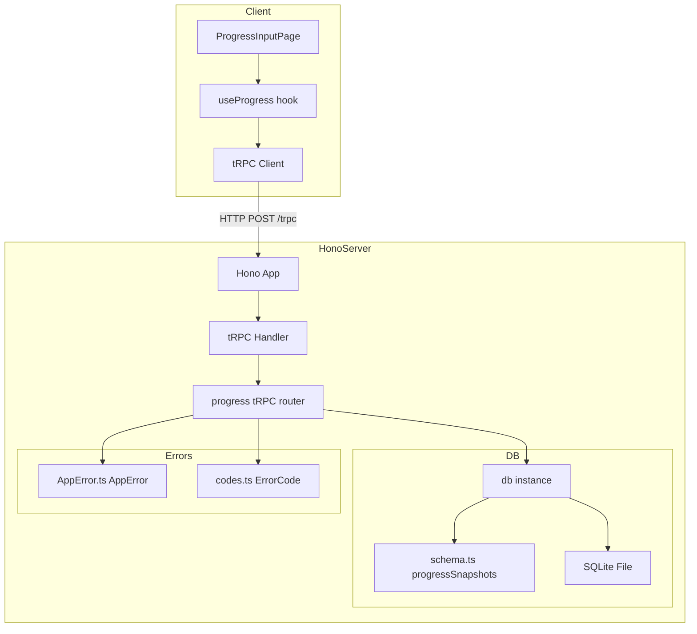
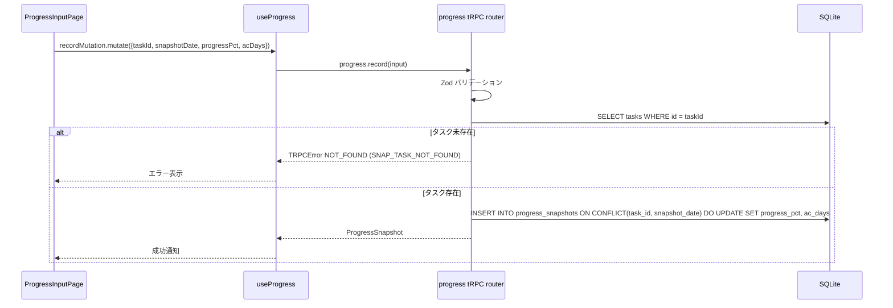
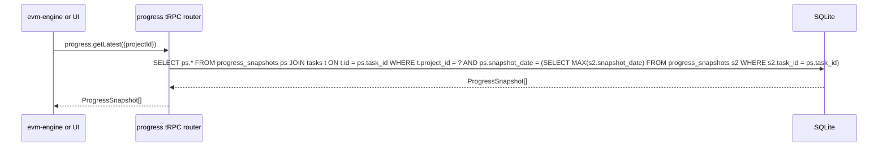

# 設計書: progress-tracking

## 概要

本スペックは EVM Studio の進捗記録機能を実装する。担当者・管理者が日次で実績工数（`ac_days`）と完了率（`progress_pct`）を記録する tRPC エンドポイント群と、ブラウザ上の日次入力フォームを提供する。

**目的**: `ProgressSnapshot` エンティティを (task_id, snapshot_date) キーで蓄積し、EVM エンジンが最新スナップショットを取得して EV/AC を計算できる API を確立する。

**ユーザー**: プロジェクト管理者・担当者がブラウザから日次進捗を入力する。EVM エンジン（downstream spec）が `progress.getLatest` を呼び出してメトリクスを計算する。

**影響**: `core-data-model` が定義した `progress_snapshots` テーブルを使用し、tRPC ルーターとクライアント UI を新規追加する。

### Goals

- `progress.record` / `getByDate` / `getLatest` / `getHistory` の 4 tRPC プロシージャを実装する
- 日次入力フォーム（`ProgressInputPage`）でワンアクション記録を実現する
- スナップショットの蓄積性（過去データ不変）を DB 制約と upsert ロジックで保証する
- EVM エンジンが必要とする「最新スナップショット一覧」を型安全に提供する

### Non-Goals

- EVM メトリクス（PV/EV/SPI/CPI）の計算（evm-engine スペックが担う）
- 進捗グラフ・チャートの描画（dashboard スペックが担う）
- ProgressSnapshot の削除エンドポイント（スナップショットは不変設計）
- WBS YAML インポート時の初回スナップショット作成（core-data-model が担う）

---

## Boundary Commitments

### This Spec Owns

- `server/src/api/progress.ts` — progress tRPC ルーター（4 プロシージャ）
- `server/src/router.ts` — 変更: progress ルーターをマウント（ファイル自体は core-data-model が所有）
- `client/src/pages/ProgressInputPage.tsx` — 日次入力フォームページ
- `client/src/hooks/useProgress.ts` — TanStack Query + tRPC クライアントフック
- `client/src/lib/trpc.ts` — tRPC クライアント設定
- `server/src/errors/codes.ts` への `SNAP_TASK_NOT_FOUND` エラーコード追加

### Out of Boundary

- `server/src/db/schema.ts` の `progressSnapshots` テーブル定義（core-data-model が所有）
- `server/src/db/index.ts` の DB 接続・マイグレーション実行（core-data-model が所有）
- `server/src/router.ts` — appRouter 定義（core-data-model が所有・新規作成）
- `server/src/index.ts` — Hono サーバー + tRPC ハンドラーマウント（core-data-model が所有・新規作成）、変更: tRPC ハンドラーマウント済み（変更不要）
- `server/src/errors/AppError.ts` クラス定義（core-data-model が所有・新規作成。`AppError.ts` は独立ファイルとして管理される）
- EVM 計算ロジック（evm-engine が担う）
- フィーバーチャート・SPI チャートなどの可視化（dashboard が担う）

### Allowed Dependencies

- `server/src/db/schema.ts` — `progressSnapshots`・`tasks` テーブル型（core-data-model 提供）
- `server/src/db/index.ts` — `db` インスタンス（core-data-model 提供）
- `server/src/errors/AppError.ts` — `AppError` クラス（core-data-model 提供）
- `server/src/errors/codes.ts` — `ErrorCode`（core-data-model 提供）
- `drizzle-orm` / `better-sqlite3` — DB クエリ
- `@trpc/server` — tRPC ルーター定義
- `zod` 4 — 入力バリデーション
- `pino` 10 — サーバーサイドログ
- `@trpc/react-query` — クライアント tRPC フック
- `@tanstack/react-query` — データフェッチ・キャッシュ

### Revalidation Triggers

以下の変更が発生した場合、progress-tracking は再確認が必要:

- `progressSnapshots` テーブルのカラム変更・削除（core-data-model が所有）
- `tasks` テーブルの `project_id` カラム変更
- `AppError` / `ErrorCode` 型定義の変更
- tRPC サーバーセットアップ（`router.ts`・`index.ts` の変更）

---

## Architecture

### Architecture Pattern & Boundary Map



依存方向: `errors/AppError.ts` + `errors/codes.ts` → `db/schema.ts` → `db/index.ts` → `api/progress.ts` → `router.ts` → `index.ts`

クライアント: `lib/trpc.ts` → `hooks/useProgress.ts` → `pages/ProgressInputPage.tsx`

### Technology Stack

| レイヤー | 選択 / バージョン | 役割 |
|---------|-----------------|------|
| Backend | Hono 4 + tRPC 11 | HTTP サーバー・progress tRPC エンドポイント |
| ORM | Drizzle ORM 0.45 | `progress_snapshots` クエリ（upsert・JOIN） |
| DB | better-sqlite3 | SQLite ドライバー（同期 API） |
| バリデーション | Zod 4 | tRPC 入力スキーマ |
| ロギング | pino 10 | サービス層ログ（task_id・project_id のみ） |
| Frontend | React 19 + TanStack Query 5 | 日次入力フォーム・データフェッチ |
| tRPC Client | @trpc/react-query | 型安全クライアントフック |

---

## File Structure Plan

### Directory Structure

```
evm-studio/
├── server/
│   └── src/
│       ├── index.ts                     # 変更: tRPC ハンドラーマウント済み（変更不要）
│       ├── router.ts                    # 変更: progress ルーターをマウント
│       ├── errors/
│       │   └── codes.ts                 # 変更: SNAP_TASK_NOT_FOUND エラーコード追加
│       └── api/
│           └── progress.ts              # 新規: progress tRPC ルーター（4 プロシージャ）
├── client/
│   └── src/
│       ├── lib/
│       │   └── trpc.ts                  # 新規: tRPC クライアント + QueryClient 設定
│       ├── hooks/
│       │   └── useProgress.ts           # 新規: progress tRPC クライアントフック
│       ├── pages/
│       │   └── ProgressInputPage.tsx    # 新規: 日次進捗入力フォームページ
│       └── App.tsx                      # 変更: QueryClientProvider + trpcClient プロバイダー + ルート追加
```

### Modified Files

- `evm-studio/server/src/router.ts` — progress ルーターをマウント（ファイル自体は core-data-model が新規作成・所有）
- `evm-studio/server/src/errors/codes.ts` — `SNAP_TASK_NOT_FOUND` を `ErrorCode` に追加
- `evm-studio/client/src/App.tsx` — `QueryClientProvider` と tRPC プロバイダーを追加、`ProgressInputPage` へのルートを追加

---

## System Flows

### 進捗記録フロー（progress.record）



### 最新スナップショット取得フロー（progress.getLatest）



---

## Requirements Traceability

| 要件 | 概要 | コンポーネント | インターフェース |
|------|------|---------------|----------------|
| 1.1–1.7 | スナップショット upsert | ProgressRouter | `progress.record` tRPC |
| 2.1–2.4 | 指定日付スナップショット取得 | ProgressRouter | `progress.getByDate` tRPC |
| 3.1–3.4 | 最新スナップショット一括取得 | ProgressRouter | `progress.getLatest` tRPC |
| 4.1–4.3 | タスク履歴取得 | ProgressRouter | `progress.getHistory` tRPC |
| 5.1–5.8 | 日次入力フォーム UI | ProgressInputPage, useProgress | tRPC クライアントフック |
| 6.1–6.4 | エラーハンドリング・型安全 | ProgressRouter, ErrorCodes | AppError, TRPCError |

---

## Components and Interfaces

### コンポーネントサマリー

| コンポーネント | レイヤー | Intent | 要件カバレッジ | 主要依存 |
|--------------|---------|--------|--------------|---------|
| ProgressRouter | API | progress 4 tRPC プロシージャ | 1.1–1.7, 2.1–2.4, 3.1–3.4, 4.1–4.3, 6.1–6.4 | DrizzleClient, AppError |
| ErrorCodes | Error | SNAP_* エラーコード追加 | 6.3 | — |
| ProgressInputPage | UI | 日次入力フォーム | 5.1–5.8 | useProgress |
| useProgress | Hook | TanStack Query tRPC フック | 5.1–5.8 | trpc client |
| TRPCClient | Client Infra | tRPC クライアント設定 | 5.1–5.8 | @trpc/react-query |

---

### API レイヤー

#### ProgressRouter

| フィールド | 詳細 |
|-----------|------|
| Intent | progress_snapshots の upsert・取得 tRPC プロシージャを提供する |
| Requirements | 1.1–1.7, 2.1–2.4, 3.1–3.4, 4.1–4.3, 6.1–6.4 |

**責任と制約**

- Zod スキーマによる全プロシージャの入力バリデーション（要件 6.1）
- `AppError` → `TRPCError` 変換（要件 6.2）
- `SNAP_TASK_NOT_FOUND` エラーコードの参照（要件 6.3）
- ログに個人名を含めず `task_id`・`project_id` のみ記録（要件 6.4）
- `progress.record` は Drizzle `onConflictDoUpdate` で upsert（要件 1.1）
- 過去スナップショットを変更・削除しない（要件 1.7）

**コントラクト**: API [x]

##### API コントラクト

| プロシージャ | 入力スキーマ（Zod） | 戻り値 | エラー |
|------------|-------------------|--------|--------|
| `progress.record` | `recordProgressSchema` | `ProgressSnapshot` | SNAP_TASK_NOT_FOUND, BAD_REQUEST |
| `progress.getByDate` | `{ projectId: z.number().int().positive(), snapshotDate: dateString }` | `ProgressSnapshot[]` | — |
| `progress.getLatest` | `{ projectId: z.number().int().positive() }` | `ProgressSnapshot[]` | — |
| `progress.getHistory` | `{ taskId: z.number().int().positive() }` | `ProgressSnapshot[]` | — |

```typescript
// server/src/api/progress.ts

const dateString = z.string().regex(/^\d{4}-\d{2}-\d{2}$/)

const recordProgressSchema = z.object({
  taskId:       z.number().int().positive(),
  snapshotDate: dateString,
  progressPct:  z.number().int().min(0).max(100),
  acDays:       z.number().nonnegative(),
})

// progress.record — upsert
// progress.getByDate — tasks JOIN でプロジェクト内タスクをフィルタ、task_id 昇順
// progress.getLatest — 各タスクの MAX(snapshot_date) レコードを返す
// progress.getHistory — task_id でフィルタ、snapshot_date 昇順
```

**実装ノート**

- `progress.record`: `db.insert(progressSnapshots).values(newRecord).onConflictDoUpdate({ target: [progressSnapshots.taskId, progressSnapshots.snapshotDate], set: { progressPct: sql`excluded.progress_pct`, acDays: sql`excluded.ac_days` } })`
- `progress.getLatest`: `tasks` テーブルと JOIN し、各タスクの MAX(snapshot_date) を持つレコードのみを返す相関サブクエリを使用
- `progress.getByDate`: `tasks.project_id = input.projectId` AND `ps.snapshot_date = input.snapshotDate` の条件で JOIN クエリ

---

### エラーレイヤー

#### ErrorCodes（変更）

| フィールド | 詳細 |
|-----------|------|
| Intent | SNAP_TASK_NOT_FOUND エラーコードを追加する |
| Requirements | 6.3 |

**コントラクト**: Service [x]

```typescript
// server/src/errors/codes.ts への追加
export const ErrorCode = {
  // ... 既存コード ...
  // Snapshot
  SNAP_TASK_NOT_FOUND: 'SNAP_TASK_NOT_FOUND',
} as const
```

tRPC エラーマッピング:
```typescript
const codeMap: Record<string, TRPCError['code']> = {
  SNAP_TASK_NOT_FOUND: 'NOT_FOUND',
  // ...
}
```

---

### クライアントインフラ

#### TRPCClient（trpc.ts）

| フィールド | 詳細 |
|-----------|------|
| Intent | tRPC クライアントと QueryClient を設定し、型安全なクライアントを提供する |
| Requirements | 5.1–5.8 |

**コントラクト**: Service [x]

```typescript
// client/src/lib/trpc.ts
import { createTRPCReact } from '@trpc/react-query'
import type { AppRouter } from '../../server/src/router'

export const trpc = createTRPCReact<AppRouter>()
```

---

### フロントエンドレイヤー

#### useProgress（フック）

| フィールド | 詳細 |
|-----------|------|
| Intent | progress tRPC プロシージャへの TanStack Query フックを提供する |
| Requirements | 5.1–5.8 |

**コントラクト**: Service [x]

```typescript
// client/src/hooks/useProgress.ts

// useProgressByDate(projectId, snapshotDate): 既存スナップショットの初期値取得（要件 5.8）
// useRecordProgress(): mutation フック（要件 5.3）
// useProjects(): プロジェクト一覧取得（要件 5.1）
// useTasksByProject(projectId): タスク一覧取得（要件 5.2）
```

**実装ノート**

- `useProgressByDate` は `trpc.progress.getByDate.useQuery({ projectId, snapshotDate }, { enabled: !!projectId && !!snapshotDate })` を使用
- `useRecordProgress` は `trpc.progress.record.useMutation()` を使用
- キャッシュ無効化: mutation 成功後に `['trpc', 'progress', 'getByDate']` を invalidate

---

#### ProgressInputPage

| フィールド | 詳細 |
|-----------|------|
| Intent | プロジェクト・日付を選択してタスクごとの progress_pct・ac_days を入力・保存する日次フォームページ |
| Requirements | 5.1–5.8 |

**コントラクト**: State [x]

**ステート管理**

- `selectedProjectId: number | null` — プロジェクトドロップダウン
- `selectedDate: string` — 日付フィールド（ISO 形式、初期値: today）
- `inputs: Record<number, { progressPct: string; acDays: string }>` — タスクIDをキーとした入力値マップ

**UI 構造**

1. プロジェクトセレクト（`projects.list` から取得）
2. 日付インプット（`<input type="date">`）
3. タスクテーブル（`tasks.listByProject` から取得。`is_leaf=true` のみ表示）
   - 列: タスク名 / progress_pct 入力（0-100 整数） / ac_days 入力（0 以上）
4. 保存ボタン
5. 成功・エラートースト

**バリデーション**

- `progressPct` が 0 未満または 100 超: フォーム送信前に「0〜100 の整数を入力してください」を表示（要件 5.6）
- `acDays` が負の値: フォーム送信前に「0 以上の数値を入力してください」を表示（要件 5.7）

**実装ノート**

- `useProgressByDate` で既存スナップショットを取得し、`inputs` の初期値に設定する（要件 5.8）
- 保存ボタン押下時、入力のある全タスクに対して `recordMutation.mutateAsync` を並列実行（`Promise.all`）する
- `is_leaf` でない（サマリータスク）は入力行を表示しない

---

## データモデル

### ProgressSnapshot（core-data-model 定義済み、参照のみ）

```
ProgressSnapshot {
  id:           INTEGER PK
  task_id:      INTEGER FK → tasks.id (CASCADE DELETE)
  snapshot_date: TEXT (YYYY-MM-DD)
  progress_pct: REAL (0–100)
  ac_days:      REAL (≥ 0)
  created_at:   INTEGER (timestamp)
  UNIQUE(task_id, snapshot_date)
}
```

**不変条件**: `(task_id, snapshot_date)` がユニーク制約のため、同一日付の upsert は既存レコードを更新する（別レコードを追加しない）。過去日付のスナップショットは変更されない。

### 追加インデックス（パフォーマンス）

```sql
CREATE INDEX idx_progress_snapshots_task_date
  ON progress_snapshots(task_id, snapshot_date DESC);
```

`getLatest` の相関サブクエリと `getHistory` のソートを高速化する。

---

## エラーハンドリング

### エラー戦略

| エラー種別 | 発生箇所 | 対応 |
|-----------|---------|------|
| 入力バリデーション失敗 | tRPC ルーター（Zod） | TRPCError BAD_REQUEST として返す |
| タスク未存在 | progress.record | AppError(SNAP_TASK_NOT_FOUND) → TRPCError NOT_FOUND |
| DB エラー | Drizzle クエリ | 上位に再 throw（tRPC が INTERNAL_SERVER_ERROR に変換） |
| クライアントバリデーション | ProgressInputPage | 送信前インライン表示、ミューテーション実行しない |

### モニタリング

- `hono/logger` ミドルウェア: HTTP リクエストログ（`index.ts`）
- `pino`: progress.record 実行時に `{ taskId, snapshotDate }` をログ出力（個人名なし）

---

## テスト戦略

### サーバー単体テスト（Vitest）

| テスト対象 | テスト内容 | 要件 |
|-----------|----------|------|
| `progress.ts` router | progress.record: 新規スナップショット作成 | 1.1, 1.6 |
| `progress.ts` router | progress.record: 同一(task_id, date)の upsert | 1.1 |
| `progress.ts` router | progress.record: progress_pct 範囲外でバリデーションエラー | 1.2 |
| `progress.ts` router | progress.record: タスク未存在で SNAP_TASK_NOT_FOUND | 1.5 |
| `progress.ts` router | progress.getLatest: 複数日付から最新のみ返す | 3.1, 3.2 |
| `progress.ts` router | progress.getHistory: 時系列昇順で返す | 4.1 |
| `progress.ts` router | 過去スナップショットが record upsert で変更されないこと | 1.7 |

### E2E テスト（Playwright）

| テストフロー | 内容 | 要件 |
|------------|------|------|
| 進捗入力 → 確認 | プロジェクト選択 → 日付選択 → progress_pct・ac_days 入力 → 保存 → 成功通知表示 | 5.1–5.4 |
| バリデーション | progress_pct=101 で保存ボタン押下 → クライアントバリデーションエラー表示 | 5.6 |
