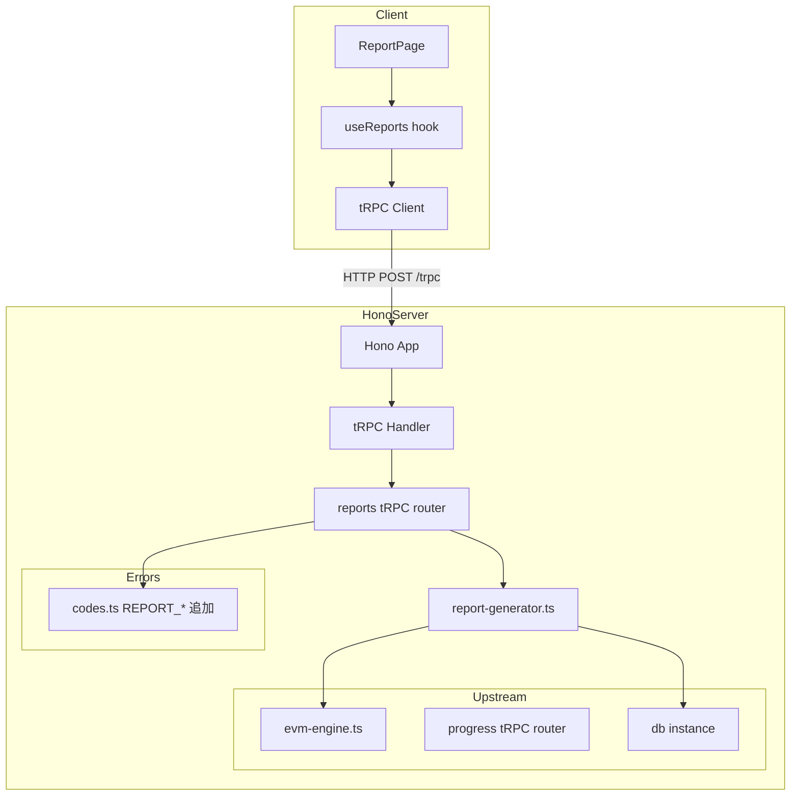
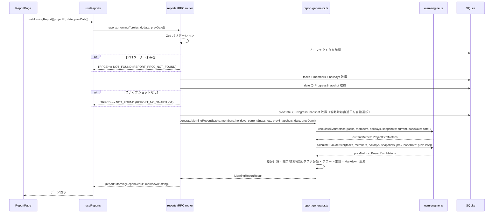

# 設計書: reporting

## 概要

本スペックは EVM Studio のレポート生成機能を実装する。`server/src/services/report-generator.ts` に evm-engine の純粋関数と progress-tracking のスナップショットを結合するサービス層を追加し、tRPC ルーター（`reports.morning` / `reports.delayed` / `reports.summary`）でクライアントに提供する。クライアントは `ReportPage` でレンダリング済み Markdown を表示し、`.md` ファイルのダウンロードを可能にする。

**目的**: 毎朝の進捗報告を手動集計なしで正確に生成し、プロジェクト管理者が定型フォーマットのレポートを即座に入手できるようにする。

**ユーザー**: プロジェクト管理者・担当者がブラウザから朝報を確認・ダウンロードする。API コンシューマー（将来のダッシュボード拡張等）が JSON 形式でメトリクスを取得する。

**影響**: `evm-studio/server/src/services/` に `report-generator.ts`、`server/src/api/` に `reports.ts` を新規追加する。`server/src/router.ts` に reports ルーターをマウントし、`client/src/` に `ReportPage.tsx`・`useReports.ts` を追加する。

### Goals

- evm-engine の `calculateEvmMetrics` を呼び出して前日比差分付き朝報を生成する
- SPI < 0.9 または `planned_end` 超過未完了タスクを遅延タスクとして抽出する
- 全 EVM メトリクス（BAC/EAC/VAC/ETC/TCPI）サマリーを一括提供する
- JSON と Markdown 二重出力でダッシュボードと Slack/Teams の両用途に対応する

### Non-Goals

- EVM 計算ロジック（evm-engine が担う）
- 進捗データの永続化（progress-tracking が担う）
- メール送信・Slack 通知・外部連携
- 認証・認可（ローカルファーストのため不要）
- レポートの DB 永続化・スケジュール実行

---

## Boundary Commitments

### This Spec Owns

- `server/src/services/report-generator.ts` — レポート生成ロジック（朝報・遅延一覧・EVM サマリー）
- `server/src/api/reports.ts` — tRPC ルーター（`reports.morning` / `reports.delayed` / `reports.summary`）
- `server/src/services/report-generator.test.ts` — report-generator 単体テスト（Vitest 4）
- `client/src/pages/ReportPage.tsx` — レポート表示・Markdown ダウンロード UI
- `client/src/hooks/useReports.ts` — TanStack Query + tRPC クライアントフック
- `server/src/errors/codes.ts` への `REPORT_*` エラーコード追加

### Out of Boundary

- EVM 計算（evm-engine が所有する `calculateEvmMetrics`, `evaluateAlertLevel` 等）
- `ProgressSnapshot` の CRUD・スナップショット取得（progress-tracking が所有）
- `tasks`・`members`・`projects` テーブル定義（core-data-model が所有）
- フィーバーチャート・SPI トレンドチャート描画（dashboard が所有）

### Allowed Dependencies

- `server/src/services/evm-engine.ts` — `calculateEvmMetrics`, `evaluateAlertLevel` のインポート（evm-engine 提供）
- `server/src/db/schema.ts` — `Task`, `Member`, `ProgressSnapshot`, `Project` 型（core-data-model 提供）
- `server/src/db/index.ts` — `db` インスタンス（core-data-model 提供）
- `server/src/router.ts` — `appRouter` への reports マウント（progress-tracking が作成済み）
- `server/src/errors/codes.ts` — `AppError`・`ErrorCode`（既存ファイルへの追記）
- `@trpc/server`, `zod 4`, `pino 10`, `drizzle-orm`, `@trpc/react-query`, `@tanstack/react-query`

### Revalidation Triggers

以下の変更が発生した場合、本スペックは統合確認を実施すること:

- `ProjectEvmMetrics`・`TaskEvmMetrics` 型の変更（evm-engine が所有）
- `calculateEvmMetrics`・`evaluateAlertLevel` のシグネチャ変更
- `ProgressSnapshot` テーブルの `progress_pct`・`snapshot_date` カラム変更
- `Task.plannedEnd`・`Task.isBuffer` カラムの変更
- `progress.getByDate`・`progress.getLatest`・`progress.getHistory` プロシージャの変更

---

## Architecture

### Architecture Pattern & Boundary Map



依存方向: `errors/codes.ts` → `db/schema.ts` → `db/index.ts` → `services/evm-engine.ts` → `services/report-generator.ts` → `api/reports.ts` → `router.ts`

クライアント: `lib/trpc.ts` → `hooks/useReports.ts` → `pages/ReportPage.tsx`

### Technology Stack

| レイヤー | 選択 / バージョン | 本フィーチャーでの役割 | 備考 |
|---------|-----------------|---------------------|------|
| Backend | TypeScript 5 + Node.js 22 | report-generator サービス + tRPC ルーター | strict モード必須 |
| API | Hono 4 + tRPC 11 | `reports.*` エンドポイント | REST ではなく tRPC |
| バリデーション | Zod 4 | tRPC 入力スキーマ | |
| ORM | Drizzle ORM 0.45 | tasks / members / projects クエリ | |
| ロギング | pino 10 | サービス層ログ（task_id・project_id のみ） | |
| Frontend | React 19 + TailwindCSS 4 | ReportPage UI | |
| データフェッチ | TanStack Query 5 + @trpc/react-query | useReports フック | |
| テスト | Vitest 4 | report-generator 単体テスト | |

---

## File Structure Plan

### Directory Structure

```
evm-studio/
├── server/
│   └── src/
│       ├── services/
│       │   ├── report-generator.ts        # 新規: 朝報・遅延一覧・EVM サマリー生成ロジック
│       │   └── report-generator.test.ts   # 新規: report-generator 単体テスト（Vitest 4）
│       ├── api/
│       │   └── reports.ts                 # 新規: reports tRPC ルーター（3 プロシージャ）
│       ├── router.ts                      # 変更: reports ルーターをマウント
│       └── errors/
│           └── codes.ts                   # 変更: REPORT_NO_SNAPSHOT, REPORT_PROJ_NOT_FOUND 追加
├── client/
│   └── src/
│       ├── pages/
│       │   └── ReportPage.tsx             # 新規: レポート表示・Markdown ダウンロード
│       ├── hooks/
│       │   └── useReports.ts              # 新規: reports tRPC クライアントフック
│       └── App.tsx                        # 変更: /reports ルートを追加
```

### Modified Files

- `evm-studio/server/src/router.ts` — `reportsRouter` を `appRouter` にマウント
- `evm-studio/server/src/errors/codes.ts` — `REPORT_NO_SNAPSHOT`・`REPORT_PROJ_NOT_FOUND` を追加
- `evm-studio/client/src/App.tsx` — `/reports` ルートと `<ReportPage />` を追加

---

## System Flows

### 朝報生成フロー（reports.morning）



---

## Requirements Traceability

| 要件 | 概要 | コンポーネント | インターフェース |
|------|------|--------------|----------------|
| 1.1–1.7 | 朝報生成（メトリクス・差分・分類・Markdown） | ReportGenerator, ReportsRouter | `generateMorningReport`, `reports.morning` |
| 1.8–1.10 | 朝報エラー処理 | ReportsRouter, ErrorCodes | TRPCError, AppError |
| 2.1–2.5 | 遅延タスク一覧 | ReportGenerator, ReportsRouter | `extractDelayedTasks`, `reports.delayed` |
| 3.1–3.5 | EVM サマリー | ReportGenerator, ReportsRouter | `generateEvmSummary`, `reports.summary` |
| 4.1–4.3 | JSON/Markdown 出力形式 | ReportGenerator | `MorningReportResult`, `renderMarkdown` |
| 5.1–5.6 | ReportPage UI | ReportPage, useReports | tRPC クライアントフック |
| 6.1–6.4 | エラーハンドリング・型安全 | ReportsRouter, ErrorCodes | AppError, TRPCError, Zod |

---

## Components and Interfaces

### コンポーネントサマリー

| コンポーネント | レイヤー | Intent | 要件カバレッジ | 主要依存 |
|--------------|---------|--------|--------------|---------|
| ReportGenerator | Service | 朝報・遅延一覧・EVM サマリー生成純粋関数 | 1.1–1.7, 2.1–2.4, 3.1–3.4, 4.1–4.3 | EvmEngine |
| ReportsRouter | API | reports 3 tRPC プロシージャ | 1.8–1.10, 2.5, 3.5, 6.1–6.4 | ReportGenerator, DrizzleClient |
| ErrorCodes | Error | REPORT_* エラーコード追加 | 6.3 | — |
| ReportPage | UI | レポート表示・Markdown ダウンロード | 5.1–5.6 | useReports |
| useReports | Hook | reports tRPC クライアントフック | 5.1–5.6 | trpc client |

---

### サービスレイヤー

#### ReportGenerator

| フィールド | 詳細 |
|-----------|------|
| Intent | evm-engine の計算結果と progress スナップショットを結合して朝報・遅延一覧・EVM サマリーを生成する純粋関数群 |
| Requirements | 1.1–1.7, 2.1–2.4, 3.1–3.4, 4.1–4.3 |

**責任と制約**

- DB アクセスを持たない。全データは呼び出し側（ReportsRouter）から引数で受け取る
- evm-engine の `calculateEvmMetrics` を呼び出して計算を委譲する（EVM 計算ロジックを重複させない）
- `is_buffer = true` のタスクを遅延タスク一覧から除外する
- 遅延判定: SPI < 0.9 OR (`planned_end < baseDate` AND `progress_pct < 100`)
- Markdown 生成は純粋な文字列操作のみで行い、外部ライブラリを使用しない
- TypeScript strict モード準拠、`any` 型禁止

**依存関係**

- Inbound: ReportsRouter — 朝報・遅延・サマリー生成 (P0)
- Outbound: `services/evm-engine.ts` — `calculateEvmMetrics`, `evaluateAlertLevel`, `ProjectEvmMetrics` (P0)
- Outbound: `db/schema.ts` — `Task`, `Member`, `ProgressSnapshot`, `Holiday` 型参照 (P0)

**コントラクト**: Service [x]

##### Service Interface

```typescript
// server/src/services/report-generator.ts

import type { Task, Member, ProgressSnapshot, Holiday } from '../db/schema'
import type { ProjectEvmMetrics, TaskEvmMetrics } from './evm-engine'
import { calculateEvmMetrics, evaluateAlertLevel } from './evm-engine'

// --- 入力型 ---

export interface ReportInput {
  tasks: Task[]
  members: Member[]
  holidays: Holiday[]
  snapshots: ProgressSnapshot[]
  baseDate: string              // 'YYYY-MM-DD'
}

// --- 出力型 ---

export interface TaskSummary {
  taskId: number
  taskName: string
  assigneeName: string | null
  progressPct: number
  prevProgressPct: number
}

export interface DelayedTaskSummary {
  taskId: number
  taskName: string
  assigneeName: string | null
  spi: number | null
  cpi: number | null
  progressPct: number
  plannedEnd: string
  alertLevel: string
}

export interface AlertSummary {
  criticalCount: number
  warningCount: number
}

export interface MorningReportData {
  projectSummary: {
    bac: number
    eac: number | null
    vac: number | null
    spi: number | null
    cpi: number | null
  }
  delta: {
    deltaSpi: number | null
    deltaEv: number
  }
  completedTasks: TaskSummary[]      // progress_pct: <100% → 100%
  progressedTasks: TaskSummary[]     // progress_pct 増加 & < 100%
  delayedTasks: DelayedTaskSummary[]
  alertSummary: AlertSummary
  date: string
  prevDate: string
}

export interface MorningReportResult {
  data: MorningReportData
  markdown: string
}

export interface EvmSummary {
  bac: number
  pv: number
  ev: number
  ac: number
  spi: number | null
  cpi: number | null
  eac: number | null
  vac: number | null
  etc: number | null
  tcpi: number | null
}

// --- 公開関数 ---

/**
 * 朝報を生成する（前日比差分付き）
 *
 * @param currentInput - 対象日の EVM 入力データ
 * @param prevSnapshots - 前回スナップショット（差分計算用）
 * @param prevDate - 前回スナップショット日（'YYYY-MM-DD'）
 * @returns 朝報データと Markdown 文字列
 */
export function generateMorningReport(
  currentInput: ReportInput,
  prevSnapshots: ProgressSnapshot[],
  prevDate: string,
): MorningReportResult

/**
 * 遅延タスクを抽出する
 *
 * 遅延条件: SPI < minSpi OR (planned_end < baseDate AND progress_pct < 100)
 * is_buffer=true タスクは除外する
 *
 * @param input - EVM 入力データ（tasks + snapshots）
 * @param minSpi - SPI 遅延閾値（デフォルト 0.9）
 * @returns 遅延タスク一覧
 */
export function extractDelayedTasks(
  input: ReportInput,
  minSpi?: number,
): DelayedTaskSummary[]

/**
 * EVM サマリーを生成する
 *
 * @param input - EVM 入力データ
 * @returns BAC/EAC/VAC/ETC/TCPI/SPI/CPI/PV/EV/AC
 */
export function generateEvmSummary(input: ReportInput): EvmSummary

/**
 * Markdown 形式の朝報を生成する（内部ユーティリティ・テスト用にエクスポート）
 *
 * @param data - 朝報データ
 * @param projectName - プロジェクト名
 * @returns Markdown 文字列
 */
export function renderMorningMarkdown(
  data: MorningReportData,
  projectName: string,
): string
```

**実装ノート**

- `generateMorningReport`:
  1. `calculateEvmMetrics(currentInput)` で当日メトリクスを取得
  2. `calculateEvmMetrics({ ...currentInput, snapshots: prevSnapshots, baseDate: prevDate })` で前日メトリクスを取得
  3. `deltaSpi = currentMetrics.spi !== null && prevMetrics.spi !== null ? currentMetrics.spi - prevMetrics.spi : null`
  4. `deltaEv = currentMetrics.ev - prevMetrics.ev`
  5. タスク分類: スナップショット比較で完了/進捗/遅延を仕分ける
  6. アラート集計: `taskMetrics` から CRITICAL_DELAY・WARNING_DELAY 件数を集計
  7. `renderMorningMarkdown` で Markdown 文字列を生成

- `extractDelayedTasks`:
  - `calculateEvmMetrics(input)` の `taskMetrics` を利用
  - `task.isBuffer === true` を除外
  - 遅延条件を OR で評価

- `renderMorningMarkdown`:
  - 外部ライブラリ不使用の純粋な文字列テンプレート
  - 見出し: `# 朝報 {projectName} - {date}` 形式
  - プロジェクトサマリー表・完了タスク・進捗タスク・遅延タスク表・アラート集計を順に出力

---

### API レイヤー

#### ReportsRouter

| フィールド | 詳細 |
|-----------|------|
| Intent | reports 3 tRPC プロシージャを提供し、DB からデータを集約して ReportGenerator に渡す |
| Requirements | 1.8–1.10, 2.5, 3.5, 6.1–6.4 |

**責任と制約**

- Zod スキーマによる全プロシージャの入力バリデーション（要件 6.1）
- `AppError` → `TRPCError` 変換（要件 6.2）
- `progress.getByDate` の代わりに DB を直接クエリする（reports は server-side サービスのため tRPC 呼び出しは不要）
- `prevDate` 省略時: 対象日より前の最新 `snapshot_date` を `MAX(snapshot_date) WHERE snapshot_date < date` で取得
- ログに個人名を含めず `project_id`・`snapshot_date` のみ記録（要件 6.4）

**コントラクト**: API [x]

##### API Contract

| プロシージャ | 入力スキーマ（Zod） | 戻り値 | エラー |
|------------|-------------------|--------|--------|
| `reports.morning` | `{ projectId: z.number().int().positive(), date: dateString, prevDate?: dateString }` | `MorningReportResult` | REPORT_PROJ_NOT_FOUND, REPORT_NO_SNAPSHOT, BAD_REQUEST |
| `reports.delayed` | `{ projectId: z.number().int().positive(), baseDate: dateString, minSpi?: z.number().min(0).max(1) }` | `DelayedTaskSummary[]` | REPORT_PROJ_NOT_FOUND, BAD_REQUEST |
| `reports.summary` | `{ projectId: z.number().int().positive(), baseDate: dateString }` | `EvmSummary` | REPORT_PROJ_NOT_FOUND, BAD_REQUEST |

```typescript
// server/src/api/reports.ts

const dateString = z.string().regex(/^\d{4}-\d{2}-\d{2}$/)

const morningReportSchema = z.object({
  projectId: z.number().int().positive(),
  date: dateString,
  prevDate: dateString.optional(),
})

const delayedSchema = z.object({
  projectId: z.number().int().positive(),
  baseDate: dateString,
  minSpi: z.number().min(0).max(1).optional().default(0.9),
})

const summarySchema = z.object({
  projectId: z.number().int().positive(),
  baseDate: dateString,
})
```

**実装ノート**

- `reports.morning`:
  1. プロジェクト存在確認 → 未存在で `AppError(REPORT_PROJ_NOT_FOUND)` → `TRPCError(NOT_FOUND)`
  2. 対象日のスナップショットを `SELECT FROM progress_snapshots JOIN tasks WHERE project_id = ? AND snapshot_date = ?` で取得
  3. スナップショットが空なら `AppError(REPORT_NO_SNAPSHOT)` → `TRPCError(NOT_FOUND)`
  4. `prevDate` 省略時: `SELECT MAX(snapshot_date) FROM progress_snapshots JOIN tasks WHERE project_id = ? AND snapshot_date < ?`
  5. tasks・members・holidays を取得して `ReportInput` を組み立て、`generateMorningReport` に渡す

---

### エラーレイヤー

#### ErrorCodes（変更）

| フィールド | 詳細 |
|-----------|------|
| Intent | REPORT_* エラーコードを追加する |
| Requirements | 6.3 |

```typescript
// server/src/errors/codes.ts への追加
export const ErrorCode = {
  // ... 既存コード ...
  // Report
  REPORT_NO_SNAPSHOT:     'REPORT_NO_SNAPSHOT',
  REPORT_PROJ_NOT_FOUND:  'REPORT_PROJ_NOT_FOUND',
} as const
```

tRPC エラーマッピング:
```typescript
REPORT_NO_SNAPSHOT:    'NOT_FOUND',
REPORT_PROJ_NOT_FOUND: 'NOT_FOUND',
```

---

### フロントエンドレイヤー

#### useReports（フック）

| フィールド | 詳細 |
|-----------|------|
| Intent | reports tRPC プロシージャへの TanStack Query フックを提供する |
| Requirements | 5.1–5.6 |

**コントラクト**: Service [x]

```typescript
// client/src/hooks/useReports.ts

// useMorningReport(projectId, date, prevDate?): 朝報取得クエリ（要件 5.2）
// useDelayedTasks(projectId, baseDate, minSpi?): 遅延タスク取得クエリ
// useEvmSummary(projectId, baseDate): EVM サマリー取得クエリ
// useProjects(): プロジェクト一覧取得（要件 5.1）
```

**実装ノート**

- `useMorningReport`: `trpc.reports.morning.useQuery({ projectId, date, prevDate }, { enabled: !!projectId && !!date })` を使用
- エラー時は TanStack Query の `error` state でトーストに渡す（要件 5.5）

---

#### ReportPage

| フィールド | 詳細 |
|-----------|------|
| Intent | プロジェクト・日付を選択して朝報を表示し、Markdown ダウンロードを提供するページ |
| Requirements | 5.1–5.6 |

**コントラクト**: State [x]

**ステート管理**

- `selectedProjectId: number | null` — プロジェクトドロップダウン
- `selectedDate: string` — 日付フィールド（ISO 形式、初期値: today）

**UI 構造**

1. プロジェクトセレクト（`projects.list` から取得）
2. 日付インプット（`<input type="date">`）
3. 朝報 Markdown 表示エリア（`<pre>` または `react-markdown` でレンダリング）
4. 「.md としてダウンロード」ボタン（Blob + URL.createObjectURL）
5. 遅延タスクテーブル（タスク名・担当者・SPI・planned_end・alert_level 列）
6. ローディングインジケーター・エラートースト

**実装ノート**

- Markdown ダウンロード: `new Blob([markdown], { type: 'text/markdown' })` → `<a download="morning-report-{date}.md">` をプログラム的にクリック
- `dangerouslySetInnerHTML` 禁止（tech.md セキュリティルール）。Markdown は `<pre>` タグか安全なレンダラーで表示
- ローディング中は `useMorningReport.isLoading` をチェックして spinner 表示

---

## データモデル

### 新規データモデルなし

本スペックは新規テーブルを定義しない。core-data-model・progress-tracking が定義済みの以下のテーブルを読み取り専用で使用する。

| テーブル | 参照フィールド | 用途 |
|---------|-------------|------|
| `projects` | `id`, `name`, `startDate`, `endDate` | プロジェクト存在確認・名前取得 |
| `tasks` | `id`, `name`, `projectId`, `estimateDays`, `plannedStart`, `plannedEnd`, `assigneeId`, `isBuffer`, `isLeaf` | EVM 計算・遅延判定 |
| `members` | `id`, `name`, `availabilityRate` | PV 計算・担当者名取得 |
| `progress_snapshots` | `taskId`, `snapshotDate`, `progressPct`, `acDays` | EV/AC 計算・差分計算 |
| `holidays` | `date` | 稼働日数計算 |

---

## Error Handling

### エラー戦略

| エラー種別 | 発生箇所 | 対応 |
|-----------|---------|------|
| 入力バリデーション失敗 | tRPC ルーター（Zod） | TRPCError BAD_REQUEST として返す |
| プロジェクト未存在 | reports.* | AppError(REPORT_PROJ_NOT_FOUND) → TRPCError NOT_FOUND |
| スナップショット未存在 | reports.morning | AppError(REPORT_NO_SNAPSHOT) → TRPCError NOT_FOUND |
| DB エラー | Drizzle クエリ | 上位に再 throw（tRPC が INTERNAL_SERVER_ERROR に変換） |
| クライアントエラー | ReportPage | TanStack Query error state → トースト表示 |

### Monitoring

- `pino`: reports.morning 実行時に `{ projectId, date }` をログ出力（個人名なし）
- `hono/logger` ミドルウェア: HTTP リクエストログ（既存）

---

## Testing Strategy

### サーバー単体テスト（Vitest 4）

`server/src/services/report-generator.test.ts` に以下をカバーする:

| テスト対象 | テスト内容 | 要件 |
|-----------|----------|------|
| `generateMorningReport` | 正常系: 前日比 ΔSPI・ΔEV の算出 | 1.2 |
| `generateMorningReport` | 完了タスク分類（prev < 100 → current = 100） | 1.3 |
| `generateMorningReport` | 進捗ありタスク分類（prev < current < 100） | 1.4 |
| `generateMorningReport` | 遅延タスク分類（SPI < 0.9 OR overdue） | 1.5 |
| `generateMorningReport` | アラート集計（CRITICAL/WARNING 件数） | 1.6 |
| `extractDelayedTasks` | SPI < 0.9 で遅延判定 | 2.1 |
| `extractDelayedTasks` | planned_end 超過未完了で遅延判定 | 2.2 |
| `extractDelayedTasks` | is_buffer=true を除外 | 2.4 |
| `extractDelayedTasks` | minSpi カスタム値の適用 | 2.1 |
| `generateEvmSummary` | 全メトリクス（BAC/EAC/VAC/ETC/TCPI）算出 | 3.1 |
| `generateEvmSummary` | PV=0 時 SPI=null | 3.2 |
| `renderMorningMarkdown` | Markdown に必要セクション全て含まれる | 4.2 |

### E2E テスト（Playwright）

| テストフロー | 内容 | 要件 |
|------------|------|------|
| 朝報表示 | プロジェクト選択 → 日付選択 → 朝報表示確認 | 5.1, 5.2 |
| Markdown ダウンロード | ダウンロードボタン押下 → .md ファイルダウンロード確認 | 5.3 |
