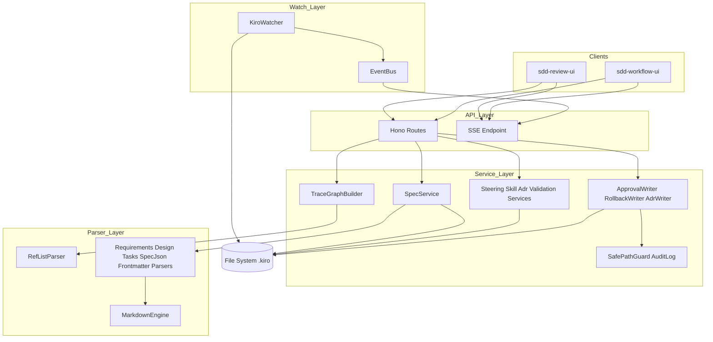
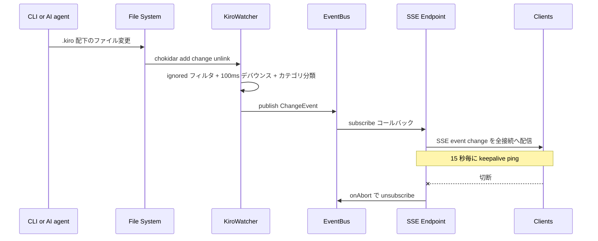
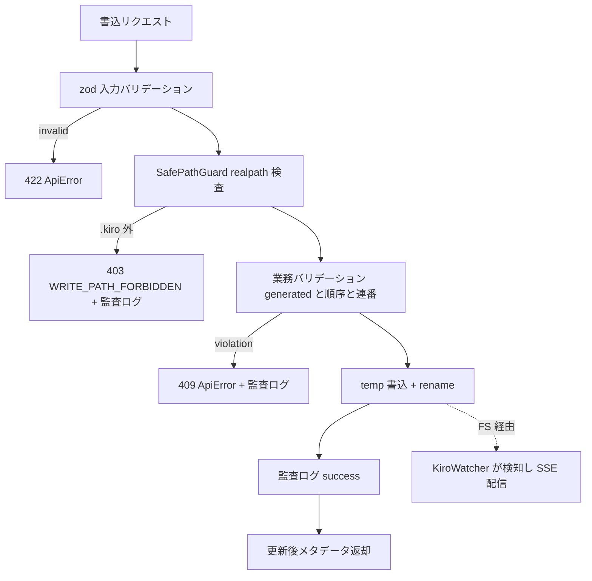

# Design Document: sdd-core

## Overview

**Purpose**: sdd-core は SDD Dashboard のデータ/API 層として、任意リポジトリの `.kiro/` 成果物（spec / steering / ADR / validation レポート）とスキル文書を構造化 JSON で提供し、Req ⇄ Design ⇄ Task の双方向トレーサビリティグラフ・SSE プッシュ通知・`.kiro/` 限定の書込 API（承認 / 巻き戻し / ADR 作成）を実装する。

**Users**: 下流スペック sdd-review-ui / sdd-workflow-ui（React SPA）が HTTP API と SSE イベントを消費する。人間のレビュアー・ワークフロー操作者はそれらの UI を通じて間接的に利用する。

**Impact**: 新規パッケージ `sdd-dashboard/server/` を作成する。既存コード（EVM Studio / `evm-studio/`）への変更はない。

### Goals

- `.kiro/` の全成果物を、パース失敗時も情報を欠落させずに（情報無欠落原則）構造化 JSON で返す
- trace-notation.md を正典とする参照解釈の唯一の実装を提供し、旧範囲表記を後方互換展開する
- ファイル変更を 2 秒以内に SSE でプッシュし、GUI のホットリロードを成立させる
- 下流 2 スペックが参照できる安定した API 契約（エンドポイント表 + 共有 TypeScript 型）を確立する

### Non-Goals

- UI・レンダリング一切（sdd-review-ui / sdd-workflow-ui が担う）
- AI 実行連携・認証・マルチユーザー・リモートアクセス
- 表記法そのものの定義変更（steering が正典。本スペックは解釈のみ）
- スペック内容の生成・再生成（CLI スキルが担う）
- `.kiro/` 以外への書込・ファイル管理

## Boundary Commitments

### This Spec Owns

- `sdd-dashboard/server/` 配下の全コード（パーサー・サービス・watcher・HTTP API・書込）
- トレーサビリティ表記法（ref-list 文法・旧範囲表記展開・クロス spec 参照）の**解釈実装**
- API 契約: `/api/*` エンドポイントの URL・リクエスト/レスポンス JSON スキーマ・SSE イベントスキーマ・エラーコード語彙（`src/types/` に集約された共有型）
- `.kiro/` への書込 3 操作（spec.json 承認フラグ / フェーズ巻き戻し / ADR 作成）とそのバリデーション・監査ログ

### Out of Boundary

- 画面表示・ルーティング・状態管理（下流 UI スペック）
- 表記法・ADR 規約・validation レポート規約の定義（steering / kiro-validate-* スキルが正典）
- SKILL.ja.md の生成（skill-ja 直接実装）。本スペックは存在するファイルを読むのみ
- `.kiro/` 成果物の内容的な正しさの判定（validation スキルが担う。本スペックは構文診断のみ）

### Allowed Dependencies

- ランタイム: Node.js 22（`node:fs/promises`, `node:path` 等の標準 API）
- npm 依存（すべて MIT）: Hono 4 / unified + remark-parse + remark-gfm + remark-frontmatter（mdast）/ chokidar v4 / yaml（frontmatter 用）/ zod（書込入力バリデーション）
- 読取対象: 対象リポジトリの `.kiro/` 全体、`.claude/skills/*/SKILL.md` および `SKILL.ja.md`（読取のみ）
- 禁止: データベース（SQLite 含む）、`evm-studio/` からの import、`.kiro/` 外への書込、`any` 型

### Revalidation Triggers

下記の変更が起きた場合、下流スペック（sdd-review-ui / sdd-workflow-ui）は統合を再検証すること:

- `src/types/` の API 契約型・エンドポイント URL・SSE イベントスキーマの形状変更
- エラーコード語彙（`ErrorCode`）の削除・意味変更
- trace-notation.md / adr.md / validation レポート規約（正典側）の文法変更 → 本スペックのパーサー改修が先行する
- リクエスト時パースから キャッシュ方式への変更（応答鮮度の前提が変わる）

## Architecture

### Architecture Pattern & Boundary Map

層状アーキテクチャを採用する。依存方向は **Types → Config → Parsers → Services → Watcher → API → Entry** の一方向のみ（左から右へ import 可、逆方向は禁止）。パーサー層は FS アクセスを持たない純粋関数で構成し、表記法解釈をここに集約する。



**Architecture Integration**:

- Selected pattern: 層状 + 純粋関数パーサー層（brief の Boundary Candidates をそのまま層に対応させた）
- Domain boundaries: 表記法解釈は Parser 層（特に RefListParser）のみが所有。FS パス解決は Config（RepoContext）と SafePathGuard のみが所有。SSE 配信は EventBus 経由のみ
- Steering compliance: structure.md の「api/ はルーティングのみ・ロジックは services/」「Single Source of Truth（パス・ポートは 1 箇所定義）」、tech.md の ErrorCode 定数パターンを踏襲
- 新規性: EVM Studio とコード共有なし。tRPC ではなく REST を採用（research.md の Decision 参照。SSE との整合・下流からの契約参照性・依存最小化のため）

### Technology Stack

| Layer | Choice / Version | Role in Feature | Notes |
|-------|------------------|-----------------|-------|
| Backend | Hono 4（Node.js 22, @hono/node-server） | HTTP API・SSE（`streamSSE`） | onAbort 後始末 + keepalive ping 必須 |
| Parsing | unified + remark-parse + remark-gfm + remark-frontmatter | markdown → mdast（position 付き） | GFM テーブル（Traceability 表）対応 |
| Frontmatter | yaml | ADR / validation レポートの YAML frontmatter | `remark-frontmatter` が切り出した raw YAML をパース |
| Watching | chokidar 4 | `.kiro/` + スキルディレクトリ監視 | glob 非対応 → `ignored` 関数フィルタ |
| Validation | zod 4 | 書込 API の入力バリデーション | フィールド単位エラー（11.4） |
| Testing | Vitest 4 | パーサー単体 + フィクスチャ統合テスト | tech.md / testing-conventions.md 準拠 |

すべて MIT ライセンス。データベース・ORM は使用しない（ADR-0001）。

## File Structure Plan

```
sdd-dashboard/
└── server/
    ├── package.json              # 独立 npm パッケージ（EVM Studio と分離）
    ├── tsconfig.json             # strict: true, noImplicitAny
    ├── vitest.config.ts
    ├── test/
    │   └── fixtures/             # フィクスチャ .kiro ツリー（正常系 / 旧範囲表記 / 破損ファイル）
    └── src/
        ├── index.ts              # エントリ: CLI 引数解決 → RepoContext 生成 → watcher/サーバー起動
        ├── config.ts             # RepoContext（リポジトリ絶対パス・.kiro パス・ポート。パス定義の唯一の場所）
        ├── errors/
        │   └── codes.ts          # ErrorCode 定数 + AppError クラス（語彙の唯一の定義場所）
        ├── types/                # API 契約型（下流 UI が import する公開契約）
        │   ├── document.ts       # Position / DocBlock / SectionTree 等の文書共通型
        │   ├── spec.ts           # SpecSummary / SpecDetail / PhaseName（承認フェーズ名）/ 各成果物の構造化型
        │   ├── resources.ts      # SteeringDoc / SkillDoc / AdrDoc / ValidationReport
        │   ├── trace.ts          # TraceGraph / TraceEdge / TraceDiagnostic / RefToken
        │   ├── events.ts         # ChangeEvent（SSE ペイロード）
        │   └── api.ts            # ApiError / RepoInfo / 書込リクエスト・レスポンス DTO
        ├── parsers/              # 純粋関数（FS アクセス禁止・fixture で単体テスト）
        │   ├── markdown.ts       # MarkdownEngine: md → mdast、セクションスライス、raw フォールバック生成
        │   ├── frontmatter.ts    # frontmatter 抽出 + YAML パース（失敗時 raw + 診断）
        │   ├── ref-list.ts       # RefListParser: ref-list 文法・旧範囲展開・クロス spec・解釈不能判定
        │   ├── spec-json.ts      # spec.json パース（不正 JSON → 診断付きエントリ）
        │   ├── requirements.ts   # RequirementsParser
        │   ├── design.ts         # DesignParser（セクションツリー + Traceability 表 + Requirements フィールド）
        │   └── tasks.ts          # TasksParser（チェックボックス階層 + 注記）
        ├── services/             # FS 読取 + パーサー合成
        │   ├── kiro-scanner.ts   # ディレクトリ走査 → ファイルインベントリ
        │   ├── spec-service.ts   # スペック一覧 / 詳細（毎リクエスト読取）
        │   ├── steering-service.ts
        │   ├── skill-service.ts  # SKILL.md / SKILL.ja.md ペア解決
        │   ├── adr-service.ts
        │   ├── validation-service.ts
        │   ├── trace-graph.ts    # TraceGraphBuilder: グラフ構築 + 診断
        │   └── writes/
        │       ├── safe-path.ts  # パスガード（realpath → .kiro プレフィックス検査）+ アトミック書込
        │       ├── audit-log.ts  # 書込監査ログ（構造化 JSON 行）
        │       ├── spec-json-writer.ts  # 承認更新・巻き戻し共通の spec.json 読み書き + derivePhase
        │       ├── approval-writer.ts
        │       ├── rollback-writer.ts
        │       └── adr-writer.ts # 連番採番 + テンプレート生成
        ├── watcher/
        │   ├── event-bus.ts      # プロセス内 pub/sub（型付き ChangeEvent）
        │   └── kiro-watcher.ts   # chokidar v4 設定（ignored フィルタ・デバウンス・カテゴリ分類）
        └── api/
            ├── app.ts            # Hono アプリ組み立て・CORS(localhost)・エラーミドルウェア
            ├── specs.ts          # GET /api/specs, /api/specs/:feature, /api/specs/:feature/trace
            ├── resources.ts      # GET /api/steering*, /api/skills*, /api/adr*
            ├── writes.ts         # PUT approvals / POST rollback / POST adr
            └── events.ts         # GET /api/events（SSE）
```

テストはソースと同階層にコロケーション（`*.test.ts`）。統合テストは `test/fixtures/` のフィクスチャリポジトリを対象に実行する。

### Modified Files

- なし（新規パッケージのみ。既存リポジトリのファイルは変更しない）

## System Flows

### 監視 → SSE 配信



ゲート条件: 変更検知から配信まで 2 秒以内（8.2）。デバウンスは 100ms で、バースト変更は最後のイベントに集約される。temp ファイル（`.tmp-*`）・dotfile・非 md/json ファイルは ignored フィルタで除外（8.3）。

### 承認更新・巻き戻し（書込パス共通フロー）



書込成功の SSE 通知は専用配信を実装せず、ファイル変更を watcher が検知する経路に一本化する（書込経路と通知経路の二重管理を避ける）。

## Requirements Traceability

| Requirement | Summary | Components | Interfaces | Flows |
|-------------|---------|------------|------------|-------|
| 1.1, 1.2, 1.3 | 起動引数の解決・検証・ポート設定 | Entry, RepoContext | CLI 引数, `RepoContext` | — |
| 1.4 | DB なし・毎リクエスト読取 | SpecService, ResourceServices | — | — |
| 1.5 | localhost オリジン限定 | HonoApp | CORS ミドルウェア | — |
| 2.1 | スペック一覧（メタ + 成果物有無） | KiroScanner, SpecService | `GET /api/specs` | — |
| 2.2 | スペック詳細（全成果物構造化） | SpecService, 各パーサー | `GET /api/specs/:feature` | — |
| 2.3 | spec.json 欠落/不正の診断付き応答 | SpecJsonParser | `SpecSummary.diagnostics` | — |
| 2.4 | 再起動なしの最新反映 | SpecService（リクエスト時読取） | — | — |
| 3.1, 3.2, 3.3 | 要件・AC・和訳の構造化 | RequirementsParser | `RequirementsDoc` | — |
| 3.4 | 全構造化要素への position 付与 | MarkdownEngine | `Position` | — |
| 4.1 | セクションツリー | DesignParser, MarkdownEngine | `SectionTree` | — |
| 4.2, 4.3 | Traceability 表・Requirements フィールド抽出 | DesignParser, RefListParser | `DesignDoc` | — |
| 4.4 | 表行のパース失敗フォールバック | DesignParser | `RawBlock` + 診断 | — |
| 5.1, 5.2, 5.3, 5.4 | タスク・階層・注記・詳細の構造化 | TasksParser, RefListParser | `TasksDoc` | — |
| 6.1 | 双方向グラフ | TraceGraphBuilder | `GET /api/specs/:feature/trace`, `TraceGraph` | — |
| 6.2 | ref-list 正典文法の解釈 | RefListParser | `RefToken` | — |
| 6.3 | 旧範囲表記の連番展開 + 実在照合 | RefListParser, TraceGraphBuilder | `RefToken`(legacy) | — |
| 6.4 | リンク切れ診断 | TraceGraphBuilder | `TraceDiagnostic` | — |
| 6.5 | 設計未カバー・タスク未カバー診断 | TraceGraphBuilder | `TraceDiagnostic` | — |
| 6.6 | クロス spec 参照解決 | RefListParser, TraceGraphBuilder | `RefToken`(cross-spec) | — |
| 6.7 | 解釈不能トークン診断（中断しない） | RefListParser | `TraceDiagnostic` | — |
| 7.1 | steering 文書の取得 | SteeringService | `GET /api/steering`, `GET /api/steering/:name` | — |
| 7.2 | スキル英日ペアの取得 | SkillService | `GET /api/skills`, `GET /api/skills/:name` | — |
| 7.3 | ADR frontmatter + 本文の構造化 | AdrService, FrontmatterParser | `GET /api/adr`, `GET /api/adr/:id` | — |
| 7.4 | validation レポートの構造化 | ValidationService, FrontmatterParser | `SpecDetail.validations` | — |
| 7.5 | frontmatter 不正時の raw フォールバック | FrontmatterParser | `RawBlock` + 診断 | — |
| 8.1 | `.kiro/` + スキルの監視 | KiroWatcher | chokidar watch | 監視 → SSE |
| 8.2 | 2 秒以内の SSE プッシュ | KiroWatcher, EventBus, SseEndpoint | `GET /api/events`, `ChangeEvent` | 監視 → SSE |
| 8.3 | 一時/無関係ファイルの除外 | KiroWatcher | ignored フィルタ | 監視 → SSE |
| 8.4 | keepalive ping | SseEndpoint | SSE コメント行 | 監視 → SSE |
| 8.5 | 切断時のリソース解放 | SseEndpoint, EventBus | `onAbort` → unsubscribe | 監視 → SSE |
| 8.6 | 複数クライアント同報 | EventBus, SseEndpoint | subscribe ファンアウト | 監視 → SSE |
| 9.1 | 承認フラグ更新 + 更新後メタ返却 | ApprovalWriter, WritesRoute | `PUT /api/specs/:feature/approvals` | 書込フロー |
| 9.2, 9.3 | generated 前提・フェーズ順序の検証 | ApprovalWriter | `ApiError`(409) | 書込フロー |
| 9.4 | ready_for_implementation 再計算 | SpecJsonWriter | `derivePhase` / `deriveReady` | 書込フロー |
| 9.5 | 未変更フィールド保持 + updated_at 更新 | SpecJsonWriter | — | 書込フロー |
| 10.1 | 対象フェーズ承認解除 + 後続クリア + phase 整合 | RollbackWriter, SpecJsonWriter | `POST /api/specs/:feature/rollback` | 書込フロー |
| 10.2 | ready_for_implementation = false | RollbackWriter, SpecJsonWriter | — | 書込フロー |
| 10.3 | 不正ターゲット/不在スペックの拒否 | RollbackWriter, WritesRoute | `ApiError`(404/422) | 書込フロー |
| 10.4 | 成果物 md の不変 | RollbackWriter（spec.json のみ書込） | — | 書込フロー |
| 11.1 | 4 桁連番 + kebab スラッグでの作成 | AdrWriter | `POST /api/adr` | 書込フロー |
| 11.2 | ADR 規約準拠の frontmatter + 必須セクション | AdrWriter | 生成テンプレート | — |
| 11.3 | status/date のデフォルト | AdrWriter | `CreateAdrInput` | — |
| 11.4 | フィールド単位バリデーション | WritesRoute(zod), RefListParser | `ApiError`(422, fieldErrors) | 書込フロー |
| 11.5 | 連番衝突時の非上書き失敗 | AdrWriter, SafePathGuard | `wx` フラグ書込 | 書込フロー |
| 12.1, 12.2 | `.kiro/` 限定書込・トラバーサル拒否 | SafePathGuard | `assertWritablePath` | 書込フロー |
| 12.3 | 書込監査ログ | AuditLog | `AuditEntry` | 書込フロー |
| 12.4 | アトミック書込（部分書込防止） | SafePathGuard(atomic write) | temp + rename | 書込フロー |
| 13.1 | 構造化エラー応答 | ErrorCodes, HonoApp | `ApiError` | — |
| 13.2 | 部分パース失敗の raw フォールバック | MarkdownEngine, 各パーサー | `DocBlock` union | — |
| 13.3 | 構造化 + raw = 全文書カバーの保証 | MarkdownEngine | カバレッジ不変則 | — |
| 13.4 | 予期しない例外でもプロセス継続 | HonoApp（エラーミドルウェア） | 500 `ApiError` | — |

## Components and Interfaces

### サマリー

| Component | Layer | Intent | Req Coverage | Key Dependencies | Contracts |
|-----------|-------|--------|--------------|------------------|-----------|
| Entry (`index.ts`) | Entry | CLI 引数解決と起動・終了制御 | 1.1, 1.2, 1.3 | RepoContext (P0), HonoApp (P0), KiroWatcher (P0) | — |
| RepoContext (`config.ts`) | Config | パス・ポートの唯一の定義場所 | 1.1, 1.3 | — | State |
| ErrorCodes (`errors/codes.ts`) | Types | エラーコード語彙 + AppError | 13.1 | — | Service |
| API 契約型 (`types/`) | Types | 下流 UI が import する公開 DTO | 2.1, 2.2, 6.1, 8.2, 13.1 | — | API |
| MarkdownEngine | Parser | md → mdast・セクションスライス・raw フォールバック | 3.4, 4.1, 13.2, 13.3 | remark (P0) | Service |
| FrontmatterParser | Parser | YAML frontmatter 抽出（失敗時 raw + 診断） | 7.3, 7.4, 7.5 | yaml (P0) | Service |
| RefListParser | Parser | 参照文法解釈の唯一の実装 | 6.2, 6.3, 6.6, 6.7 | — | Service |
| SpecJsonParser | Parser | spec.json の構造化（不正時診断） | 2.3 | — | Service |
| RequirementsParser | Parser | 要件・AC・和訳の構造化 | 3.1, 3.2, 3.3 | MarkdownEngine (P0) | Service |
| DesignParser | Parser | セクションツリー + Traceability 抽出 | 4.1, 4.2, 4.3, 4.4 | MarkdownEngine (P0), RefListParser (P0) | Service |
| TasksParser | Parser | タスク階層・注記の構造化 | 5.1, 5.2, 5.3, 5.4 | MarkdownEngine (P0), RefListParser (P0) | Service |
| KiroScanner | Service | `.kiro/` 走査・ファイルインベントリ | 2.1 | RepoContext (P0) | Service |
| SpecService | Service | スペック一覧/詳細の合成 | 1.4, 2.1, 2.2, 2.4 | KiroScanner (P0), 各パーサー (P0) | Service |
| SteeringService / SkillService / AdrService / ValidationService | Service | リソース別読取 | 7.1, 7.2, 7.3, 7.4 | MarkdownEngine (P0), FrontmatterParser (P0) | Service |
| TraceGraphBuilder | Service | 双方向グラフ + 診断 | 6.1, 6.3, 6.4, 6.5, 6.6 | RefListParser (P0), SpecService (P0) | Service |
| SafePathGuard | Write | パスガード + アトミック書込 | 12.1, 12.2, 12.4 | RepoContext (P0) | Service |
| AuditLog | Write | 書込監査ログ | 12.3 | — | Service |
| SpecJsonWriter | Write | spec.json 読み書き共通 + derivePhase | 9.4, 9.5, 10.1 | SafePathGuard (P0) | Service |
| ApprovalWriter | Write | 承認フラグ更新 | 9.1, 9.2, 9.3 | SpecJsonWriter (P0), AuditLog (P0) | Service |
| RollbackWriter | Write | フェーズ巻き戻し | 10.1, 10.2, 10.3, 10.4 | SpecJsonWriter (P0), AuditLog (P0) | Service |
| AdrWriter | Write | ADR 連番採番 + 生成 | 11.1, 11.2, 11.3, 11.5 | SafePathGuard (P0), AuditLog (P0) | Service |
| EventBus | Watch | 型付き pub/sub | 8.2, 8.5, 8.6 | — | Event |
| KiroWatcher | Watch | chokidar 監視 + 分類 + デバウンス | 8.1, 8.2, 8.3 | chokidar (P0), EventBus (P0) | Event |
| HonoApp + Routes | API | ルーティング・CORS・エラーミドルウェア | 1.5, 2.1, 2.2, 6.1, 7.1, 7.2, 7.3, 7.4, 9.1, 10.3, 11.4, 13.1, 13.4 | Hono (P0), 全サービス (P0) | API |
| SseEndpoint (`api/events.ts`) | API | SSE 配信・keepalive・後始末 | 8.2, 8.4, 8.5, 8.6 | EventBus (P0), Hono streamSSE (P0) | API, Event |

以下、新しい境界を導入するコンポーネントの詳細。単純な読取サービス（Steering / Skill / Adr / Validation）はサマリー行 + API 契約表のみとする。

### Parser 層

#### MarkdownEngine

| Field | Detail |
|-------|--------|
| Intent | markdown → position 付き mdast 変換と、構造化失敗範囲の raw ブロック生成 |
| Requirements | 3.4, 4.1, 13.2, 13.3 |

**Responsibilities & Constraints**

- unified + remark-parse + remark-gfm + remark-frontmatter で mdast を得る。FS アクセス禁止（入力は文字列）
- 見出し depth に基づくセクションスライス（`heading N` 〜 次の `heading <=N` 直前）を提供する
- **情報無欠落不変則**: 出力ブロック列の position を連結すると元文書全体を隙間なくカバーする。構造化できなかった範囲はオフセット補集合から `RawBlock` として切り出す

**Dependencies**

- External: unified / remark-parse / remark-gfm / remark-frontmatter — mdast 変換 (P0)

**Contracts**: Service [x]

##### Service Interface

```typescript
interface Position {
  startLine: number;   // 1-origin
  endLine: number;
  startOffset: number; // 0-origin 文字オフセット
  endOffset: number;
}

type DocBlock<T> =
  | ({ kind: "structured"; position: Position } & T)
  | { kind: "raw"; position: Position; markdown: string; reason: string };

interface SectionNode {
  title: string;
  depth: number;       // 1-6
  position: Position;
  children: SectionNode[];
}

interface MarkdownEngine {
  parse(source: string): { tree: MdastRoot; sections: SectionNode[] };
  /** 構造化済み position 群の補集合を RawBlock 列として返す */
  coverGaps(source: string, covered: Position[], reason: string): RawBlock[];
}
```

- Preconditions: 入力は UTF-8 文字列（バイナリは呼び出し側で拒否）
- Postconditions: `parse` は例外を投げない。パース不能でも全文を 1 個の RawBlock とした結果を返す
- Invariants: 出力 position の連結 = `[0, source.length)`（13.3）

#### RefListParser

| Field | Detail |
|-------|--------|
| Intent | trace-notation.md の参照文法を解釈する唯一の実装（正典の解釈所有） |
| Requirements | 6.2, 6.3, 6.6, 6.7 |

**Responsibilities & Constraints**

- 入力文字列をカンマ分割し、各トークンを判別する。例外を投げず、必ず全トークン分の結果を返す（6.7）
- 旧範囲表記は「同一 major かつ両端 minor が整数」の場合のみ閉区間で連番展開し `legacy: true` を付ける。それ以外の範囲風トークン（major 跨ぎ・非整数）は `unparsable`
- 実在照合（requirements.md との突き合わせ）は行わない。それは TraceGraphBuilder の責務（6.3 後半・6.4）

**Contracts**: Service [x]

##### Service Interface

```typescript
type RefToken =
  | { kind: "id"; id: string; raw: string }
  | { kind: "range"; from: string; to: string; expanded: string[]; legacy: true; raw: string }
  | { kind: "cross-spec"; feature: string; id: string; raw: string }
  | { kind: "unparsable"; raw: string };

interface RefListParser {
  parseRefList(input: string): RefToken[];
}
```

- Preconditions: なし（空文字列は空配列）
- Postconditions: 入力トークン数 = 出力要素数。`expanded` は両端含む昇順
- Invariants: `1.1-1.6` → `["1.1","1.2","1.3","1.4","1.5","1.6"]`。`15.*`・自由記述・括弧付きは `unparsable`

#### RequirementsParser / DesignParser / TasksParser / SpecJsonParser / FrontmatterParser

| Field | Detail |
|-------|--------|
| Intent | 成果物別の構造化（いずれも MarkdownEngine / RefListParser の合成。純粋関数） |
| Requirements | 2.3, 3.1, 3.2, 3.3, 4.1, 4.2, 4.3, 4.4, 5.1, 5.2, 5.3, 5.4, 7.5 |

**Responsibilities & Constraints**

- **RequirementsParser**: `Requirement <N>` 見出し → `{ id, title, objective }`、番号付きリスト → `{ id: "N.M", text }`。直後のインデント `- 和訳:` を `translationJa` に格納（3.3）。Boundary Context / Introduction はセクションとして保持
- **DesignParser**: セクションツリー（4.1）に加え、`Requirements Traceability` テーブル行 → `{ refs: RefToken[], summary, components, interfaces, flows }`（4.2）、コンポーネント詳細 `| Requirements |` 行・`Req Coverage` 列 → `RefToken[]`（4.3）。行パース失敗は RawBlock + 診断で当該行のみ落とす（4.4）
- **TasksParser**: `- [ ]` / `- [x]` / `- [ ]*` 行 → `{ id, description, checked, parallel, optional }`（5.1）。ID の `.` 有無で major/sub を判定し親子付け（5.2）。`_Requirements:_` / `_Depends:_` / `_Boundary:_` を抽出（5.3）。その他の詳細 bullet は `details: string[]` に保持（5.4）
- **SpecJsonParser**: `JSON.parse` + スキーマ検証。失敗時は `{ raw, diagnostics }` を返しエントリ自体は残す（2.3）
- **FrontmatterParser**: 先頭 `---` ブロックを yaml でパース。欠落・不正時は本文全体を raw + 診断（7.5）。ADR / validation レポートのキーは検証するが、未知キーは保持する

**Contracts**: Service [x]（代表シグネチャのみ。全 DTO は `types/spec.ts` / `types/resources.ts` に定義）

```typescript
interface RequirementsDoc {
  requirements: Array<DocBlock<{
    id: string; title: string; objective: string | null;
    criteria: Array<DocBlock<{ id: string; text: string; translationJa: string | null }>>;
  }>>;
  otherBlocks: DocBlock<{ section: SectionNode }>[];
}

interface TaskEntry {
  id: string;             // "3" | "3.2"
  description: string;
  checked: boolean;
  parallel: boolean;      // (P)
  optional: boolean;      // - [ ]*
  details: string[];
  requirements: RefToken[];
  depends: string[];
  boundary: string | null;
  position: Position;
  subtasks: TaskEntry[];  // major のみ非空
}
```

### Service 層

#### SpecService

| Field | Detail |
|-------|--------|
| Intent | `.kiro/specs/` の一覧/詳細をパーサー合成で構造化して返す |
| Requirements | 1.4, 2.1, 2.2, 2.4 |

**Responsibilities & Constraints**

- 毎リクエストでファイルを読み直す（キャッシュなし）。これにより 2.4 / 1.4 を構造的に満たす（research.md Decision 参照）
- 成果物ファイルの有無は KiroScanner のインベントリから判定。`validation-{gap,design,impl}.md` は ValidationService に委譲
- spec.json 不正でもエントリを返す（2.3 は SpecJsonParser が担い、本サービスは結果を透過）

**Contracts**: Service [x]

```typescript
interface SpecService {
  list(): Promise<SpecSummary[]>;
  get(feature: string): Promise<SpecDetail>; // 不在時 AppError(SPEC_NOT_FOUND)
}

interface SpecSummary {
  feature: string;
  phase: string | null;
  language: string | null;
  approvals: SpecApprovals | null;
  readyForImplementation: boolean | null;
  createdAt: string | null;
  updatedAt: string | null;
  artifacts: Record<"brief" | "requirements" | "design" | "tasks" | "research"
    | "validationGap" | "validationDesign" | "validationImpl", boolean>;
  diagnostics: Diagnostic[]; // spec.json 不正等
}
```

#### TraceGraphBuilder

| Field | Detail |
|-------|--------|
| Intent | Req ⇄ Design ⇄ Task の双方向グラフ構築と欠損・リンク切れ診断 |
| Requirements | 6.1, 6.3, 6.4, 6.5, 6.6 |

**Responsibilities & Constraints**

- 入力は構造化済み `RequirementsDoc` / `DesignDoc` / `TasksDoc`（FS 直接アクセスなし）。クロス spec 参照解決時のみ SpecService 経由で参照先 requirements を取得（6.6）
- エッジ源泉は 3 種: design Traceability 行（`source: "design-table"`）、コンポーネント Requirements フィールド（`"component-field"`）、タスク `_Requirements:_`（`"task-annotation"`）
- 旧範囲展開トークンは展開後 ID ごとにエッジを張り、展開元範囲の実在照合を行う（6.3）。不在 ID は `broken-link` 診断（6.4）
- requirements 側の全 AC ID を母集合として `design-uncovered` / `task-uncovered` を算出（6.5）。`unparsable` トークンは `unparsable-ref` 診断に転記し構築は継続（6.7 はパーサー側と合わせて成立）

**Contracts**: Service [x] / API [x]

```typescript
type NodeRef =
  | { type: "requirement"; id: string }                 // "1.2"
  | { type: "design"; name: string }                    // コンポーネント名 or Traceability 行ラベル
  | { type: "task"; id: string };                       // "3.2"

interface TraceEdge {
  from: NodeRef;
  to: NodeRef;
  source: "design-table" | "component-field" | "task-annotation";
  legacyExpanded: boolean;
}

type TraceDiagnostic =
  | { kind: "broken-link"; ref: string; where: NodeRef; position: Position }
  | { kind: "design-uncovered"; requirementId: string }
  | { kind: "task-uncovered"; requirementId: string }
  | { kind: "unparsable-ref"; raw: string; where: NodeRef; position: Position };

interface TraceGraph {
  feature: string;
  nodes: { requirements: NodeRef[]; designElements: NodeRef[]; tasks: NodeRef[] };
  edges: TraceEdge[];
  diagnostics: TraceDiagnostic[];
}
```

- Postconditions: グラフは無向に辿れる（edges から両方向インデックスをクライアント側で構築可能な完全列挙）。診断は requirements の全 AC ID を走査して網羅的に出す

### Watch 層

#### KiroWatcher + EventBus

| Field | Detail |
|-------|--------|
| Intent | ファイル変更の検知・分類・配信（SSE の上流） |
| Requirements | 8.1, 8.2, 8.3, 8.5, 8.6 |

**Responsibilities & Constraints**

- chokidar v4 で `.kiro/` と `.claude/skills/` を監視。glob 非対応のため `ignored: (path) => boolean` 関数で除外（dotfile、`.tmp-*`、`.md`/`.json` 以外）（8.3）
- `awaitWriteFinish` + 100ms デバウンスでバーストを集約し、検知から配信まで 2 秒以内を守る（8.2）
- パスからカテゴリ（`spec` / `steering` / `skill` / `adr` / `other`）と feature 名（specs 配下のみ）を分類する
- EventBus は型付き pub/sub。subscribe は unsubscribe 関数を返し、SSE 側の onAbort で必ず呼ぶ（8.5）。複数 subscriber へ同報（8.6）

**Contracts**: Event [x]

##### Event Contract

- Published events: `ChangeEvent`
- Ordering / delivery: プロセス内同期配信。デバウンス窓内の同一パス連続変更は最後の 1 件に集約

```typescript
interface ChangeEvent {
  type: "add" | "change" | "unlink";
  path: string;       // リポジトリルートからの相対パス
  category: "spec" | "steering" | "skill" | "adr" | "other";
  feature: string | null;  // category=spec のとき .kiro/specs/<feature>/
  at: string;         // ISO 8601
}

interface EventBus {
  publish(event: ChangeEvent): void;
  subscribe(listener: (event: ChangeEvent) => void): () => void; // 戻り値 = unsubscribe
}
```

### Write 層

#### SafePathGuard + AuditLog

| Field | Detail |
|-------|--------|
| Intent | 書込の安全性（パス制限・原子性）と監査の横断基盤 |
| Requirements | 12.1, 12.2, 12.3, 12.4 |

**Responsibilities & Constraints**

- `assertWritablePath`: 候補パスを正規化し、存在する最近接祖先の `realpath` を解決した上で、`<repo>/.kiro/` プレフィックス内であることを検査。違反は `AppError(WRITE_PATH_FORBIDDEN)`（12.1, 12.2）
- `writeFileAtomic`: 同一ディレクトリの `.tmp-<random>` へ書いて `rename`。`wx` モード（既存時失敗）をオプションで提供（ADR 衝突検出、11.5 が利用）（12.4）
- AuditLog: 全書込試行（拒否含む）を `{ at, operation, targetPath, outcome, errorCode? }` の JSON 行としてサーバーログへ出力（12.3）。`.kiro/` 内には書かない（成果物を汚染しない）

**Contracts**: Service [x]

```typescript
interface SafePathGuard {
  assertWritablePath(candidate: string): Promise<string>; // 戻り値 = 検証済み絶対パス
  writeFileAtomic(path: string, content: string, opts?: { exclusive?: boolean }): Promise<void>;
}

interface AuditEntry {
  at: string;
  operation: "approval-update" | "rollback" | "adr-create";
  targetPath: string;
  outcome: "success" | "rejected" | "failed";
  errorCode: string | null;
}
```

#### SpecJsonWriter / ApprovalWriter / RollbackWriter

| Field | Detail |
|-------|--------|
| Intent | spec.json の整合的な更新（承認・巻き戻しの共通基盤と各操作） |
| Requirements | 9.1, 9.2, 9.3, 9.4, 9.5, 10.1, 10.2, 10.3, 10.4 |

**Responsibilities & Constraints**

- SpecJsonWriter: 読取 → 変換関数適用 → アトミック書込。未知フィールドはそのまま保持し、`updated_at` を更新（9.5）。`phase` と `ready_for_implementation` は純粋関数 `derivePhase(approvals)` / `deriveReady(approvals)` で導出（9.4, 10.1。research.md Decision 参照）
- ApprovalWriter のバリデーション: 対象フェーズの `generated === true`（9.2）、フェーズ順序 requirements → design → tasks で先行フェーズ `approved === true`（9.3）。違反は `AppError(APPROVAL_*, 409)`
- RollbackWriter: 対象フェーズ `approved = false`、後続フェーズ両フラグ `false`、`ready_for_implementation = false`（10.1, 10.2）。spec.json 以外には一切触れない（10.4）。不明フェーズ名は zod（422）、不在スペックは `SPEC_NOT_FOUND`（404）（10.3）

**Contracts**: Service [x]

```typescript
type PhaseName = "requirements" | "design" | "tasks";

interface ApprovalWriter {
  updateApproval(feature: string, phase: PhaseName, approved: boolean): Promise<SpecSummary>;
}
interface RollbackWriter {
  rollback(feature: string, targetPhase: PhaseName): Promise<SpecSummary>;
}
```

#### AdrWriter

| Field | Detail |
|-------|--------|
| Intent | ADR 規約準拠ファイルの採番・生成 |
| Requirements | 11.1, 11.2, 11.3, 11.5 |

**Responsibilities & Constraints**

- `.kiro/adr/` を走査して既存最大番号 + 1 を 4 桁ゼロ埋めで採番（欠番を作らない）。スラッグはタイトルから kebab-case 導出（入力で上書き可）（11.1）
- 生成内容は `.kiro/adr/template.md` と同形: frontmatter 8 キー + `## Context` / `## Decision` / `## Consequences`（+ 任意 `## Alternatives`）（11.2）。status デフォルト `proposed`、date は当日（11.3）
- 書込は `exclusive: true`（`wx`）で実行し、採番競合時は `AppError(ADR_NUMBER_CONFLICT, 409)` で既存ファイルを保護（11.5）

**Contracts**: Service [x]

```typescript
interface CreateAdrInput {
  title: string;
  context: string;
  decision: string;
  consequences: string;
  alternatives?: string;
  status?: "proposed" | "accepted";
  specs?: string[];
  requirements?: string[]; // クロス spec 形式 "<feature>/<id>" を zod + RefListParser で検証 (11.4)
  slug?: string;
}

interface AdrWriter {
  create(input: CreateAdrInput): Promise<AdrDoc>; // 作成後の構造化 ADR を返す
}
```

### API 層

#### HonoApp + Routes / SseEndpoint

| Field | Detail |
|-------|--------|
| Intent | ルーティング・入力検証・CORS・エラー変換・SSE 配信（ロジックは持たない） |
| Requirements | 1.5, 8.2, 8.4, 8.5, 8.6, 9.1, 10.3, 11.4, 13.1, 13.4 |

**Responsibilities & Constraints**

- CORS を `http://localhost:*` / `http://127.0.0.1:*` オリジンに限定（1.5）
- エラーミドルウェア: `AppError` → 対応 HTTP ステータス + `ApiError` JSON、zod エラー → 422 + `fieldErrors`、未知例外 → 500 + `INTERNAL_ERROR`（プロセスは継続）（13.1, 13.4, 11.4）
- SseEndpoint: Hono `streamSSE`。接続時に EventBus へ subscribe し、`onAbort` で unsubscribe + タイマー解除（8.5）。15 秒間隔でコメント行 `: ping` を送信（8.4）。全接続に同一イベントを書き込む（8.6）

**Contracts**: API [x] / Event [x]

##### API Contract（公開エンドポイント一覧 — 下流スペックが参照する安定契約）

| Method | Endpoint | Request | Response | Errors |
|--------|----------|---------|----------|--------|
| GET | `/api/repo` | — | `RepoInfo`（リポジトリ絶対パス・名前） | 500 |
| GET | `/api/specs` | — | `SpecSummary[]` | 500 |
| GET | `/api/specs/:feature` | — | `SpecDetail`（全成果物構造化 + validations） | 404, 500 |
| GET | `/api/specs/:feature/trace` | — | `TraceGraph` | 404, 500 |
| GET | `/api/steering` | — | `SteeringDocSummary[]` | 500 |
| GET | `/api/steering/:name` | — | `SteeringDoc`（content + sections） | 404, 500 |
| GET | `/api/skills` | — | `SkillSummary[]`（en/ja 有無付き） | 500 |
| GET | `/api/skills/:name` | — | `SkillDoc`（`en` 必須・`ja` nullable） | 404, 500 |
| GET | `/api/adr` | — | `AdrSummary[]`（frontmatter） | 500 |
| GET | `/api/adr/:id` | — | `AdrDoc`（frontmatter + 構造化本文） | 404, 500 |
| GET | `/api/events` | — | SSE ストリーム（`event: change`, data: `ChangeEvent`） | — |
| PUT | `/api/specs/:feature/approvals` | `{ phase: PhaseName; approved: boolean }` | `SpecSummary` | 404, 409, 422, 500 |
| POST | `/api/specs/:feature/rollback` | `{ targetPhase: PhaseName }` | `SpecSummary` | 404, 422, 500 |
| POST | `/api/adr` | `CreateAdrInput` | `AdrDoc`（201） | 409, 422, 500 |

注:

- `403 WRITE_PATH_FORBIDDEN`（12.2）は SafePathGuard による多層防御（defense in depth）であり、`:feature` パラメータ制約（英数字 + `-` `_`）と zod 入力検証により公開 API の正規経路からは到達しない。そのため上記書込エンドポイントの Errors 列には含めない
- `POST /api/adr` は Phase 2 の UI 消費者を意図的に持たない（sdd-workflow-ui はスコープ外と明示）。CLI / curl からの利用と、将来の sdd-workflow-ui 統合ポイントとして提供する

エラーレスポンス共通形:

```typescript
interface ApiError {
  error: {
    code: string;                            // ErrorCode 定数（機械可読）
    message: string;                         // 人間可読
    fieldErrors?: Record<string, string[]>;  // 422 のみ
  };
}
```

## Data Models

DB は存在しない。ドメインモデル = ファイルシステム上の `.kiro/` 規約（spec ディレクトリ・steering・ADR・validation レポート）であり、本スペックはそれらの**読取ビュー（DTO）**と **spec.json への書込変換**のみを定義する。DTO の正典は `src/types/` の TypeScript 型（前節のインターフェース群）。

**整合性ルール**:

- spec.json 書込は読取 → 変換 → アトミック書込の単純な read-modify-write。ローカル単一ユーザー前提で楽観ロックは持たない（同時書込は最後の書込が勝つ。監査ログで追跡可能）
- `phase` / `ready_for_implementation` は approvals フラグからの導出値であり、書込時に常に再計算される（不整合の構造的排除）
- 文書 DTO は `DocBlock` union（structured | raw）の列で表現し、「position 連結 = 元文書全体」を全パーサー共通の不変則とする

## Error Handling

### Error Strategy

tech.md の ErrorCode 定数パターンを踏襲する。ビジネス層は `AppError(code, message)` を throw し、API 層のエラーミドルウェアが HTTP ステータスへ変換する。**パース失敗はエラーではない**: 文書パーサーは throw せず、診断付き raw フォールバックを正常レスポンスに含める（情報無欠落原則）。

### Error Categories and Responses

| ErrorCode | HTTP | 発生条件 |
|-----------|------|---------|
| `REPO_INVALID` | 起動時 exit(1) | リポジトリパス不在 / `.kiro/` 不在（1.2） |
| `SPEC_NOT_FOUND` | 404 | 不在 feature への詳細/trace/書込要求 |
| `RESOURCE_NOT_FOUND` | 404 | 不在 steering / skill / ADR |
| `VALIDATION_FAILED` | 422 | zod 入力検証失敗（fieldErrors 付き、11.4） |
| `APPROVAL_NOT_GENERATED` | 409 | generated=false フェーズへの承認（9.2） |
| `APPROVAL_ORDER_VIOLATION` | 409 | 先行フェーズ未承認（9.3） |
| `ADR_NUMBER_CONFLICT` | 409 | ADR 連番衝突（11.5） |
| `WRITE_PATH_FORBIDDEN` | 403 | `.kiro/` 外への書込解決（12.2） |
| `INTERNAL_ERROR` | 500 | 未知例外（13.4。プロセス継続） |

### Monitoring

- HTTP リクエストログ: `hono/logger`
- 書込監査ログ: AuditLog の構造化 JSON 行（12.3）
- SSE 接続の開始/終了をログ出力（接続リーク検知の手がかり）

## Testing Strategy

testing-conventions.md（厳密値アサート・データフロー結合テスト・偽 pass 防止）に従う。

### Unit Tests（Vitest, パーサー中心）

1. RefListParser: 全列挙 / 旧範囲展開（`1.1-1.6` → 6 個の厳密一致）/ クロス spec / `15.*`・major 跨ぎ範囲・括弧付き注記が `unparsable` になる境界ケース（6.2, 6.3, 6.6, 6.7）
2. RequirementsParser: 本リポジトリの実 spec（和訳併記スタイル）を fixture に、ID・和訳・position の厳密値検証（3.1, 3.2, 3.3, 3.4）
3. DesignParser / TasksParser: 旧 spec `dashboard` の実ファイル断片を fixture に、Traceability 行・`(P)`/`*` マーカー・3 注記の抽出を厳密値検証（4.2, 4.3, 5.1, 5.3）
4. 情報無欠落不変則: 破損 markdown（途中で壊れた表・不正見出し）を入力し「全ブロック position 連結 = 元文書」をプロパティ的に検証（13.2, 13.3）
5. derivePhase / deriveReady・ApprovalWriter / RollbackWriter のバリデーション全分岐（9.2, 9.3, 9.4, 10.1, 10.2）
6. SafePathGuard: `../` 連鎖・絶対パス・symlink 経由の `.kiro/` 脱出がすべて拒否される（12.1, 12.2）

### Integration Tests（フィクスチャ .kiro ツリー → API レスポンス）

1. フィクスチャリポジトリ（正常 spec / 旧範囲表記 spec / spec.json 破損 spec を含む）に対する `GET /api/specs` / `/api/specs/:feature` / `/trace` の応答スキーマと診断内容の厳密検証（2.1, 2.2, 2.3, 6.4, 6.5）
2. 書込データフロー: `PUT approvals` → ディスク上の spec.json が有効 JSON かつ未知フィールド保持 → `GET /api/specs` に反映（9.1, 9.5, 2.4, 12.4）
3. ADR 作成: 連番採番 → 生成ファイルが adr.md 規約の frontmatter キーを厳密に持つ → 同番号再作成が 409（11.1, 11.2, 11.5）
4. 監視 → SSE: フィクスチャファイルを実際に変更し、SSE クライアントが 2 秒以内に正しい `ChangeEvent`（type/path/category/feature）を受信。切断後に subscriber 数が 0 へ戻る（8.1, 8.2, 8.5, 8.6）
5. 偽 pass 防止: SSE テストは「変更なしではイベントが来ない」ことを先に確認してから本シナリオを流す

### E2E / Performance

- 本スペックは UI を持たないため Playwright E2E は対象外（下流 UI スペックが担う）。性能はローカル単一ユーザー前提で、統合テスト内のレイテンシアサート（SSE 2 秒以内）のみを設ける

## Security Considerations

- **パストラバーサル防止**が本スペック最大の脅威面: 書込パスは正規化 + realpath 解決後に `.kiro/` プレフィックス検査（12.1, 12.2）。読取もリポジトリルート外への解決を拒否する（`:feature` / `:name` パラメータは英数字 + `-` `_` のみ許可）
- バインドは localhost、CORS は localhost オリジン限定（1.5）。認証はスコープ外（ローカル単一ユーザー）
- 書込操作は全件監査ログに記録（12.3）。`dangerouslySetInnerHTML` 相当の懸念（raw markdown の描画）はクライアント側の責務として Revalidation Triggers に明記済み
