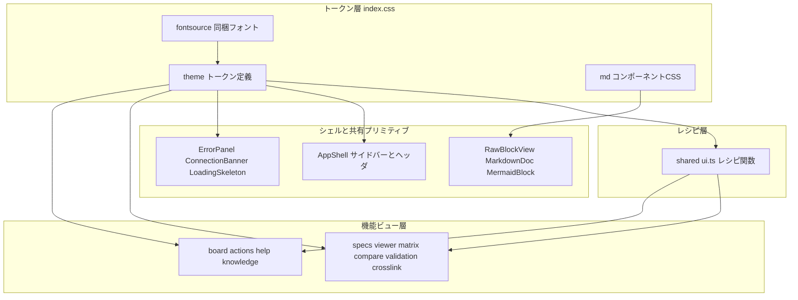

# Technical Design Document — sdd-design-system

## Overview

**Purpose**: 本設計は、sdd-dashboard 本番クライアント（`client/`）のビジュアルを、デザイン正典であるスケルトン（`skeleton-client/src/styles.css`）のデザイン言語（paper/ink/brand のあたたかいトーン、濃緑サイドバー、統一されたカード/バッジ/チップ）に一致させる**ビジュアル再スキン**の実装方式を定める。

**Users**: ダッシュボード閲覧者は全画面で一貫したリッチな配色・タイポグラフィで内容を読める。今後 UI を拡張する開発者は、ここで確立するトークンとレシピを参照規約として利用する。

**Impact**: 変更は原則として視覚表現のみ。スケルトン由来のデザイントークンを Tailwind v4 の `@theme` に一元定義して既定パレットを削除し、既存コンポーネントの色クラス（351 箇所、slate 中心）をトークン utility へ置換する。例外として Requirement 8 に定める範囲に限り、ドキュメントビューアの読書体験のためのレイアウト調整（DesignView のセクション表示順・ナビの sticky 化・オーバーフロー封じ込め・本文最大幅）を行う。それ以外の DOM 構造・`data-testid`・`aria-label`・`role`・可視テキスト・機能挙動は一切変更しない。

### Goals
- デザイントークン（色・フォント）の単一定義元を `client/src/index.css` の `@theme` に確立する（1.1, 1.3）
- 既定 slate パレットの使用を機構的に不可能にし、全画面をブランドパレットへ置換する（1.4, 1.5, 4.1, 4.2, 4.3, 4.4, 4.5）
- シェル・共有プリミティブ・markdown 表示をスケルトンの装飾に一致させる（2.1, 2.2, 2.3, 2.4, 3.1, 3.2, 3.3, 3.4）
- ドキュメントビューアの読書体験を確立する: 本文先頭化・トレーサビリティ表の後置と装飾・オーバーフロー封じ込め・sticky ナビ・本文最大幅（8.1, 8.2, 8.3, 8.4, 8.5）
- 既存単体テスト・E2E の全件成功とローカル完結（外部 URL ゼロ）を維持する（5.3, 6.1, 6.2）

### Non-Goals
- 機能追加・挙動変更・Requirement 8 の範囲を超える画面構成・情報設計・ルーティング・状態管理・API の変更
- スクロール連動のセクションハイライト（scroll-spy）等の新規インタラクション
- スケルトンにあって本番に無い画面・レイアウトの機能的取り込み
- skeleton-client 自体の改変（参照源として保持する）
- Mermaid 図の内部テーマ変更（対象は図枠と封じ込めのみ。図の中身は default テーマを維持）

## Boundary Commitments

### This Spec Owns
- `client/src/index.css` の `@theme` デザイントークン定義（色・フォント）と `.md` markdown コンポーネントスタイル
- 共有装飾レシピ `client/src/shared/ui.ts`（badge / chip / btn / card の className 生成）
- 本番クライアント全コンポーネントの **className 値**（視覚表現）
- フォント資産の同梱方式（@fontsource variable パッケージ）
- DesignView のビューアレイアウト: セクション表示順（本文 → Traceability）・ナビの sticky 化・本文最大幅・埋め込み要素のオーバーフロー封じ込め（Requirement 8 の範囲に限定）

### Out of Boundary
- コンポーネントの DOM 構造・props・状態・イベントハンドラ（Requirement 8 が定める DesignView のセクション順・レイアウト変更を除き、className 以外の属性は不変）
- `data-testid` / `aria-label` / `role` / 可視テキスト / `.jump-highlight` / `.correspondence-highlight` / `UNCOVERED_ROW_CLASS` の名称と役割（5.1, 5.2）
- サーバー（`server/`）・API 契約・データモデル
- skeleton-client 配下の全ファイル（7.1）
- 既存テストファイル（`*.test.tsx` / `e2e/*.spec.ts`）の変更（新規テスト追加は可。唯一の例外: 8.1 の表示順変更が無効化する `DesignView.test.tsx` の順序固定テスト 1 件のみ、新仕様の順序を検証するよう更新する）

### Allowed Dependencies
- 正典参照: `skeleton-client/src/styles.css`（読み取りのみ。装飾差異はスケルトンを優先する: 7.2）
- Tailwind CSS v4（既存。`@theme` / `@layer components` を使用）
- 新規 npm 依存: `@fontsource-variable/inter`、`@fontsource-variable/jetbrains-mono`（自己ホストフォント、OFL）
- これ以外の新規ランタイム依存は導入しない（CVA 等のスタイリングライブラリ不採用）

### Revalidation Triggers
- `@theme` トークン名の変更・削除 → 全 UI スペック（sdd-core / sdd-review-ui / sdd-workflow-ui の画面実装）の再スキン箇所に影響
- `shared/ui.ts` レシピ関数のシグネチャ変更 → 呼び出し元の全 feature に影響
- `.md` クラスのセレクタ構造変更 → markdown 表示系（RawBlockView / MarkdownDoc / MermaidBlock）の再検証
- テスト契約（`"border"` 部分文字列、`UNCOVERED_ROW_CLASS` 等）に触れる変更 → 該当テストの再実行必須
- 今後 sdd-dashboard に追加される UI スペックは本スペックのトークン・レシピ規約に準拠する（downstream 制約）

## Architecture

### Existing Architecture Analysis
- 本番クライアントは React 19 + Tailwind v4（CSS-first、`@tailwindcss/vite`）+ react-router 7。`index.css` は `@import "tailwindcss"` とハイライト 2 クラスのみで、装飾は各 `.tsx` の utility クラスに分散（色クラス 351 箇所）
- テストは data-testid / role / aria-label / 可視テキストで選択しており色クラスに依存しない。ただし 3 つのクラス契約が存在する（後述の Implementation Notes）
- markdown 内部要素（h1–h4 / code / pre / table / blockquote）は完全無装飾（Tailwind preflight がブラウザ既定スタイルも除去するため、表は罫線・余白ゼロで表示が崩れている）
- DesignView（`DesignView.tsx:207-246`）は `flex` の 2 カラム（nav `w-56` 非 sticky + article）で、article 内は **Traceability 表 → 本文**の順。実測（sdd-core/design、全高 23,574px）でファーストビューを 56 行 × 高さ 2,283px の表が占有し、本文は約 2.5 画面先。AppShell `main` に最大幅がなく本文行長が無制限。Mermaid コンテナには `overflow-x-auto` が既にあるがシーケンス図がページを突き破る（封じ込めの検証が必要）
- `DesignView.test.tsx:252` に「Traceability テーブル → 本文見出しが文書順で描画される」という旧順序を固定するテストが存在する（8.1 で更新する唯一の既存テスト）
- スケルトンは素の CSS 184 行で全装飾を定義済み。これを「正」としてトークン化する。ビューアレイアウトの正典は `.main`（max-width 1280px・padding 26px 34px）と `.viewer-grid`（230px toc + 1fr、gap 22px）・`.toc`（sticky top 20px・max-height 85vh）

### Architecture Pattern & Boundary Map



**Architecture Integration**:
- **Selected pattern**: トークン層 → レシピ層 → シェル/プリミティブ → 機能ビュー の単方向依存。下位層は上位層を参照しない
- **依存方向の強制**: 色・フォントの定義元は `index.css` の `@theme` のみ。`--color-*: initial` で Tailwind 既定パレットを削除するため、トークン外の色 utility（`bg-slate-50` 等）は CSS を生成せず、混入が機構的に不可能になる（1.4, 1.5 のビルドレベル強制）
- **Existing patterns preserved**: Tailwind utility クラス運用・コンポーネント分割・`safeMarkdownOptions` の安全設定は不変。手書き CSS の持ち込みは `.md` スコープ（markdown 内部要素専用）の 1 例外のみ
- **Steering compliance**: Single Source of Truth（structure.md）— トークン定義 1 箇所・レシピ定義 1 箇所。ローカル完結方針（フォント同梱・外部 URL ゼロ）

### Technology Stack

| Layer | Choice / Version | Role in Feature | Notes |
|-------|------------------|-----------------|-------|
| スタイリング | Tailwind CSS v4（既存） | `@theme` トークン定義・utility 生成・`@layer components` | 設定ファイル不要の CSS-first を継続 |
| フォント | `@fontsource-variable/inter` 5.2.x（新規） | 本文フォント Inter の自己ホスト | woff2 を Vite が dist へ同梱（6.1, 6.3） |
| フォント | `@fontsource-variable/jetbrains-mono` 5.2.x（新規） | コード・識別子フォントの自己ホスト | 同上 |
| フロントエンド | React 19 + Vite 7（既存） | 変更なし | className 値のみ編集 |

## File Structure Plan

### New Files
```
sdd-dashboard/client/src/
├── shared/
│   ├── ui.ts          # 装飾レシピ関数（badgeClass / chipClass / btnClass / cardClass）— 唯一の新規実装ファイル
│   └── ui.test.ts     # レシピ関数の variant→クラス列の対応を固定する単体テスト
```

### Modified Files

**トークン層（このスペックの核）**
- `client/src/index.css` — ① `@theme` ブロック追加（`--color-*: initial` + スケルトン由来トークン全定義 + `--font-sans` / `--font-mono`）、② `@fontsource-variable/*` の `@import`、③ `@layer components` に `.md` スタイル（skeleton 121–135 行のポート、色は全てトークン参照）。既存の `.jump-highlight` / `.correspondence-highlight` は**一字も変えない**
- `client/package.json` — fontsource 2 パッケージを dependencies に追加

**シェル・共有プリミティブ（className 値のみ変更）**
- `client/src/app/AppShell.tsx` — サイドバー濃緑化・ヘッダ warm paper 化・ナビ active 表現（2.1, 2.2, 2.3, 2.4）。`main` にスケルトン `.main` 準拠の最大幅（1280px）とパディングを付与（8.5）
- `client/src/shared/ErrorPanel.tsx` / `ConnectionBanner.tsx` / `LoadingSkeleton.tsx` — bad / warn / line 系トークンへ（3.3）

**markdown 表示（className 値 + `md` クラス付与のみ）**
- `client/src/markdown/RawBlockView.tsx` — ルート div に `md` クラス付与。failure 装飾を warn トークンへ置換（`"border"` 部分文字列は維持）
- `client/src/markdown/MarkdownDoc.tsx` — ルート要素に `md` クラス付与
- `client/src/markdown/MermaidBlock.tsx` — コンテナへ図枠装飾（白背景・line 罫線・角丸 8px・中央寄せ）、エラー表示を bad トークンへ
- `client/src/markdown/DocBlockList.tsx` — 必要に応じ区切り装飾のトークン化のみ

**機能ビュー層（DesignView 以外は className 値のみ変更。構造・testid 不変）**
- `client/src/features/specs/` — SpecListPage / SpecOverviewPage / SpecMetaBadges / DocumentTabs（4.1。バッジ・タブは ui.ts レシピへ）
- `client/src/features/viewer/DesignView.tsx` — **本スペック唯一の構造変更ファイル**。article 内のセクション順を「本文 → Traceability 表」へ入替（8.1）、表へ matrix 装飾（8.2）、nav を sticky 化（8.4）。testid（`design-section-nav` / `design-body` / `traceability-row` / `trace-row-*` アンカー）は全て不変
- `client/src/features/viewer/DesignView.test.tsx` — 順序固定テスト（`:252` 「Traceability テーブル → 本文見出しが文書順で描画される」）1 件のみ新仕様の順序（本文 → Traceability）へ更新（5.3 例外）
- `client/src/features/viewer/` — RequirementsView / TasksView / DocumentView（4.2。要件カード・AC 行・TOC・タスク行は className のみ）
- `client/src/features/matrix/` — MatrixGrid / DiagnosticsPanel / MatrixPage（4.3。表・focus 行 `#fdf3cf` 系・uncovered 行 `#f9e9e4` 系トークン）
- `client/src/features/compare/` / `validation/`（4.4）
- `client/src/features/crosslink/` — RefChip / JumpBackBar / CounterpartPopover（3.2 ポップオーバー装飾を含む）
- `client/src/workflow/` — board（SpecPipelineNode 等）/ actions（承認・手戻りダイアログ = 3.2 モーダル装飾）/ help / knowledge（AdrStatusBadge / steering / skills）（4.5）

> 機能ビュー層の全ファイルは「色 utility クラスを意味マッピング表（後述）とレシピ関数で置換する」という同一パターンの繰り返し。個別の責務変更はない。

## Requirements Traceability

| Requirement | Summary | Components | Interfaces | Flows |
|-------------|---------|------------|------------|-------|
| 1.1, 1.3, 1.4 | スケルトン同一パレットを `@theme` で単一定義、既定パレット削除で slate 置換を強制 | DesignTokens | `@theme` トークン表 | — |
| 1.2 | Inter / JetBrains Mono を自己ホストし `--font-sans` / `--font-mono` で適用 | FontProvisioning, DesignTokens | フォントスタック定義 | — |
| 1.5 | 新規色・フォントはトークン参照（既定パレット削除により直値系 utility は無効） | DesignTokens, UiRecipes | — | — |
| 2.1, 2.2, 2.3, 2.4 | サイドバー濃緑・ナビ active・ヘッダ warm paper・見出し階層 | AppShellReskin | sidebar 系トークン | — |
| 3.1 | カード・バッジ・チップ・ボタンの統一装飾 | UiRecipes | `badgeClass` ほかレシピ関数 | — |
| 3.2 | モーダル・ポップオーバーの装飾統一 | FeatureReskin の workflow actions, crosslink CounterpartPopover | overlay / modal 装飾規約 | — |
| 3.3 | エラーパネル・接続バナーを状態色トークンで表示 | SharedPrimitivesReskin | bad / warn トークン | — |
| 3.4 | markdown 表示（見出し・コード・引用・表・Mermaid 図枠）をスケルトン `.md` に一致 | MarkdownTheme | `.md` スコープ CSS | — |
| 4.1 | スペック一覧・概要の再スキン | FeatureReskin specs | 意味マッピング表 | — |
| 4.2 | ドキュメントビューアの再スキン | FeatureReskin viewer | 意味マッピング表 | — |
| 4.3 | トレーサビリティマトリクスの再スキン | FeatureReskin matrix | focus / uncovered トークン | — |
| 4.4 | 比較ビュー・検証レポートの再スキン | FeatureReskin compare, validation | 意味マッピング表 | — |
| 4.5 | ワークフロー系画面の再スキン | FeatureReskin workflow | 意味マッピング表 | — |
| 5.1 | testid / aria / role / 可視テキスト不変更 | 全 Reskin コンポーネント共通制約 | マークアップ契約 | — |
| 5.2 | 対話用クラス 3 種の名称・役割維持 | DesignTokens の index.css 編集制約, FeatureReskin matrix | クラス契約 | — |
| 5.3 | 既存単体テスト・E2E の全件成功（8.1 の順序固定テスト 1 件のみ更新可） | Testing Strategy, DesignViewReadability | — | — |
| 5.4 | Requirement 8 の範囲を除き変更を視覚表現に限定 | Boundary Commitments 全体 | — | — |
| 8.1 | design 本文を先頭に、Traceability 表は本文後の専用セクションへ | DesignViewReadability | DesignView セクション順 | — |
| 8.2 | Traceability 表へスケルトン matrix 装飾 | DesignViewReadability | matrix 表スタイル | — |
| 8.3 | 埋め込み要素のオーバーフローを要素枠内に封じ込め | MarkdownTheme, FeatureReskin の MermaidBlock | `.md` overflow 規約 | — |
| 8.4 | セクションナビの sticky 化 | DesignViewReadability | skeleton `.toc` 準拠 | — |
| 8.5 | 本文の読みやすい最大幅 | AppShellReskin | skeleton `.main` 準拠 | — |
| 6.1, 6.3 | 外部 URL 非依存・フォント同梱 | FontProvisioning | @fontsource import | — |
| 6.2 | dist の外部 URL 不在チェック合格 | Testing Strategy の no-external-URL 検査 | `e2e/check-dist-no-external-urls.ts` | — |
| 7.1 | skeleton-client を改変・削除しない | Out of Boundary 宣言 | — | — |
| 7.2 | 装飾差異はスケルトンを正典として優先 | 全 Reskin コンポーネント共通制約 | 目視比較プロセス | — |

## Components and Interfaces

| Component | Domain/Layer | Intent | Req Coverage | Key Dependencies (P0/P1) | Contracts |
|-----------|--------------|--------|--------------|--------------------------|-----------|
| DesignTokens | トークン層 | `@theme` による色・フォントの単一定義元 | 1.1, 1.3, 1.4, 1.5 | Tailwind v4 (P0), skeleton styles.css 正典 (P0) | State |
| FontProvisioning | トークン層 | Inter / JetBrains Mono の自己ホスト | 1.2, 6.1, 6.3 | @fontsource-variable (P0), Vite asset 同梱 (P0) | — |
| MarkdownTheme | トークン層 | `.md` スコープの markdown 装飾 CSS とオーバーフロー封じ込め | 3.4, 8.3 | DesignTokens (P0), RawBlockView ほか markdown 系 (P1) | State |
| UiRecipes | レシピ層 | badge / chip / btn / card の className レシピ | 1.5, 3.1 | DesignTokens (P0) | Service |
| AppShellReskin | シェル | サイドバー・ヘッダ・ナビの再スキンと main 最大幅 | 2.1, 2.2, 2.3, 2.4, 8.5 | DesignTokens (P0) | — |
| SharedPrimitivesReskin | シェル | ErrorPanel / ConnectionBanner / LoadingSkeleton の再スキン | 3.3 | DesignTokens (P0) | — |
| DesignViewReadability | 機能ビュー層 | DesignView のセクション順入替・表装飾・sticky ナビ | 8.1, 8.2, 8.4 | DesignTokens (P0), MarkdownTheme (P1) | State |
| FeatureReskin | 機能ビュー層 | 各 feature / workflow の色クラス置換 | 3.2, 4.1, 4.2, 4.3, 4.4, 4.5 | DesignTokens (P0), UiRecipes (P1) | — |

### トークン層

#### DesignTokens（`client/src/index.css` の `@theme`）

| Field | Detail |
|-------|--------|
| Intent | スケルトン由来の全デザイントークンを Tailwind v4 `@theme` で一元定義し、既定パレットを削除する |
| Requirements | 1.1, 1.3, 1.4, 1.5 |

**Responsibilities & Constraints**
- 色とフォントの定義元はこのブロックのみ。コンポーネント側は生成された utility（`bg-paper` / `text-ink` 等）だけを使う
- `--color-*: initial` を先頭に置き Tailwind 既定パレット（slate / amber / emerald …）を削除する。`white` / `black` は再定義して維持
- 既存の `.jump-highlight` / `.correspondence-highlight`（直書き RGB）は本スペックの対象外として不変更（5.2）。出自コメントを維持

**Token Definition（正典: skeleton styles.css。値の改変禁止）**

| トークン | 値 | 出典・用途 |
|---|---|---|
| `--color-paper` | `#f7f4ec` | 地の背景 |
| `--color-paper-warm` | `#fbf9f2` | カード・ヘッダ・モーダル背景 |
| `--color-ink` | `#2a2722` | 本文テキスト |
| `--color-ink-soft` | `#6b655a` | 補助テキスト |
| `--color-line` | `#e3ddcf` | 罫線・ボーダー |
| `--color-brand` | `#7ea61f` | 主アクセント・active・primary ボタン |
| `--color-brand-soft` | `#eef3df` | ブランド淡背景・chip 背景 |
| `--color-ok` / `--color-ok-soft` / `--color-ok-line` | `#5d8a3a` / `#e7efdc` / `#c9dcb4` | 成功系（文字 / 背景 / 枠） |
| `--color-warn` / `--color-warn-soft` / `--color-warn-line` / `--color-warn-ink` | `#c89a2d` / `#f7eed3` / `#e6d49a` / `#8a6a14` | 警告系（warn-ink はバッジ文字色） |
| `--color-bad` / `--color-bad-soft` / `--color-bad-line` | `#b8482e` / `#f6e0da` / `#e7bcae` | エラー系 |
| `--color-gray-mid` / `--color-gray-soft` | `#9a958a` / `#eceae3` | 中立状態色（badge.gray / 矢印等） |
| `--color-sidebar` / `--color-sidebar-ink` / `--color-sidebar-muted` / `--color-sidebar-soft` / `--color-sidebar-section` | `#26301a` / `#e9ecdf` / `#cdd5bd` / `#9fae84` / `#8d9a73` | サイドバー専用系 |
| `--color-chip-ink` / `--color-chip-line` / `--color-chip-hover` | `#50691a` / `#d2dfb0` / `#dfe9c4` | chip 専用系 |
| `--color-focus-row` / `--color-uncovered-row` | `#fdf3cf` / `#f9e9e4` | matrix / task 行ハイライト |
| `--color-fill-soft` / `--color-pre-bg` / `--color-pre-ink` | `#efece2` / `#2c2a25` / `#e8e4d8` | soft fill（`.md` インラインコード背景・`.md th`・matrix/Traceability 表ヘッダ）/ `.md` pre 装飾 |
| `--color-overlay` | `rgb(30 28 20 / 0.45)` | モーダル・オーバーレイ背景（スケルトン .overlay 準拠） |
| `--font-sans` | `'Inter Variable', system-ui, -apple-system, 'Hiragino Sans', 'Noto Sans JP', sans-serif` | 本文（1.2。日本語はシステムフォールバック） |
| `--font-mono` | `'JetBrains Mono Variable', ui-monospace, SFMono-Regular, Menlo, monospace` | コード・識別子（1.2） |

**意味マッピング表（既存 351 箇所の置換規則）**

| 既存クラス族 | 置換先トークン | 備考 |
|---|---|---|
| `slate-50` / `bg-white`（地） | `paper` / `white` | ページ地は paper、要素内白地は white 維持可 |
| `slate-100` | `paper-warm` または `line`（用途別） | hover 背景は `paper-warm` |
| `slate-200`, `slate-300` | `line` | 罫線・ボーダー |
| `slate-400`, `slate-500` | `ink-soft` | 補助テキスト |
| `slate-600` 〜 `slate-900` | `ink` | 本文・見出し |
| `amber-*` | `warn` 系 | 警告・保留・diagnostics |
| `emerald-*` | `ok` 系 | 成功・承認 |
| `red-*`, `rose-*` | `bad` 系 | エラー・削除 |
| `sky-*`, `blue-*` | `brand` 系 | ready 情報・主アクションボタン |
| `indigo-*`（generated 状態） | `warn` 系 | スケルトンの node.generated が amber 系のため |
| `gray-*`（workflow ダイアログ） | `paper-warm` / `line` | モーダル装飾規約に従う |

**Contracts**: State [x] — `@theme` トークン名は下流全コンポーネントとの契約。変更は Revalidation Trigger

**Implementation Notes**
- Integration: sidebar active の `rgba(126,166,31,.25)` は追加トークンなしで `bg-brand/25` と表現する
- Validation: 再スキン完了時に `grep -rE "(slate|sky|emerald|indigo|rose)-[0-9]|amber-[0-9]|red-[0-9]|blue-[0-9]|gray-[0-9]" client/src --include="*.tsx"` が 0 件
- Risks: 既定パレット削除により置換漏れは「無スタイル」で顕在化する（ビルドエラーにならない）→ 上記 grep と全画面目視で検出

#### FontProvisioning（フォント自己ホスト）

| Field | Detail |
|-------|--------|
| Intent | Inter / JetBrains Mono の variable フォントを npm パッケージとして同梱し外部 URL ゼロで提供する |
| Requirements | 1.2, 6.1, 6.3 |

**Responsibilities & Constraints**
- `client/src/index.css` 冒頭で `@import "@fontsource-variable/inter";` と `@import "@fontsource-variable/jetbrains-mono";` を行う（定義元を index.css に集約）
- woff2 は Vite のアセットパイプラインで `dist/assets/` に同梱され、相対 URL で参照される（6.1）
- 日本語グリフは同梱しない。`--font-sans` のフォールバック（Hiragino Sans / Noto Sans JP）に委ねる（スケルトンと同等の挙動）

**Implementation Notes**
- Validation: `npm run build` 後に `e2e/check-dist-no-external-urls.ts` を実行し合格すること（6.2）
- Risks: バンドル +数百 KB（latin 系 woff2）。ローカル配信のため許容

#### MarkdownTheme（`.md` スコープ CSS — utility 運用の唯一の例外）

| Field | Detail |
|-------|--------|
| Intent | react-markdown が生成する内部要素にスケルトン `.md` 相当の装飾とオーバーフロー封じ込めを与える |
| Requirements | 3.4, 8.3 |

**Responsibilities & Constraints**
- `index.css` の `@layer components` に skeleton styles.css 121–135 行を移植する。対象セレクタ: `.md h1` 〜 `.md h4` / `.md code` / `.md pre` / `.md pre code` / `.md table` / `.md th, .md td` / `.md th` / `.md blockquote`。色は全て `var(--color-*)` 参照に書き換える（直値の複製禁止）
- **オーバーフロー封じ込め（8.3）**: `.md pre` と `.md table` はスケルトン同様 `overflow-x: auto`（table は `display: block; max-width: 100%`）で要素内横スクロールに収める。封じ込めの不変則は「**ページ全体（body / main）の横スクロールを発生させない**」。Mermaid は MermaidBlock コンテナの `overflow-x-auto` を維持した上で、フレックス祖先の `min-w-0` 欠落など封じ込めを破る要因を実画面（巨大シーケンス図を含む sdd-core/design）で検証して塞ぐ
- 適用範囲は `.md` 配下のみ。utility が届く通常コンポーネントにこの例外を広げない
- `md` クラスの付与先: `RawBlockView` ルート div / `MarkdownDoc` ルート要素。**クラス名 `md` は `"border"` を部分文字列に含まないこと**（RawBlockView.test.tsx:91,100 / DocBlockList.test.tsx:81 の gap 契約）
- Mermaid 図枠は `MermaidBlock` コンテナへ utility（`bg-white border border-line rounded-lg p-3.5 text-center` 相当）で付与する（スケルトン `.mermaid-block` 準拠）。図の内部テーマは default のまま

**Contracts**: State [x] — `.md` セレクタ構造は markdown 表示 3 コンポーネントとの契約

**Implementation Notes**
- Integration: `RawBlockView` の failure 装飾は `border border-dashed` + warn 系トークンへ置換し、className に `"border"` を含む契約を維持する（RawBlockView.test.tsx:82）
- Validation: 表（罫線 1px line・セル padding 4px 9px・ヘッダ背景 fill-soft）、blockquote（左 3px brand・brand-soft 背景）、pre（pre-bg 暗背景）の目視確認。巨大シーケンス図を含む design 文書でページ横スクロールが発生しないこと（8.3）
- Risks: `safeMarkdownOptions`（XSS 安全設定）には触れない。スタイルのみの変更に限定

### レシピ層

#### UiRecipes（`client/src/shared/ui.ts`）

| Field | Detail |
|-------|--------|
| Intent | 頻出装飾（badge / chip / btn / card）の className を型付き純関数で一元生成する |
| Requirements | 1.5, 3.1 |

**Responsibilities & Constraints**
- className 文字列を返す純関数のみ。React コンポーネント・DOM 構造・状態を持たない（5.4 の視覚限定を構造で保証）
- variant はスケルトンの装飾分類と 1:1 対応（badge: ok / warn / bad / gray、chip: default / danger / plain、btn: default / primary / danger）

##### Service Interface
```typescript
export type BadgeVariant = "ok" | "warn" | "bad" | "gray";
export type ChipVariant = "default" | "danger" | "plain";
export type BtnVariant = "default" | "primary" | "danger";

/** スケルトン .badge 準拠: pill 形状 + 状態色（背景 soft / 文字 / 枠 line の 3 点セット） */
export function badgeClass(variant: BadgeVariant): string;
/** スケルトン .chip 準拠: mono フォント + brand-soft 背景。danger / plain で配色切替 */
export function chipClass(variant?: ChipVariant): string;
/** スケルトン button.btn 準拠: 白地 + line 枠。primary は brand 塗り、danger は bad 文字 */
export function btnClass(variant?: BtnVariant): string;
/** スケルトン .card 準拠: paper-warm 背景 + line 枠 + 角丸 10px */
export function cardClass(): string;
```
- Preconditions: なし（全 variant は型で閉じる。`any` 不使用）
- Postconditions: 返値はトークン utility のみで構成される静的文字列（直値・既定パレットを含まない）
- Invariants: 同一 variant は常に同一文字列（純関数）

**Implementation Notes**
- Integration: 既存コンポーネントはインラインの utility 列をレシピ呼び出しへ置換する。追加装飾（マージン等のレイアウト調整）は呼び出し側で連結してよい（色は不可）
- Validation: `ui.test.ts` で variant→クラス列の対応を固定。`AdrStatusBadge.test.tsx` の「ステータス間で className が異なる」契約は variant 切替で自然に満たされる
- Risks: レシピ肥大化 → 4 種（badge/chip/btn/card)以外は安易に追加せず、再出現 3 回以上の装飾のみ昇格させる

### 機能ビュー層（構造変更を伴う唯一のコンポーネント）

#### DesignViewReadability（`client/src/features/viewer/DesignView.tsx`）

| Field | Detail |
|-------|--------|
| Intent | design 文書の読書体験を成立させる: 本文先頭化・Traceability 表の後置と装飾・ナビ sticky 化 |
| Requirements | 8.1, 8.2, 8.4 |

**Responsibilities & Constraints**
- **セクション順入替（8.1）**: article 内の描画順を「本文（`data-testid="design-body"`）→ Requirements Traceability（専用セクション・`h2` 見出し維持）」へ変更する。JSX のセクションブロックの位置交換のみで、各セクションの内部構造・testid・`trace-row-<reqId>` アンカー・`data-node-*` 属性は不変
- **表装飾（8.2）**: Traceability 表へスケルトン `table.matrix` 準拠の装飾（セル罫線 `border-line`・ヘッダ背景 `fill-soft`・12.5px 系コンパクトタイポグラフィ・`th/td` padding 5px 9px 相当）を utility で適用
- **ナビ sticky 化（8.4）**: `nav[data-testid="design-section-nav"]` をスケルトン `.toc` 準拠で `sticky`（top 20px 相当）+ `max-h-[85vh]` + `overflow-y-auto` + `self-start` にする。幅は現行 `w-56`（≒ skeleton 230px）を維持
- クロスリンク互換: RefChip からのジャンプ先 `trace-row-<reqId>` アンカーは表の移動後も同一 ID で存在するため、`useJump` / `.jump-highlight` の挙動は変わらない（5.2）

**Contracts**: State [x] — セクション描画順「本文 → Traceability」は新しい表示契約。`DesignView.test.tsx` の順序テストがこの契約を固定する

**Implementation Notes**
- Integration: 順序入替は `DesignView.tsx:219-243` の 2 つの `<section>` ブロックの交換。sticky 化は nav の className 変更のみ
- Validation: 既存順序固定テスト（`DesignView.test.tsx:252`）を新契約（本文見出し → Traceability テーブル）へ更新する（5.3 の唯一の例外として要件・Boundary に明記済み）。それ以外のテスト（ナビクリックのスクロール・アンカー払い出し・全文描画）は無変更で成功すること
- Risks: sticky はフレックス子要素では `align-self: flex-start`（`self-start`）がないと効かない — 実画面でスクロール追従を確認する

### シェル・機能ビュー層（summary-only）

#### AppShellReskin（2.1, 2.2, 2.3, 2.4, 8.5）
- サイドバー: `bg-sidebar text-sidebar-muted`、brand 見出し + `text-sidebar-soft` 補助、active ナビは `bg-brand/25 text-white border-l-[3px] border-brand`（スケルトン .sidebar 準拠）
- ヘッダ: `bg-paper-warm border-line`、アプリ名 `text-ink`・リポジトリ名 `text-ink-soft`
- ページ見出し: タイトル 19px/700 相当（`text-[19px] font-bold`）+ サブ `text-ink-soft text-[12.5px]`（スケルトン .page-title / .page-sub 準拠）
- main 最大幅（8.5）: `main` にスケルトン `.main` 準拠の `max-w-[1280px]` とパディング（26px / 34px 相当）を適用し、全ページの本文行長を制御する（document viewer は内側の 2 カラムグリッドと合わせて読みやすい行長になる）
- 制約: NavLink の構造・`aria-label`・ルーティングは不変。className のみ

#### SharedPrimitivesReskin（3.3）
- ErrorPanel: `border-bad-line bg-bad-soft text-bad`、ConnectionBanner: `border-warn-line bg-warn-soft text-warn-ink`、LoadingSkeleton: `border-line bg-paper-warm text-ink-soft`
- `role="alert"` / `role="status"` は不変

#### FeatureReskin（3.2, 4.1, 4.2, 4.3, 4.4, 4.5）
- 全 feature / workflow コンポーネントへ意味マッピング表とレシピ関数を適用する同一パターンの繰り返し
- モーダル・ポップオーバー装飾規約（3.2）: オーバーレイは `bg-overlay`（DesignTokens の `--color-overlay` を参照）。ダイアログは `bg-paper-warm rounded-xl shadow-[0_18px_50px_rgba(0,0,0,0.25)]`、ポップオーバーは `shadow-[0_12px_36px_rgba(0,0,0,0.18)]`（スケルトン .overlay / .modal / .popover 準拠。影 2 種は再出現時にトークン昇格を検討）
- matrix（4.3）: focus 行 `bg-focus-row`、uncovered 行 `bg-uncovered-row`。`UNCOVERED_ROW_CLASS` 定数の名称は不変（5.2）
- board（4.5）: approved ノードは ok 系、generated ノードは warn 系（スケルトン .pipe .node 準拠。既存 indigo を warn へ）
- 共通制約（5.1, 7.2）: `data-testid` / `aria-label` / `role` / 可視テキスト不変。スケルトンとの装飾差異が判明した場合はスケルトン値を採用する

## Data Models

対象外。本スペックはデータモデル・API 契約・永続化に一切触れない（視覚表現のみ）。

## Error Handling

- ランタイムエラー経路の変更なし。ErrorPanel / ConnectionBanner / MermaidBlock エラー表示は配色のみ bad / warn トークンへ置換し、`role="alert"` / `role="status"` と表示文言を維持する
- 置換漏れ（既定パレット削除による無スタイル化）は実行時エラーにならないため、Testing Strategy の grep 検査と目視確認で検出する

## Testing Strategy

### Regression（5.3 — 本スペックの主検証）
1. `client` 単体テスト全件（74 ファイル）が全件成功すること（`npm test`）。唯一の例外: `DesignView.test.tsx` の順序固定テスト 1 件を 8.1 の新契約（本文 → Traceability）へ更新する。それ以外の既存テストは無変更で成功させる
2. E2E（`e2e/readonly-local.spec.ts` / `review.spec.ts`）が全件成功すること
3. クラス契約の個別確認: RawBlockView failure ラッパーに `"border"` を含む / gap ラッパーに含まない、`UNCOVERED_ROW_CLASS` 行ハイライト、AdrStatusBadge のステータス間 className 差分

### Unit Tests（新規・更新）
1. `shared/ui.test.ts` — badgeClass / chipClass / btnClass / cardClass の各 variant が期待クラス列を返す（トークン utility のみで構成され既定パレット名を含まない）
2. `DesignView.test.tsx` — 順序テストを「本文見出し → Traceability テーブルが文書上この順で描画される」へ更新（8.1 の表示契約の固定）。ナビ sticky 化後もナビクリックのスクロール・アンカー払い出しテストが無変更で成功すること（8.4 が構造を壊していない証跡）

### Static / Build Checks
1. 残存色クラス検査: `client/src` の `*.tsx` に対する既定パレット族（slate / gray / sky / emerald / indigo / rose / amber / red / blue の数値スケール）の grep が 0 件（1.4）
2. `npm run build` 成功 + `e2e/check-dist-no-external-urls.ts` 合格（6.2 — フォント同梱後の外部 URL ゼロ確認）
3. `tsc --noEmit` / `eslint` 既存チェック成功

### Visual Verification（7.2, 8.1, 8.3, 8.4, 8.5）
1. skeleton-client と本番を並行起動し、4 画面（spec 一覧 / document viewer の requirements・design / matrix / 承認モーダル）を目視比較。差異はスケルトン側へ寄せる
2. markdown 埋め込み要素の確認: 表（罫線・padding・ヘッダ背景）、blockquote（brand 左罫線 + brand-soft 背景）、code / pre、Mermaid 図枠（3.4）
3. design 文書の読書体験確認（sdd-core/design = 最長文書で実施）: ① ファーストビューに本文（Overview）が表示される（8.1）② 巨大シーケンス図・横長表でページ全体の横スクロールが発生しない（8.3）③ 長スクロール中もセクションナビが追従し内部スクロールできる（8.4）④ 本文行長が最大幅で制御される（8.5）

## Security Considerations

- 外部リソース取得は増えない（フォントは npm 同梱、外部 URL ゼロ: 6.1）。`safeMarkdownOptions` の XSS 安全設定（rehype-raw 不使用・urlTransform・dangerouslySetInnerHTML 禁止）には触れない
- 新規依存 @fontsource 2 パッケージは静的アセットのみ（実行コードなし、OFL ライセンス）

## Performance & Scalability

- フォント同梱によりバンドルが数百 KB 増（variable woff2、latin 系）。ローカル配信のため初回ロードへの影響は軽微
- `@theme` トークン化により生成 CSS はむしろ縮小方向（使用 utility の種類が減る）。実行時パフォーマンスへの影響なし
