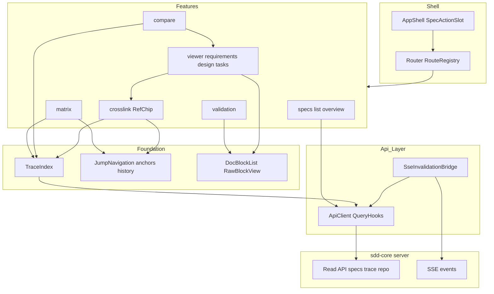
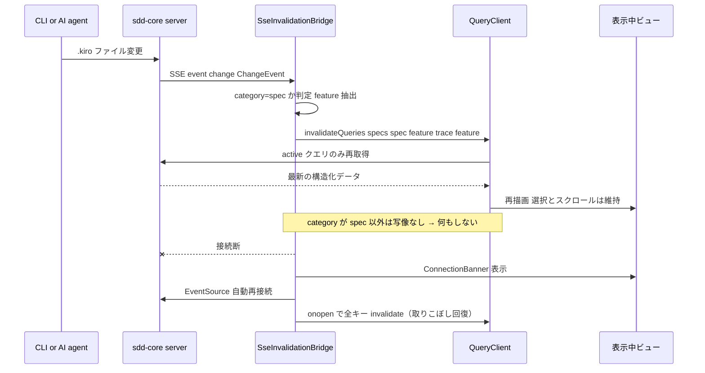
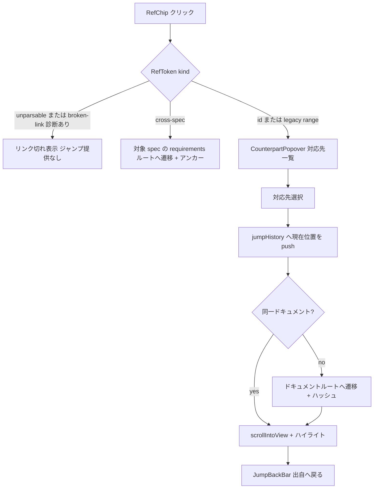

# Design Document: sdd-review-ui

## Overview

**Purpose**: sdd-review-ui は SDD Dashboard のレビュアー体験を実装する。sdd-core の読取 API（構造化スペックデータ・トレーサビリティグラフ・SSE 変更通知）を消費し、スペック成果物の構造化ビューア、Req ⇄ Design ⇄ Task の相互リンクナビゲーション、サイドバイサイド比較、トレーサビリティマトリクス、validation レポート表示を提供する読み取り専用 SPA である。

**Users**: スペックの承認レビューを行う人間のレビュアーが直接利用する。また下流スペック sdd-workflow-ui が、本スペックの構築する SPA シェル（ルーティング・SSE 基盤・操作スロット）の上に画面を追加する。

**Impact**: 新規ディレクトリ `sdd-dashboard/client/` を作成する（サーバーは sdd-core が `sdd-dashboard/server/` に実装済みの前提）。既存コード（EVM Studio / `evm-studio/`）への変更はない。

### Goals

- 元ファイルの情報を一切欠落させない構造化ビューア（raw フォールバックブロックを文書順に必ず描画）を提供する
- Req 番号クリックから設計・タスクへ、およびすべての逆方向へジャンプでき、常に出自へ戻れるナビゲーションを成立させる
- 未カバー要件・リンク切れを sdd-core の診断のまま可視化し、承認判断の見落としを防ぐ
- CLI/AI のファイル変更から手動リロードなしで画面が追従する
- sdd-workflow-ui が衝突なく同居できる SPA シェル境界（ルートレジストリ・SpecActionSlot・SSE ブリッジ）を確立する

### Non-Goals

- 書込操作とその UI（承認・手戻り・ADR 作成は sdd-workflow-ui + sdd-core 書込 API）
- フロー俯瞰ボード・ヘルプ・steering / スキル / ADR 閲覧画面（sdd-workflow-ui）
- markdown パース・参照表記の解釈・トレーサビリティ判定（sdd-core が唯一の実装。本スペックは結果を描画するのみ）
- リモートアクセス・認証・マルチユーザー

## Boundary Commitments

### This Spec Owns

- `sdd-dashboard/client/` パッケージ全体の scaffolding（Vite + React 19 + TypeScript strict + TailwindCSS、契約型エイリアス、テスト設定）
- SPA レイアウトシェルとルーティングの基盤: `AppShell`（ヘッダ + スペックサイドバー + コンテンツ領域）、ルートレジストリ（`app/router.tsx`）、TanStack Query の `QueryClient`、SSE 購読 → クエリ無効化ブリッジ
- スペックドキュメント系ルート `/specs/**` 配下の全画面（一覧・概要・ビューア・比較・マトリクス・validation）
- 相互リンクのアンカー ID 規約（`navigation/anchors.ts`）とジャンプ履歴
- workflow-ui 向け拡張契約: (a) ルート名前空間の予約（`/board` `/help` `/steering` `/skills` `/adr` は本スペックでは未実装のまま空ける）、(b) スペック画面ヘッダの `SpecActionSlot`（承認操作を重ねる挿入点）、(c) `SseInvalidationBridge` のカテゴリ別無効化写像への追加点

### Out of Boundary

- `/board` `/help` `/steering` `/skills` `/adr` ルートの画面実装と、steering / skills / adr 系 API の消費（sdd-workflow-ui）
- sdd-core の書込 3 エンドポイント（`PUT /api/specs/:feature/approvals` / `POST /api/specs/:feature/rollback` / `POST /api/adr`）の呼び出し。本スペックの ApiClient は GET と SSE のみを実装する
- 参照表記の再パース・トレーサビリティの再判定・診断の独自生成（sdd-core の `TraceGraph` / `TraceDiagnostic` をそのまま使う）
- `sdd-dashboard/server/` のコード変更

### Allowed Dependencies

- 上流 API（読取のみ）: `GET /api/repo`, `GET /api/specs`, `GET /api/specs/:feature`, `GET /api/specs/:feature/trace`, `GET /api/events`（SSE）— sdd-core design.md の API 契約表に準拠
- 契約型: `sdd-dashboard/server/src/types/` を tsconfig エイリアス `@contracts/*` で **`import type` 限定** で参照（ランタイム import 禁止。ESLint で強制）
- npm 依存（すべて MIT・ローカルバンドル）: react 19 / react-dom / react-router 7（library mode）/ @tanstack/react-query 5 / react-markdown + remark-gfm / tailwindcss 4 / vite / vitest + @testing-library/react + msw（dev）/ @playwright/test（dev）
- 禁止: `dangerouslySetInnerHTML`、`any` 型、外部 CDN・外部 API、`evm-studio/` からの import、書込エンドポイント呼び出し、データベース

### Revalidation Triggers

下記の変更が起きた場合、sdd-workflow-ui は統合を再検証すること:

- ルートレジストリの形（`RouteObject[]` 合成方式）・予約名前空間の変更
- `SpecActionSlot` の契約（登録 API・描画コンテキスト）の変更
- `SseInvalidationBridge` のカテゴリ写像追加点の形状変更
- AppShell のナビゲーション構造（サイドバー/ヘッダ）の大幅変更

また上流 sdd-core 側の `src/types/` 契約型・エンドポイント URL・`ChangeEvent` スキーマ・`ApiError` 形状の変更時は、本スペックが統合を再検証する（sdd-core design.md の Revalidation Triggers と対）。

## Architecture

### Architecture Pattern & Boundary Map

機能スライス + 共有基盤層を採用する。依存方向は **Contracts（型）→ Api → Trace / Navigation / Markdown → Features → Shell** の一方向のみ（左から右へ import 可、逆方向は禁止）。サーバー契約の解釈は Api 層と Trace 層に集約し、画面（Features）は構造化データを受け取って描画するだけにする。



**Architecture Integration**:

- Selected pattern: 機能スライス + 共有基盤層（research.md の Architecture Pattern Evaluation 参照）。brief の Boundary Candidates（ドキュメントレンダラ / リンクナビゲーション / 比較 / マトリクス / validation ビュー）を features と共有基盤にそのまま対応させた
- Domain boundaries: 参照とトレーサビリティの取り扱いは TraceIndex のみが所有（展開のみ・解釈なし）。アンカー ID 規約は anchors.ts のみが所有。raw markdown の安全描画は RawBlockView のみが所有。SSE → 再取得の経路は SseInvalidationBridge のみが所有
- Steering compliance: structure.md の「データフェッチは TanStack Query を介し hooks に封じ込め」「コンポーネント PascalCase / フック use プレフィックス」「Single Source of Truth（API ベース URL・ポートは 1 箇所）」、tech.md の `dangerouslySetInnerHTML` 禁止を踏襲。Phase 2 制約（roadmap.md）が EVM Studio スタック記述に優先する箇所: tRPC ではなく sdd-core の REST + 契約型を消費する
- 新規性: EVM Studio とコード共有なし。`sdd-dashboard/client/` は独立した npm パッケージ

### Technology Stack

| Layer | Choice / Version | Role in Feature | Notes |
|-------|------------------|-----------------|-------|
| UI | React 19 + Vite + TailwindCSS 4 | SPA・ビルド・スタイリング | roadmap Phase 2 制約。外部 CDN 不使用 |
| Routing | react-router 7（library mode） | URL ⇄ ビュー復元・ルートレジストリ | `RouteObject[]` 合成で workflow-ui が後付け可能 |
| Data | @tanstack/react-query 5 | 読取 API のキャッシュ・無効化・再試行 | brief の指定。サーバーキャッシュの唯一の置き場 |
| SSE | ブラウザ標準 `EventSource` | `GET /api/events` 購読・自動再接続 | 追加依存なし。`event: change` を購読 |
| Markdown | react-markdown + remark-gfm | raw フォールバックと brief/research の安全描画 | hast → React 要素直接生成。raw HTML 非描画 |
| Contracts | `@contracts/*`（tsconfig paths → `../server/src/types/`） | sdd-core 公開契約型の import | `import type` 限定（ESLint 強制） |
| Testing | Vitest + Testing Library + msw / Playwright | 単体・結合 / E2E | testing-conventions.md 準拠 |

## File Structure Plan

```
sdd-dashboard/
├── client/
│   ├── package.json            # 独立パッケージ（server とは npm scripts で連携）
│   ├── vite.config.ts          # dev proxy: /api → サーバーポート（定義はここ 1 箇所）
│   ├── tsconfig.json           # strict: true / paths: @/* → src/*, @contracts/* → ../server/src/types/*
│   ├── index.html              # ローカルアセットのみ参照（外部 CDN なし）
│   ├── vitest.config.ts
│   └── src/
│       ├── main.tsx            # エントリ: QueryClient + Router + Bridge の組み立て
│       ├── index.css           # Tailwind エントリ + デザイントークン
│       ├── app/
│       │   ├── AppShell.tsx        # ヘッダ + スペックサイドバー + Outlet + ConnectionBanner
│       │   ├── router.tsx          # ルートレジストリ（review ルート定義 + 予約名前空間の宣言）
│       │   ├── SpecActionSlot.tsx  # workflow-ui 向け操作スロット（Context + 表示コンポーネント）
│       │   └── queryClient.ts      # QueryClient 設定（再試行・staleTime）
│       ├── api/
│       │   ├── client.ts           # GET 限定 fetch ラッパ + ApiError 正規化（書込メソッドなし）
│       │   ├── queryKeys.ts        # クエリキー定義の唯一の場所
│       │   ├── useRepoInfo.ts      # GET /api/repo
│       │   ├── useSpecs.ts         # GET /api/specs
│       │   ├── useSpecDetail.ts    # GET /api/specs/:feature
│       │   ├── useTraceGraph.ts    # GET /api/specs/:feature/trace
│       │   └── sse/
│       │       └── useChangeEvents.ts  # SseInvalidationBridge（EventSource + 無効化 + 接続状態）
│       ├── trace/
│       │   ├── traceIndex.ts       # TraceGraph → 双方向インデックス（純粋関数）
│       │   └── useTraceIndex.ts    # useTraceGraph + traceIndex の合成フック
│       ├── navigation/
│       │   ├── anchors.ts          # NodeRef → DOM アンカー ID 規約（純粋関数）
│       │   ├── useJump.ts          # scrollIntoView + 一時ハイライト
│       │   └── jumpHistory.ts      # ジャンプ履歴スタック（Context + reducer）
│       ├── markdown/
│       │   ├── RawBlockView.tsx    # react-markdown 安全描画（urlTransform で外部 URL 遮断）
│       │   ├── MarkdownDoc.tsx     # brief / research 等の文書全体描画
│       │   └── DocBlockList.tsx    # DocBlock union の structured/raw ディスパッチ（文書順保証）
│       ├── features/
│       │   ├── specs/
│       │   │   ├── SpecListPage.tsx     # /specs 一覧
│       │   │   ├── SpecOverviewPage.tsx # /specs/:feature 概要（成果物 + validation + 診断）
│       │   │   ├── DocumentTabs.tsx     # 成果物タブ（不在はディム表示）
│       │   │   └── SpecMetaBadges.tsx   # phase / approvals / ready 表示
│       │   ├── viewer/
│       │   │   ├── SpecDocumentPage.tsx # /specs/:feature/:document ディスパッチ
│       │   │   ├── RequirementsView.tsx # 要件カード + AC リスト（英文+和訳ペア）
│       │   │   ├── DesignView.tsx       # セクションツリーナビ + 本文 + Traceability 表
│       │   │   ├── TasksView.tsx        # タスク階層 + マーカー + 注記
│       │   │   └── DiagnosticBadge.tsx  # パース診断の共通表示
│       │   ├── crosslink/
│       │   │   ├── RefChip.tsx            # 参照チップ（通常 / broken / cross-spec / legacy）
│       │   │   ├── CounterpartPopover.tsx # 対応先一覧ポップオーバー
│       │   │   └── JumpBackBar.tsx        # ジャンプ履歴の戻る UI
│       │   ├── compare/
│       │   │   ├── ComparePage.tsx        # /specs/:feature/compare（pane 選択は URL クエリ）
│       │   │   ├── ComparePane.tsx        # ビューアの埋め込みラッパ
│       │   │   └── useCorrespondence.ts   # 選択要素 → 対向ペインの対応アンカー算出
│       │   ├── matrix/
│       │   │   ├── MatrixPage.tsx         # /specs/:feature/matrix
│       │   │   ├── MatrixGrid.tsx         # Req × Design × Task グリッド
│       │   │   └── DiagnosticsPanel.tsx   # broken-link / unparsable-ref 一覧
│       │   └── validation/
│       │       ├── ValidationList.tsx       # レポート一覧（type / date / decision、未生成表示）
│       │       └── ValidationReportPage.tsx # /specs/:feature/validation/:type
│       └── shared/
│           ├── ErrorPanel.tsx      # ApiError 表示 + 再試行ボタン
│           ├── ConnectionBanner.tsx # SSE 切断インジケータ
│           └── LoadingSkeleton.tsx
└── e2e/
    ├── playwright.config.ts
    └── review.spec.ts          # フィクスチャリポジトリ + 実サーバーに対する E2E
```

テストはソースと同階層にコロケーション（`*.test.ts` / `*.test.tsx`）。E2E は `sdd-dashboard/e2e/` に置き、sdd-core の `test/fixtures/` のフィクスチャリポジトリを対象に実サーバーを起動して実行する。

### Modified Files

- なし（新規ディレクトリのみ。`sdd-dashboard/server/` および既存リポジトリのファイルは変更しない）

### ルート表（本スペックが定義する URL 空間）

| Route | 画面 | 備考 |
|-------|------|------|
| `/` | `/specs` へリダイレクト | — |
| `/specs` | SpecListPage | 1.1 |
| `/specs/:feature` | SpecOverviewPage | 1.2, 1.3, 6.1 |
| `/specs/:feature/:document` | SpecDocumentPage（document = brief / requirements / design / tasks / research） | 1.4。ハッシュ `#<anchor>` でジャンプ位置復元 |
| `/specs/:feature/compare?left=...&right=...` | ComparePage | 4.1, 4.2 |
| `/specs/:feature/matrix` | MatrixPage | 5.1 |
| `/specs/:feature/validation/:type` | ValidationReportPage（type = gap / design / impl） | 6.2 |
| `/board` `/help` `/steering` `/skills` `/adr` | **予約**（未実装） | sdd-workflow-ui がルートレジストリへ追加する |

## System Flows

### SSE 変更反映フロー



ゲート条件: 無効化は `refetchType: 'active'`（表示中の observer があるクエリのみ即時再取得 → 7.4）。同一 tick 内の連続イベントは無効化対象キーを集合化して 1 回にまとめる。React のキー設計は `feature` / `document` 単位で安定させ、再取得後もコンポーネントが unmount されない（選択・スクロール維持 → 7.2）。

### 相互リンクジャンプフロー



アンカー解決に失敗した場合（design 要素名と見出しの照合外れ等）は、ドキュメント先頭へ遷移し「対象位置を特定できなかった」notice を表示する（黙って無視しない）。

## Requirements Traceability

| Requirement | Summary | Components | Interfaces | Flows |
|-------------|---------|------------|------------|-------|
| 1.1 | スペック一覧（メタ + 成果物有無） | SpecListPage, ApiClient | `GET /api/specs`, `SpecSummary` | — |
| 1.2 | 成果物・validation の選択提示 | SpecOverviewPage, DocumentTabs | `SpecDetail`, `SpecSummary.artifacts` | — |
| 1.3 | 成果物不在の非エラー表示 | DocumentTabs, SpecOverviewPage | `SpecSummary.artifacts` | — |
| 1.4 | URL によるビュー復元 | Router, SpecDocumentPage | ルート表, URL ハッシュ | — |
| 1.5 | エラーコード + メッセージ + 再試行 | ApiClient, ErrorPanel | `ApiError` | — |
| 2.1 | 要件の構造化カード描画 | RequirementsView | `RequirementsDoc` | — |
| 2.2 | 英文 + 和訳ペア表示 | RequirementsView | `criteria[].translationJa` | — |
| 2.3 | セクションツリー + Traceability 表 | DesignView | `SectionNode`, DesignDoc | — |
| 2.4 | タスク階層・マーカー・注記 | TasksView | `TaskEntry` | — |
| 2.5 | raw ブロックの文書順全文描画 | DocBlockList, RawBlockView | `DocBlock` union | — |
| 2.6 | 不活性・安全な描画 | RawBlockView | react-markdown 設定 | — |
| 2.7 | brief / research の整形描画 | MarkdownDoc, SpecDocumentPage | `SpecDetail` の文書フィールド | — |
| 3.1 | Req → design / task の提示とジャンプ | RefChip, CounterpartPopover, TraceIndex | `coverOf` | 相互リンクジャンプ |
| 3.2 | design / task → Req のジャンプ | RefChip, TraceIndex | `requirementsOf` | 相互リンクジャンプ |
| 3.3 | スクロール + ハイライト | JumpNavigation | `useJump`, anchors | 相互リンクジャンプ |
| 3.4 | ジャンプ履歴と出自への戻り | jumpHistory, JumpBackBar | `JumpHistoryApi` | 相互リンクジャンプ |
| 3.5 | リンク切れ参照の判別表示 | RefChip, TraceIndex | `TraceDiagnostic`(broken-link) | 相互リンクジャンプ |
| 3.6 | クロス spec ジャンプ | RefChip, Router | `RefToken`(cross-spec) | 相互リンクジャンプ |
| 4.1 | 2 ドキュメント並列表示 | ComparePage, ComparePane | compare ルート + クエリパラメータ | — |
| 4.2 | ペインのドキュメント切替 | ComparePage | クエリパラメータ left/right | — |
| 4.3 | 対応要素のハイライト + スクロール | useCorrespondence, ComparePane, TraceIndex | `correspondenceOf` | — |
| 4.4 | ペイン内の相互リンク維持 | ComparePane, RefChip | — | 相互リンクジャンプ |
| 5.1 | Req × Design × Task カバレッジ表示 | MatrixPage, MatrixGrid, TraceIndex | `GET /api/specs/:feature/trace`, `TraceGraph` | — |
| 5.2 | 未カバー要件のハイライト | MatrixGrid | `TraceDiagnostic`(design-uncovered, task-uncovered) | — |
| 5.3 | リンク切れ・解釈不能診断の併記 | DiagnosticsPanel | `TraceDiagnostic` | — |
| 5.4 | マトリクスからの遷移 | MatrixGrid, JumpNavigation | anchors | 相互リンクジャンプ |
| 5.5 | グラフの as-is 描画（独自判定なし） | TraceIndex（純粋展開のみ） | `TraceGraph` 完全列挙 | — |
| 6.1 | validation 一覧とメタデータ | ValidationList, SpecOverviewPage | `SpecDetail.validations` | — |
| 6.2 | レポートの構造化描画 + fallback | ValidationReportPage, DocBlockList | `ValidationReport` | — |
| 6.3 | パース失敗時の raw + 診断表示 | ValidationReportPage, RawBlockView, DiagnosticBadge | 診断付き raw | — |
| 6.4 | 未生成レポートの表示 | ValidationList | `SpecSummary.artifacts`(validation*) | — |
| 7.1 | 表示中ビューの自動最新化 | SseInvalidationBridge | `GET /api/events`, `ChangeEvent` | SSE 変更反映 |
| 7.2 | 連続変更への追従と選択維持 | SseInvalidationBridge, Router | 安定キー設計 | SSE 変更反映 |
| 7.3 | 切断表示と自動再接続 | SseInvalidationBridge, ConnectionBanner | EventSource readyState | SSE 変更反映 |
| 7.4 | 無関係ビューの非破壊 | SseInvalidationBridge | カテゴリ別キー写像 | SSE 変更反映 |
| 8.1 | 読み取り専用（書込手段なし） | ApiClient（GET 限定）, SpecActionSlot（本スペックでは空） | GET 限定クライアント契約 | — |
| 8.2 | 完全ローカル動作 | Scaffolding, RawBlockView | urlTransform, ローカルアセット | — |

## Components and Interfaces

### サマリー

| Component | Layer | Intent | Req Coverage | Key Dependencies | Contracts |
|-----------|-------|--------|--------------|------------------|-----------|
| Scaffolding（client パッケージ設定） | Infra | Vite / TS strict / Tailwind / `@contracts` エイリアス | 8.2 | — | — |
| AppShell + Router | Shell | レイアウト・ルートレジストリ・予約名前空間 | 1.4, 7.2 | react-router (P0) | State |
| SpecActionSlot | Shell | workflow-ui の操作 UI 挿入点（本スペックでは空） | 8.1 | — | Service |
| ApiClient + QueryHooks | Api | GET 限定 fetch + `ApiError` 正規化 + クエリキー | 1.1, 1.2, 1.5, 8.1 | TanStack Query (P0) | Service |
| SseInvalidationBridge | Api | `ChangeEvent` → クエリ無効化・接続状態 | 7.1, 7.2, 7.3, 7.4 | EventSource (P0), QueryClient (P0) | Event |
| TraceIndex | Trace | `TraceGraph` の双方向インデックス（純粋関数） | 3.1, 3.2, 3.5, 5.1, 5.5 | `@contracts/trace` (P0) | Service |
| JumpNavigation（anchors + useJump + jumpHistory） | Navigation | アンカー規約・スクロール・ハイライト・履歴 | 3.3, 3.4, 5.4 | — | Service, State |
| DocBlockList + RawBlockView + MarkdownDoc | Markdown | DocBlock ディスパッチ + 安全 raw 描画 | 2.5, 2.6, 2.7, 8.2 | react-markdown (P0) | Service |
| SpecListPage | Feature: specs | スペック一覧 | 1.1 | useSpecs (P0) | — |
| SpecOverviewPage + DocumentTabs + SpecMetaBadges | Feature: specs | 概要・成果物選択・不在表示・validation 一覧導線 | 1.2, 1.3, 6.1, 6.4 | useSpecDetail (P0) | — |
| SpecDocumentPage + RequirementsView / DesignView / TasksView + DiagnosticBadge | Feature: viewer | 成果物別構造化ビューア | 2.1, 2.2, 2.3, 2.4, 2.7 | DocBlockList (P0), RefChip (P1) | — |
| RefChip + CounterpartPopover + JumpBackBar | Feature: crosslink | 参照チップ・対応先提示・broken / cross-spec 表示 | 3.1, 3.2, 3.5, 3.6, 4.4 | TraceIndex (P0), JumpNavigation (P0) | Service |
| ComparePage + ComparePane + useCorrespondence | Feature: compare | 並列表示・切替・対応ハイライト | 4.1, 4.2, 4.3, 4.4 | viewer (P0), TraceIndex (P0) | State |
| MatrixPage + MatrixGrid + DiagnosticsPanel | Feature: matrix | カバレッジマトリクス・診断・遷移 | 5.1, 5.2, 5.3, 5.4 | useTraceGraph (P0), TraceIndex (P0), JumpNavigation (P0) | — |
| ValidationList + ValidationReportPage | Feature: validation | レポート一覧・構造化表示 | 6.1, 6.2, 6.3, 6.4 | useSpecDetail (P0), DocBlockList (P0) | — |
| ErrorPanel + ConnectionBanner + LoadingSkeleton | Shared | エラー・切断・ローディング表示 | 1.5, 7.3 | — | — |

以下、新しい境界を導入するコンポーネントの詳細。純粋な表示コンポーネント（SpecListPage / SpecMetaBadges / LoadingSkeleton 等）はサマリー行のみとする。

### Shell 層

#### AppShell + Router + SpecActionSlot

| Field | Detail |
|-------|--------|
| Intent | SPA の骨格と、workflow-ui が同居するための拡張契約の所有 |
| Requirements | 1.4, 7.2, 8.1 |

**Responsibilities & Constraints**

- `router.tsx` はルートレジストリとして review ルート（ルート表参照）を `RouteObject[]` で定義し、予約名前空間をコメントではなく定数 `RESERVED_NAMESPACES` で宣言する。workflow-ui は将来このレジストリへ自身の `RouteObject[]` を連結する（本スペック内のファイル変更は連結点 1 箇所のみになるよう設計）
- AppShell はヘッダ（リポジトリ名 = `GET /api/repo`）・スペックサイドバー・`<Outlet/>`・ConnectionBanner を構成する。スペック画面のヘッダ右端に `<SpecActionSlot.Outlet/>` を置く
- AppShell のナビゲーション領域は**宣言済みの連結点**とする: sdd-workflow-ui は予約名前空間（`/board` `/help` `/steering` `/skills` `/adr`）向けのナビリンク追加に限り、`AppShell.tsx` への最小限の修正（同スペックの Modified Files に明記）を行ってよい。それ以外の AppShell への変更は引き続き本スペックが所有する
- SpecActionSlot は Context ベースの登録 API を持ち、**本スペックでは何も登録しない**（読み取り専用 → 8.1）。workflow-ui が承認操作ボタンを登録する
- 状態の置き場の規律: サーバーデータ = TanStack Query、ビュー位置 = URL（パス・クエリ・ハッシュ）、UI 一時状態（履歴・ハイライト）= Context。これ以外のグローバルストアを導入しない

**Contracts**: Service [x] / State [x]

##### Service Interface

```typescript
import type { ReactNode } from "react";

/** workflow-ui が操作 UI を差し込む拡張点 */
interface SpecActionContext {
  feature: string;
  document: DocumentKind | null; // 表示中ドキュメント（概要画面では null）
}

interface SpecActionSlotApi {
  /** 戻り値 = unregister。review-ui 自身は登録しない */
  register(render: (ctx: SpecActionContext) => ReactNode): () => void;
}

type DocumentKind = "brief" | "requirements" | "design" | "tasks" | "research";

/** ルートレジストリ */
const RESERVED_NAMESPACES = ["/board", "/help", "/steering", "/skills", "/adr"] as const;
```

##### State Management

- State model: URL が唯一のビュー位置の真実（spec / document / 比較ペイン / アンカー）。リロード・共有で復元（1.4）
- Persistence & consistency: 永続化なし。再取得時もルートが変わらないため選択は保持される（7.2）

### Api 層

#### ApiClient + QueryHooks

| Field | Detail |
|-------|--------|
| Intent | sdd-core 読取契約の唯一の消費点。エラー正規化とクエリキーの集約 |
| Requirements | 1.1, 1.2, 1.5, 8.1 |

**Responsibilities & Constraints**

- `client.ts` は `get<T>(path)` のみを公開する（POST / PUT / DELETE を実装しない — 8.1 の構造的保証）。ベース URL は vite dev proxy / 同一オリジンで解決し、定義は `vite.config.ts` の 1 箇所
- 非 2xx 応答は sdd-core の `ApiError` 形（`{ error: { code, message, fieldErrors? } }`）をパースして `NormalizedApiError` に変換し throw。`error.fieldErrors` はそのまま `fieldErrors` に引き継ぐ（422 応答でのみ populate される。GET 限定の本スペックでは未使用だが、同型を消費する sdd-workflow-ui の書込エラー表示が利用する）。ネットワーク断は `code: "NETWORK_ERROR"`（クライアント側合成コード）に正規化
- クエリキーは `queryKeys.ts` に集約: `['repo']` / `['specs']` / `['spec', feature]` / `['trace', feature]`。SseInvalidationBridge と必ず同じ定義を共有する
- フックは `useQuery` 薄ラッパ（`useSpecs(): UseQueryResult<SpecSummary[], NormalizedApiError>` 等）。変換・解釈をしない

**Dependencies**

- External: @tanstack/react-query — キャッシュ・再試行 (P0)
- Outbound: sdd-core `GET /api/repo` / `GET /api/specs` / `GET /api/specs/:feature` / `GET /api/specs/:feature/trace` (P0)

**Contracts**: Service [x]

##### Service Interface

```typescript
import type { SpecSummary, SpecDetail } from "@contracts/spec";
import type { TraceGraph } from "@contracts/trace";
import type { RepoInfo } from "@contracts/api";

interface NormalizedApiError {
  code: string;            // sdd-core ErrorCode または "NETWORK_ERROR"
  message: string;
  status: number | null;   // ネットワーク断は null
  /** 422 時に sdd-core ApiError の error.fieldErrors から転記。GET 限定の本スペックでは未使用（sdd-workflow-ui 向け） */
  fieldErrors?: Record<string, string[]>;
}

interface ApiClient {
  get<T>(path: string): Promise<T>; // 非 2xx は NormalizedApiError を throw
}

// QueryHooks（戻り値は TanStack Query の UseQueryResult）
declare function useRepoInfo(): UseQueryResult<RepoInfo, NormalizedApiError>;
declare function useSpecs(): UseQueryResult<SpecSummary[], NormalizedApiError>;
declare function useSpecDetail(feature: string): UseQueryResult<SpecDetail, NormalizedApiError>;
declare function useTraceGraph(feature: string): UseQueryResult<TraceGraph, NormalizedApiError>;
```

- Preconditions: `feature` はルートパラメータ由来（空文字は呼び出さない）
- Postconditions: エラー時も `NormalizedApiError` の `code` / `message` が必ず非空（ErrorPanel が 1.5 を満たすための前提）
- Invariants: `@contracts` からは型のみ import（ランタイム依存なし）

#### SseInvalidationBridge（`api/sse/useChangeEvents.ts`）

| Field | Detail |
|-------|--------|
| Intent | `ChangeEvent` の消費とクエリ無効化・接続状態の唯一の経路 |
| Requirements | 7.1, 7.2, 7.3, 7.4 |

**Responsibilities & Constraints**

- `GET /api/events` へ `EventSource` で接続し、`event: change` を購読する。ペイロードは sdd-core 契約の `ChangeEvent`（`{ type, path, category, feature, at }`）
- カテゴリ別キー写像: `category === "spec"` → `['specs']` + `['spec', feature]` + `['trace', feature]` を invalidate（`refetchType: 'active'`）。`steering` / `skill` / `adr` / `other` → 本スペックでは写像なし（何もしない → 7.4）。写像テーブルは export し、workflow-ui がエントリを追加できる
- 同一マイクロタスク内の連続イベントはキーを `Set` に集約し 1 回の invalidate にまとめる（AI 生成バースト対策）
- 接続状態 `"connected" | "reconnecting"` を公開する。`onerror` で `reconnecting`（EventSource の自動再接続に任せる）、`onopen` で `connected` に戻し全キーを invalidate（切断中の取りこぼし回復 → 7.3）
- アンマウント時に `EventSource.close()`（リソースリーク防止）

**Contracts**: Event [x]

##### Event Contract

- Subscribed events: SSE `event: change`, data = `ChangeEvent`（`@contracts/events`）
- Ordering / delivery: at-most-once 表示で十分（最終的に invalidate → 再取得で収束する。イベント自体をデータとして保持しない）

```typescript
import type { ChangeEvent } from "@contracts/events";

type SseStatus = "connected" | "reconnecting";

/** category → 無効化キー生成。workflow-ui が将来エントリを追加する拡張点 */
type InvalidationMap = Partial<
  Record<ChangeEvent["category"], (event: ChangeEvent) => QueryKey[]>
>;

declare function useChangeEvents(map?: InvalidationMap): { status: SseStatus };
```

### Trace / Navigation / Markdown 基盤

#### TraceIndex（`trace/traceIndex.ts`）

| Field | Detail |
|-------|--------|
| Intent | `TraceGraph` の完全列挙エッジから双方向ルックアップを構築する純粋関数。解釈・再判定をしない |
| Requirements | 3.1, 3.2, 3.5, 5.1, 5.5 |

**Responsibilities & Constraints**

- 入力は sdd-core の `TraceGraph`（nodes / edges / diagnostics）のみ。requirements / design / tasks 本文の参照表記を読まない（再パース禁止 — 5.5）
- `edges` から requirement → design / task、design / task → requirement の隣接 Map を構築する。エッジの追加・削除・重複排除以外の加工をしない（`source` / `legacyExpanded` は表示属性としてそのまま保持）
- `diagnostics` を kind 別・対象 ID 別に索引化する（broken-link / design-uncovered / task-uncovered / unparsable-ref）。診断の生成・抑制はしない

**Contracts**: Service [x]

##### Service Interface

```typescript
import type { TraceGraph, TraceEdge, TraceDiagnostic, NodeRef } from "@contracts/trace";

interface TraceIndex {
  /** 要件 ID → その要件をカバーする design 要素 / タスク（エッジ属性付き） */
  coverOf(requirementId: string): { designs: TraceEdgeView[]; tasks: TraceEdgeView[] };
  /** design 要素名 or タスク ID → 参照している要件 */
  requirementsOf(node: NodeRef): TraceEdgeView[];
  /** ノード単位の診断（broken-link / unparsable-ref は発生元位置付き） */
  diagnosticsFor(node: NodeRef): TraceDiagnostic[];
  /** グラフ全体の診断（マトリクス・DiagnosticsPanel 用、入力の diagnostics そのまま） */
  allDiagnostics: TraceDiagnostic[];
  uncovered: { design: ReadonlySet<string>; task: ReadonlySet<string> };
  nodes: TraceGraph["nodes"];
}

interface TraceEdgeView {
  node: NodeRef;
  source: TraceEdge["source"];
  legacyExpanded: boolean;
}

declare function buildTraceIndex(graph: TraceGraph): TraceIndex;
```

- Preconditions: なし（空グラフは空インデックス）
- Postconditions: `coverOf` / `requirementsOf` の結果集合の和 = 入力 `edges` と一致（欠落・追加なし）
- Invariants: `allDiagnostics` は入力 `diagnostics` と要素単位で同一

#### JumpNavigation（`navigation/anchors.ts` + `useJump.ts` + `jumpHistory.ts`）

| Field | Detail |
|-------|--------|
| Intent | アンカー ID 規約・ジャンプ実行・履歴の横断基盤 |
| Requirements | 3.3, 3.4, 5.4 |

**Responsibilities & Constraints**

- `anchors.ts`: `NodeRef` → DOM アンカー ID の決定的な変換（`requirement "1.2"` → `req-1.2`、`task "3.2"` → `task-3.2`、`design "RawBlockView"` → `design-rawblockview`（slug 正規化: trim → 小文字 → 非英数を `-`））。全ビューア・マトリクス・比較が同一関数を使う（規約の単一定義）
- `useJump`: アンカーへ `scrollIntoView({ block: "center" })` + 2 秒の一時ハイライトクラス付与。アンカー不在時は `{ resolved: false }` を返し、呼び出し側がフォールバック notice を表示する（黙って無視しない）
- `jumpHistory.ts`: ジャンプ前の位置（ルート + アンカー）をスタックに push。`back()` で pop して復元（3.4）。ブラウザ履歴とは独立の UI 内履歴（JumpBackBar に表示）

**Contracts**: Service [x] / State [x]

##### Service Interface

```typescript
import type { NodeRef } from "@contracts/trace";

declare function anchorIdOf(node: NodeRef): string;

interface JumpTarget {
  feature: string;
  document: DocumentKind;
  anchorId: string;
}

interface JumpApi {
  jumpTo(target: JumpTarget): void;       // 履歴 push + 遷移 + スクロール + ハイライト
  back(): void;                            // 直前の出自へ戻る
  canGoBack: boolean;
  lastResolution: { resolved: boolean } | null; // アンカー解決失敗の通知用
}
```

#### DocBlockList + RawBlockView + MarkdownDoc

| Field | Detail |
|-------|--------|
| Intent | 情報無欠落原則のクライアント側実装の唯一の所有者 |
| Requirements | 2.5, 2.6, 2.7, 8.2 |

**Responsibilities & Constraints**

- `DocBlockList<T>`: sdd-core の `DocBlock<T>` 配列を**入力順のまま**走査し、`kind: "structured"` は渡されたレンダラへ、`kind: "raw"` は RawBlockView へディスパッチする。並べ替え・スキップ・結合をしない（位置連結 = 元文書全体というサーバー側不変則を表示でも保つ → 2.5）
- `RawBlockView`: react-markdown + remark-gfm で markdown 文字列を React 要素として描画。raw HTML は非描画（react-markdown デフォルト）、`urlTransform` で `http(s)` の外部オリジン URL を無効化（画像・リンクの外部取得を遮断 → 8.2）。`dangerouslySetInnerHTML` 不使用（2.6）。raw ブロックには「生表示」であることを示す控えめなボーダー + `reason` のツールチップを付ける
- `MarkdownDoc`: brief / research など「構造化スキーマを持たない文書」をセクション見出し付きで全文描画する（2.7）。内部は RawBlockView と同一の安全設定を共有する

**Dependencies**

- External: react-markdown + remark-gfm — markdown → React 要素 (P0)

**Contracts**: Service [x]

##### Service Interface

```typescript
import type { DocBlock } from "@contracts/document";
import type { ReactNode } from "react";

interface DocBlockListProps<T> {
  blocks: ReadonlyArray<DocBlock<T>>;
  renderStructured: (block: Extract<DocBlock<T>, { kind: "structured" }>) => ReactNode;
}

interface RawBlockViewProps {
  markdown: string;
  reason?: string; // 診断ツールチップ
}
```

- Invariants: `blocks` の全要素が DOM に描画される（テスト: 描画テキスト合計 = 元文書テキスト。空白正規化のみ許容）

### Feature 層

#### RequirementsView / DesignView / TasksView（`features/viewer/`）

| Field | Detail |
|-------|--------|
| Intent | 成果物別の構造化描画。すべての参照表示を RefChip に委譲する |
| Requirements | 2.1, 2.2, 2.3, 2.4 |

**Responsibilities & Constraints**

- **RequirementsView**: `RequirementsDoc.requirements` を要件カード（ID・タイトル・objective）+ AC リストとして描画。各 AC は `id` チップ + 英文 + `translationJa`（存在時はペア表示 → 2.2）。各要件・AC に `anchorIdOf` のアンカーを払い出す。`otherBlocks`（Introduction / Boundary Context）は MarkdownDoc 相当で描画
- **DesignView**: `SectionNode` ツリーを左ナビとして描画し、本文は DocBlockList で描画。Requirements Traceability 行の `refs: RefToken[]` は RefChip 列として描画（2.3）。セクション見出しに design 要素アンカーを払い出す
- **TasksView**: `TaskEntry` 階層をチェックボックス表示（`checked` / `parallel` = `(P)` バッジ / `optional` = `*` バッジ）+ 詳細 bullet + `requirements`（RefChip 列）・`depends`（タスクアンカーへのリンク）・`boundary`（テキスト）で描画（2.4）
- 3 ビューとも raw フォールバックは DocBlockList 経由（自前で握りつぶさない）。パース診断は DiagnosticBadge で当該位置に表示

**Contracts**: なし（表示のみ。props は `@contracts/spec` の DTO をそのまま受ける）

#### RefChip + CounterpartPopover（`features/crosslink/`）

| Field | Detail |
|-------|--------|
| Intent | 参照トークンの表示とジャンプ起点の唯一の実装 |
| Requirements | 3.1, 3.2, 3.5, 3.6, 4.4 |

**Responsibilities & Constraints**

- 入力は sdd-core の `RefToken`。kind 別の表示: `id` → 通常チップ、`range`（legacy）→ 展開 ID 群のチップ + legacy バッジ、`cross-spec` → `feature/ID` チップ、`unparsable` → 警告スタイルの非リンクチップ（raw テキストそのまま表示）
- クリック時: TraceIndex で対応先を引き、CounterpartPopover に design / task 別に一覧表示 → 選択で `jumpTo`（3.1, 3.2）。requirement ノード上のチップ（例 AC の自 ID）も同じポップオーバーで両方向を提示する
- TraceIndex の broken-link 診断に該当する参照はリンク切れスタイル（打消し + 警告色 + 診断メッセージ）で描画し、ジャンプを提供しない（3.5）
- `cross-spec` は対象 spec の requirements ルート + アンカーへ遷移（3.6）。比較ビュー内でも同一コンポーネントが機能する（4.4）

**Contracts**: Service [x]

```typescript
import type { RefToken, NodeRef } from "@contracts/trace";

interface RefChipProps {
  token: RefToken;
  /** チップが置かれている場所（診断照合・履歴の出自に使用） */
  origin: NodeRef;
}
```

#### ComparePage + useCorrespondence（`features/compare/`）

| Field | Detail |
|-------|--------|
| Intent | 2 ペイン表示と、トレースグラフ由来の対応ハイライト同期 |
| Requirements | 4.1, 4.2, 4.3, 4.4 |

**Responsibilities & Constraints**

- ペイン構成は URL クエリ（`?left=requirements&right=design`、デフォルト requirements / design）。切替はセレクタで URL を書き換える（4.1, 4.2 — リロード復元は 1.4 の規律に従う）
- ComparePane は SpecDocumentPage と同じビューアを埋め込み、独立スクロールさせる。RefChip・DocBlockList をそのまま再利用（4.4）
- `useCorrespondence`: 一方のペインで要素（要件カード・design セクション・タスク）が選択されたら、TraceIndex の隣接から対向ペインのドキュメント種別に該当するノードを取り、アンカー ID 集合に変換 → 対向ペインがハイライト + 先頭へスクロール（4.3）。対応関係はグラフ由来のみ（research.md Decision 参照）

**Contracts**: State [x]

```typescript
interface CompareSelection {
  pane: "left" | "right";
  node: NodeRef;
}
// useCorrespondence(selection, traceIndex, targetDocument) => { anchorIds: string[] }
```

#### MatrixPage + MatrixGrid + DiagnosticsPanel（`features/matrix/`）

| Field | Detail |
|-------|--------|
| Intent | Req × Design × Task カバレッジの一覧と診断の可視化 |
| Requirements | 5.1, 5.2, 5.3, 5.4 |

**Responsibilities & Constraints**

- 行 = `TraceGraph.nodes.requirements` の全要件 ID（昇順）。列グループ = Design（design 要素）/ Task（タスク ID）。セル = エッジ有無 + `source` 種別（design-table / component-field / task-annotation）のマーク。データは TraceIndex の展開結果のみ（5.1, 5.5）
- `uncovered.design` / `uncovered.task` に含まれる行は警告ハイライト（5.2）。broken-link / unparsable-ref は DiagnosticsPanel に raw テキスト・発生元・位置（`position.startLine`）付きで一覧表示（5.3）
- 行ヘッダクリック → requirements ビューの該当 AC へ、セル / 列ヘッダクリック → design / tasks ビューの該当要素へ `jumpTo`（5.4）

**Contracts**: なし（表示のみ）

#### ValidationList + ValidationReportPage（`features/validation/`）

| Field | Detail |
|-------|--------|
| Intent | validation レポート（gap / design / impl）の一覧と構造化表示 |
| Requirements | 6.1, 6.2, 6.3, 6.4 |

**Responsibilities & Constraints**

- 一覧は `SpecDetail.validations`（sdd-core 7.4）から type / date / decision をバッジ表示（6.1）。存在しない type は「未生成」プレースホルダ（6.4）
- レポート本文は frontmatter メタ + DocBlockList で描画（6.2）。frontmatter 不正で raw 全文 + 診断が返るケース（sdd-core 7.5）は RawBlockView + DiagnosticBadge で表示（6.3）

**Contracts**: なし（表示のみ）

## Data Models

クライアントに永続データはない。状態は 3 種に分離し、それぞれ唯一の置き場を持つ:

| 状態 | 置き場 | 内容 |
|------|--------|------|
| サーバーデータ | TanStack Query キャッシュ | `SpecSummary[]` / `SpecDetail` / `TraceGraph` / `RepoInfo`（キーは `queryKeys.ts`） |
| ビュー位置 | URL（パス・クエリ・ハッシュ） | spec / document / 比較ペイン構成 / アンカー |
| UI 一時状態 | React Context | ジャンプ履歴スタック・一時ハイライト・SSE 接続状態 |

**整合性ルール**:

- サーバーデータの形は `@contracts/*` の型が正典。クライアント側での再構成は TraceIndex（純粋展開）と `NormalizedApiError`（エラー正規化）の 2 つだけに限定する
- `DocBlock` 列は受信順 = 文書順として扱い、表示側で並べ替えない（情報無欠落の表示版不変則）
- 同一ドキュメントの再取得ではコンポーネントキーが変わらない（`feature` + `document` キー）ため、選択・スクロール・履歴は再取得を跨いで保持される

## Error Handling

### Error Strategy

データ取得エラーは TanStack Query の error state に集約し、画面単位の ErrorPanel で表示する。**パース診断はエラーではない**: sdd-core が正常応答に含める診断（raw フォールバック・spec.json 不正等）は DiagnosticBadge / RawBlockView でコンテンツとして描画する（情報無欠落原則）。

### Error Categories and Responses

| 区分 | 発生条件 | 応答 |
|------|---------|------|
| `SPEC_NOT_FOUND`(404) | 不在 feature への URL 直アクセス | ErrorPanel「スペックが見つからない」+ 一覧へ戻る導線 |
| `INTERNAL_ERROR`(500) ほか `ApiError` | サーバー側異常 | ErrorPanel に `code` + `message` + 再試行ボタン（1.5） |
| `NETWORK_ERROR`（合成） | fetch 失敗・サーバー停止 | ErrorPanel + ConnectionBanner（SSE 側も同時に reconnecting になる） |
| SSE 切断 | EventSource error | ConnectionBanner「再接続中」表示 + 自動再接続 + 復帰時全キー invalidate（7.3） |
| アンカー解決失敗 | ジャンプ先 DOM 不在（名称照合外れ等） | ドキュメント先頭へ遷移 + 「対象位置を特定できなかった」notice（黙って無視しない） |
| 描画時例外 | 想定外データ形 | ルート単位の React Error Boundary で当該画面のみフォールバック（SPA 全体を落とさない） |

### Monitoring

- ローカルツールのため計測基盤は持たない。`NormalizedApiError` と SSE 状態遷移を `console.warn` で出力（開発時の手がかり）

## Testing Strategy

testing-conventions.md（厳密値アサート・データフロー結合テスト・偽 pass 防止）に従う。

### Unit Tests（Vitest + Testing Library）

1. `buildTraceIndex`: フィクスチャ `TraceGraph`（legacy 展開エッジ・broken-link・uncovered を含む）に対し、`coverOf("1.2")` / `requirementsOf(task)` の結果集合がエッジ列挙と厳密一致し、診断が入力と同一であること（3.1, 3.2, 3.5, 5.5）
2. `anchorIdOf`: requirement / task / design（空白・記号入り名称）の変換結果を厳密値で検証。同一入力 → 同一出力の決定性（3.3, 5.4）
3. `RawBlockView`: `<script>alert(1)</script>` と `` を含む markdown が**文字列として表示され**、script 要素・外部 img 要素が DOM に存在しないこと。GFM テーブルが table 要素として描画されること（2.6, 8.2）
4. `DocBlockList` 情報無欠落: structured / raw 混在のフィクスチャで、描画テキスト連結（空白正規化後）が元文書全文と一致すること（2.5）
5. `RequirementsView`: 実 spec（本スペックの requirements.md 構造化フィクスチャ）で、AC の英文と `translationJa` がペアで同一カード内に描画されること（2.1, 2.2）
6. `useCorrespondence`: 選択ノード → 対向アンカー集合の厳密一致（グラフにない対応が生成されないこと）（4.3）

### Integration Tests（msw でモックした API + 画面結合）

1. 一覧 → 概要 → ドキュメント表示のフロー: `SpecSummary.artifacts` の false 項目がディム表示になり、クリックしてもエラーにならない（1.1, 1.2, 1.3）
2. RefChip ジャンプ: requirements ビューで AC チップ → ポップオーバー → design 対応先選択 → URL が design ルート + ハッシュに変わり、対象セクションにハイライトクラスが付く。JumpBackBar の戻るで出自 AC へ復帰（3.1, 3.3, 3.4）
3. broken-link チップ: 診断付きフィクスチャでリンク切れスタイルになり、クリックしてもナビゲーションが発生しない（3.5）
4. SSE 無効化: フェイク EventSource で `change`（category=spec, feature=表示中）を発火 → `['spec', feature]` の再取得が発生し新データが描画される。**先に「イベントなしでは再取得が起きない」ことを確認してから本シナリオを流す**（偽 pass 防止）。category=steering のイベントでは再取得ゼロ（7.1, 7.4）
5. エラー表示: 500 + `ApiError` フィクスチャで `code` / `message` の厳密値が画面に出て、再試行ボタンが refetch を発火する（1.5）

### E2E Tests（Playwright、実 sdd-core サーバー + フィクスチャリポジトリ）

1. メインレビューフロー: ダッシュボードを開く → スペック一覧（フィクスチャの feature 名を厳密値で確認）→ requirements 表示 → Req チップから design へジャンプ → マトリクスで uncovered 行のハイライトを確認（1.1, 2.1, 3.1, 5.1, 5.2）
2. ライブ更新: テスト中にフィクスチャの requirements.md をディスク上で書き換え → リロードなしで新しい AC テキスト（厳密値）が表示されること。表示中の document 選択が維持されること（7.1, 7.2）
3. 読み取り専用・ローカル完結の検証: 全 E2E 実行を通してネットワークログに外部オリジンへのリクエストが 0 件、サーバーへの非 GET リクエスト（`/api/events` 以外の長命接続を除く）が 0 件であることをアサート（8.1, 8.2）

## Security Considerations

- **XSS が最大の脅威面**: `.kiro/` の markdown は信頼できない入力として扱う。`dangerouslySetInnerHTML` 全面禁止、react-markdown は raw HTML 非描画設定（rehype-raw を導入しない）、`urlTransform` で `javascript:` 等の危険スキームと外部オリジン URL を無効化。React デフォルトエスケープに依存する構造化ビューも同様
- **ローカル完結**: index.html / フォント / アイコンを含め外部 CDN 参照ゼロ（ビルド成果物に外部 URL が含まれないことを E2E で検証）
- 認証はスコープ外（sdd-core が localhost バインド + localhost CORS を担保。sdd-core design.md 1.5）
- 書込能力の構造的排除: ApiClient に GET 以外のメソッドを実装しない。`fetch` の直接使用は ESLint ルールで `api/client.ts` 以外で禁止

## Performance & Scalability

- ローカル単一ユーザー前提。目標: 変更イベント受信 → 再描画完了 1 秒以内（sdd-core 側 2 秒以内の検知配信と合わせ、体感「保存したら画面が変わる」を成立させる）
- 大きな文書（1,000 行超の design.md）対策: `DocBlock` 単位の `memo` 化と安定キー（`position.startOffset`）。マトリクスは要件 × ノード数が数百セル規模であり仮想化は導入しない（YAGNI。閾値を超えたら再検討）
