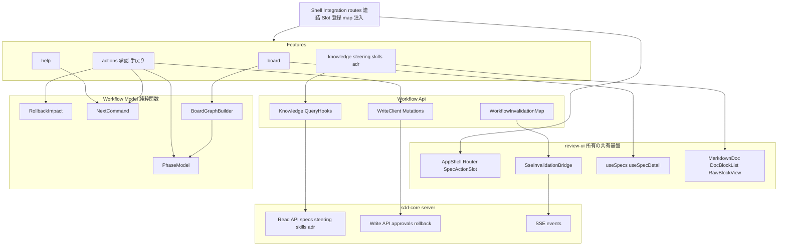
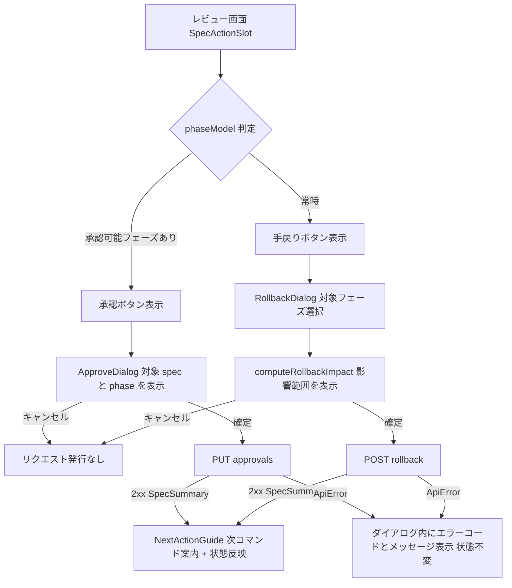
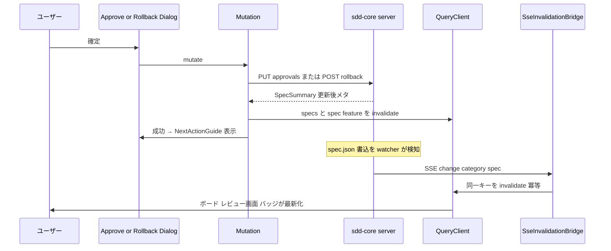

# Design Document: sdd-workflow-ui

## Overview

**Purpose**: sdd-workflow-ui は SDD Dashboard のワークフロー/オペレーション体験を実装する。sdd-core の読取・書込 API と SSE 変更通知を消費し、sdd-review-ui が構築する SPA シェルの拡張点に接続して、パイプライン俯瞰ボード（@xyflow/react によるフロー可視化）、レビュー画面上の承認操作、影響範囲可視化付きの手戻り操作、cc-sdd フローのヘルプ/オンボーディング、steering / スキル（英日切替）/ ADR のナレッジビューアを提供する。

**Users**: スペックの承認・手戻りを行うレビュアー/開発者と、cc-sdd フローを初めて使う開発者が直接利用する。下流スペックはない。

**Impact**: `sdd-dashboard/client/src/workflow/` を新設し、sdd-review-ui が所有するシェルの連結点（ルートレジストリ・SpecActionSlot 登録・InvalidationMap 注入・ナビゲーション）に最小限の変更を加える。既存コード（EVM Studio / `evm-studio/`）への変更はない。

### Goals

- 全スペックのフェーズ進行・承認状態（spec.json 由来）を 1 画面のグラフィカルなフローで俯瞰できるようにする
- 承認・手戻りを「必ず確認ステップを挟み、実行後に次の CLI コマンドを案内する」操作としてレビュー画面へ統合する
- 手戻りの実行前に、下流フェーズの承認解除・再承認の必要性を可視化し、影響を見落とさせない
- cc-sdd フロー全体を初見開発者が画面上で理解できるオンボーディングを提供する
- steering / スキル英日 / ADR をエディタなしで参照可能にする
- review-ui の読み取り専用契約と既存レビュー画面の動作を一切壊さずに同居する

### Non-Goals

- スペックドキュメントの精読・相互リンク・トレーサビリティ表示（sdd-review-ui が担う）
- markdown パース・書込の実処理・書込バリデーション（sdd-core が担う。本スペックは結果を表示するのみ）
- スペック再生成そのもの（CLI スキルが担う。GUI は状態変更と次アクション案内まで）
- 承認可否の判断ロジック（人間が判断する）
- ADR の作成・編集 UI（sdd-core の `POST /api/adr` は本スペックでは消費しない。将来候補）
- AI 実行連携（Claude Code 起動）・リモートアクセス・認証

## Boundary Commitments

### This Spec Owns

- `sdd-dashboard/client/src/workflow/` 配下の全コード（board / actions / help / knowledge の各画面、書込クライアント、ワークフロー系クエリフック、フェーズモデル純粋関数群）
- ルート名前空間 `/board` `/help` `/steering` `/skills` `/adr` の画面実装（review-ui が予約済みの空間を埋める）
- sdd-core 書込 API 2 エンドポイント（approvals / rollback）の SPA 内唯一の呼び出し点と、その確認ステップ UI
- フェーズ進行モデルの表示解釈（spec.json の approvals → パイプライン段階表示、承認可能条件、巻き戻し影響予測、次 CLI コマンド導出）
- `SseInvalidationBridge` への `steering` / `skill` / `adr` カテゴリ無効化写像の追加エントリ

### Out of Boundary

- SPA シェル本体（AppShell・ルートレジストリ機構・SpecActionSlot 機構・SSE ブリッジ機構）の所有 — sdd-review-ui が所有。本スペックが行うのは、公開された拡張点への登録と、Modified Files に明示列挙した連結点ファイルへの最小限の変更（AppShell.tsx のナビリンク追加・router.tsx のルート連結 等）のみ。宣言済み連結点を超える AppShell の変更は境界外のまま
- `/specs/**` ルート配下の画面と GET 系スペック読取フック（`useSpecs` / `useSpecDetail` 等）— sdd-review-ui 所有。本スペックは import して再利用する
- 安全な markdown 描画基盤（`MarkdownDoc` / `DocBlockList` / `RawBlockView`）— sdd-review-ui 所有。本スペックは再利用し、独自の markdown 描画設定を持たない
- 承認・巻き戻しのバリデーションと spec.json 書込の実体、`phase` / `ready_for_implementation` の導出 — sdd-core 所有。クライアント側の影響予測は表示専用であり、正は常にサーバー返却値
- `POST /api/adr` の呼び出し（ADR 作成 UI は本スペックの範囲外）

### Allowed Dependencies

- 上流 API（sdd-core design.md の API 契約表に準拠）:
  - 読取: `GET /api/specs`, `GET /api/specs/:feature`, `GET /api/steering`, `GET /api/steering/:name`, `GET /api/skills`, `GET /api/skills/:name`, `GET /api/adr`, `GET /api/adr/:id`, `GET /api/events`（SSE）
  - 書込: `PUT /api/specs/:feature/approvals`, `POST /api/specs/:feature/rollback` の 2 つのみ
- 契約型: `@contracts/*`（`sdd-dashboard/server/src/types/`）を `import type` 限定で参照（review-ui と同一規律）
- review-ui の公開拡張点と共有基盤: ルートレジストリ（`RouteObject[]` 連結）、`SpecActionSlot.register`、`InvalidationMap` エントリ追加、`useSpecs` / `useSpecDetail` / `queryKeys` / `MarkdownDoc` / `DocBlockList` / `RawBlockView` / `ErrorPanel` / `LoadingSkeleton`
- npm 依存（すべて MIT・ローカルバンドル）: @xyflow/react ^12.11（Pro 機能不使用）。その他は review-ui scaffolding が導入済みの react 19 / react-router 7 / @tanstack/react-query 5 / tailwindcss 4 / vitest / msw / @playwright/test を共用する
- 禁止: `dangerouslySetInnerHTML`、`any` 型、外部 CDN・外部 API、`evm-studio/` からの import、approvals / rollback 以外の書込エンドポイント呼び出し、`workflow/api/writeClient.ts` 以外での fetch 直接使用

### Revalidation Triggers

下記の変更が起きた場合、本スペックは統合を再検証すること（上流 2 スペックの Revalidation Triggers と対）:

- sdd-core: `src/types/` の契約型・エンドポイント URL・`ChangeEvent` スキーマ・`ApiError` 形状・エラーコード語彙の変更
- sdd-core: RollbackWriter / ApprovalWriter のセマンティクス変更（巻き戻し時の後続フェーズ処理、承認順序ルール）→ `computeRollbackImpact` / 承認可能条件の表示が乖離する
- sdd-review-ui: ルートレジストリの形（`RouteObject[]` 合成方式）・予約名前空間・`SpecActionSlot` 契約・`InvalidationMap` 形状・markdown 基盤コンポーネントの props 変更

また本スペックの変更のうち、review-ui 連結点（router 連結・main.tsx 組込・AppShell ナビ・ESLint 許可）の形を変えるものは、sdd-review-ui 側の再検証を要する。

## Architecture

### Architecture Pattern & Boundary Map

review-ui と同型の機能スライス + 共有基盤層を採用し、`workflow/` 名前空間に閉じる。依存方向は **Contracts（型）→ Model（純粋関数）→ Api → Features → Shell Integration** の一方向のみ（左から右へ import 可、逆方向は禁止）。review-ui の共有基盤（markdown / ErrorPanel / スペック読取フック）への依存は Api・Features 層からの一方向 import で、review-ui 側から workflow への import は発生しない。



**Architecture Integration**:

- Selected pattern: 機能スライス + 拡張点接続（research.md の Architecture Pattern Evaluation 参照）。brief の Boundary Candidates（俯瞰ボード / 承認・手戻り操作フロー / ヘルプ / ナレッジビューア）を features にそのまま対応させた
- Domain boundaries: フェーズ進行の表示解釈（パイプライン段階・承認可能条件・巻き戻し影響・次コマンド）は Model 層の純粋関数のみが所有。書込 HTTP は WriteClient のみが所有。SSE カテゴリ写像の追加は WorkflowInvalidationMap のみが所有。markdown 安全描画は review-ui 基盤に委譲（独自所有しない）
- Steering compliance: structure.md の「データフェッチは TanStack Query を介し hooks に封じ込め」「Single Source of Truth（コマンド対応表・クエリキー・書込クライアントは各 1 箇所）」、tech.md の `dangerouslySetInnerHTML` 禁止を踏襲。Phase 2 制約（roadmap.md）が EVM Studio スタック記述に優先する箇所: tRPC ではなく sdd-core の REST + 契約型を消費する
- 新規依存: @xyflow/react ^12.11 のみ（board スライスに閉じる）

### Technology Stack

| Layer | Choice / Version | Role in Feature | Notes |
|-------|------------------|-----------------|-------|
| UI | React 19 + Vite + TailwindCSS 4 | 画面群・スタイリング | review-ui scaffolding を共用。外部 CDN 不使用 |
| Flow 可視化 | @xyflow/react ^12.11 | パイプラインボードの描画 | MIT。Pro 機能不使用。CSS はローカル import。board ルートのみで使用 |
| Routing | react-router 7（library mode） | `/board` `/help` `/steering` `/skills` `/adr` ルート | review-ui のルートレジストリへ `RouteObject[]` を連結 |
| Data | @tanstack/react-query 5 | ナレッジ読取キャッシュ + 承認/巻き戻し mutation | 書込は `useMutation`、成功時に返却 `SpecSummary` で反映 |
| SSE | review-ui `SseInvalidationBridge` | steering / skill / adr カテゴリの無効化写像追加 | `InvalidationMap` 拡張点を利用（新規接続なし） |
| Markdown | review-ui `MarkdownDoc` / `DocBlockList` / `RawBlockView` | steering / スキル / ADR 本文の安全描画 | 独自 markdown 設定を持たない |
| Contracts | `@contracts/*`（`import type` 限定） | sdd-core 公開契約型 | review-ui と同一の ESLint 強制 |
| Testing | Vitest + Testing Library + msw / Playwright | 単体・結合 / E2E | testing-conventions.md 準拠 |

## File Structure Plan

```
sdd-dashboard/client/
├── package.json                # 変更: @xyflow/react ^12.11 を dependencies に追加
├── eslint.config.js            # 変更: fetch 直接使用の許可に workflow/api/writeClient.ts を追加
└── src/
    ├── main.tsx                # 変更: workflow 統合の組み込み（registerWorkflow 呼び出し 1 箇所）
    ├── app/
    │   ├── router.tsx          # 変更: workflowRoutes を予約名前空間へ連結（連結点 1 箇所）
    │   └── AppShell.tsx        # 変更: 共通ナビへ Board / Help / Knowledge リンクを追加
    └── workflow/
        ├── routes.tsx              # workflowRoutes: RouteObject[]（本スペックの URL 空間の唯一の定義）
        ├── integration.tsx         # registerWorkflow: SpecActionSlot 登録 + InvalidationMap 注入の組立
        ├── model/                  # 純粋関数（FS/HTTP アクセスなし・fixture で単体テスト）
        │   ├── phaseModel.ts       # SpecSummary → PhaseStep[] 導出・承認可能フェーズ判定の唯一の場所
        │   ├── rollbackImpact.ts   # computeRollbackImpact: 巻き戻し影響の事前予測（表示専用）
        │   └── nextCommand.ts      # フェーズ → 次 CLI コマンド対応表（承認後 / 手戻り後 / ヘルプ共用）
        ├── api/
        │   ├── writeClient.ts      # 書込専用 fetch ラッパ（approvals / rollback の 2 メソッドのみ）
        │   ├── useApprovalMutation.ts
        │   ├── useRollbackMutation.ts
        │   ├── workflowQueryKeys.ts # steering / skills / adr クエリキーの唯一の定義
        │   ├── useSteeringList.ts  # GET /api/steering
        │   ├── useSteeringDoc.ts   # GET /api/steering/:name
        │   ├── useSkillList.ts     # GET /api/skills
        │   ├── useSkillDoc.ts      # GET /api/skills/:name
        │   ├── useAdrList.ts       # GET /api/adr
        │   ├── useAdrDoc.ts        # GET /api/adr/:id
        │   └── invalidationMap.ts  # workflowInvalidationMap: steering/skill/adr カテゴリ写像
        ├── board/
        │   ├── BoardPage.tsx       # /board 画面（取得 + PipelineFlow + ナビゲーション）
        │   ├── PipelineFlow.tsx    # @xyflow/react ラッパ（読取専用設定・fitView）
        │   ├── SpecPipelineNode.tsx # カスタムノード（フェーズ状態・ready・診断バッジ）
        │   └── buildBoardGraph.ts  # SpecSummary[] → ノード/エッジ/座標（純粋関数）
        ├── actions/
        │   ├── SpecWorkflowActions.tsx # SpecActionSlot へ登録する操作 UI（承認 / 手戻りボタン）
        │   ├── ConfirmDialog.tsx       # 確認ダイアログ基盤（確定 / キャンセル・実行中無効化）
        │   ├── ApproveDialog.tsx       # 承認確認（対象 spec / phase 表示 + 実行 + エラー表示）
        │   ├── RollbackDialog.tsx      # 手戻り確認（対象フェーズ選択 + 影響範囲表示 + 実行 + エラー表示）
        │   └── NextActionGuide.tsx     # 実行後の次 CLI コマンド案内パネル
        ├── help/
        │   ├── HelpPage.tsx        # /help 画面
        │   └── helpContent.tsx     # cc-sdd フロー解説コンテンツ（ローカル静的・nextCommand を参照）
        └── knowledge/
            ├── steering/
            │   ├── SteeringListPage.tsx # /steering 一覧
            │   └── SteeringDocPage.tsx  # /steering/:name 本文（MarkdownDoc 描画）
            ├── skills/
            │   ├── SkillListPage.tsx    # /skills 一覧（EN/JA 有無バッジ）
            │   └── SkillDocPage.tsx     # /skills/:name 本文（EN/JA タブ。lang は URL クエリ）
            └── adr/
                ├── AdrListPage.tsx      # /adr 一覧（status バッジ・date・specs）
                ├── AdrDetailPage.tsx    # /adr/:id 本文（frontmatter メタ + 本文散文）
                └── AdrStatusBadge.tsx   # proposed/accepted/deprecated/superseded の表示原子
```

テストはソースと同階層にコロケーション（`*.test.ts` / `*.test.tsx`）。E2E は review-ui が確立した `sdd-dashboard/e2e/` に `workflow.spec.ts` を追加し、sdd-core のフィクスチャリポジトリ + 実サーバーに対して実行する。

### Modified Files

- `sdd-dashboard/client/src/app/router.tsx` — `workflowRoutes` をルートレジストリへ連結（review-ui が設計した連結点 1 箇所のみ）
- `sdd-dashboard/client/src/app/AppShell.tsx` — 共通ナビゲーションへ Board / Help / Steering / Skills / ADR のリンクを追加（既存ナビ構造・レビュー画面の挙動は変更しない）
- `sdd-dashboard/client/src/main.tsx` — `registerWorkflow()`（SpecActionSlot 登録 + `useChangeEvents` への workflowInvalidationMap 注入）を組み込む
- `sdd-dashboard/client/package.json` — `@xyflow/react` 追加
- `sdd-dashboard/client/eslint.config.js` — fetch 直接使用の許可ファイルに `workflow/api/writeClient.ts` を追加（既存ルールの緩和ではなく許可対象の追加）
- `sdd-dashboard/e2e/workflow.spec.ts` — 新規 E2E（e2e ディレクトリ自体は review-ui 所有の既存構成）

### ルート表（本スペックが定義する URL 空間）

| Route | 画面 | 備考 |
|-------|------|------|
| `/board` | BoardPage | 1.1, 1.5 |
| `/help` | HelpPage | 4.1 |
| `/steering` | SteeringListPage | 5.1 |
| `/steering/:name` | SteeringDocPage | 5.2 |
| `/skills` | SkillListPage | 6.1 |
| `/skills/:name?lang=en\|ja` | SkillDocPage | 6.2。言語タブは URL クエリで復元 |
| `/adr` | AdrListPage | 7.1 |
| `/adr/:id` | AdrDetailPage | 7.2 |

いずれも review-ui の予約名前空間内であり、`/specs/**` には新ルートを追加しない。

## System Flows

### 承認・手戻り操作フロー（確認ゲート共通）



ゲート条件: 書込リクエストはダイアログの確定操作からのみ発行される（9.3 の構造的保証）。エラー時はダイアログを閉じず、表示中の状態を変更しない（2.6, 3.6）。実行中は確定ボタンを無効化し二重送信を防ぐ。

### 書込成功後の状態反映（mutation + SSE の二重経路）



mutation 成功時の invalidate と SSE 由来の invalidate は同一クエリキー集合に収束するため冪等（8.2）。SSE 経路は CLI/AI による外部変更も同じ仕組みで反映する（8.1）。

## Requirements Traceability

| Requirement | Summary | Components | Interfaces | Flows |
|-------------|---------|------------|------------|-------|
| 1.1, 1.2 | 全スペックのフェーズ進行・承認状態・ready のグラフィカル表示 | PhaseModel, BoardGraphBuilder, BoardPage, PipelineFlow, SpecPipelineNode | `useSpecs`, `PhaseStep`, `BoardGraph` | — |
| 1.3 | メタデータ不正スペックの診断付き表示 | BoardGraphBuilder, SpecPipelineNode | `SpecSummary.diagnostics` | — |
| 1.4 | ボードからレビュー画面へ遷移 | BoardPage, SpecPipelineNode | `/specs/:feature` ルート | — |
| 1.5 | ボードビューの URL 復元 | WorkflowRoutes | `/board` ルート | — |
| 2.1 | 生成済み未承認フェーズへの承認操作の提示 | SpecWorkflowActions, PhaseModel | `SpecActionSlot.register`, `approvablePhase` | 承認・手戻り操作 |
| 2.2 | 承認の確認ステップ（対象表示） | ApproveDialog, ConfirmDialog | `ConfirmDialogProps` | 承認・手戻り操作 |
| 2.3 | キャンセル時のリクエスト不発行 | ApproveDialog, ConfirmDialog | — | 承認・手戻り操作 |
| 2.4 | 承認実行と更新後状態の表示 | ApprovalMutation, WriteClient | `PUT /api/specs/:feature/approvals` | 書込成功後の状態反映 |
| 2.5 | 承認後の次アクション・CLI コマンド案内 | NextActionGuide, NextCommand | `nextCommandAfterApproval` | 承認・手戻り操作 |
| 2.6 | 承認拒否時のエラー表示と状態不変 | ApproveDialog, ApprovalMutation | `ApiError`(409/404/422) | 承認・手戻り操作 |
| 3.1 | 巻き戻し先フェーズを選択できる手戻り操作 | SpecWorkflowActions, RollbackDialog | `SpecActionSlot.register`, `PhaseName` | 承認・手戻り操作 |
| 3.2 | 実行前の影響範囲表示（承認解除・ready 喪失） | RollbackImpact, RollbackDialog | `computeRollbackImpact`, `RollbackImpactView` | 承認・手戻り操作 |
| 3.3 | キャンセル時のリクエスト不発行 | RollbackDialog, ConfirmDialog | — | 承認・手戻り操作 |
| 3.4 | 巻き戻し実行と更新後状態の表示 | RollbackMutation, WriteClient | `POST /api/specs/:feature/rollback` | 書込成功後の状態反映 |
| 3.5 | 手戻り後の次 CLI コマンド案内 | NextActionGuide, NextCommand | `nextCommandAfterRollback` | 承認・手戻り操作 |
| 3.6 | 巻き戻し拒否時のエラー表示と状態維持 | RollbackDialog, RollbackMutation | `ApiError`(404/422) | 承認・手戻り操作 |
| 4.1 | cc-sdd フローの順序立った解説 | HelpPage, HelpContent | `/help` ルート | — |
| 4.2 | 各フェーズの成果物・承認の意味・CLI コマンド解説 | HelpContent, NextCommand | `PHASE_COMMANDS` | — |
| 4.3 | 共通ナビゲーションからのヘルプ到達 | ShellIntegration | AppShell ナビリンク | — |
| 5.1 | steering 文書一覧 | SteeringListPage, KnowledgeQueryHooks | `GET /api/steering`, `SteeringDocSummary[]` | — |
| 5.2 | steering 本文の無欠落描画 | SteeringDocPage | `GET /api/steering/:name`, MarkdownDoc | — |
| 6.1 | スキル一覧（英日有無付き） | SkillListPage, KnowledgeQueryHooks | `GET /api/skills`, `SkillSummary[]` | — |
| 6.2 | 英日タブ切替 | SkillDocPage | `GET /api/skills/:name`, `SkillDoc` | — |
| 6.3 | 日本語版不在の非エラー表示 | SkillDocPage | `SkillDoc.ja` nullable | — |
| 7.1 | ADR 一覧（id・タイトル・status バッジ・date・specs） | AdrListPage, AdrStatusBadge, KnowledgeQueryHooks | `GET /api/adr`, `AdrSummary[]` | — |
| 7.2 | ADR 本文セクションの散文描画 | AdrDetailPage | `GET /api/adr/:id`, `AdrDoc` | — |
| 7.3 | ADR メタデータ不正時の raw + 診断表示 | AdrDetailPage | RawBlockView + 診断 | — |
| 8.1 | 表示中リソースの変更自動反映 | WorkflowInvalidationMap | `InvalidationMap`(steering/skill/adr), `ChangeEvent` | 書込成功後の状態反映 |
| 8.2 | 承認・手戻り後の全ビュー反映 | ApprovalMutation, RollbackMutation | invalidate キー集合 | 書込成功後の状態反映 |
| 8.3 | 無関係な変更通知でビューを乱さない | WorkflowInvalidationMap | カテゴリ別キー写像 | — |
| 9.1 | 同一 SPA・共通ナビゲーション統合 | ShellIntegration, WorkflowRoutes | ルートレジストリ連結 | — |
| 9.2 | 既存レビュー画面の無変更動作 | ShellIntegration, SpecWorkflowActions | 拡張点のみへの接続 | — |
| 9.3 | 確認ステップなしの状態変更禁止 | ConfirmDialog, ApproveDialog, RollbackDialog | 確定操作からのみ mutate | 承認・手戻り操作 |
| 9.4 | 承認・手戻り以外の状態変更手段の不在 | WriteClient | 2 メソッド限定クライアント | — |
| 9.5 | 完全ローカル動作 | Scaffolding 変更（@xyflow/react ローカルバンドル） | ローカルアセットのみ | — |
| 9.6 | 読取失敗時のエラーコード・メッセージ・再試行表示 | KnowledgeQueryHooks, BoardPage | `NormalizedApiError`, ErrorPanel（再利用） | — |

## Components and Interfaces

### サマリー

| Component | Layer | Intent | Req Coverage | Key Dependencies | Contracts |
|-----------|-------|--------|--------------|------------------|-----------|
| WorkflowRoutes + ShellIntegration | Shell Integration | ルート連結・Slot 登録・map 注入・ナビリンクの組立 | 1.5, 4.3, 9.1, 9.2 | review-ui Router (P0), SpecActionSlot (P0), useChangeEvents (P0) | Service |
| PhaseModel (`model/phaseModel.ts`) | Model | spec.json approvals → パイプライン段階・承認可能判定の唯一の解釈 | 1.1, 1.2, 2.1 | `@contracts/spec` (P0) | Service |
| RollbackImpact (`model/rollbackImpact.ts`) | Model | 巻き戻し影響の事前予測（表示専用・サーバーが正） | 3.2 | `@contracts/spec` (P0) | Service |
| NextCommand (`model/nextCommand.ts`) | Model | フェーズ → 次 CLI コマンド対応の唯一の定義 | 2.5, 3.5, 4.2 | — | Service |
| WriteClient (`api/writeClient.ts`) | Api | 書込 2 操作の SPA 内唯一の HTTP 呼び出し点 | 2.4, 3.4, 9.4 | `@contracts/api` (P0) | Service, API |
| ApprovalMutation / RollbackMutation | Api | useMutation ラッパ・成功時 invalidate・エラー正規化 | 2.4, 2.6, 3.4, 3.6, 8.2 | WriteClient (P0), QueryClient (P0) | Service |
| KnowledgeQueryHooks + workflowQueryKeys | Api | steering / skills / adr 読取フックとキー集約 | 5.1, 5.2, 6.1, 6.2, 7.1, 7.2, 9.6 | review-ui ApiClient `get` (P0) | Service |
| WorkflowInvalidationMap (`api/invalidationMap.ts`) | Api | steering / skill / adr カテゴリ → クエリキー写像 | 8.1, 8.3 | workflowQueryKeys (P0) | Event |
| BoardGraphBuilder (`board/buildBoardGraph.ts`) | Feature: board | SpecSummary[] → ノード/エッジ/座標（純粋関数） | 1.1, 1.2, 1.3 | PhaseModel (P0) | Service |
| BoardPage + PipelineFlow + SpecPipelineNode | Feature: board | ボード画面・@xyflow/react 描画・遷移 | 1.1, 1.2, 1.3, 1.4 | useSpecs (P0), @xyflow/react (P0), BoardGraphBuilder (P0) | — |
| SpecWorkflowActions | Feature: actions | SpecActionSlot へ登録する承認・手戻りボタン | 2.1, 3.1, 9.2 | PhaseModel (P0), useSpecs (P0) | Service |
| ConfirmDialog | Feature: actions | 確認ゲート基盤（確定 / キャンセル / 実行中無効化） | 2.2, 2.3, 3.3, 9.3 | — | Service |
| ApproveDialog | Feature: actions | 承認確認・実行・エラー表示 | 2.2, 2.3, 2.4, 2.6 | ConfirmDialog (P0), ApprovalMutation (P0) | — |
| RollbackDialog | Feature: actions | 対象フェーズ選択・影響表示・実行・エラー表示 | 3.1, 3.2, 3.3, 3.4, 3.6 | ConfirmDialog (P0), RollbackImpact (P0), RollbackMutation (P0) | — |
| NextActionGuide | Feature: actions | 実行後の次 CLI コマンド案内 | 2.5, 3.5 | NextCommand (P0) | — |
| HelpPage + HelpContent | Feature: help | cc-sdd フロー解説（ローカル静的） | 4.1, 4.2, 4.3 | NextCommand (P1) | — |
| SteeringListPage / SteeringDocPage | Feature: knowledge | steering 一覧・本文 | 5.1, 5.2 | KnowledgeQueryHooks (P0), MarkdownDoc (P0) | — |
| SkillListPage / SkillDocPage | Feature: knowledge | スキル一覧・英日タブ | 6.1, 6.2, 6.3 | KnowledgeQueryHooks (P0), MarkdownDoc (P0) | — |
| AdrListPage / AdrDetailPage / AdrStatusBadge | Feature: knowledge | ADR 一覧・本文・status バッジ | 7.1, 7.2, 7.3 | KnowledgeQueryHooks (P0), MarkdownDoc (P0), RawBlockView (P0) | — |

以下、新しい境界を導入するコンポーネントの詳細。純粋な表示コンポーネント（HelpPage / 一覧ページ / バッジ等）はサマリー行のみとする。

### Model 層（純粋関数）

#### PhaseModel

| Field | Detail |
|-------|--------|
| Intent | spec.json の approvals からパイプライン段階表示と承認可能条件を導出する唯一の解釈点 |
| Requirements | 1.1, 1.2, 2.1 |

**Responsibilities & Constraints**

- 入力は `SpecSummary`（または `approvals` + `readyForImplementation`）のみ。HTTP・DOM アクセスを持たない
- 4 段階（requirements / design / tasks / implementation）それぞれの表示状態を導出する: `not-generated` / `generated`（未承認）/ `approved`。implementation 段階は `readyForImplementation` で `ready` / `not-ready` を表現する
- 承認可能フェーズの判定はサーバーのルール（sdd-core 9.2, 9.3）と同じ表示条件を使う: `generated === true` かつ `approved === false` かつ先行フェーズがすべて `approved === true`。条件を満たさないフェーズに承認ボタンを出さない（サーバー側 409 を「通常操作で踏まない」ようにする。最終判定はサーバー）
- `approvals` が `null`（spec.json 不正）の場合は全段階 `unknown` を返し、診断付き表示に委ねる（1.3）

**Contracts**: Service [x]

##### Service Interface

```typescript
import type { SpecSummary, PhaseName } from "@contracts/spec";

// PhaseName（"requirements" | "design" | "tasks"）は @contracts/spec が正典。本スペックでは再宣言しない

type PhaseStepState =
  | { kind: "not-generated" }
  | { kind: "generated" }       // 生成済み・未承認
  | { kind: "approved" }
  | { kind: "unknown" };        // approvals 読取不能（診断あり）

interface PipelineView {
  steps: Array<{ phase: PhaseName | "implementation"; state: PhaseStepState; current: boolean }>;
  ready: boolean | null;        // null = 不明
}

declare function buildPipelineView(spec: SpecSummary): PipelineView;
/** 現在承認操作を提示すべきフェーズ。なければ null */
declare function approvablePhase(spec: SpecSummary): PhaseName | null;
```

- Preconditions: なし（diagnostics 付き SpecSummary も受け付ける）
- Postconditions: `steps` は常に 4 要素・固定順。`current` は高々 1 つ
- Invariants: `approvablePhase` が非 null を返す条件は sdd-core の承認バリデーション（9.2, 9.3）を満たす場合に限る

#### RollbackImpact

| Field | Detail |
|-------|--------|
| Intent | 巻き戻し実行前の影響範囲（表示専用予測）の唯一の導出点 |
| Requirements | 3.2 |

**Responsibilities & Constraints**

- sdd-core RollbackWriter のセマンティクス（10.1, 10.2: 対象フェーズ `approved = false`、後続フェーズ両フラグ `false`、`ready_for_implementation = false`）をそのまま写像し、「承認が解除されるフェーズ」「生成状態ごとクリアされ再生成・再承認が必要になる後続フェーズ」「ready 喪失」を列挙する
- 表示専用であり、書込判断・実行には使わない。実行結果は常にサーバー返却の `SpecSummary` で上書きされる
- sdd-core のセマンティクス変更時に追従する（Revalidation Triggers）

**Contracts**: Service [x]

```typescript
interface RollbackImpactView {
  targetPhase: PhaseName;
  revokedApproval: PhaseName[];   // 承認が解除されるフェーズ（target 含む、承認済みのもののみ）
  clearedPhases: PhaseName[];     // 生成・承認の両フラグがクリアされる後続フェーズ
  losesReady: boolean;            // 現在 ready_for_implementation = true から false になるか
  nextCommand: string;            // 例 "/kiro-spec-requirements sdd-workflow-ui"
}

declare function computeRollbackImpact(spec: SpecSummary, targetPhase: PhaseName): RollbackImpactView;
```

#### NextCommand

| Field | Detail |
|-------|--------|
| Intent | フェーズ → 次 CLI コマンドの対応表の唯一の定義（Single Source of Truth） |
| Requirements | 2.5, 3.5, 4.2 |

**Responsibilities & Constraints**

- 承認後: requirements 承認 → `/kiro-spec-design {feature}`、design 承認 → `/kiro-spec-tasks {feature}`、tasks 承認 → `/kiro-impl {feature}`
- 手戻り後: 巻き戻し先フェーズの再生成コマンド（requirements → `/kiro-spec-requirements {feature}`、design → `/kiro-spec-design {feature}`、tasks → `/kiro-spec-tasks {feature}`）
- ヘルプコンテンツのフェーズ別コマンド解説（4.2）も本対応表を参照する

**Contracts**: Service [x]

```typescript
declare function nextCommandAfterApproval(phase: PhaseName, feature: string): string;
declare function nextCommandAfterRollback(targetPhase: PhaseName, feature: string): string;
/** ヘルプ用: フェーズ → { artifact, approvalMeaning, command } の固定記述 */
declare const PHASE_COMMANDS: ReadonlyArray<{ phase: string; artifact: string; command: string }>;
```

### Api 層

#### WriteClient + ApprovalMutation / RollbackMutation

| Field | Detail |
|-------|--------|
| Intent | sdd-core 書込契約の SPA 内唯一の消費点と、mutation の状態管理・キャッシュ反映 |
| Requirements | 2.4, 2.6, 3.4, 3.6, 8.2, 9.4 |

**Responsibilities & Constraints**

- `writeClient.ts` は次の 2 メソッドのみを公開する（汎用 `post` / `put` を export しない — 9.4 の構造的保証）。fetch 直接使用が許可される SPA 内 2 つ目（最後）のファイル
- 非 2xx は sdd-core の `ApiError` 形をパースし、review-ui 所有の共有型 `NormalizedApiError`（`@/api/client` から import。`code` / `message` / `status`、422 時 `fieldErrors`）へ正規化して throw する。同形の型を本スペック側で再宣言しない
- mutation 成功時: 返却された `SpecSummary` を `['specs']` / `['spec', feature]` キャッシュへ反映し、`['specs']` / `['spec', feature]` / `['trace', feature]` を invalidate する（SSE 経由の invalidate と同一キー集合 → 冪等、8.2）
- mutation 実行中は `isPending` を公開し、ダイアログが確定ボタンを無効化する（二重送信防止）

**Dependencies**

- External: @tanstack/react-query `useMutation` — 書込状態管理 (P0)
- Outbound: sdd-core `PUT /api/specs/:feature/approvals` / `POST /api/specs/:feature/rollback` (P0)

**Contracts**: Service [x] / API [x]

##### Service Interface

```typescript
import type { SpecSummary, PhaseName } from "@contracts/spec";
import type { NormalizedApiError } from "@/api/client"; // review-ui 所有の共有型（code / message / status / fieldErrors?）

interface WriteClient {
  updateApproval(feature: string, phase: PhaseName, approved: boolean): Promise<SpecSummary>;
  rollback(feature: string, targetPhase: PhaseName): Promise<SpecSummary>;
}

// NormalizedApiError の fieldErrors?: Record<string, string[]>（422 のみ設定）が
// ダイアログ内のフィールド単位エラー表示（2.6, 3.6）を駆動する

// Mutation フック（戻り値は TanStack Query の UseMutationResult）
declare function useApprovalMutation(feature: string):
  UseMutationResult<SpecSummary, NormalizedApiError, { phase: PhaseName }>;
declare function useRollbackMutation(feature: string):
  UseMutationResult<SpecSummary, NormalizedApiError, { targetPhase: PhaseName }>;
```

##### API Contract（消費する上流契約 — sdd-core design.md と同一）

| Method | Endpoint | Request | Response | Errors |
|--------|----------|---------|----------|--------|
| PUT | `/api/specs/:feature/approvals` | `{ phase: PhaseName; approved: boolean }` | `SpecSummary` | 404, 409, 422, 500 |
| POST | `/api/specs/:feature/rollback` | `{ targetPhase: PhaseName }` | `SpecSummary` | 404, 422, 500 |

- Preconditions: 承認は `approved: true` でのみ呼ぶ（承認解除 UI は提供しない。解除は手戻り操作で行う）
- Postconditions: 成功時は返却 `SpecSummary` がキャッシュ反映済み。失敗時はキャッシュ未変更（2.6, 3.6）
- Invariants: 本クライアント以外から書込エンドポイントを呼ぶコードは存在しない（ESLint + コードレビューで担保）

#### KnowledgeQueryHooks + workflowQueryKeys

| Field | Detail |
|-------|--------|
| Intent | steering / skills / adr 読取の TanStack Query 封じ込めとキー集約 |
| Requirements | 5.1, 5.2, 6.1, 6.2, 7.1, 7.2, 9.6 |

**Responsibilities & Constraints**

- review-ui の `ApiClient.get<T>` を再利用し（GET なので追加の fetch 実装を持たない）、`useQuery` 薄ラッパとして実装する。変換・解釈をしない
- クエリキーは `workflowQueryKeys.ts` に集約: `['steering']` / `['steering', name]` / `['skills']` / `['skills', name]` / `['adr']` / `['adr', id]`。WorkflowInvalidationMap と必ず同じ定義を共有する
- エラーは review-ui の `NormalizedApiError` のまま透過し、各ページが `ErrorPanel`（再利用）で code / message / 再試行を表示する（9.6）

**Contracts**: Service [x]

```typescript
import type { SteeringDocSummary, SteeringDoc, SkillSummary, SkillDoc, AdrSummary, AdrDoc }
  from "@contracts/resources";

declare function useSteeringList(): UseQueryResult<SteeringDocSummary[], NormalizedApiError>;
declare function useSteeringDoc(name: string): UseQueryResult<SteeringDoc, NormalizedApiError>;
declare function useSkillList(): UseQueryResult<SkillSummary[], NormalizedApiError>;
declare function useSkillDoc(name: string): UseQueryResult<SkillDoc, NormalizedApiError>;
declare function useAdrList(): UseQueryResult<AdrSummary[], NormalizedApiError>;
declare function useAdrDoc(id: string): UseQueryResult<AdrDoc, NormalizedApiError>;
```

#### WorkflowInvalidationMap

| Field | Detail |
|-------|--------|
| Intent | review-ui SseInvalidationBridge への steering / skill / adr カテゴリ写像の追加（拡張点の唯一の利用者） |
| Requirements | 8.1, 8.3 |

**Responsibilities & Constraints**

- review-ui の `InvalidationMap` 拡張点（`Partial<Record<ChangeEvent["category"], (event) => QueryKey[]>>`）にエントリを追加する: `steering` → `[['steering']]`、`skill` → `[['skills']]`、`adr` → `[['adr']]`（プレフィックス invalidate で一覧・詳細の両方が無効化される）
- `spec` カテゴリの写像は review-ui 所有のまま変更しない（ボードの `['specs']` はそれで無効化される）。`other` カテゴリは写像なし（8.3）
- 無効化の実行・接続管理・再接続回復はすべて review-ui の Bridge が担う（本スペックは写像データの提供のみ）

**Contracts**: Event [x]

##### Event Contract

- Subscribed events: review-ui Bridge 経由の SSE `event: change`（`ChangeEvent`）
- Ordering / delivery: review-ui Bridge の規律（active クエリのみ再取得・マイクロタスク集約）に従う

```typescript
import type { InvalidationMap } from "@/api/sse/useChangeEvents";

export const workflowInvalidationMap: InvalidationMap = {
  steering: () => [["steering"]],
  skill: () => [["skills"]],
  adr: () => [["adr"]],
};
```

### Shell Integration 層

#### WorkflowRoutes + ShellIntegration（`routes.tsx` + `integration.tsx`）

| Field | Detail |
|-------|--------|
| Intent | review-ui の 3 拡張点への接続と共通ナビ追加を 1 箇所に集約する |
| Requirements | 1.5, 4.3, 9.1, 9.2 |

**Responsibilities & Constraints**

- `workflowRoutes: RouteObject[]` をルート表どおりに定義し、`app/router.tsx` の連結点で予約名前空間へ合成する。`/specs/**` には触れない（9.2）
- `registerWorkflow()` は (a) `SpecActionSlot.register` に `SpecWorkflowActions` のレンダラを登録し、(b) `useChangeEvents` へ `workflowInvalidationMap` を渡す組立を行う。`main.tsx` からの呼び出しは 1 行
- AppShell の共通ナビへ Board / Help / Steering / Skills / ADR リンクを追加する（既存リンク・レイアウト構造は変更しない）
- board ルートは route-level code splitting（`React.lazy`）で @xyflow/react を遅延ロードし、レビュー画面の初期ロードに影響させない

**Contracts**: Service [x]

```typescript
import type { RouteObject } from "react-router";

export const workflowRoutes: RouteObject[]; // /board /help /steering /skills /adr
export function registerWorkflow(slot: SpecActionSlotApi): () => void; // 戻り値 = 解除
```

### Feature: board

#### BoardGraphBuilder + BoardPage + PipelineFlow + SpecPipelineNode

| Field | Detail |
|-------|--------|
| Intent | スペック一覧をフェーズパイプラインのフローグラフとして可視化する |
| Requirements | 1.1, 1.2, 1.3, 1.4 |

**Responsibilities & Constraints**

- `buildBoardGraph` は純粋関数: `SpecSummary[]` を入力に、スペックごとに 1 レーン（requirements → design → tasks → implementation の 4 ノード + 進行エッジ）を生成し、決定論的な格子座標を割り当てる（自動レイアウトライブラリ不使用）。ノードデータは PhaseModel の `PipelineView` を埋め込む
- `SpecPipelineNode` はカスタムノード: フェーズ状態（未生成 = ディム / 生成済み未承認 = 枠 + バッジ / 承認済み = 塗り）、現在フェーズの強調、`ready` バッジ、`diagnostics` 非空時の警告バッジを表示する（1.2, 1.3）。spec.json 不正のスペックもレーンを必ず生成する（state = unknown 表示）
- `PipelineFlow` は @xyflow/react を読取専用設定（`nodesDraggable=false`・`nodesConnectable=false`・`fitView`・ローカル CSS import）でラップする。Pro 機能・外部リソースを使用しない
- スペックラベル（またはレーン）クリックで `/specs/:feature` へ遷移する（1.4）。データは `useSpecs`（review-ui フック）のみで、SSE 反映もそのキャッシュ経由で自動成立する
- 取得エラー時は `ErrorPanel` を表示する（9.6）

**Contracts**: Service [x]

```typescript
import type { Node, Edge } from "@xyflow/react";
import type { SpecSummary } from "@contracts/spec";

interface BoardGraph {
  nodes: Node<SpecPipelineNodeData>[];
  edges: Edge[];
}
interface SpecPipelineNodeData extends Record<string, unknown> {
  feature: string;
  pipeline: PipelineView;
  hasDiagnostics: boolean;
}
declare function buildBoardGraph(specs: SpecSummary[]): BoardGraph;
```

- Postconditions: 入力スペック数 = レーン数（省略なし、1.3）。同一入力 → 同一座標（決定性）

### Feature: actions

#### SpecWorkflowActions + ConfirmDialog + ApproveDialog + RollbackDialog + NextActionGuide

| Field | Detail |
|-------|--------|
| Intent | レビュー画面に重ねる承認・手戻り操作の全フロー（確認ゲート・影響表示・次アクション案内） |
| Requirements | 2.1, 2.2, 2.3, 2.4, 2.5, 2.6, 3.1, 3.2, 3.3, 3.4, 3.5, 3.6, 9.3 |

**Responsibilities & Constraints**

- `SpecWorkflowActions` は `SpecActionContext`（feature / document）を受け取り、`useSpecs` キャッシュの該当 `SpecSummary` から `approvablePhase` を判定して承認ボタンを表示する（2.1。承認可能フェーズがなければ承認ボタン非表示）。手戻りボタンは承認済みフェーズが 1 つ以上ある場合に表示する（3.1）
- `ConfirmDialog` は確認ゲートの唯一の基盤: 確定 / キャンセルの 2 操作を持ち、確定コールバック以外から書込が起こらない構造にする（9.3）。実行中（`isPending`）は確定を無効化。Esc / 背景クリックはキャンセル扱い（2.3, 3.3）
- `ApproveDialog`: 対象 feature / phase / ドキュメント名を明示し（2.2）、確定で `useApprovalMutation` を実行（2.4）。エラー時はダイアログ内に `code` + `message`（422 は fieldErrors も）を表示し、閉じずに再試行・キャンセルを選べる（2.6）
- `RollbackDialog`: 巻き戻し先フェーズの選択 UI（requirements / design / tasks。承認済み・生成済みフェーズのみ選択可）→ 選択に応じて `computeRollbackImpact` の結果を「承認解除: design, tasks / 再生成が必要 / 実装準備フラグ解除」のように可視化（3.2）→ 確定で `useRollbackMutation` を実行（3.4）。エラー処理は ApproveDialog と同様（3.6）
- `NextActionGuide`: mutation 成功後にダイアログ内容を成功表示へ切り替え、更新後の状態サマリと `nextCommandAfterApproval` / `nextCommandAfterRollback` のコマンド（コピー操作付き）を提示する（2.5, 3.5）

**Contracts**: Service [x]

```typescript
interface ConfirmDialogProps {
  title: string;
  children: ReactNode;        // 対象表示・影響表示
  confirmLabel: string;
  pending: boolean;
  error: NormalizedApiError | null;
  onConfirm: () => void;      // 書込はこのコールバック経由のみ
  onCancel: () => void;
}
```

### Feature: help / knowledge

#### HelpPage / SteeringListPage / SteeringDocPage / SkillListPage / SkillDocPage / AdrListPage / AdrDetailPage

| Field | Detail |
|-------|--------|
| Intent | フロー解説とナレッジ閲覧（すべて表示のみ・review-ui markdown 基盤へ委譲） |
| Requirements | 4.1, 4.2, 4.3, 5.1, 5.2, 6.1, 6.2, 6.3, 7.1, 7.2, 7.3 |

**Responsibilities & Constraints**

- **HelpPage**: `helpContent.tsx` のローカル静的コンテンツで cc-sdd フロー（Discovery → Requirements → 承認 → Design → 承認 → Tasks → 承認 → 実装）を順序図 + フェーズ別カード（成果物・承認の意味・CLI コマンド = `PHASE_COMMANDS` 参照）で解説する（4.1, 4.2）。外部リンク・外部画像を含めない
- **SteeringDocPage**: `SteeringDoc`（content + sections）を `MarkdownDoc` で全文描画する（5.2。情報無欠落は review-ui 基盤の不変則に乗る）
- **SkillDocPage**: `SkillDoc.en`（必須）/ `SkillDoc.ja`（nullable）をタブで切替表示する。タブ選択は URL クエリ `?lang=` に表現しリロードで復元。`ja` が null のときは JA タブを無効化し「日本語版は未作成」の非エラー表示で EN を表示する（6.2, 6.3）
- **AdrListPage**: `AdrSummary[]` を id 昇順で一覧し、status は `AdrStatusBadge`（proposed / accepted / deprecated / superseded の色分け）、date・specs を併記する（7.1）
- **AdrDetailPage**: `AdrDoc` の frontmatter メタ（id / title / status / date / specs / requirements / supersedes / superseded_by）をヘッダ表示し、本文（Context / Decision / Consequences / Alternatives）を `MarkdownDoc` で散文描画する（7.2）。frontmatter 不正で raw + 診断が返るケース（sdd-core 7.5）は `RawBlockView` + 診断表示にフォールバックする（7.3）
- 全ページ共通: ローディングは `LoadingSkeleton`、エラーは `ErrorPanel`（再利用、9.6）

**Contracts**: なし（表示のみ。props は `@contracts/resources` の DTO をそのまま受ける）

## Data Models

クライアントに永続データはない。review-ui の状態規律（サーバーデータ = TanStack Query / ビュー位置 = URL / UI 一時状態 = Context・ローカル state）を踏襲し、本スペックが追加する状態は以下のみ:

| 状態 | 置き場 | 内容 |
|------|--------|------|
| ナレッジ系サーバーデータ | TanStack Query キャッシュ | `SteeringDocSummary[]` / `SteeringDoc` / `SkillSummary[]` / `SkillDoc` / `AdrSummary[]` / `AdrDoc`（キーは `workflowQueryKeys.ts`） |
| ビュー位置 | URL | `/board` `/help` `/steering/:name` `/skills/:name?lang=` `/adr/:id` |
| 操作フロー一時状態 | コンポーネントローカル state | ダイアログ開閉・選択中 targetPhase・mutation 進行/エラー/成功表示 |

**整合性ルール**:

- スペック状態の正典は常にサーバー返却の `SpecSummary`。PhaseModel / RollbackImpact はその表示解釈・予測であり、独自の状態を持たない
- 書込後のキャッシュ整合は「mutation 成功時の即時反映 + SSE 由来 invalidate」の冪等な二重経路で収束させる（System Flows 参照）
- ダイアログの一時状態は URL に載せない（リロードで操作フローは消えるが、状態変更は確認ゲートを通過したものだけが永続している）

## Error Handling

### Error Strategy

読取エラーは review-ui と同じ `NormalizedApiError` + `ErrorPanel` パターンに統一する。書込エラーは「操作の文脈の中で表示する」: ダイアログを閉じず、エラー内容と再試行手段をその場で提示する。**書込エラー時に楽観的更新は行っていないため、巻き戻し表示処理は不要**（キャッシュは成功レスポンスでのみ更新される）。

### Error Categories and Responses

| 区分 | 発生条件 | 応答 |
|------|---------|------|
| `APPROVAL_NOT_GENERATED`(409) | 未生成フェーズへの承認（通常は PhaseModel が事前に防ぐ） | ApproveDialog 内に code + message 表示。状態表示は不変（2.6） |
| `APPROVAL_ORDER_VIOLATION`(409) | 先行フェーズ未承認（同上） | 同上 + 「先行フェーズの承認が必要」の文脈は message をそのまま表示 |
| `SPEC_NOT_FOUND`(404) | 操作中にスペックが削除された等 | ダイアログ内に表示 + 閉じた後に一覧へ戻る導線 |
| `VALIDATION_FAILED`(422) | 不正な phase 値等（通常 UI からは発生しない） | code + message + fieldErrors を表示（3.6） |
| `INTERNAL_ERROR`(500) / `NETWORK_ERROR` | サーバー異常・接続断 | ダイアログ内表示 + 再試行。SSE 側の ConnectionBanner（review-ui）も併発する |
| 読取系 `ApiError` / `NETWORK_ERROR` | ナレッジ・ボードの取得失敗 | `ErrorPanel` に code + message + 再試行ボタン（9.6） |
| 描画時例外 | 想定外データ形 | ルート単位の React Error Boundary（review-ui の規律に従い workflow ルートにも適用） |

### Monitoring

- ローカルツールのため計測基盤は持たない。mutation の失敗（code / feature / phase）を `console.warn` に出力する（開発時の手がかり。個人情報は含まれない）

## Testing Strategy

testing-conventions.md（厳密値アサート・データフロー結合テスト・偽 pass 防止）に従う。

### Unit Tests（Vitest, Model 層中心）

1. `buildPipelineView` / `approvablePhase`: approvals の全組合せ（未生成 / 生成済み未承認 / 承認済み / null）で段階状態と承認可能フェーズを厳密値検証。特に「design が generated でも requirements 未承認なら approvable は null」（sdd-core 9.3 と同条件）（1.1, 1.2, 2.1）
2. `computeRollbackImpact`: ready_for_implementation = true の全承認済みスペックに対し target = requirements / design / tasks の各ケースで、`revokedApproval` / `clearedPhases` / `losesReady` が sdd-core RollbackWriter セマンティクス（対象 approved=false・後続両フラグ false・ready=false）と厳密一致すること（3.2）
3. `nextCommandAfterApproval` / `nextCommandAfterRollback`: フェーズ × feature の全対応を厳密値検証（`"/kiro-spec-design sdd-workflow-ui"` 等）（2.5, 3.5）
4. `buildBoardGraph`: 3 スペック（正常 / 一部未生成 / spec.json 破損）のフィクスチャで、レーン数 = 入力数、ノード状態・診断フラグ・座標の決定性を厳密値検証（1.1, 1.3）
5. `workflowInvalidationMap`: steering / skill / adr イベント → 期待キーの厳密一致、`other` カテゴリのエントリが存在しないこと（8.1, 8.3）

### Integration Tests（msw でモックした API + 画面結合）

1. 承認フロー: レビュー画面（SpecActionSlot 描画）で承認ボタン → ダイアログに対象 spec / phase が表示 → **キャンセル時に PUT リクエストが 0 件であることを msw リクエストログで先に確認**（偽 pass 防止 + 2.3 / 9.3）→ 確定で PUT が 1 件発行され、成功レスポンス反映後に NextActionGuide へ `/kiro-spec-design {feature}` の厳密値が表示される（2.2, 2.4, 2.5）
2. 承認エラー: msw が 409 `APPROVAL_ORDER_VIOLATION` を返すフィクスチャで、ダイアログ内に code / message の厳密値が表示され、画面上の承認バッジが未承認のまま変わらないこと（2.6）
3. 手戻りフロー: target = requirements 選択で影響表示に「design / tasks の承認解除」「実装準備解除」が列挙され、確定で POST が発行され、成功後に `/kiro-spec-requirements {feature}` が案内される。キャンセル時はリクエスト 0 件（3.1, 3.2, 3.3, 3.4, 3.5）
4. 承認ボタンの表示条件: 全承認済みスペックでは承認ボタンが出ず、生成済み未承認フェーズを持つスペックでのみ出ること（2.1）
5. ナレッジビューア: スキル詳細で `ja: null` フィクスチャの JA タブが無効化 + 非エラー表示、`ja` ありフィクスチャでタブ切替により本文テキストが厳密値で切り替わること（6.2, 6.3）。ADR frontmatter 破損フィクスチャが raw + 診断表示になること（7.3）
6. SSE 反映: フェイク EventSource で category=steering イベント → `['steering']` の再取得が発生し新データが描画される。**先に「イベントなしでは再取得が起きない」ことを確認**（偽 pass 防止）。category=other では再取得 0 件（8.1, 8.3）

### E2E Tests（Playwright、実 sdd-core サーバー + フィクスチャリポジトリ）

1. ワークフロー主要パス: ボードを開く → フィクスチャ全スペックのレーンとフェーズ状態（厳密値）を確認 → スペッククリックでレビュー画面へ遷移 → 承認実行（確認ダイアログ経由）→ **ディスク上の spec.json の approved が実際に true になったことをファイル読取でアサート** → ボードに戻り該当フェーズが承認済み表示へ自動更新されていること（1.1, 1.4, 2.2, 2.4, 8.2）
2. 手戻りパス: 全承認済みフィクスチャに対し requirements へ巻き戻し → 影響表示の内容（design / tasks 解除）を確認して確定 → spec.json 上で後続フェーズのフラグがクリアされ ready が false になったことをファイルでアサート → 次コマンド案内の表示確認（3.2, 3.4, 3.5）
3. 誤操作防止・ローカル完結: 確認ダイアログのキャンセル後に spec.json が変更されていないことをアサート（9.3）。全 E2E を通してネットワークログに外部オリジンへのリクエストが 0 件、書込リクエストが承認・手戻り操作由来の 2 エンドポイント以外に 0 件であること（9.4, 9.5）
4. ナレッジ・ヘルプ: `/help` で cc-sdd フローの 8 ステップが順に表示され、`/steering` → 文書表示、`/skills` → EN/JA タブ切替、`/adr` → status バッジ付き一覧 → 本文表示が成立すること（4.1, 5.1, 5.2, 6.1, 6.2, 7.1, 7.2）

## Security Considerations

- **誤操作・意図しない書込が最大の脅威面**: 書込は `writeClient.ts` の 2 メソッドに構造的に限定（9.4）し、すべての書込は ConfirmDialog の確定コールバック経由のみ（9.3）。サーバー側のバリデーション・パスガード（sdd-core 12.x）を最終防衛線とし、クライアントは「通常操作で 409 を踏まない」一次フィルタに徹する
- **XSS**: steering / スキル / ADR の markdown は信頼できない入力として扱い、描画は review-ui の安全基盤（raw HTML 非描画・urlTransform・`dangerouslySetInnerHTML` 禁止）のみを使う。workflow 側に独自の markdown 描画設定を持たない
- **ローカル完結**: @xyflow/react とその CSS はローカルバンドル。helpContent も静的ローカルコンテンツのみ（9.5。E2E で外部リクエスト 0 件を検証）
- 認証はスコープ外（sdd-core が localhost バインド + localhost CORS を担保）

## Performance & Scalability

- ローカル単一ユーザー前提。ボードは数十スペック × 4 ノード規模であり仮想化・自動レイアウトは導入しない（YAGNI。閾値を超えたら再検討）
- @xyflow/react は board ルートの `React.lazy` で遅延ロードし、レビュー画面・操作ダイアログの初期表示に影響させない
- 書込後の体感目標: 確定 → 更新後状態の表示まで 1 秒以内（mutation レスポンス直接反映のため SSE を待たない）
