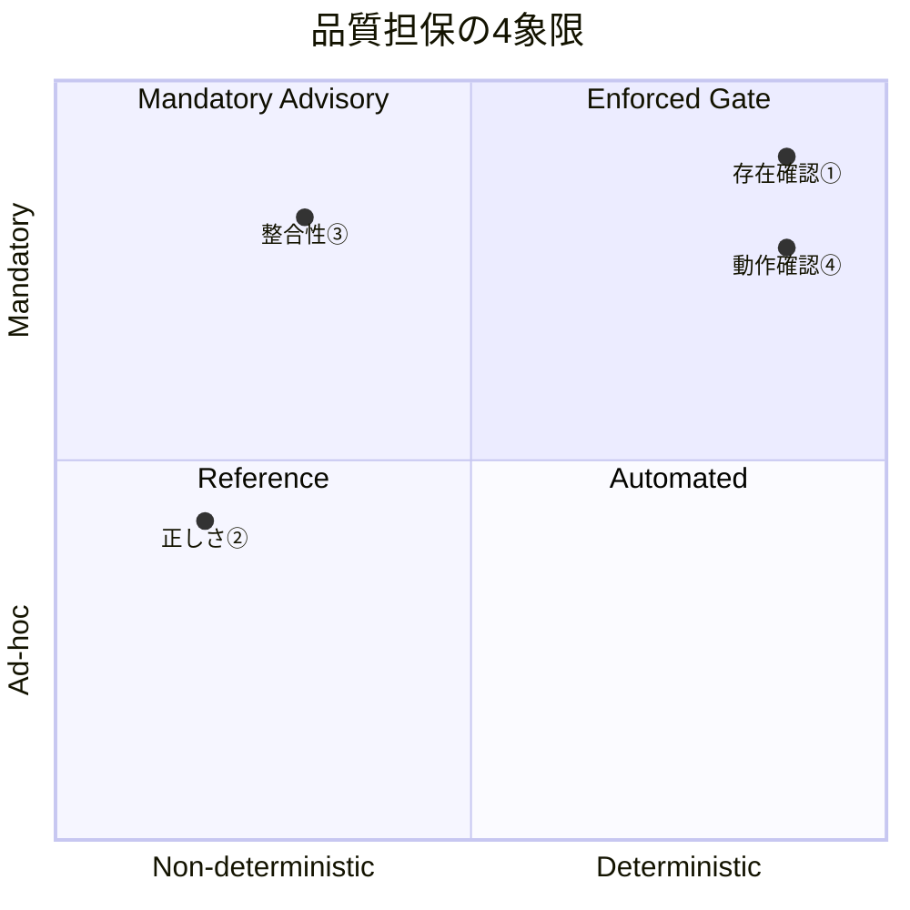
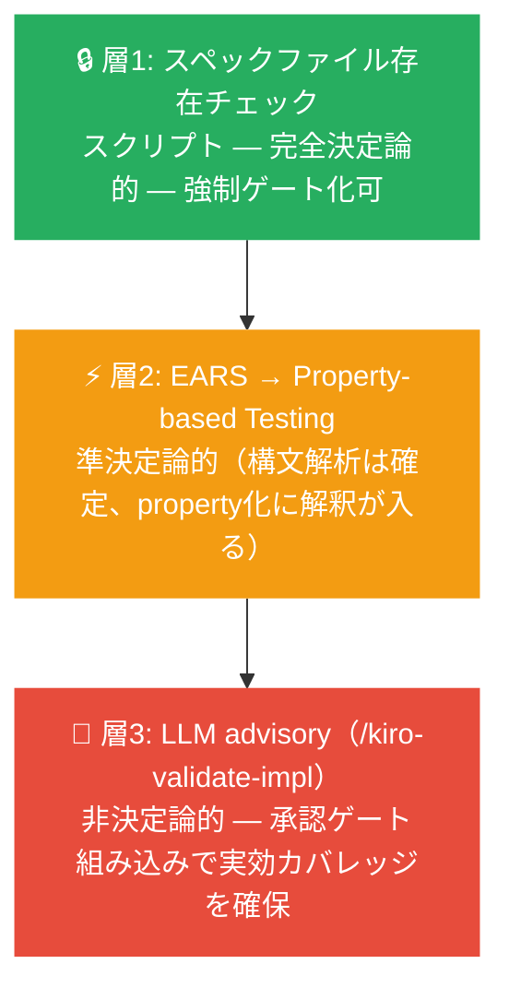

# なぜ仕様駆動開発か

**Spec-Driven Development ワークショップ — Module 1**

---

## 仕様（Spec）とは

> "Specs or specifications are structured artifacts that formalize the development process for features and bug fixes in your application."
> — [Kiro Docs: Specs](https://kiro.dev/docs/specs/)

仕様は「高レベルのアイデアを詳細な実装計画へ変換し、明確なトレーサビリティと進捗管理を実現するための体系的なアプローチ」だ。すべての仕様は 3 つのファイルで構成される。

| ファイル | 問い | 役割（公式定義） |
|---------|------|----------------|
| `requirements.md` | **WHAT** — 何を満たすか | "Captures user stories, acceptance criteria, or bug analysis in structured notation" |
| `design.md` | **HOW** — どう作るか | "Documents technical architecture, sequence diagrams, and implementation considerations" |
| `tasks.md` | **ORDER** — どの順で | "Provides a detailed implementation plan with discrete, trackable tasks" |

**EARS（Easy Approach to Requirements Syntax）** とは `WHEN {条件} THE SYSTEM SHALL {振る舞い}` の構文で要件を記述する形式だ。公式ドキュメントは EARS を *"unambiguous and easy to understand"* かつ *"directly translatable into test cases"* と位置づけている。主体・条件・動作を明示することで AI の解釈ブレを防ぐが、EARS の真の価値は「誤解を消す構文」ではなく「誤解を可視化して検証しやすくする構文制約」にある。

## 仕様駆動開発（SDD）とは

> "Provide a structured approach to building new features, guiding you through requirements gathering, technical design, and implementation planning."
> — [Kiro Docs: Feature Specs](https://kiro.dev/docs/specs/feature-specs/)

AI に実装を任せる前に、仕様を機械可読な形で書き切る開発スタイル。3 段階の人間承認ゲートを経ることで、AI が自由に解釈する余地を最小化し、人間の判断を仕様という形で実装に刻み込む。

```
Requirements → [人間承認] → Design → [人間承認] → Tasks → [人間承認] → 実装
```

> 「プロンプトは AI への口頭指示、仕様は AI との契約書。契約書は後から見返せて、別の AI エージェントが読んでも同じ理解ができる」

SDD は AI 時代に生まれた概念ではない。Design by Contract 等と同じ系譜を持つ既存の原則だ。AI によって変わったのはコスト構造——実装コストがほぼゼロになり、仕様への投資対効果が劇的に上がった。

---

## SDD が必要な 3 つの理由

### 理由 1: AI の速さが「間違った方向への速さ」になるのを防ぐ

仕様なしで AI に任せることは、優秀だが指示が必要な新人に何も説明せず丸投げするのと同じだ。AI は高速に実装を生産できるが、方向が違えば間違った方向への高速移動になる。

承認ゲートが「方向違いの実装」を Requirements の段階で止める。コードを捨てるより仕様を直す方が圧倒的に安い。これは承認ゲートを「手間」としてではなく「コストの前払い」として捉え直す転換点だ。

### 理由 2: 複数セッション・複数エージェントでも文脈が消えない

チャット履歴はセッションをまたぐと消えるが、仕様ファイルは git 管理されて永続する。複数日の作業や並列サブエージェント実行が成立するのは「共有された仕様ファイル」があるからだ。公式ドキュメントも次のように明示している。

> "Specs are designed to be version-controlled, making them easily shareable across your team. Store specs directly in your project repository alongside the code they describe."
> — [Kiro Docs: Best Practices](https://kiro.dev/docs/specs/best-practices/)

逆説的なことに、AI は最も SDD に忠実なチームメンバーだ。非 SDD 派の人間よりも AI エージェントの方が仕様を一貫して守る。これは段階的な SDD 導入において、AI を「味方」として位置づけられることを意味する。

### 理由 3: 「なぜこうなっているのか」が半年後も分かる

コードには WHAT は残るが WHY は残らない。AI が書いたコードはその傾向がさらに深刻で、説明はチャット履歴に消える。SDD では `design.md`・ステアリング文書・ADR に WHY が永続する。

ステアリングとは、プロジェクト横断の規約や文脈を AI に永続的に伝える仕組みだ。

> "Steering gives Kiro persistent knowledge about your workspace through markdown files. Instead of explaining your conventions in every chat, steering files ensure Kiro consistently follows your established patterns, libraries, and standards."
> — [Kiro Docs: Steering](https://kiro.dev/docs/steering/)

> 「適切な粒度の仕様を、コードより先に書き、常にコードと整合させておくことで、AI による実装の自動化と人間による意思決定の管理を両立する」

---

## プロンプトと仕様の違い

| 軸 | プロンプト | 仕様（Spec） |
|----|----------|------------|
| **寿命** | セッション終了で消える | git 管理で永続 |
| **構造** | 自由形式 | requirements / design / tasks |
| **承認ゲート** | なし | 3 段階の人間承認 |
| **粒度の分離** | 混在 | WHAT / HOW / ORDER が分離 |

---

## いつ SDD を使うか: 3 軸判断

3 つの軸のどれか一つでも閾値を超えたら新規スペックを起こす。

| 軸 | 閾値 | スペックの役割 |
|---|------|--------------|
| **作業期間** | 1 週間超 | 「1 週間後の自分への引き継ぎ書」。セッションをまたいだ文脈の永続先 |
| **協働規模** | 複数人 or 複数エージェント | 「全員が参照できる唯一の真実」。1 人でも並列サブエージェント実行なら該当 |
| **保守期間** | 本番運用・長期保守あり | 「WHY の永続先」。コードには WHAT しか残らない |

### 「本番システム = SDD 前提」の割り切り

本番で運用・保守されるシステムはほぼ必ず「保守期間」軸で閾値を超える。実際のプロダクト開発で「使い捨て」に分類できる機能はほとんどないため、本番システムは SDD 前提と割り切って構わない。導入の粒度は機能単位でよく、システム全体の一斉移行は不要だ。

### 早見表

| 条件 | 新規スペック | 既存スペック更新 |
|------|------------|----------------|
| 1 時間の小修正 | 不要 | 対象範囲なら**必須** |
| 1 日の機能追加 | 任意 | 対象範囲なら**必須** |
| 1 週間以上の機能開発 | **必要** | 必須 |
| チーム開発（複数人/エージェント） | **必要** | 必須 |
| 本番運用・長期保守 | **必要** | 必須 |

「向いていない場面」とは「新規スペックを作らなくていい」という意味であり、「既存スペックを無視していい」という意味ではない。既存スペックの対象範囲への変更は規模に関わらず更新が必須だ。乖離したスペックは「持たない方がましな嘘の地図」になる。

---

## SDD の位置づけ: 技術的負債の全体マップ

SDD が有効なのはフィーチャーレイヤーだ。速く作れるようになった分、品質劣化も速くなり得る——AI 時代の品質管理の緊張感はここにある。SDD は強力だが銀の弾丸ではない。

| レイヤー | 主な実践 |
|---------|---------|
| アーキテクチャ・境界設計 | DDD・クリーンアーキテクチャ・境界コンテキスト |
| **フィーチャーレイヤー** | **← SDD が有効** |
| 実装品質・テスト・依存管理・運用 | それぞれ専用の実践が必要 |

---

## 品質担保の 4 象限

SDD の品質を担保する観点は 4 つに分解できる。

| 象限 | 問い | 対処手段 |
|------|------|---------|
| ① 存在確認 | 仕様ファイルが存在するか | スクリプト（完全決定論的・強制ゲート化可）|
| ② 正しさ | 仕様の内容は正しいか | 人間レビュー + LLM advisory（決定論的にできない）|
| ③ 整合性 | 仕様とコードが一致しているか | `/kiro-validate-impl` を承認ゲートに組み込む（義務的 advisory）|
| ④ 動作確認 | コードが正しく動くか | テスト実行（完全決定論的・強制ゲート化可）|



重要な気づきは、「判定の決定論性」と「実行の義務化」は別軸だということだ。コードレビューも決定論的ではないが、「PR マージ前必須」というゲートで機能する。`/kiro-validate-impl` も同様に、承認ゲートに組み込むことで非決定論的な advisory でも実効的なカバレッジが得られる。

---

## CI 自動化の 3 層モデル

決定論的なものを強制ゲートに、そうでないものを advisory に——これが CI 設計の基本原則だ。



**層 2 の補足**: EARS → Property-based Testing は「準決定論的」だ。Kiro はこの変換を実装済みであり、公式には次のように説明されている。

> "Kiro extracts properties from EARS-formatted requirements, generates test cases automatically, and runs them during implementation phases to surface failures and guide corrections."
> — [Kiro Docs: Correctness](https://kiro.dev/docs/specs/correctness/)

EARS 構文（WHEN/SHALL の分解）は決定論的だが、「無効なメールアドレス」のような語句の property 化にはドメイン解釈が入り揺らぎの余地がある。EARS の価値は「誤解を可視化して検証しやすくする」構文制約にある。

コードと仕様が乖離したとき、ツールはどちらが正しいか判断できない——これが CI の完全自動化に根本的な限界がある理由であり、人間のゲートが不可欠な理由だ。

---

## レガシーシステムへの SDD 導入

「一気に全体 SDD 化」は現実的でない。接点から段階的に広げる設計が必要だ。


| 戦略 | 説明 | 向いているケース |
|------|------|----------------|
| **ボーイスカウット** | 触った箇所から仕様を書く | 高頻度改修箇所がある |
| **ストラングラーフィグ** | 新機能は SDD 必須にする | 新機能開発が続く |
| **AI 逆生成** | 既存コードから仕様を生成 | 仕様なしの大規模システム |

---

## よくある誤解

| 誤解 | 正しい理解 |
|------|-----------|
| SDD は AI 時代の新概念 | AI 以前から存在。AI でコスト構造が変わった |
| 小さな修正に SDD は不要 | 新規スペック不要 ≠ 既存スペック更新不要 |
| 全員一斉に SDD にしないと効果がない | モジュール単位で採用可能 |
| SDD で技術的負債全般をカバーできる | フィーチャーレイヤー専門のプラグイン |
| 向いていない場面では既存スペックも無視してよい | 既存スペック対象なら更新は常に必須 |
| EARS → PBT は完全に決定論的 | 構文解析は決定論的、property 化には解釈が入る（準決定論的）|
