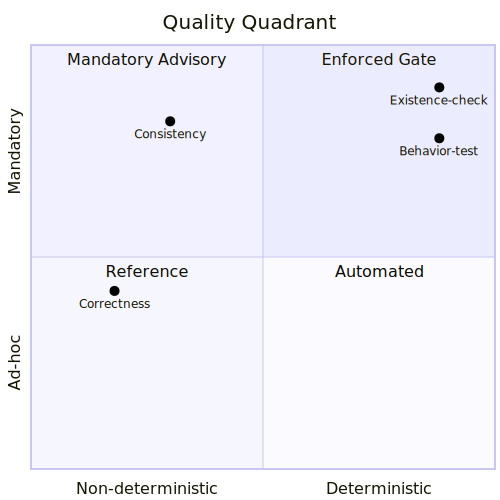

# なぜ仕様駆動開発か

**Spec-Driven Development ワークショップ — Module 1**

---

## このモジュールで学ぶこと

- 「プロンプト」と「仕様」の本質的な違い
- AI 開発に SDD が必要な **3 つの理由**
- SDD を使うべき場面の判断軸（3 軸）
- 品質担保を **4 象限** で考える方法

---

## 定義: 仕様（Spec）とは

| ファイル | 問い | 役割 |
|---------|------|------|
| `requirements.md` | **WHAT** | ユーザーストーリーと受け入れ基準（EARS 形式） |
| `design.md` | **HOW** | 技術アーキテクチャとトレードオフの記録 |
| `tasks.md` | **ORDER** | 実行可能なタスクの詳細計画 |

> 高レベルのアイデアを詳細な実装計画へ変換するための**構造化された成果物**

---

## 定義: SDD とは

**AI に実装を任せる前に、仕様を機械可読な形で書き切る**開発スタイル

---

## Why SDD ① AI の速さを制御する

> 「仕様なしで AI に任せることは、優秀だが指示が必要な新人に何も説明せず丸投げするのと同じ」

- AI は高速に実装を大量生産できる
- **方向が違えば、間違った方向への高速移動になる**
- 承認ゲートが Requirements の段階で「方向違い」を止める
- コードを捨てるより **仕様を直す方が圧倒的に安い**

---

## Why SDD ② 複数セッションでも文脈が消えない

- チャット履歴はセッションをまたぐと消える
- 仕様ファイルは **git 管理されて永続する**
- 複数日作業・並列サブエージェント実行が成立するのは「共有された仕様ファイル」があるから

> 「AI は最も SDD に忠実なチームメンバー」

---

## Why SDD ③ WHY が半年後も分かる

- コードには **WHAT は残るが WHY は残らない**
- AI が書いたコードはその傾向がさらに深刻（説明はチャット履歴に消える）
- `design.md`・ステアリング文書・ADR に **WHY が永続する**

---

## プロンプト vs 仕様: 4 つの違い

| 軸 | プロンプト | 仕様（Spec） |
|----|----------|------------|
| **寿命** | セッション終了で消える | git 管理で永続 |
| **構造** | 自由形式 | requirements / design / tasks |
| **承認ゲート** | なし | 3 段階の人間承認 |
| **粒度の分離** | 混在 | WHAT / HOW / ORDER が分離 |

> 「プロンプトは AI への口頭指示、仕様は AI との契約書」

---

## よくある誤解

| 誤解 | 正しい理解 |
|------|-----------|
| SDD は AI 時代の新概念 | AI 以前から存在。AI でコスト構造が変わった |
| 小さな修正に SDD は不要 | 新規スペック不要 ≠ 既存スペック更新不要 |
| 全員一斉に SDD にしないと効果がない | モジュール単位で採用可能 |
| SDD で技術的負債全般をカバーできる | フィーチャーレイヤー専門のプラグイン |
| 向いていない場面では SDD を無視してよい | 既存スペック対象なら更新は常に必須 |

---

## いつ使うか: 3 軸判断

**本番システム = SDD 前提** と割り切って構わない

---

## SDD の位置づけ: 技術的負債の全体マップ

SDD は強力だが **銀の弾丸ではない**

---

## 品質担保の 4 象限

| 記号 | 意味 | 象限 |
|------|------|------|
| 存在確認・動作確認 | スクリプト/テスト強制 | 強制ゲート |
| 整合性 | /kiro-validate-impl 義務的 advisory | 義務的 advisory |
| 正しさ | 人間レビュー + LLM advisory | ad-hoc |

---

## CI 自動化の 3 層モデル

> 「決定論的なものを強制ゲートに、そうでないものを advisory に」

---

## レガシーシステムへの SDD 導入

「一気に全体 SDD 化」は現実的でなく、**接点から段階的に広げる**

---

## まとめ

> 「適切な粒度の仕様を、コードより先に書き、常にコードと整合させておくことで、
> AI による実装の自動化と人間による意思決定の管理を両立する」

---

## 演習: プロンプトと SDD の違いを体感する

**設定**: 同じ要件を「プロンプト」と「EARS 仕様ファイル」で書き比べる

**問い**: 「ユーザー登録時にバリデーションも入れてください」をプロンプトで書いた場合と
EARS 形式で書いた場合、AI の解釈はどう変わるか？

**4 つの軸で比較してください:**
寿命 / 構造 / 承認ゲート / 粒度の分離

*参照: 転換点1（プロンプトと SDD の本質的な違い）*
