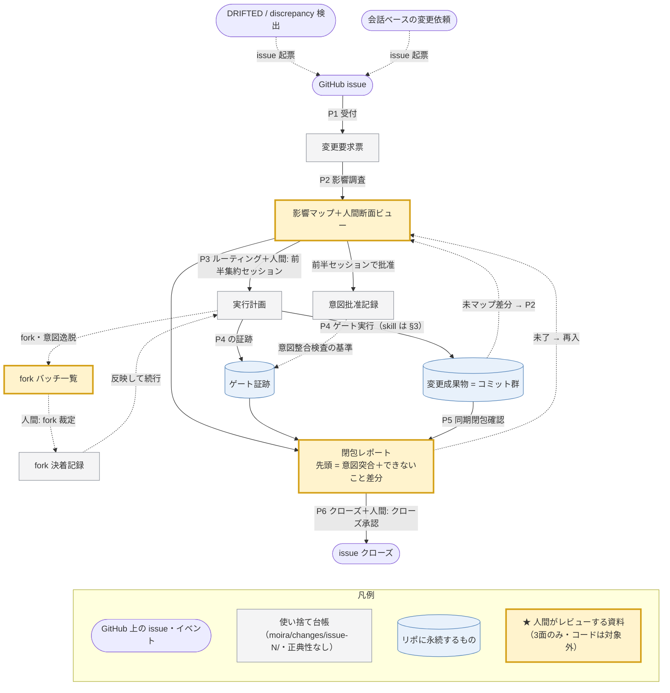

# Moira 変更管理フロー DFD（ドラフト v5）

> **状態**: draft v5（codex レビュー第1・第2ラウンド反映済・#40 裁定反映済・人間タッチポイント再設計
> 〔前半集約〕反映済・人間未レビュー）
> **対象 issue**: [#39](https://github.com/PrimeBrains/sdd-workshop/issues/39)
> **来歴**: v1 を codex（独立ベンダーレビュー）にかけ Critical 3・Important 11・Minor 2 を受領し v2 で反映
> （#12 のみ部分採択＝入口の保証を撤回し正直なスコープ宣言に変更）。第2ラウンド（修正検証）で部分解消 5・
> 新規 Important 4 の残存指摘を受け、v3 で反映（§9 決着記録）。v4 は issue #40 の裁定（R/D/T 使い捨て化・
> moira-verification 改訂）を反映し **R 級と H6 を廃止**（§11）。v5 はユーザー要望（批准の細切れによる
> 認知負荷）を受け、**人間タッチポイントを「前半集約セッション＋fork バッチ＋薄いクローズ承認」の
> 3 点構造へ再設計**（§6・§12。批准対象を「最終文」から「意図＋受け入れ基準」へ前倒し）。
> **位置づけ**: `.kiro/steering/moira-verification.md` の「変更時のゲート対応」表を、**入口**（受付・影響調査・
> ルーティング）と**出口**（同期閉包確認・クローズ）まで延長した工程間配線図。既存のゲート対応表・各 skill の
> 委譲辺は**変更しない**——本フローはそれらを呼び出すオーケストレーション層である。

## 0. 一文の定義とスコープ

**変更管理フローとは、変更要求を GitHub issue に正規化して受け付け、影響マップ（波及先成果物の明示的列挙＋各行の
期待 postcondition と検証器）を作業台帳として、既存ゲート群を依存順に起動し、「影響マップの全行が証跡付きで解消
（resolved）または追跡先の生きた deferred」になったことをもって閉じる工程列である。**

- **スコープの正直な宣言**: 本フローは「リポジトリへの全変更を強制的に横取りする」機構では**ない**。既存 skill の
  直接起動・直接 commit は技術的に可能なまま残る（bypass 防止を PR ゲートで強制するかは §8 未決事項 5）。本フローが
  保証するのは「**このフローを通った変更**については波及先が黙って落ちない」ことである。
- **入口の正規化（P1）**: (a) GitHub issue、(b) `decision-conformance` の DRIFTED／`kiro-scenario-e2e` の
  discrepancy 等の検出結果（→ issue 起票して入る）、(c) 会話ベースの変更依頼（→ issue 起票して入る）——いずれも
  issue に正規化してから流す。
- **黙って落ちる波及先を作らない**——Moira 本体の警告哲学（acknowledge では消えず、commit で消える。§0/P0）の
  プロセスへの自己適用。ゆえに「見送り」は解消ではない（§5）。

## 1. 全体 DFD

凡例補足: 「人間:」と付く辺が人間タッチポイント（順に §6 の HA 前半集約セッション・HB fork バッチ・
H5 クローズ承認）。★の資料がそこで読む対象——影響マップの人間断面（前半）・fork バッチ一覧（発生時）・
閉包レポート先頭（クローズ時）の 3 つだけ。**★に載るのはシナリオ・プロパティ・設計判断の 3面のみで、
ソースコード・テストコードはレビュー対象外（codex＋CI に委譲）**。提示は md へ吐き出し＋コンソールに
サマリとパス、AskUserQuestion は最終裁定のみ（§6 提示規約）。実線＝生成、点線＝制御・再入。各工程の
処理内容は §2、クラス別ゲートと担当 skill・昇格/上申辺は §3・§4、人間タッチポイントの中身は §6 が正。

## 2. 各工程の in/out

| 工程 | in | 処理 | out | 主担当 |
|---|---|---|---|---|
| **P1 受付・正規化** | 入口 3 種（issue／検出結果／会話依頼） | issue に正規化し、**人間の言葉（曖昧さ・省略を含む）を後段の LLM 処理が迷わない明確な変更要求文に書き起こす**（原文は issue に残る——情報は失わない）。候補クラス（§3）を仮判定。**受付時点の commit を base として変更要求票に記録**（以後の全差分検査は `base..HEAD`） | 変更要求票（issue 番号・明確化した要求文・候補クラス・**base commit**） | AI（メイン文脈） |
| **P2 影響調査** | 変更要求票＋正典群＋トレース機構（下記）＋（再入時）未マップ差分 | 波及先成果物を列挙。**各行に「クラス・根拠・担当ゲート・期待 postcondition・検証器」を必須記載** | **影響マップ**（作業台帳・append-only）＋**人間断面ビュー**——**レビュー対象＝シナリオ・プロパティ・設計判断の 3面行のみ**を前面に置き、ソースコード・テストコード（C 級）・検証基盤（V 級）等の機械決着行は「**人間はレビューしない**（codex＋CI に委譲）」と見出しで明示した別節に分けて畳む | AI（調査 subagent 派遣可） |
| **P3 ルーティング裁定** | 影響マップ | §3 の規則で経路と依存順を確定し、**前半集約セッション（HA）で判断事項を一括で人間に諮る**——マップ確認・境界裁定・When/Then 発案・M/D/P 意図批准（受け入れ基準つき）・実行計画承認（§6） | 実行計画（経路列・依存順）＋**意図批准記録**（各ゲートの整合検査の基準・issue コメントに記録） | AI＋人間（HA） |
| **P4 ゲート実行** | 実行計画 | 各クラスの既存ゲートを依存順（§4）に起動。**各ゲート完了時に changed paths − mapped paths を計算し、非空なら P2 へ差し戻し** | 変更成果物（コミット群）＋ゲート証跡 | 各既存 skill／agent |
| **P5 同期閉包確認** | 影響マップ＋ゲート証跡＋実差分。**差分の両端を固定**: base＝P1 で記録した変更開始前 commit、対象＝P5 開始時の HEAD。**照合中に HEAD が動いたら判定無効・再実行** | 影響マップの各行を resolved／deferred／未了に判定（§5）。`diff(base..HEAD)` に対する未マップ差分の非存在も確認。**deferred 行の後続 issue openness は `gh issue view` で機械照合し証跡化**（人間の確認義務にしない） | **閉包レポート**（人間向け先頭に「3面最終文↔意図の対応表」と「できないことになったこと」の平易な差分を置き、機械決着は折り畳む） | AI（照合 subagent） |
| **P6 クローズ** | 閉包レポート | 人間承認（**H5・薄い**——読むのは §6 の 3 点のみ）→ issue クローズコメント。ジャーナル来歴は**該当する確定分岐がある場合のみ**（記録条件は `moira-model-update`／目録の規律に従う——本フローは条件を新設しない） | クローズ済み issue | AI＋人間（H5） |

**P2 が使うトレース機構（既存・新造なし）**: MODEL の安定 clause ID（A/I/P/R——行番号禁止）／DECISIONS-CATALOG
裏面 ref と計器被覆マップ（**変更 path → 裏面 ref の逆引きを含む**。§5）／PROPERTIES の clause→property 被覆／
E2E spec の SPEC_META／`e2e/coverage-check.test.ts` の被覆定義。（trace-notation の ref-list 走査は
R/D/T 使い捨て化〔#40〕により閉包条件から除外——使い捨て文書のリンク整合は追わない）

## 3. ルーティング規則（変更クラス）

判定は「その変更が最も上流のどの正典に触れるか」で行う。複数クラスに跨る issue は全クラスを影響マップに載せ、§4 の依存順で処理する。

| クラス | 判定基準 | 経路（既存ゲート） | 人間タッチポイント |
|---|---|---|---|
| **M（MODEL・正典設計物級）** | MODEL の公理・制約・語彙・既定・イベント意味論に**積極的に矛盾または変更**。**および `moira-model-update` が所有する確定設計物**（NAMING・命名文書・同 skill 自身・moira 系 agent 定義） | `moira-model-update`（敵対ゲート＋同一 run での bound プロパティ再批准＋派生文書同期） | HA（意図批准）＋HB（ループ内 fork） |
| **D（設計判断級）** | MODEL がその論点に**沈黙**している 0→1 の構造判断（境界・所有権・依存方向・enforce の所在）。沈黙は「衝突」でなく「拡張」——Decision は中間状態として有効 | DECISIONS-CATALOG に `proposed` 起票 → `doc-refine` → **仕分け弁**: (a) 責任・帰結・ドメイン意味＋混合 → H4 批准／(b) 純工学 → doc-refine 技術ゲートで確定（PO レビュー対象にしない）。**agreed 後、MODEL の制約・語彙・既定に触れるなら M へ昇格**（D → M → 下流再実行のループ。§4） | HA（(a)/混合の意図批准のみ）＋HB |
| **P（プロパティ級）** | 不変条件の新設・改訂。**3 サブルートに分岐**: ①プロパティ一文（散文と同じ敵対ゲート＋H4 批准）②PBT 実装（**著者≠実装者**・mutation で非空虚性・到達 witness・決定的 seed・CI 実走）③**生成器/shrinker**（正典上「最大のリスク・一級レビュー対象」——敵対的構成レビュー＋自己被覆アサーション） | PROPERTIES.md＋PBT 資産（各サブルートの義務は左記） | HA（一文の意図批准のみ）＋HB |
| **S（シナリオ級）** | 観測ふるまい・外的妥当性。**unit と flow は別ルート**: unit → `kiro-scenario`（**人間が When/Then を発案**——AI は §3 を発案しない）／flow（`.kiro/scenarios/flows/`）→ `kiro-scenario-flow`（合成範囲は人間承認・メンバー欠陥は unit へ差し戻し）。**計器③（`kiro-scenario-e2e`）再生成は agreed unit のみ**——flow-level E2E 自動化は `kiro-scenario-flow` の規範どおり未整備（follow-up）であり、flow 行の検証器は flow 文書自体の確定ゲート（checker＋敵対ゲート）まで。flow は構成 unit の per-unit E2E で間接的に覆われるに留まる（正直開示） | 上記 skill 群 | HA（When/Then 発案＋意図批准）＋HB |
| **C（コード級）** | 正典に触れない実装 | `/kiro-impl`（worker=sonnet）＋codex レビュー＋CI（計器①②③④）。**実装サイクル開始時に必要なら R/D/T を正典から再生成**——R/D/T は使い捨ての作業文書であり波及先成果物ではない（moira-verification「R/D/T は使い捨ての再生成物」・#40。旧 R 級はこの吸収により廃止） | なし |
| **V（検証基盤級）** | **検知器そのものの変更**: `.github/workflows/*`・dependency-cruiser 設定・`e2e/coverage-check.test.ts`・カバレッジ設定等 | **自己検証禁止**（変更後の検知器自身の PASS だけで閉じない）: 変更前後の gate inventory 比較＋**陰性対照**（検知すべきものを検知できることの確認）＋独立レビュー（codex） | なし（独立レビューが代替） |
| **F（一般確定文書級）** | M 級所有物**以外**の steering・一般 agent/skill 定義等 | `doc-refine` | 文書により批准 |

**既存委譲辺との整合（本フローが尊重する辺・変更しない）**:
- `kiro-scenario` → `moira-model-update`（MODEL 矛盾の上申。S 処理中に M 級発覚 → 影響マップに M 行追記し M を先に処理）
- `kiro-scenario-flow` → `kiro-scenario`（メンバー欠陥の差し戻し）
- `kiro-scenario-e2e` → discrepancy のユーザー上申
- `decision-conformance` の DRIFTED → 修正 issue 起票（＝P1 入口 (b)）
- agreed Decision の `moira-model-update` 昇格（moira-verification「正典との関係」）

**境界不明瞭な issue の既定ルート**: 「表示だけに見えて導出規則に触る」型が最頻。判定に迷ったら **D 級に起こす**——
Decision は MODEL 沈黙下の中間状態として有効であり、doc-refine／批准の過程で MODEL に触れると判明すれば昇格ループ
（D → M）が拾う。既存 MODEL 条項と**積極的に矛盾**することが最初から明白な場合のみ直接 M。それでも迷うなら HA の境界裁定へ。
（v1 の「上流に倒して沈黙なら降格」は正典の昇格方向と逆のため撤回——codex 指摘 #1。）

## 4. ゲート実行の順序規則

**全順序ではなく、ループを含む依存順**である。

- **基本の依存方向**: 正典（M）確定 → D/P/S → C。下流は「動いた後の正典」に対して処理する（R/D/T の
  再生成は C の実装サイクル内の準備作業であり、独立の工程段ではない——#40）。
- **昇格ループ（D → M → P3 再裁定 → 下流再実行）**: D 級で agreed になった Decision が MODEL の制約・語彙・既定に
  触れる場合、M（`moira-model-update`）へ昇格する。M 完了後はゲート間を直接遷移せず **P3 へ戻って再裁定**する——
  再実行対象は「影響マップのうち M の変更が触れた clause/成果物を参照する下流行（P/S/C）」であり、その判定材料は
  影響マップ自体が持つ（行＝波及先＋根拠 clause）。**D 自体は再実行しない**（Decision は agreed 済み。M の結果が
  Decision の前提を覆す場合は新たな D 行の追記＝新判断であって、同一判断の反復ではない）。**M を先に処理できるのは
  issue が最初から M 級と判明している場合のみ**——D で判断が起きる前に M を先行させる規則ではない。
- **上申ループ（S → M）**: シナリオ処理中の MODEL 矛盾は `kiro-scenario` の既存辺で上申し、M 処理後に S を再開。
- S の agreed 後に `kiro-scenario-e2e`。C は上流成果物確定後。実装完了後の xfail「予期せぬ pass」→ green 昇格は
  本フロー外の既存 CI 規律。
- **再調査契機（codex 指摘 #13）**: 各 P4 ゲート完了時および P5 開始時に
  `git diff の changed paths − 影響マップの mapped paths` を計算し、**非空なら P2 へ差し戻して影響マップに追記**する。
  影響マップは append-only（行の削除禁止・deferred 化は §5 の要件で）。

## 5. 同期閉包の判定（P5）

**行の状態は 3 値**:

1. **resolved** — 当該行の**期待 postcondition** を、行に指定された**検証器**が確認した（下記）。
   **コミットの存在は成果物の存在証明にしかならず、単独では resolved にできない**（codex 指摘 #14）——意味的義務には
   批准記録・テスト結果・照合 verdict・レビュー結果のいずれかを要する。
2. **deferred** — 今回はやらない。**ただし次を全て満たす場合のみ**（codex 指摘 #2）: 追跡可能な後続 issue への参照＋
   owner＋再評価条件を持ち、**その後続 issue が open で生きている**。恒久的な非適用を主張するなら「正典上の義務なし」の
   根拠を要求する。単なる「理由付き見送り」は deferred の要件を満たさず**未了**である——acknowledge では消えない。
3. **未了** — 上記以外。1 行でもあれば閉包不成立 → P4（または P2）へ戻る。

加えて**未マップ差分の非存在**（`diff(base..HEAD)` の changed − mapped = ∅。**`moira/changes/**` は台帳自身の
ため検査対象から除外**——除外しないと台帳の更新が閉包を壊す自己言及になる。base＝P1 記録の変更開始前 commit、
HEAD＝P5 開始時に固定）を閉包の必要条件とする。

**照合 verdict と 3 値状態の対応（状態機械を閉じる）**: `decision-conformance` 等の照合結果は次のとおり行状態へ写す。
- **ALIGNED** → 当該行を resolved にできる（限定的照合結果として。PASS とは呼ばない）
- **UNVERIFIABLE** → **未了**のまま
- **DRIFTED** → **未了**のまま。是正 issue を**起票しただけでは状態は変わらない**——当該行が deferred へ遷移できるのは
  **deferred の全要件**（後続 issue 参照＋owner＋再評価条件＋後続 issue が open で生きている）を満たした場合のみで、
  是正を本 issue 内で完了させたなら再照合で ALIGNED を得て resolved にする。

**検証器の一覧（既存の再利用・新造ゲートなし）と、その証跡としての扱い**:

| 波及の種類 | 検証器 | 証跡としての扱い（正直枠） |
|---|---|---|
| MODEL 変更の派生同期（NAMING・steering・ジャーナル・参照実装 types/fold） | `moira-model-update` ゲート自身の同期義務＋`doc-fact-checker`（影響マップ範囲） | ゲートの「残存 Critical=0＋Important 全件 disposition」判定＋批准記録（deferred Important があれば閉包レポートに全件列挙。後続 issue の openness は P5 が `gh issue view` で機械照合し証跡化——人間は「できないこと差分」の平易ビューだけを読む）。**M 行の postcondition は `moira-model-update` の現行規範が実施する範囲**（敵対ゲート・bound プロパティ再批准・派生同期）に限る——**境界モデル検査（第2器）は未実装（正典自身が「到達目標」と開示）のため resolved 条件に含めず**、その不在は下記「P5 の限界」の未整備義務に計上する |
| Decision ↔ 実装の整合（計器⑥） | `decision-conformance`。**対象選定は map→Decision に加え、changed path → 目録裏面 ref の逆引き** | verdict→3値の写像は上記。**逆引きの実行定義**: ①機械段＝changed path のパス片・ファイル名で目録全文を grep、②AI 段＝ヒット近傍の Decision を照合 subagent が意味的に突合。**裏面 ref は自由記述混在で機械逆引きの完全性は主張できない**——未記載・曖昧 ref による取りこぼしは「P5 の限界」の残余に計上し、恒久対策（裏面 ref への機械可読 path フィールドの正規化）は §8 未決事項 6 |
| シナリオ unit/flow ↔ E2E ↔ EARS 被覆 | `e2e/coverage-check.test.ts`（毎 CI）＋`e2e-scenario-checker` | CI green＋checker verdict |
| clause ↔ property 被覆 | PROPERTIES.md の被覆表（手動表） | 手動表の更新を照合 subagent が確認 |
| コード品質・回帰 | codex レビュー＋CI（計器①②③④） | レビュー結果＋CI green |
| 検証基盤（V 級） | gate inventory 前後比較＋陰性対照＋独立レビュー | **変更後の検知器自身の PASS は証跡にしない**（自己検証禁止） |

**P5 の限界（正直枠）**: P5 が保証するのは「影響マップに載った行＋未マップ差分ゼロ」であって、P2 の**調査自体の網羅性**
ではない（trace 機構に載らない意味的波及の見落としは残る——§5/P2「網羅性は帰納で証明できない」と同型の残余）。対策は
(a) P2 でトレース機構を機械的に辿る、(b) 受け入れテストの陰性対照で P2/P5 の検出力自体を試す、(c) 後日発覚した漏れは
新 issue として再入させる。**未整備義務の明示**（本フローが検知できると主張しないもの・moira-verification の正直枠と
同じ正直さで扱う）: ①M 級変更時の境界モデル検査（第2器・未実装）、②裏面 ref 逆引きの完全性（ref 未正規化のため。
§8-6）、③再生成 R/D/T の忠実性（#40 の正直枠——専用ゲートを持たず、実装計器と正典被覆で間接的に支える）。

## 6. 人間タッチポイント（v5: 3 点構造——細切れ批准による認知負荷の排除）

**設計原理**: 批准の対象を「AI が起こした最終文」から「**意図＋受け入れ基準**」へ前倒しする。
Kiro 哲学の核（intent を build 前に人間が批准する）にはむしろ忠実になる。最終文は独立採点者による
**意図整合検査**（批准記録 ↔ ドラフトの突合。著者≠検査者）で守り、整合すれば auto-agreed で下流へ
進む。逸脱は fork として上申する。

| ID | 位置 | 内容 | 性質 |
|---|---|---|---|
| **HA 前半集約セッション** | P3 直後・ゲート実行前（原則 issue につき 1 回） | まとめて一括で諮る: ①影響マップ人間断面の確認（「はねる先はこれで全部か」）②境界裁定（旧 H1）③**When/Then の発案**（旧 H3——元々「入力」なので前倒しが自然）④**M/D/P 各行の意図批准**（旧 H2 の方向づけ・旧 H4——何を決めるか・受け入れ基準・却下したい方向を実質で yes/no。仕分け規律は従前: D は (a)/混合のみ・P は一文のみ）⑤実行計画の承認 | 旧 H1〜H4 を**集約** |
| **HB fork バッチ** | P4 実行中（発生時のみ） | ①検証ループ内の genuine fork（敵対者が出す・事実で決められない分岐）②意図整合検査で検出された**批准済み意図からの逸脱**。いずれも**即時割込みにせず、下流をブロックする時点まで溜めてまとめて聞く**。再入（未マップ差分→P2）で影響マップに新行が生えた場合の追加判断も、新行分だけのミニ HA としてここに合流 | 不可避な残余（バッチ化で緩和） |
| **H5 クローズ承認（薄い）** | P6 | 読むのは 3 点のみ: ①**3面最終文の意図突合**（「批准済み意図 ↔ agreed 文面」の対応表——最終文を人間が読む唯一の点＝意図ドリフトの人間バックストップ。全文通読か抜き取りかは運用ノブ）②**「できないことになったこと」の平易な差分**（deferred のシナリオ語への翻訳——「今の機能ではこのシナリオに対応できない〔追跡 #NN〕」。issue#・owner・再評価条件・openness の帳簿は読まない——openness は P5 が `gh issue view` で機械照合済み）③**閉包 PASS の一行**（コンソールで一瞥）。fork の経緯は issue コメントに監査可能な形で残るが読む義務なし。突合で「違う」と気づいたら、その場で直さず fork／新 issue として再入（クローズは下りない） | 本フロー**新設**（v5 で薄型化） |

- **人間レビューの提示規約（可読性最優先）**: HA・HB・H5 のいずれも、AskUserQuestion の狭い選択肢欄に
  術語を詰め込まない。①詳細は `moira/changes/issue-N/` の md に**人間可読を最優先**で吐き出す（見出し・
  平易文・表。3面＝シナリオ・プロパティ・設計判断の節と、「レビューしない」ソースコード・テストコードの
  節を分け、後者は対象外であることを冒頭に明示）②コンソールには**確認点のサマリと詳細ファイルのパス**を
  出す③AskUserQuestion は md を読んだうえでの**最終の裁定（yes/no・選択）だけ**に使う。
- **意図整合検査の主体**: 各ゲートの独立採点者（`doc-gate-judge`／`moira-gate-judge`）が、HA の
  意図批准記録（issue コメント）と最終ドラフトを突合する。整合の証跡はゲート証跡に含める。
- **撤回条件（3 本目）**: 「事前批准した意図と agreed 文面の乖離が実害化」した欠陥はポストモーテムに
  literal タグ **`[intent-drift]`** を含めて記録し（`/kiro-postmortem-add` のタグ規律に追加要）、
  未レビュー 2 件で**文面批准（旧 H4 型）への復帰を再審査**する。
- **実装帰結（正直開示）**: `kiro-scenario`／`kiro-scenario-flow`／`doc-refine`／`moira-model-update` は
  現在「ループ内で AskUserQuestion」を要求する契約のため、**「変更管理フローの事前批准記録を人間承認の
  証跡として受け入れる（＋逸脱時はユーザーへ）」改訂が必要**（M 級。人間入力の偽装ではなく証跡ベースで
  通す）。本フロー構築時の作業項目とする。
- **純 C 級 issue** は途中タッチポイントなし（codex＋CI が代替）のため、人間の関与は HA のマップ一瞥と
  H5 のみ。

## 7. 実装形態（想定・レビュー対象外の参考）

- skill 1 本（仮称 `moira-change`）＝ P1〜P3・P5〜P6 のオーケストレーション＋P4 での既存 skill 起動の振り付け。
- steering 文書 1 本＝本 DFD の確定版（moira-verification.md から参照）。
- **台帳一式の置き場は `moira/changes/issue-N/`**（2026-07-19 ユーザー裁定・§8-2 解消）: 影響マップ・
  意図批准記録・fork 記録・閉包レポートを ticket ごとの md として repo に置き、クローズ後も残す（削除
  しない・同期もしない）。issue API 往復の遅さを避け、台帳が変更本体と同じ git 履歴に乗る。
  - **非正典マーキング**: `moira/changes/README.md` に「正典性なし・根拠にしない・grep でヒットしても
    現況を主張しない」を宣言し、各ファイルの frontmatter に `status: working-ledger` / `issue: N` を
    持たせる（R/D/T アーカイブ「当時の射影」規律と同型）。
  - **人間向け要約は issue コメント**: 前半セッションの結果とクローズ時の閉包サマリ（できないこと差分
    含む）だけを issue に短く残す——モバイルで読むのは issue、機械が読む台帳は repo、の分担。
  - 未マップ差分検査からの自己除外は §5。

## 8. 未決事項（レビューで裁定を求める点）

1. **P5 掃射の範囲**: `decision-conformance`／`doc-fact-checker` は「影響マップ範囲＋裏面 ref 逆引きヒット分」に
   限定して走らせる（案）。全量掃射は高コストで閉包の定義にも過剰。→ 限定で良いか。
2. ~~**影響マップ・閉包レポートの置き場**: issue コメント案で良いか。~~ → **裁定済み（2026-07-19）**:
   `moira/changes/issue-N/` の md として repo に置き、残す。非正典マーキング＋issue には人間向け要約のみ
   ＋未マップ差分検査から自己除外（§5・§7）。
3. **軽量パスの要否**: 明白な C 級のみ（typo 等）に P2 を簡略化した fast path を設けるか。判定基準が新たな誤分類面に
   なることに注意。
4. **陰性対照の恒常化**: 受け入れテスト時のみか、定期実行まで組むか。
5. **bypass 防止の強制**: 本フローを通らない直接変更（直接 commit・skill 直接起動）を PR ゲート（issue 参照の強制等）で
   塞ぐか、当面は「フローを使う」運用規律に留めるか（§0 のスコープ宣言はこの裁定までの正直な現状）。
6. **裏面 ref の正規化**: DECISIONS-CATALOG の裏面 ref に機械可読な実装 path フィールドを追加する目録改訂を行うか
   （§5 の逆引き完全性の恒久対策。目録改訂自体は本フローの F/M 級変更として別 issue）。

## 9. codex レビュー第1ラウンドの決着記録

| # | 深刻度 | 指摘（要旨） | 決着 |
|---|---|---|---|
| 1 | Critical | 「MODEL 沈黙なら降格」は正典の昇格方向と逆 | 採択——撤回し、迷ったら D 起票＋D→M 昇格ループに変更（§3・§4） |
| 2 | Critical | 「理由付き見送り」での閉包・close は警告哲学の誤用 | 採択——deferred は後続 issue＋owner＋再評価条件が生きている場合のみ。単なる見送りは未了（§5） |
| 3 | Critical | P4 が配線されておらずゲート名の一覧 | 採択——P3 からの条件辺・依存順・昇格/上申ループ・成果物/証跡の分離・git diff 供給元を配線（§1） |
| 4 | Important | D 級一律 H4 は仕分け規律 (a)/(b) 違反 | 採択——仕分け弁を経路に内蔵（§3・§6） |
| 5 | Important | NAMING/moira 系 skill/agent 定義は `moira-model-update` 所有 | 採択——M 級に統合し F 級から除外（§3） |
| 6 | Important | P 級が正典の PBT ゲート（敵対ゲート・批准・mutation・witness・生成器）を再現していない | 採択——3 サブルートに分割（§3） |
| 7 | Important | CI/検証基盤変更が unroutable＋自己検証問題 | 採択——V 級を新設・自己検証禁止（§3・§5） |
| 8 | Important | scenario flow が unroutable | 採択——S 級を unit/flow の 2 ルートに分割（§3） |
| 9 | Important | `decision-conformance` を PASS 証跡扱いできない＋逆引き欠落 | 採択——verdict 意味論を明記・裏面 ref 逆引きを追加（§5） |
| 10 | Important | trace-notation は定義であって検知器でない | 採択——実行主体（P5 照合 subagent）・走査方法・出力を固定（§5） |
| 11 | Important | R/D/T 人間レビュー「なし」が段階的移行と矛盾 | 採択——H6 を新設（§6） |
| 12 | Important | 「issue 唯一の入口」は願望で bypass 防止がない | 部分採択——保証を撤回し正直なスコープ宣言＋入口 3 種の正規化に変更。強制の要否は未決事項 5 へ（§0・§8） |
| 13 | Important | 影響マップ追記の再調査契機・未マップ差分検出の欠落 | 採択——changed−mapped 差分チェックを各ゲート後と P5 開始時に義務化・基準 commit 固定（§4・§5） |
| 14 | Important | コミット存在だけで証跡になり得る | 採択——行に postcondition＋検証器を必須化。コミットは存在証明のみ（§2・§5） |
| 15 | Minor | 変更要求票のデータフローが図に無い | 採択——図に明示＋凡例（§1） |
| 16 | Minor | ジャーナル記録条件が曖昧 | 採択——「該当する確定分岐がある場合のみ・条件は既存規律に従う」に修正（§1・§2） |

## 10. codex レビュー第2ラウンド（修正検証）の決着記録

第1ラウンド 16 件中 11 件解消・5 件部分解消、新規 Important 4 件（判定 FAIL）。v3 で以下を反映。
（**記録の不一致・v4 注記**: 散文の「部分解消 5」に対し下表の残存行は 4 行〔R#3/R#8/R#9/R#13〕のみで
1 件不一致。原記録が残っていないため**列挙可能な表を正**とする——#40 の fact-check で検出。）

| # | 深刻度 | 残存指摘（要旨） | 決着 |
|---|---|---|---|
| R#3 | Important 残存 | GM の復帰辺が §4 本文（P/S/R/C 再実行）と不一致・GD へ誤配線・P/S 行なし時に R/C へ到達不能 | 採択——復帰をゲート間直接辺でなく **P3 再裁定**に一本化（再実行対象は影響マップの下流行から導出）。D は再実行しない（§1・§4） |
| R#8 | Important 残存 | flow の E2E 送り先が skill 実能力と不整合（kiro-scenario-e2e は unit のみ・flow-level E2E は follow-up） | 採択——計器③再生成は agreed unit のみと明記。flow は文書確定ゲートまで・per-unit E2E による間接被覆を正直開示（§1・§3） |
| R#9 | Important 残存 | 裏面 ref 逆引きの実行可能性欠如（自由記述混在・文法未定義） | 採択——2 段（grep＋AI 突合）の実行定義を固定し、完全性は主張せず残余に計上。恒久対策（ref 正規化）を未決事項 6 に追加（§5・§8） |
| R#13 | Important 残存 | 差分範囲の両端未定義（base が不明・HEAD 基準なら差分が空になり得る） | 採択——base＝P1 受付時 commit を変更要求票に記録、対象＝P5 開始時 HEAD、`diff(base..HEAD)` に統一（§1・§2・§5） |
| N-1 | Important | M 行の postcondition が実在 skill の能力（境界モデル検査未実装）を超える | 採択——M 行の resolved 条件を現行規範の範囲に限定し、第2器の不在を未整備義務として明示（§5） |
| N-2 | Important | DRIFTED→3値閉包状態の遷移が未定義（起票だけで閉包できる読み） | 採択——verdict→3値の写像を明文化。DRIFTED は起票では動かず、deferred 全要件充足か再照合 ALIGNED のみ（§5） |
| N-3 | Important | R 経路に必須の技術敵対ゲート（doc-refine）欠落 | 採択——R 級経路に doc-refine を常設（H6 卒業後も残る・H6 は代替でない）（§1・§3）。**その後 v4 で R 級自体が廃止され失効**（§11） |
| N-4 | Important | D→M 後の再実行が図・本文・閉包規則で不一致 | 採択——R#3 と同じ P3 再裁定機構に統合（§1・§4） |

## 11. #40 裁定の反映（v4）

issue #40（2026-07-19 人間批准）で R/D/T の処遇が「維持する派生 IR」から「使い捨ての再生成物」へ改訂された
（`moira-verification.md`「R/D/T は使い捨ての再生成物」節）。本 DFD への反映:

- **R 級を廃止**——「R/D/T の同期」という変更クラスは、同期対象が消えたため存在しない。R/D/T の再生成は
  C 級の実装サイクル内の準備作業として吸収（§3 C 行）。
- **H6（移行期 R/D/T レビュー）を廃止**——段階的移行そのものが廃止されたため（§6）。
- **P5 から trace-notation ref-list 走査を除外**——使い捨て文書のリンク整合は閉包条件でない（§2・§5）。
- **未整備義務①（MODEL→R の意味的一致）を削除**し、代わりに「再生成 R/D/T の忠実性は専用ゲートを
  持たない」を正直枠に計上（§5）。
- §9 #11・§10 N-3 の H6／R 級 doc-refine 常設の決着は**履歴として保持**したまま失効（本節が上書き）。

なお計器群（第1〜4器・⑥ decision-conformance・clause→property 被覆）の検査対象は実装↔正典であり、
本改訂で役割は変わらない。

## 12. 人間タッチポイント再設計の来歴（v5）

2026-07-19 のユーザー要望「**人間の判断ゲートをできるだけ前半の一回にまとめたい——細切れの批准は
認知負荷が上がる**」を受けた設計変更（ユーザーとの対話で方向合意済み・本 DFD 自体は人間未レビューの
draft のまま）:

- **批准対象の前倒し**: 「最終文の批准」→「意図＋受け入れ基準の事前批准（HA）＋独立採点者による
  意図整合検査＋逸脱の fork 化」。旧 H1〜H4 は HA に集約、旧 H5 は薄型化（§6）。
- **人間の関与は原則 2 回**（HA・H5）＋発生時のみ HB（fork バッチ——即時割込みでなくブロック時点まで
  バッチ）。
- **H5 の読む義務は 3 点**: 3面最終文の意図突合／「できないことになったこと」の平易な差分／閉包一行。
  deferred の帳簿検査（openness 等）は P5 の機械照合へ移管。fork 経緯は記録のみ（読む義務なし）。
- **新リスクと計器**: 最終文を人間が読まずに agreed になる経路が生まれるため、撤回条件タグ
  `[intent-drift]`（未レビュー 2 件で文面批准への復帰を再審査）を 3 本目の反証装置として追加。
- **未実施の波及**: 各ゲート系スキルの「ループ内 AskUserQuestion」契約を「事前批准記録の証跡受け入れ」
  へ改訂する M 級作業（§6 実装帰結）と、`/kiro-postmortem-add` への `[intent-drift]` タグ登録が、
  本フロー構築時の作業項目として残る。
